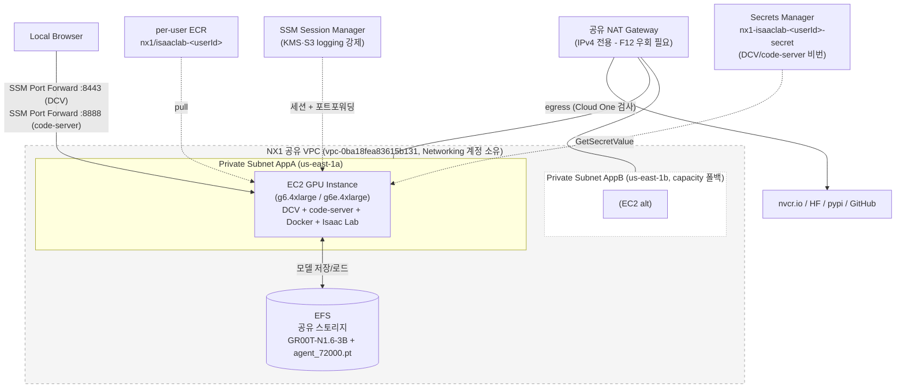

# 1. 클라우드 인프라 준비 및 환경 확인 (NX1)

> 🟦 **BEST NX1**: 원본 가이드의 `CloudShell` · `cdk deploy` · `DcvUrl(public IP)` · `CloudFront(code-server)` 단계는 NX1에서 **모두 막혀 있습니다** (CloudShell 차단, CDK 미허용, public IP 미허용, CloudFront 미배포). 본 모듈은 **CloudFormation 콘솔 + SSM 포트포워딩**으로 진행합니다. 로컬 PC 사전 준비(AWS CLI v2 + Session Manager plugin + `~/.aws/config` + `aws sso login`)는 [모듈 0](0.-nx1-self-deploy.md) 참고. *원본 1.3·1.5(자원 설명·환경 확인)는 그대로 학습 가치가 있으니 본 모듈에서도 보존했습니다.*

이 모듈에서 본인이 사용할 GPU 인스턴스 + 공유 스토리지 + 사전 다운로드된 모델 가중치까지 한 번에 만듭니다.

***

## 1.1 어떤 리소스가 필요한가 (원본 → NX1 매핑)

원본 가이드는 CDK 한 번으로 VPC + Public/Private Subnet + NAT + IGW + EFS + EC2 GPU + DCV + ECR + AWS Batch + CloudFront + Lambda 까지 자동 생성합니다. NX1에서는 **거버넌스/quota 단순화 목적으로** Batch 경로와 신규 VPC·신규 CloudFront를 의도적으로 제외하고, 공유 자원은 import해서 재사용합니다.

| 리소스 | 왜 필요한가 | 원본 (CDK 자동생성) | NX1에서 어떻게 |
|---|---|---|---|
| **VPC + Subnet** | 인스턴스가 들어가는 사설 네트워크 | 사용자별 신규 VPC (`10.x.0.0/16`) | NX1 공유 VPC `vpc-0ba18fea83615b131` (Networking 계정 소유) **그대로 사용**. 수정 금지 |
| **Public Subnet + IGW + Public IP** | DCV 접속용 (브라우저 → public IP:8443) | 사용자별 자동 | **미사용** — NX1은 public IP 차단. DCV 접속은 SSM 포트포워딩으로 (1.4) |
| **Private Subnet + NAT** | 인스턴스의 인터넷 egress | 사용자별 자동 | NX1 공용 NAT(`subnet-0824e676b789f5f5d` AppA / `-09db5ca35015f76e3` AppB) 재사용. egress는 Cloud One 검사 통과(2026-05-25 probe PASS) |
| **EC2 GPU 인스턴스 + DCV + Docker + Isaac Lab** | Isaac Sim·Lab 실행, code-server, GR00T inference docker | g6e.4xlarge UserData로 자동 설치 | 동일하지만 본 워크샵 default `g6.4xlarge` (g6e도 선택 가능). UserData에 NX1 안전망 패치 ([F12/F13/F15](#nx1-안전망-요약)) |
| **EFS + 마운트 + 사전 자산** | 모델 가중치(GR00T-N1.6-3B, agent_72000.pt) 공유 | 자동 생성·다운로드 | 동일 |
| **DCV 비밀번호** | DCV/code-server 로그인 | Secrets Manager 자동 생성 | 동일 (`nx1-isaaclab-<userId>-secret`, `doosan:owner=BEST_NX1` 태그 필수) |
| ~~**CloudFront → code-server**~~ | ~~code-server 외부 접속~~ | CloudFront distribution 자동 | **미사용** — code-server 접속은 SSM 포트포워딩 :8888 (1.6) |
| ~~**AWS Batch (Compute Env / JQ / JD)**~~ | ~~RL 분산 학습~~ | 자동 생성 | **미사용** — 모듈 3 (RL Batch)도 NX1 v1에서 optional. 본 PoC 학습은 SageMaker 단일 경로 |
| ~~**Lambda (GPU capacity AZ 자동 탐색)**~~ | ~~배포 시점 GPU 가용 AZ 자동 선택~~ | CFN custom resource | **미사용** — 멤버가 AZ 파라미터로 직접 지정 (AppA 1a 기본, capacity 부족 시 AppB 1b) |
| **ECR repo** | GR00T inference 이미지 등 | `groot-inference` 자동 | per-user `nx1/isaaclab-<userId>` 자동 생성 (NX1 IAM은 `nx1/*` prefix만 push/pull 허용) |
| **IAM Role (인스턴스용)** | EC2가 S3·ECR·EFS·SSM 사용 | 자동 | per-user CFN, **least-privilege** (`AmazonSSMManagedInstanceCore` + nx1/dibh 버킷 + nx1/* ECR + KMS + SSM 세션 KMS·S3 로그 + 자기 인스턴스 self-stop 한정) |

**한 스택으로 압축**: 위 리소스 전체를 NX1에선 **`nx1-isaaclab-<userId>`** 단일 스택으로 본인이 self-deploy. 강사 선배포 부분은 없습니다 (모듈 5와 다름 — Day1 인프라는 모두 per-user).

### NX1 안전망 요약

NX1 인스턴스 역할에는 다음이 박혀 있습니다 (다른 워크샵 환경엔 없음):

- **F12 IPv6 강제 우회**: 공유 NAT가 IPv4 전용이라 dual-stack 인스턴스가 IPv6 먼저 시도하면 timeout. UserData가 `gai.conf precedence` + apt `ForceIPv4` + sysctl로 IPv4 강제. 적용 안 하면 빌드 ~90분, 적용 시 ~32분
- **F13 SSM 세션 KMS Decrypt 권한**: 계정 SSM Preferences가 `alias/ssm/logging`으로 세션 암호화 강제 → 권한 없으면 SSM 세션 자체 핸드셰이크 실패
- **F15 SSM 세션 S3 로그 권한**: `db-bestnx1-us-east-1-sessionmanager-logs/sessions/*`에 GetEncryptionConfiguration + PutObject. 누락 시 세션 시작이 종료 (2026-05-28 차일황 수석 self-deploy에서 발견·수정)
- **idle 720분 자가 stop**: 무활동 시 자기 인스턴스 stop (자기 한정). **재시작 권한은 멤버에 없음** → 자리를 오래 비우면 강사에게 문의
- **SageMaker 학습 launch 권한** (2026-05-29 ↑): NX1 Studio JupyterLab 사용 불가 우회용으로 인스턴스 역할에 SageMaker `CreateTrainingJob` / Endpoint / Pipeline / MLflow 호출 + 본인 SageMakerRole `iam:PassRole` + 본인 `nx1-groot-*` S3 read/write 권한이 박혀 있습니다. 모듈 5·7의 학습 launch가 code-server에서 그대로 동작합니다.

### 사전 요구 사항 (NX1)

- [NVIDIA Omniverse License Agreement](https://docs.omniverse.nvidia.com/isaacsim/latest/common/NVIDIA_Omniverse_License_Agreement.html) 동의
- AWS Identity Center 로그인 → 역할 `BESTNX1-Developer` (Doosan AD + MFA). 모듈 0 사전 준비 완료
- `~/.aws/config` 작성 + `aws sso login` (모듈 0 §3 참고)
- (DCV/code-server GUI 접속자) 로컬 **AWS CLI v2** + **Session Manager plugin**
- ~~CloudShell, CDK CLI, Node.js~~ → **NX1에선 불요**
- ~~Service Quotas로 G·VT 인스턴스 vCPU 확인~~ → NX1 공용 quota는 강사가 사전 확인 (현 768 vCPU, 9명 충분)

***

## 1.2 인프라 배포 — `nx1-isaaclab-<userId>` (~30~35분)

원본의 `npx cdk deploy` 흐름은 NX1에서 다음으로 대체됩니다.

> **사전 조건**: [모듈 0](0.-nx1-self-deploy.md)의 사전 준비 (Identity Center 로그인 / AWS CLI v2 + Session Manager plugin / `~/.aws/config` / `aws sso login`)가 완료되어 있어야 합니다.

1. 콘솔 → **CloudFormation** → **Create stack** → *With new resources*
2. **Template source = Amazon S3 URL**:
   ```
   <DAY1_TEMPLATE_URL>
   ```
   *(정확한 URL은 강사가 채팅으로 공유. 로컬 "파일 업로드"는 권한 밖이라 실패합니다.)*
3. **Stack name**: `nx1-isaaclab-<본인UserId>` (예 `nx1-isaaclab-alice`)
4. **Parameters**:

   | 키 | 값 | 메모 |
   |---|---|---|
   | `UserId` | 본인 ID (소문자/숫자/하이픈) | 다른 멤버와 겹치지 않게 |
   | `InstanceType` | `g6.4xlarge` (기본) 또는 `g6e.4xlarge` | g6=L4 24GB, g6e=L40S 48GB. 본 워크샵엔 g6 충분 |
   | `SubnetId` | `subnet-0824e676b789f5f5d` (AppA, 1a) 기본 | capacity 부족 시 `subnet-09db5ca35015f76e3` (AppB, 1b)로 재배포 |
   | `ScriptsZipUrl` | 강사 제공 `s3://dibh-.../nx1/day1/userdata-*.zip` | UserData 부트스트랩 스크립트 묶음 |
   | `EnableCodeServer` | `true` (VSCode 쓸 때) | |
   | `IdleMinutes` | `720` 기본 | 무활동 자가 stop 분 |
   | 기타 | 기본값 유지 | |

5. **Configure stack options → Permissions → IAM role** = `CloudFormationDeployer` ⚠️필수
6. **Tags** → Key `doosan:owner`, Value `BEST_NX1` ⚠️필수 (없으면 거부)
7. **Submit** → `CREATE_IN_PROGRESS` → UserData 부트스트랩 ~30~35분 후 `CREATE_COMPLETE`

진행 확인: 콘솔의 스택 **Events** 탭. 또는 SSM 세션이 살아있다면 인스턴스에서 `sudo tail -f /var/log/cloud-init-output.log`.

> **원본 1.2의 `nohup cdk deploy &` + `tail -f deploy.log` 패턴은 NX1에선 불요**. CFN은 비동기 처리이고 콘솔 Events 탭이 같은 정보를 줍니다.

### CDK가 생성하던 인프라 다이어그램 (NX1 변형)



원본과의 주요 차이:
- VPC + Public Subnet + IGW + CloudFront 없음 (다 import 또는 미사용)
- AWS Batch 스택 없음 (모듈 3은 v1 optional)
- 외부 접근은 SSM 포트포워딩 단일 경로

***

## 1.3 배포 완료 및 접속 정보 확인

CFN 콘솔 → 본인 스택 (`nx1-isaaclab-<userId>`) → **Outputs** 탭에서 다음을 확인합니다:

| Output 키 | 값 | 용도 |
|---|---|---|
| `InstanceId` | `i-...` | SSM 포트포워딩 `--target` |
| `PortForwardCmd` | `aws ssm start-session ...` 완성 명령 | 그대로 복사해서 로컬 터미널 실행 — DCV 8443 포트포워딩 |
| `SecretArn` | DCV/code-server 비밀번호 시크릿 ARN | 콘솔 Secrets Manager에서 retrieve |
| `EfsId` | `fs-...` | EFS 마운트 확인용 |

> **원본의 `DcvUrl` (https://public-ip:8443) 형태는 NX1에서 존재하지 않습니다.** Public IP 자체가 없어 DCV는 SSM 포트포워딩으로만 접속.

### DCV/code-server 비밀번호 확인

콘솔 → **Secrets Manager** → `nx1-isaaclab-<userId>-secret` → **Retrieve secret value** → `username=ubuntu`, `password=...`.

또는 SSM 세션 (Day1 인스턴스에서):

```bash
aws secretsmanager get-secret-value \
  --secret-id nx1-isaaclab-<userId>-secret \
  --region us-east-1 \
  --query SecretString --output text | python3 -c "import sys,json; print(json.load(sys.stdin)['password'])"
```

> **원본의 `cat deploy.log | grep DcvUrl` 패턴은 NX1에선 불요** — Outputs 탭에 같은 정보가 명시적으로 박혀있습니다.

***

## 1.4 DCV 접속 (SSM 포트포워딩)

원본은 `https://<public-ip>:8443`을 브라우저에서 직접 열지만, NX1은 인스턴스에 public IP가 없어 **로컬 터미널의 SSM 포트포워딩으로 터널을 만든 뒤** `https://localhost:8443`을 엽니다.

### 1.4.1 SSM 포트포워딩 (로컬 터미널)

```bash
aws ssm start-session --target <InstanceId> \
  --document-name AWS-StartPortForwardingSession \
  --parameters portNumber=8443,localPortNumber=8443 \
  --region us-east-1 --profile BESTNX1-Developer-737138011740
```

> **편의**: CFN Outputs의 `PortForwardCmd` 값에 InstanceId가 이미 박혀있으니 그대로 복사·실행하면 됩니다.

세션이 열리면 그 터미널은 닫지 말고 그대로 두세요 (터널 유지).

### 1.4.2 브라우저에서 DCV 진입

1. 다른 브라우저 탭: `https://localhost:8443`
2. 자가서명 인증서 경고 → "고급" → "계속 진행"
3. Username: `ubuntu`, Password: 1.3에서 확인한 값
4. DCV 데스크톱이 열림

### 참고 — Amazon DCV란?

[Amazon DCV (Desktop Cloud Visualization)](https://docs.aws.amazon.com/ko_kr/dcv/latest/adminguide/what-is-dcv.html)는 AWS의 고성능 원격 디스플레이 프로토콜입니다. Isaac Sim 같은 그래픽 집약 애플리케이션을 EC2 GPU에서 원격 렌더링할 때 사용합니다. 본 워크샵에서는 모듈 4 (Isaac Sim에서 학습 모델 로드)와 모듈 8 (closed-loop 평가)에서 DCV가 필수입니다.

> **NX1은 DCV-over-SSM을 5/27 end-to-end 검증 완료** (Dimitri PR#1356로 team-role에 StartPortForwardingSession 권한 배포). 5월 초만 해도 미검증 R&D 항목이었으니 격세지감.

***

## 1.5 환경 설치 확인

DCV 데스크톱이 열렸으면 그 안의 터미널, 또는 SSM Session Manager 브라우저 셸 둘 다 OK. 다음을 확인합니다.

```bash
# (필요 시) ubuntu 사용자로 전환
sudo su - ubuntu

# GPU 드라이버
nvidia-smi

# Docker 이미지 (UserData가 isaaclab-batch:latest 자동 빌드)
docker images | grep isaaclab

# EFS 마운트
df -h | grep efs

# code-server 상태
systemctl status code-server

# GR00T 모델 가중치 (efs-mount.sh가 EFS로 자동 다운로드)
ls /home/ubuntu/environment/efs/GR00T-N1.6-3B
```

**정상 결과**:
- `nvidia-smi` → GPU 정보 출력 (L4 — g6, 또는 L40S — g6e)
- `docker images | grep isaaclab` → `isaaclab-batch:latest`
- `df -h | grep efs` → EFS 마운트
- `code-server` → `active (running)` (만약 EnableCodeServer=true로 배포한 경우)
- `ls .../GR00T-N1.6-3B` → 모델 파일 목록

**문제 시 UserData 로그**:

```bash
sudo tail -200 /var/log/cloud-init-output.log
sudo tail -200 /var/log/cfn-init.log
```

Deep Learning AMI 기반이라 CUDA / NVIDIA Driver / PyTorch 등 학습 환경은 기본 설치되어 있습니다.

> **NX1 빌드가 평소보다 오래 걸린다면**: F12 IPv6 우회가 적용되지 않은 인스턴스일 수 있습니다 (드뭄). `cat /etc/gai.conf | grep precedence` 확인 후 `precedence ::ffff:0:0/96 100` 줄이 없으면 강사 문의.

***

## 1.6 code-server (VSCode) 접속 (SSM 포트포워딩)

원본은 CloudFront URL을 브라우저로 열지만, NX1은 CloudFront 없이 SSM 포트포워딩 :8888로 접속합니다.

### 1.6.1 포트포워딩 (DCV 터널과 별개로 추가 터미널)

```bash
aws ssm start-session --target <InstanceId> \
  --document-name AWS-StartPortForwardingSession \
  --parameters portNumber=8888,localPortNumber=8888 \
  --region us-east-1 --profile BESTNX1-Developer-737138011740
```

### 1.6.2 브라우저에서 code-server 진입

- 브라우저: `http://localhost:8888`
- Password: DCV와 동일 (같은 Secrets Manager 시크릿)

> **DCV와 code-server는 동시에 사용 가능**. 두 개의 SSM 포트포워딩 터널을 별도 터미널로 띄우면 됩니다.

***

## 1.7 자주 막히는 곳 (NX1 Day1 특화)

| 증상 | 해결 |
|---|---|
| `CREATE_FAILED: not authorized to perform iam:CreateRole` | IAM role을 `CloudFormationDeployer`로 안 바꿨습니다 (1.2 step 5) |
| `CreateStack` 거부 (태그 누락) | `doosan:owner=BEST_NX1` 태그 필수 (1.2 step 6) |
| `CREATE_FAILED` UserData 빌드 실패 + 90분 타임아웃 | F12 IPv6 우회 미적용. 새 템플릿(2026-05-28 이후)에는 박혀 있음 → S3 URL 재확인 후 재배포 |
| Session Manager 시작 즉시 `AccessDenied: s3:GetEncryptionConfiguration on ... sessionmanager-logs` | F15 미반영 구 템플릿. 모듈 0 §"재배포 필요" 안내대로 update-stack |
| Session Manager `Fetching data key failed... kms:Decrypt` | F13 KMS 권한 누락. 같은 update-stack 절차 |
| `localhost:8443` / `:8888` 안 됨 | SSM 포트포워딩 세션 살아있는지, 로컬 포트 충돌 없는지 |
| 인스턴스 꺼져 있음 | idle 720분 후 자가 stop. 멤버에 재시작 권한 없음 → 강사 문의 |
| 재부팅 직후 SSM 재연결 안 됨 (`TargetNotConnected`) | SSM 에이전트 부팅 ~1~2분 대기 |

***

## References

- [모듈 0 — NX1 셀프 배포 가이드](0.-nx1-self-deploy.md)
- [Amazon DCV 공식 문서](https://docs.aws.amazon.com/ko_kr/dcv/latest/adminguide/what-is-dcv.html)
- [NVIDIA Omniverse License Agreement](https://docs.omniverse.nvidia.com/isaacsim/latest/common/NVIDIA_Omniverse_License_Agreement.html)
- [NVIDIA Isaac-GR00T (모듈 5에서 사용)](https://github.com/NVIDIA/Isaac-GR00T)
- 강사가 staging한 템플릿: `<INSTRUCTOR_BUCKET_DAY1_PREFIX>`
