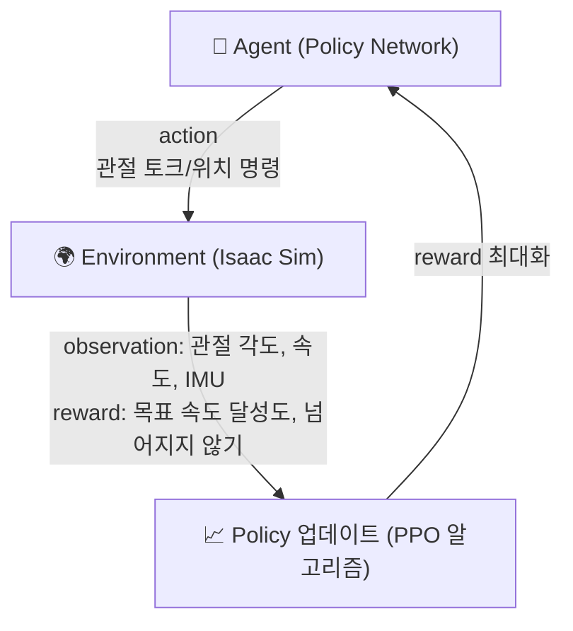

# 2. Isaac Lab 강화학습 실행

> 🟦 **BEST NX1**: 박스 접속은 [모듈 1](1.-isaaclab-infra-setup.md) (§1.4 DCV 포트포워딩 또는 §1.5 SSM Session Manager). 학습 명령은 박스 내부에서 동일하게 실행하지만, **컨테이너 이미지 이름은 NX1 빌드 결과 기준 `nx1/isaaclab-<userId>:latest`** 입니다 (원본 가이드의 `isaaclab-batch-[custom name]`이 아님). §2.4 참고.

[NVIDIA Isaac Lab](https://isaac-sim.github.io/IsaacLab/main/index.html)은 Isaac Sim 위에서 동작하는 로봇 학습 프레임워크입니다. GPU 가속 물리 시뮬레이션 환경에서 수천 개의 로봇을 동시에 시뮬레이션하며, 강화학습(RL)을 통해 로봇 제어 정책(Policy)을 학습할 수 있습니다.

---

### 2.1 핵심 개념: 강화학습(RL)으로 로봇 제어 학습

강화학습은 에이전트(로봇)가 환경과 상호작용하며 보상을 최대화하는 행동 정책을 스스로 학습하는 방법입니다.



* **Observation**: 로봇의 현재 상태 (관절 각도, 각속도, 몸체 방향, 접촉 정보 등)
* **Action**: 로봇에게 내리는 명령 (각 관절의 목표 위치 또는 토크)
* **Reward**: 얼마나 잘 수행했는지의 스칼라 신호 (예: 목표 속도에 가까울수록 +, 넘어지면 큰 -)
* **Policy**: Observation → Action 매핑을 수행하는 신경망. 학습의 최종 산출물

---

### 2.2 Isaac Lab 소프트웨어 스택

| 계층 | 구성 요소 | 역할 |
|---|---|---|
| 5 | RL Algorithm (skrl / RSL-RL) | PPO, SAC 등 학습 알고리즘 |
| 4 | Isaac Lab (Task / Environment) | 로봇·환경 정의, 보상 함수, 관측 구성 |
| 3 | Isaac Sim (Omniverse) | USD 기반 씬 렌더링, 센서 시뮬레이션 |
| 2 | PhysX 5 (GPU-accelerated) | 물리 시뮬레이션 (충돌, 관절, 마찰) |
| 1 | CUDA / GPU Driver | 하드웨어 가속 |

Isaac Lab이 수천 개의 환경을 **단일 GPU에서 병렬 실행**할 수 있는 이유는 PhysX 5의 GPU 파이프라인 덕분입니다. 각 환경이 독립적으로 시뮬레이션되므로 하나의 GPU에서 2048~4096개의 로봇을 동시에 학습시킬 수 있습니다.

---

### 2.3 Dockerfile 확인

IsaacLab 실행을 위한 파일들과 Dockerfile을 확인 할 수 있습니다.

```bash
cat ~/environment/IsaacLab/Dockerfile
```

Dockerfile에는 아래와 같은 항목이 포함되어 있습니다:

* NVIDIA Isaac Sim 5.1.0 이미지 다운로드
* IssacLab 워크스페이스 추가
* 다중 노드 및 다중 GPU 환경에서 Isaac Lab RL 작업을 실행하는데에 필요한 스크립트 (`distributed_run.bash`)

<figure><figcaption></figcaption></figure>

---

### 2.4 컨테이너 실행

DCV 또는 code-server 터미널에서 아래 명령어를 사용해 Isaac Sim 도커 컨테이너를 실행합니다.

자동 시작된 컨테이너가 없는 경우, 아래 명령어로 직접 실행할 수 있습니다:

```bash
cd ~/environment/IsaacLab && xhost +
```

먼저 본인 인스턴스에 빌드된 이미지 이름을 확인합니다:

```bash
docker images | grep isaaclab
```

NX1 환경에서는 UserData가 `nx1/isaaclab-<userId>:latest` 형식으로 빌드 + ECR 푸시까지 완료한 상태입니다. 예시 출력:

```
737138011740.dkr.ecr.us-east-1.amazonaws.com/nx1/isaaclab-seokjus:latest   b6fdcade6b1a   25.4GB
nx1/isaaclab-seokjus:latest                                                b6fdcade6b1a   25.4GB
```

> 원본 가이드의 `isaaclab-batch-[custom name]` 형식이 *아닙니다*. NX1 IAM은 ECR `nx1/*` prefix만 push/pull을 허용하므로 UserData가 의도적으로 `nx1/` prefix를 붙여 빌드합니다.

본인의 `<userId>`로 치환해서 (또는 위 `docker images` 출력의 이름을 그대로 복사):

```bash
docker run \
  --shm-size=60g \
  --name isaac-lab \
  --entrypoint bash \
  -it \
  --gpus all \
  --rm \
  --network=host \
  -e "ACCEPT_EULA=Y" \
  -e "PRIVACY_CONSENT=Y" \
  -e DISPLAY \
  nx1/isaaclab-<본인userId>:latest
```

예시 (`UserId=seokjus`):

```bash
docker run \
  --shm-size=60g \
  --name isaac-lab \
  --entrypoint bash \
  -it \
  --gpus all \
  --rm \
  --network=host \
  -e "ACCEPT_EULA=Y" \
  -e "PRIVACY_CONSENT=Y" \
  -e DISPLAY \
  nx1/isaaclab-seokjus:latest
```

> **`pull access denied for isaaclab-<userId>` 에러가 나면** prefix `nx1/` 가 빠진 것입니다. 정확한 이름은 `docker images | grep isaaclab` 출력의 `nx1/isaaclab-<userId>:latest` 줄.

<details>

<summary><mark style="color:$info;">ℹ️ [참고]</mark> 이미 실행 중인 컨테이너에 접속하는 경우</summary>

컨테이너가 이미 실행 중이라면 새로 띄울 필요 없이 기존 컨테이너에 접속할 수 있습니다. 컨테이너가 실행중이 아니라면 위 docker run을 실행했으므로 아래 내용은 skip합니다.

```bash
# 실행 중인 컨테이너 확인
docker ps

# 컨테이너 접속
docker exec -it isaac-lab bash
```

</details>

<details>

<summary><mark style="color:$warning;">ℹ️ [참고]</mark> 주요 Docker 옵션 설명</summary>

| 옵션 | 설명 |
| --- | --- |
| `--shm-size=60g` | 공유 메모리 크기. Isaac Sim은 GPU-CPU 간 대용량 텐서 전송에 `/dev/shm`을 사용. 기본값(64MB)으로는 부족하여 OOM 발생 |
| `--gpus all` | 컨테이너에서 호스트의 모든 NVIDIA GPU에 접근 허용 (NVIDIA Container Toolkit 필요) |
| `--network=host` | 호스트 네트워크를 공유하여 DCV 디스플레이 연결 및 TensorBoard 접근 가능 |
| `-e DISPLAY` | X11 디스플레이를 컨테이너에 전달하여 GUI 렌더링 지원 |
| `--rm` | 컨테이너 종료 시 자동 삭제 (디스크 공간 절약) |

</details>

---

### 2.5 학습 실행

컨테이너가 실행되면, 컨테이너 내부 프롬프트에서 다음 명령어를 사용해 학습 작업을 실행합니다.

```shellscript
# GUI에서 실행하는 경우 — DCV 화면에서 시뮬레이션을 시각적으로 확인 가능
cd /workspace/IsaacLab && \
/isaac-sim/python.sh -m torch.distributed.run \
  --nnodes=1 \
  --nproc_per_node=1 \
  scripts/reinforcement_learning/skrl/train.py \
  --task=Isaac-Velocity-Rough-H1-v0
```

```shellscript
# headless 모드 — 렌더링 없이 학습만 수행하므로 훨씬 빠름 (워크숍 권장)
cd /workspace/IsaacLab && \
./isaaclab.sh -p scripts/reinforcement_learning/skrl/train.py \
  --task Isaac-Velocity-Rough-H1-v0 \
  --num_envs 2048 \
  --headless
```

**주요 파라미터 설명:**

| 파라미터 | 설명 |
| --- | --- |
| `--task Isaac-Velocity-Rough-H1-v0` | Unitree H1 휴머노이드 로봇이 거친 지형(Rough Terrain)에서 목표 속도로 걷는 Task |
| `--num_envs 2048` | 동시에 시뮬레이션하는 환경(로봇) 수. GPU 메모리가 허용하는 만큼 늘릴수록 학습이 빨라짐 |
| `--headless` | GUI 렌더링을 비활성화하여 연산 리소스를 학습에 집중 |

**Task 이름 구조 해석:**

`Isaac-Velocity-Rough-H1-v0`의 각 부분은 다음을 의미합니다:

* `Isaac` — Isaac Lab 프레임워크의 환경
* `Velocity` — 목표 속도 추종(velocity tracking) 과제. 로봇이 지정된 선속도/각속도 명령을 따라야 함
* `Rough` — 거친 지형(높낮이가 있는 불규칙 표면). `Flat`은 평지 환경
* `H1` — [Unitree H1](https://www.unitree.com/h1) 휴머노이드 로봇 (180cm, 47kg, 19 자유도)
* `v0` — 환경 버전

**학습 알고리즘 — PPO (Proximal Policy Optimization):**

이 워크숍에서는 [skrl](https://skrl.readthedocs.io/) 라이브러리의 PPO 구현을 사용합니다. PPO는 로봇 제어에 가장 널리 쓰이는 강화학습 알고리즘으로, 정책을 안정적으로 업데이트하면서도 샘플 효율이 좋아 시뮬레이션 기반 학습에 적합합니다.

* 강화학습 라이브러리인 [skrl](https://skrl.readthedocs.io/)을 활용해 학습 ([scripts/reinforcement\_learning/skrl/train.py](https://github.com/isaac-sim/IsaacLab/blob/main/scripts/reinforcement_learning/skrl/train.py))
* 학습할 Task ([사용 가능한 task 목록](https://isaac-sim.github.io/IsaacLab/main/source/overview/environments.html))

학습 중 생성되는 체크포인트와 로그는 컨테이너 내부 `/workspace/IsaacLab/logs/skrl/h1_rough/` 경로에 저장됩니다.

> **"Isaac Sim" is not responding** 경고창이 나오더라도 **Wait** 버튼을 누르고 대기하세요. Isaac Sim GUI가 로딩되고 학습이 시작되는데 5분 미만으로 시간이 소요됩니다.

<figure><figcaption></figcaption></figure>

---

### 2.6 TensorBoard 모니터링

학습이 진행되는 동안 Tensorboard를 통해 학습 과정을 확인할 수 있습니다.

```shellscript
# TensorBoard 모니터링 (새 터미널에서)
docker exec -it isaac-lab \
  /isaac-sim/python.sh -m tensorboard.main \
  --logdir /workspace/IsaacLab/logs/skrl/h1_rough/ \
  --bind_all
```

DCV 브라우저에서 `http://localhost:6006` 에 접속해서 텐서보드를 확인할 수 있습니다.

<figure><figcaption></figcaption></figure>

* **mean\_episode\_length**: 모든 에이전트에 대해 환경에서 각 에피소드의 평균 길이입니다. 이는 환경이 재설정되기 전에 거치는 반복 횟수를 정의합니다. 최적의 경우, 학습이 끝날 때쯤에는 에피소드 길이가 최대값에 도달해야 합니다.
* **mean\_reward**: 각 iteration에서 학습이 어떻게 수행되고 있는지를 나타냅니다.


실제 휴머노이드 Policy은 이 환경을 활용하여 72,000회 이상의 학습 epoch와 3시간 동안 복잡한 이족 보행 작업을 학습합니다. 학습이 완료될 때까지 기다릴 필요 없이 다음 단계로 진행하세요.


***

### References




