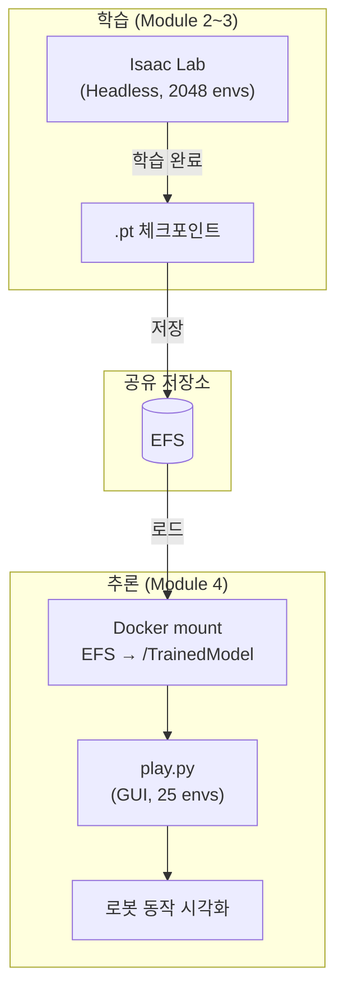

# 4. IsaacSim에서 학습된 모델 로드

> 🟦 **BEST NX1**: IsaacSim GUI 접속은 **DCV-over-SSM (포트 8443)** 으로 합니다 — 절차는 [모듈 1 §1.4](1.-isaaclab-infra-setup.md#1-4-dcv-접속-ssm-포트포워딩) 참고. 컨테이너 이미지 이름은 NX1 빌드 결과 기준 `nx1/isaaclab-<userId>:latest` 입니다 (§4.3 참고). EFS는 Day1 UserData가 이미 마운트 완료해서 §4.2 수동 mount는 NX1에서 *불요* — 그대로 §4.3으로 진행하세요.

학습이 완료된 휴머노이드 모델을 [EFS (Elastic File System)](https://docs.aws.amazon.com/ko_kr/efs/latest/ug/whatisefs.html) 폴더에 저장해놨습니다. 이 폴더를 DCV EC2 인스턴스에 마운트하여 IsaacSim에서 실행할 수 있습니다.

### 4.1 학습과 추론의 차이

| 구분 | 학습 (Training) | 추론 (Inference/Play) |
| --- | --- | --- |
| 목적 | Policy 신경망의 가중치를 최적화 | 학습된 Policy로 로봇 동작을 실행 |
| 모드 | Headless (렌더링 없이 빠르게) | GUI (시각적으로 결과 확인) |
| 환경 수 | 2048~16384 (데이터 수집 극대화) | 25~64 (시각화 용도) |
| GPU 사용 | 물리 시뮬레이션 + 신경망 역전파 | 물리 시뮬레이션 + 신경망 순전파만 |
| 출력 | `.pt` 체크포인트 파일 | 시뮬레이션 화면에서 로봇 동작 확인 |

**체크포인트 파일 (`.pt`)**: PyTorch 모델의 학습된 가중치를 직렬화한 파일입니다. Policy 네트워크와 Value 네트워크의 파라미터가 저장되어 있으며, 추론 시 Policy 네트워크만 로드하여 Observation → Action 매핑을 수행합니다.



#### 체크포인트 파일 가이드

워크숍에서 사용할 수 있는 두 가지 체크포인트 파일이 있습니다:

| 상황                     | 체크포인트                    | 경로                                                                                                 |
| ---------------------- | ------------------------ | -------------------------------------------------------------------------------------------------- |
| 학습 없이 바로 inference 테스트 | `agent_72000.pt` (사전 제공) | `/workspace/IsaacLab/TrainedModel/agent_72000.pt`                                                  |
| Batch 학습 후 결과 확인       | `best_agent.pt` (직접 학습)  | `/workspace/IsaacLab/TrainedModel/models/h1_rough/{timestamp}_ppo_torch/checkpoints/best_agent.pt` |

* **agent\_72000.pt**: 워크숍 S3 버킷에서 다운로드되어 EFS에 자동 배치된 사전 학습 체크포인트입니다 (72,000 iteration).
* **best\_agent.pt**: [Module 3](3.-isaaclab-rl-train-batch.md)의 AWS Batch 분산 학습 실행 시 생성되는 체크포인트로, 학습 중 가장 좋은 성능을 보인 시점에 저장됩니다.

***

### 4.2 EFS 마운트 — NX1에선 이미 완료됨

> 🟦 **NX1**: Day1 UserData(`efs-mount.sh`)가 본인 인스턴스에 EFS를 이미 `/home/ubuntu/environment/efs`로 마운트해 둡니다. 콘솔에서 EFS ID를 찾거나 `sudo mount` 명령을 실행할 필요가 없습니다 — 마운트 상태만 확인하고 §4.3으로 가세요.

```bash
# NX1 인스턴스에서 마운트 확인만
df -h | grep efs
ls /home/ubuntu/environment/efs    # GR00T-N1.6-3B / agent_72000.pt 등이 보여야 정상
```

<details>
<summary><strong>(원본 가이드 — 일반 환경에서 EFS 수동 mount 시)</strong></summary>

원본 가이드처럼 EC2 인스턴스에 EFS를 수동 마운트해야 하는 환경이라면, 콘솔에서 IsaacLab*-EFS로 명명된 파일시스템 ID를 복사한 뒤:

```bash
sudo mount -t nfs4 -o nfsvers=4.1,rsize=1048576,wsize=1048576,hard,timeo=600,retrans=2,noresvport \
  <File System ID>.efs.us-east-1.amazonaws.com:/ /home/ubuntu/environment/efs
```

NX1에선 위 단계를 UserData가 자동 처리합니다.

</details>

### 4.3 Docker 컨테이너 실행

EFS가 마운트된 Docker 컨테이너를 실행합니다.

```bash
cd ~/environment/IsaacLab
xhost +
```

> ✅ **NX1 가장 안전한 방법** — 본인 인스턴스에서 다음 한 줄을 실행하고, 출력된 짧은 이름(`nx1/isaaclab-<userId>:latest`)을 그대로 아래 `docker run` 마지막 줄에 복사하세요. UserId 추측·스택 이름 매핑 모두 불필요합니다.
>
> ```bash
> docker images | grep isaaclab
> ```
>
> 예시 출력 (`UserId=seokjus`):
>
> ```
> 737138011740.dkr.ecr.us-east-1.amazonaws.com/nx1/isaaclab-seokjus:latest   b6fdcade6b1a   25.4GB
> nx1/isaaclab-seokjus:latest                                                b6fdcade6b1a   25.4GB
> ```
>
> 짧은 쪽을 복사. 두 줄은 같은 IMAGE ID이지만 짧은 이름이 타이핑·복사 실수 적습니다.

```bash
docker run --shm-size=60g --name isaac-lab \
    --entrypoint bash -it \
    --gpus all -e "ACCEPT_EULA=Y" --rm --network=host \
    -v /home/ubuntu/environment/efs:/workspace/IsaacLab/TrainedModel \
    -e DISPLAY \
    -e "PRIVACY_CONSENT=Y" \
    nx1/isaaclab-<본인userId>:latest
```

예시 (`UserId=seokjus`):

```bash
docker run --shm-size=60g --name isaac-lab \
    --entrypoint bash -it \
    --gpus all -e "ACCEPT_EULA=Y" --rm --network=host \
    -v /home/ubuntu/environment/efs:/workspace/IsaacLab/TrainedModel \
    -e DISPLAY \
    -e "PRIVACY_CONSENT=Y" \
    nx1/isaaclab-seokjus:latest
```

> **`pull access denied for isaaclab-<userId>` 에러가 나면** prefix `nx1/` 가 빠진 것입니다. 정확한 이름은 `docker images | grep isaaclab` 출력의 짧은 줄.
>
> **⚠️ 스택 이름과 `UserId` 파라미터가 다를 수 있음**: 예를 들어 스택 이름이 `nx1-isaaclab-ilhwang`이라도 `UserId` 파라미터가 `ilhwang-c`로 배포된 경우 이미지는 `nx1/isaaclab-ilhwang-c:latest` 입니다. 항상 `docker images` 출력 또는 콘솔 → CloudFormation → 본인 스택 → **Parameters** 탭의 `UserId` 값 기준.

`-v /home/ubuntu/environment/efs:/workspace/IsaacLab/TrainedModel` 명렁어를 통해 호스트 컴퓨터의 EFS 폴더를 컨테이너 내부의 `TrainedModel` 폴더와 마운트합니다.

즉, 마운트된 EFS 디렉터리가 컨테이너 내부의 /workspace/IsaacLab/TrainedModel 디렉토리에서 사용 가능해집니다.

```bash
cd /workspace/IsaacLab/TrainedModel
ls -lrt 
```

EFS 디렉토리로 이동하여 학습된 모델을 확인할 수 있습니다.

<figure><figcaption></figcaption></figure>

***

### 4.4 학습이 완료된 모델로 IsaacSim 실행 (사전 학습 완료 모델 검증)

EFS에 저장된 학습된 모델을 사용하여 추론(inference) 모드로 실행합니다. `play.py`는 `train.py`와 동일한 환경을 생성하되, Policy 업데이트 없이 학습된 가중치로 순전파만 수행합니다. 로봇이 학습된 정책에 따라 실제로 어떻게 움직이는지 시각적으로 확인할 수 있습니다.


**skrl 2.0.0 호환 패치 (Isaac Lab 2.x / Isaac Sim 5.1.0):**

skrl 2.0.0에서 API가 변경되어 `play.py`의 일부 호출이 호환되지 않습니다. 아래 패치는 두 가지를 수정합니다:
1. `set_running_mode` → `pass` (skrl 2.0에서 제거된 메서드)
2. `.act(obs, timestep, timesteps)` → `.act(obs, {}, timestep, timesteps)` (새 시그니처에 빈 상태 dict 추가)

```shellscript
expand -t 4 /workspace/IsaacLab/scripts/reinforcement_learning/skrl/play.py | sed '/set_running_mode/c\        pass' | sed 's/\.act(obs, timestep=0, timesteps=0)/.act(obs, {}, timestep=0, timesteps=0)/' > /tmp/pf.py && cp /tmp/pf.py /workspace/IsaacLab/scripts/reinforcement_learning/skrl/play.py
```

```shellscript

cd /workspace/IsaacLab
./isaaclab.sh -p scripts/reinforcement_learning/skrl/play.py \
    --task=Isaac-Velocity-Rough-H1-v0 \
    --num_envs 25 \
    --checkpoint=/workspace/IsaacLab/TrainedModel/agent_72000.pt
```

**추론 파라미터 설명:**

| 파라미터 | 설명 |
| --- | --- |
| `--task=Isaac-Velocity-Rough-H1-v0` | 학습 시 사용한 것과 동일한 태스크를 지정해야 Observation/Action 공간이 일치 |
| `--num_envs 25` | 시각화 용도이므로 소수의 환경만 실행 (GPU 메모리 절약, 화면에서 관찰 용이) |
| `--checkpoint=...` | 로드할 모델 가중치 파일 경로. Policy 네트워크의 학습된 파라미터가 이 파일에서 복원됨 |

<figure><figcaption></figcaption></figure>


**버전 호환 참고:** Isaac Lab 2.3.2 + Isaac Sim 5.1.0 조합에서는 rsl_rl 의존성의 호환 이슈로 인해 `h1_locomotion.py` 데모가 동작하지 않습니다. skrl 기반 `play.py`를 사용하세요.


```bash
cd /workspace/IsaacLab
/isaac-sim/python.sh scripts/demos/h1_locomotion.py
```

시뮬레이션 환경이 완전히 로드되면 휴머노이드 로봇을 클릭하여 선택한 다음, 아래 키를 사용하여 로봇의 방향을 제어할 수 있습니다.

* ⬆️: 앞으로 이동
* ⬇️: 로봇 정지
* ⬅️: 왼쪽으로 이동
* ➡️: 오른쪽으로 이동

---

### 4.5 Batch Job 수행 완료된 결과 모델로 IsaacSim 실행

> 🟦 **BEST NX1**: 본 절은 [모듈 3 (AWS Batch RL 분산 학습)](3.-isaaclab-rl-train-batch.md) 결과물을 검증하는 단계입니다. **NX1 워크샵 v1은 Batch 경로를 미사용** (학습은 SageMaker 단일 경로) 하므로 본 절은 건너뛰어도 됩니다. 사전 제공된 `agent_72000.pt`(§4.4)로 추론 검증은 이미 끝낸 상태입니다.

[Module 3](3.-isaaclab-rl-train-batch.md)에서 AWS Batch로 분산 학습한 결과를 검증합니다. Batch Job이 완료되면 EFS의 `/efs/models` 경로에 체크포인트가 저장되며, 이를 Docker 컨테이너에 마운트하여 추론을 실행합니다.

```bash
cd /workspace/IsaacLab
./isaaclab.sh -p scripts/reinforcement_learning/skrl/play.py \
    --task=Isaac-Velocity-Rough-H1-v0 \
    --num_envs 25 \
    --checkpoint=/workspace/IsaacLab/TrainedModel/models/h1_rough/2026-02-10_14-59-27_ppo_torch/checkpoints/best_agent.pt
```

**체크포인트 경로 구조:**

```
/workspace/IsaacLab/TrainedModel/       ← EFS 마운트 포인트
└── models/
    └── h1_rough/                       ← 태스크별 디렉토리
        └── <날짜>_<시간>_ppo_torch/    ← 학습 실행 시점의 타임스탬프
            └── checkpoints/
                ├── best_agent.pt       ← 학습 중 최고 보상을 기록한 시점의 모델
                └── agent_<N>.pt        ← N번째 iteration의 모델
```


`best_agent.pt`는 학습 과정에서 가장 높은 평균 보상(mean_reward)을 달성한 시점에 자동 저장됩니다. 타임스탬프 디렉토리명은 Batch Job 실행 시점에 따라 달라지므로 `ls` 명령으로 실제 경로를 확인하세요.


***

### 4.6 검증된 체크포인트를 S3에 아카이빙

IsaacSim에서 동작을 확인한 체크포인트는 S3에 업로드하여 장기 보관합니다. EFS는 실시간 공유 저장소로 적합하지만, 스토리지 비용이 S3 대비 약 13배 높으므로(`EFS ~$0.30/GB/월` vs `S3 Standard ~$0.023/GB/월`) 검증 완료된 모델은 S3로 이동하는 것이 좋습니다.

**EFS vs S3 역할 구분:**

| 구분 | EFS | S3 |
| --- | --- | --- |
| 용도 | 학습 중 실시간 저장 · 노드 간 공유 | 검증 완료 모델 장기 보관 · 버전 관리 |
| 접근 방식 | POSIX 파일시스템 (mount) | API / CLI (`aws s3`) |
| 비용 | ~$0.30/GB/월 | ~$0.023/GB/월 |
| 적합한 시점 | 학습 진행 중 ~ 추론 검증까지 | 검증 완료 후 |

> 🟦 **BEST NX1 — 신규 임의 버킷 생성은 차단됨**: NX1 Developer 역할은 `aws s3 mb s3://isaac-lab-checkpoints-*` 같은 임의 이름의 버킷 생성 권한이 없습니다. 대신 다음 중 하나를 사용하세요:
> - **본인 Day1 스택의 ECR repo `nx1/isaaclab-<userId>`** (이미지 보관용 — checkpoint와는 다른 용도)
> - **(Day2 배포 후) 본인 Day2 스택의 S3 버킷 `nx1-groot-<userId>-737138011740`** — `nx1-groot-*` 패턴으로 IAM 허용. checkpoint 파일도 여기 업로드 가능
> - **공용 staging 버킷 `dibh-737138011740-us-east-1-cloudformation`** — 강사 staging 영역, 본인 prefix(`<userId>/checkpoints/...`) 정해서 사용
>
> 본 절의 명령들은 위 NX1 버킷 이름으로 치환해서 실행하세요.

#### S3 버킷 생성 (최초 1회) — NX1에서는 *생략*

NX1에서는 새 버킷 생성 대신 위의 기존 버킷 중 하나를 사용합니다. 일반 환경에선:

```bash
# (NX1 외) 버킷 이름은 globally unique해야 합니다
aws s3 mb s3://isaac-lab-checkpoints-<ACCOUNT_ID> --region us-east-1
```

#### 검증된 체크포인트 업로드

```bash
# NX1 예시 — Day2 배포 후 본인 user 버킷에
aws s3 cp /home/ubuntu/environment/efs/models/h1_rough/<timestamp>_ppo_torch/checkpoints/best_agent.pt \
  s3://nx1-groot-<userId>-737138011740/checkpoints/h1_rough/best_agent.pt

# (NX1 외 일반 환경)
# aws s3 cp .../best_agent.pt s3://isaac-lab-checkpoints-<ACCOUNT_ID>/h1_rough/best_agent.pt

# 학습 로그까지 포함
aws s3 sync /home/ubuntu/environment/efs/models/h1_rough/<timestamp>_ppo_torch \
  s3://nx1-groot-<userId>-737138011740/checkpoints/h1_rough/<timestamp>_ppo_torch/
```

#### S3에서 다시 다운로드 (다른 인스턴스에서 사용 시)

```bash
# NX1
aws s3 cp s3://nx1-groot-<userId>-737138011740/checkpoints/h1_rough/best_agent.pt \
  /home/ubuntu/environment/efs/models/best_agent.pt
```


EFS의 체크포인트는 검증 후 S3 업로드가 확인되면 삭제하여 EFS 비용을 절감할 수 있습니다. 단, 추가 실험이나 비교가 필요한 경우를 대비하여 최신 2~3개 실험은 EFS에 유지하는 것을 권장합니다.

