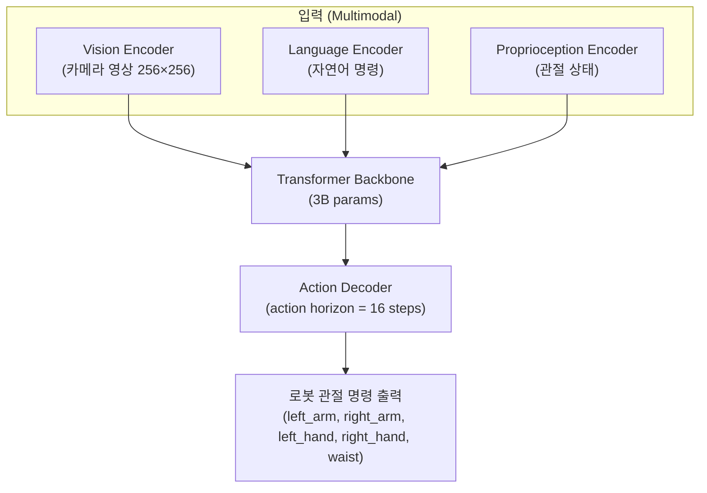
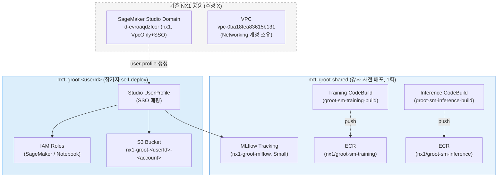

# 5. VLA Fine-tuning 인프라 배포 (NX1)

> 🟦 **BEST NX1**: 원본 가이드의 `cdk deploy`·`CloudShell`·`npm run deploy` 단계는 NX1에서 **모두 막혀 있습니다** (CloudShell 차단, CDK 미허용, Developer 역할은 직접 리소스 생성 불가). 본 모듈은 **CloudFormation 콘솔 + 강사가 미리 만든 공유 인프라**로 진행합니다. 접속 패턴은 [0. NX1 셀프 배포 가이드](0.-nx1-self-deploy.md) 참고. 또한 NX1 Day2는 **SageMaker 단일 학습 경로**로 간소화되어 있어 (Batch 스택은 제외) AWS Batch는 본 모듈에서 다루지 않습니다 — 학습은 모듈 7(SageMaker Pipeline) 한 길로 갑니다.

***

## 5.1 GR00T N1 개요

[NVIDIA GR00T N1](https://developer.nvidia.com/gr00t)은 범용 휴머노이드 로봇을 위한 **Vision-Language-Action (VLA) 모델**입니다. 이전 모듈에서 학습한 강화학습 기반 Policy(PPO)가 특정 태스크에 특화된 제어기라면, GR00T N1은 자연어 명령과 카메라 영상을 입력으로 받아 로봇 관절 명령을 직접 생성하는 **Foundation Model**입니다.

**GR00T N1 아키텍처:**



본 워크샵은 GR00T-N1.6 base를 사용합니다. (N1.7는 `nvidia/Cosmos-Reason2-2B` HuggingFace gated model 라이선스 동의가 필요해 NX1 워크샵에서는 제외했습니다.)

***

## 5.2 어떤 리소스가 필요한가 (원본 → NX1 매핑)

GR00T fine-tuning 파이프라인은 다음 리소스들이 필요합니다. 원본 가이드는 이를 CDK 3개 스택(`GrootFinetuneShared` + `GrootBatchTrain-<userId>` + `GrootFinetuneSagemaker-<userId>`)으로 묶어 한 번에 배포합니다. NX1에서는 거버넌스/quota/단순화 목적으로 **AWS Batch 경로를 제외**하고 SageMaker 단일 학습 경로만 사용하며, 신규 VPC·신규 Studio Domain은 기존 공용 자원을 import해 재사용합니다.

| 리소스 | 왜 필요한가 | 원본 (CDK 자동생성) | NX1에서 어떻게 |
|---|---|---|---|
| **VPC + Private Subnet** | 학습 잡·노트북·MLflow가 들어가는 사설 네트워크 | Batch/SM 스택이 IsaacLab 스택에서 import | NX1 공유 VPC `vpc-0ba18fea83615b131` 그대로 사용 (수정 금지). 모듈 0 참고 |
| **EFS** (학습 데이터·모델 공유) | 멀티 학습 잡 간 데이터셋·체크포인트 공유 | IsaacLab 스택에서 import | Day1에서 만든 EFS를 모듈 7 학습 잡이 그대로 사용 |
| **Training ECR repo** | 학습 컨테이너 이미지 저장 | `groot-sm-training` 자동 생성 | `nx1-groot-shared` 스택이 **`nx1/groot-sm-training`** 으로 생성. NX1 IAM은 `nx1/*` prefix만 ECR push/pull 허용 |
| **Inference ECR repo** | 추론 endpoint 컨테이너 저장 | `groot-sm-inference` 자동 생성 | 동일하게 **`nx1/groot-sm-inference`** |
| **Training CodeBuild** | Docker 이미지를 GPU 없이 ECR로 빌드·푸시 | `groot-sm-training-build` 빈 프로젝트 | `nx1-groot-shared`가 동일 이름으로 생성. 모듈 7에서 트리거 |
| **Inference CodeBuild** | 추론 이미지 빌드 | `groot-sm-inference-build` 빈 프로젝트 | 동일하게 `nx1-groot-shared`가 생성 |
| ~~**Batch Compute Env / JQ / JD**~~ | ~~AWS Batch로 GR00T fine-tune 분산 학습~~ | `GrootBatchTrain-<userId>` 스택 | **NX1 미사용** — 학습은 SageMaker Pipeline 한 길로. Batch ECR (`groot-batch-train`)도 미생성 |
| **SageMaker Studio Domain** | 노트북·UserProfile 컨테이너 | `physical-ai-studio` 신규 생성 (~10분) | **기존 `d-evroaqdzfcor` ("nx1" 도메인, VpcOnly + SSO) 재사용**. 신규 생성 안 함. 참가자 user-profile만 추가 |
| **SageMaker UserProfile** (per-user) | Studio 진입 + 본인 노트북·세션 | `GrootFinetuneSagemaker-<userId>` | `nx1-groot-<userId>` 스택이 생성. SSO 매핑(`SsoUserValue`) 필요 |
| **S3 Bucket** (per-user) | 학습 데이터·모델 아티팩트 | `groot-sm-artifacts-<userId>` | `nx1-groot-<userId>-<account>` (네이밍 `nx1-*` 강제) |
| **SageMakerRole** (per-user) | 학습 잡이 S3·ECR·MLflow 접근 | per-user 자동 | per-user CFN, 단 권한은 `nx1-*`/`dibh-*` 버킷·`nx1/*` ECR로 스코프 |
| **NotebookRole** (per-user) | Studio 노트북 권한 | per-user 자동 | 동일 |
| **MLflow Tracking Server** | 학습 metric / artifact / model registry | 사용자별 1개 (`groot-mlflow-<userId>`, Small) | **공유 1개** (`nx1-groot-mlflow`, Small). 모든 참가자가 동일 서버 사용 (시간당 과금 절감). per-user S3 prefix로 격리 |
| ~~**deploy-endpoint Lambda**~~ | ~~Pipeline 끝나면 자동 endpoint 배포~~ | per-user 자동 | **NX1 미사용** — 평가는 ZMQ-local 패턴으로 단순화 (Spec B.1) |

### 두 스택으로 압축

위 리소스들을 NX1에서는 다음 두 스택으로 묶어 배포합니다.

| 스택 | 누가 배포 | 무엇을 만드나 |
|---|---|---|
| **`nx1-groot-shared`** (Day2-shared) | **강사가 1회 사전 배포** | SageMaker training/inference ECR ×2 + CodeBuild ×2 + 공유 MLflow (Small) |
| **`nx1-groot-<userId>`** (Day2-user) | **참가자 본인이 self-deploy** | per-user S3 + SageMakerRole + NotebookRole + Studio user-profile |

### 5.2.1 공유 스택 — 강사 선배포 (참가자 진행 X)

`nx1-groot-shared`는 워크샵 시작 전 강사가 1회 배포합니다. 참가자는 별도 액션이 없으며, 강사가 제공하는 다음 값들을 사용합니다:

| 값 | 사용처 |
|---|---|
| Training ECR URI (`<account>.dkr.ecr.us-east-1.amazonaws.com/nx1/groot-sm-training`) | 모듈 7 학습 컨테이너 |
| Inference ECR URI (`...nx1/groot-sm-inference`) | 모듈 7 추론 endpoint |
| Training/Inference CodeBuild 프로젝트명 (`groot-sm-training-build`, `groot-sm-inference-build`) | 모듈 7 컨테이너 빌드 트리거 |
| **MLflow Tracking Server Name** (`nx1-groot-mlflow`) | 모듈 7 학습 metric/artifact 로깅 |
| **Studio Domain ID** (`d-evroaqdzfcor`) | 다음 단계 user-profile 배포에 파라미터로 입력 |

> 위 값들은 **CloudFormation 콘솔 → 스택 `nx1-groot-shared` → Outputs 탭**에서도 직접 확인할 수 있습니다 (참가자도 `BESTNX1-Developer` 역할로 read 가능).

### 5.2.2 사용자별 스택 — 참가자 self-deploy (~5분)

콘솔 → **CloudFormation** → **Create stack** → *With new resources*.

1. **Template source = Amazon S3 URL**:
   ```
   https://dibh-737138011740-us-east-1-cloudformation.s3.us-east-1.amazonaws.com/nx1/day2/day2-user.yaml
   ```
   *(정확한 URL은 강사가 채팅으로 공유. 로컬 "파일 업로드"는 권한 밖이라 실패합니다.)*

2. **Stack name**: `nx1-groot-<본인UserId>` (예 `nx1-groot-alice`).

3. **Parameters**:

   | 키 | 값 | 메모 |
   |---|---|---|
   | `UserId` | 본인 ID (소문자/숫자/하이픈) | Day1과 동일 ID 권장. 리소스 prefix·user-profile 이름이 됩니다 |
   | `StudioDomainId` | `d-evroaqdzfcor` | 강사가 채팅으로 확인. 기존 nx1 Studio 도메인 |
   | `SsoUserValue` | 본인의 IdC UserName *전체* (`<id>@doosan.com` 또는 `<id>@corp.doosan.com`) | local-part만 적으면 안 됩니다. AWS 팀은 `@doosan.com`, Bobcat 팀은 `@corp.doosan.com` |
   | `MlflowTrackingServerName` | `nx1-groot-mlflow` (또는 강사 제공 값 그대로) | `nx1-groot-shared` Outputs에서도 확인 가능 |
   | `CreateNotebook` 등 기타 | 기본값 유지 | |

4. **Configure stack options → Permissions → IAM role** = `CloudFormationDeployer` ⚠️필수
5. **Tags** → Key `doosan:owner`, Value `BEST_NX1` ⚠️필수 (없으면 거부)
6. **Submit** → `CREATE_IN_PROGRESS` → 약 3~5분 후 `CREATE_COMPLETE`.

**스택 Outputs (콘솔에서 확인):**

| 키 | 의미 |
|---|---|
| `BucketName` | per-user S3 버킷 (`nx1-groot-<userId>-<account>`) — 모듈 7 학습 데이터·아티팩트 저장 |
| `SageMakerRoleArn` | 학습 잡이 사용할 IAM 역할 |
| `NotebookRoleArn` | Studio Notebook 실행 역할 |
| `StudioUserProfileName` | 본인의 Studio user-profile 이름 (`<userId>`) |
| `MlflowArn` | (조건부) 공유 MLflow tracking server ARN — 모듈 7에서 학습 잡 환경변수로 주입 |

> **`SsoUserValue`를 비워둬도 됩니다**: 비워두면 user-profile은 만들어지지만 SSO 매핑이 없어 Studio 콘솔 진입 시 자동 생성될 수도 있습니다. 처음 시도 시 본인 IdC UserName 전체 형식이 헷갈리면 비우고 진행 → 작동 안 하면 update-stack 으로 채우는 방식도 OK.

### 5.2.3 리소스 다이어그램 (NX1)



> **원본 대비 빠진 것**: AWS Batch 스택 (`GrootBatchTrain-<userId>`), Batch ECR (`groot-batch-train`), 신규 Studio Domain. 모두 NX1에서 의도적으로 제외했습니다 — 거버넌스/quota/단순화 목적. 학습은 SageMaker만.

***

## 5.3 컨테이너 이미지 빌드 (모듈 7에서 트리거)

원본 가이드는 5단계에서 Batch 컨테이너를 자동 빌드했지만, NX1에서는 **SageMaker training/inference 컨테이너를 모듈 7 시작 부분에서 명시적으로 트리거**합니다 (CodeBuild는 빈 프로젝트로 등록만 되어 있음).

본 모듈에서는 **공유 스택의 CodeBuild 프로젝트가 등록되어 있는지만 확인**하고 넘어갑니다.

### 5.3.1 CodeBuild 프로젝트 확인

콘솔 → **CodeBuild** → **Build projects** → 다음 두 개가 보이면 OK:
- `groot-sm-training-build`
- `groot-sm-inference-build`

또는 SSM 세션 (Day1 인스턴스에서) CLI로:

```bash
aws codebuild batch-get-projects \
  --names groot-sm-training-build groot-sm-inference-build \
  --region us-east-1 \
  --query "projects[].name" --output text
```

> **`groot-batch-train-build`는 NX1에 없습니다** — Batch 경로 자체를 제외했기 때문. 원본 가이드 5.2.2의 "약 30분 빌드 대기" 단계는 모듈 7로 이동했습니다.

### 5.3.2 (선택) 빌드 상태 모니터링

모듈 7에서 CodeBuild를 트리거한 뒤 진행 상황은 다음으로 확인:

```bash
aws codebuild list-builds-for-project \
  --project-name groot-sm-training-build \
  --region us-east-1 \
  --query "ids[0]" --output text | \
xargs -I{} aws codebuild batch-get-builds --ids {} \
  --region us-east-1 \
  --query "builds[0].{Status:buildStatus,Phase:currentPhase}" \
  --output table
```

***

## 5.4 SageMaker Studio 진입 확인

본 모듈의 마지막 단계는 **본인 user-profile로 Studio에 진입할 수 있는지** 확인하는 것입니다. 모듈 7 학습 launch는 Studio 노트북에서 진행됩니다.

### 5.4.1 Studio 진입

1. AWS Identity Center 포털 (`https://ad-doosanad-1s129xqo6hgkh.awsapps.com/start/`) 로그인
2. **AWS account → BEST NX1 → SageMaker Studio NX1** 역할 클릭
3. SageMaker Studio 콘솔에서 **Domains → nx1 (`d-evroaqdzfcor`) → User profiles** 탭
4. 본인 `<userId>` user-profile이 보이는지 확인 → **Open Studio** (또는 user-profile 클릭 → **Launch**)
5. JupyterLab 또는 Code Editor 앱 시작 → 인스턴스 타입은 작은 것(`ml.t3.medium`)으로 시작, 학습은 SageMaker Training Job으로 별도 실행하므로 노트북 자체에 큰 GPU 불필요

> **첫 진입 시 user-profile이 자동 생성될 수도 있습니다** — `SsoUserValue`를 비워두고 배포한 경우, Studio 첫 로그인 시 IdC가 user-profile을 만들어줍니다. 이 경우 5.2.2의 user-profile은 중복으로 보일 수 있는데, 콘솔에서 확인 후 본인 것 하나만 사용하면 됩니다.

### 5.4.2 동작 확인 (간단)

Studio JupyterLab 새 노트북에서:

```python
import boto3
sm = boto3.client("sagemaker", region_name="us-east-1")

# 공유 MLflow tracking server 도달 가능한지
resp = sm.describe_mlflow_tracking_server(TrackingServerName="nx1-groot-mlflow")
print("MLflow:", resp["TrackingServerStatus"], resp["TrackingServerArn"])

# 본인 S3 버킷 접근
import os
s3 = boto3.client("s3", region_name="us-east-1")
bucket = f"nx1-groot-{os.environ.get('USER','<userId>')}-737138011740"  # 본인 userId로 변경
print("S3 bucket:", s3.head_bucket(Bucket=bucket))
```

`MLflow: Created arn:aws:sagemaker:...` 와 S3 bucket HTTP 200이 보이면 OK.

***

## 5.5 GR00T base 모델 추론 검증 (선택, Day1 DCV 인스턴스에서)

**왜 이 단계를?** 모듈 7에서 fine-tune한 모델을 평가하기 전에, **base 모델이 본인 환경에서 정상 동작하는지** 한 번 확인해 두면 모듈 6~8 디버깅이 훨씬 쉬워집니다. 실패 시 학습 결과물 문제인지 환경 문제인지 분리할 수 있습니다.

원본 가이드 5.3~5.4의 "ECR pull → docker run → ZMQ ping" 흐름은 NX1 Day1 인스턴스에서 그대로 동작합니다. SageMaker 학습/추론 경로(모듈 7)와는 별개의 빠른 sanity check 단계입니다.

### 5.5.1 사전 조건

- 본인 Day1 스택 (`nx1-isaaclab-<userId>`)이 `CREATE_COMPLETE` 상태이고 SSM Session Manager 또는 DCV로 접속 가능
- 강사가 5.2.1의 ECR에 GR00T-N1.6 inference 이미지를 미리 푸시해 두었거나, 모듈 7 빌드 후 진행

### 5.5.2 ECR 로그인 + 이미지 Pull

Day1 인스턴스에 SSM Session Manager로 접속한 후:

```bash
sudo su - ubuntu

# ECR 로그인 (인스턴스 역할로 자동, 별도 키 불필요)
aws ecr get-login-password --region us-east-1 | \
  docker login --username AWS \
    --password-stdin 737138011740.dkr.ecr.us-east-1.amazonaws.com

# 강사 제공 이미지 URI (또는 콘솔 ECR → nx1/groot-sm-inference 에서 복사)
ECR_URI=737138011740.dkr.ecr.us-east-1.amazonaws.com/nx1/groot-sm-inference:n1.6
docker pull "$ECR_URI"
docker images
```

> **NX1 인스턴스 역할은 `nx1/*` ECR에만 push/pull 권한**이 있습니다 (Spec A.3 IAM least-privilege). 다른 ECR repo는 의도적으로 차단되어 있으니 URI에 `nx1/` prefix가 있는지 확인하세요.

### 5.5.3 추론 서버 실행 (EFS 모델 경로)

원본 가이드와 동일하게 EFS에 받아진 N1.6 체크포인트를 직접 로딩합니다. (Day1 인스턴스 EFS 마운트 경로 = `/home/ubuntu/environment/efs`)

```bash
# 기존 컨테이너 정리
docker rm -f groot-policy-server 2>/dev/null

echo "ECR_URI=$ECR_URI"   # 비어있으면 위 단계 다시

docker run -d --gpus all --name groot-policy-server \
  --shm-size=8g --network host \
  --entrypoint /bin/sh \
  -e PYTHONUNBUFFERED=1 \
  -v /home/ubuntu/environment/efs:/mnt/efs \
  "$ECR_URI" \
  -c 'cd /workspace/gr00t-repo && python3 -m gr00t.eval.run_gr00t_server \
    --model-path /mnt/efs/GR00T-N1.6-3B \
    --embodiment-tag GR1 \
    --host 0.0.0.0 \
    --port 5555'

docker logs -f groot-policy-server   # "Server ready" 보면 Ctrl+C
```

### 5.5.4 ZMQ ping

```bash
docker run --rm --network=host "$ECR_URI" -c '
python3 -c "
import zmq, msgpack
ctx = zmq.Context()
sock = ctx.socket(zmq.REQ)
sock.connect(\"tcp://localhost:5555\")
sock.send(msgpack.packb({\"endpoint\": \"ping\"}))
print(\"Server response:\", msgpack.unpackb(sock.recv(), raw=False))
"'
```

기대: `Server response: {'status': 'ok', 'message': 'Server is running'}`

### 5.5.5 전체 상태 확인

```bash
echo "=== GPU ==="
nvidia-smi --query-gpu=name,memory.used,memory.total --format=csv

echo "=== Docker Images ==="
docker images | grep -iE 'groot|nx1'

echo "=== Policy Server ==="
docker ps | grep groot-policy-server

echo "=== Port 5555 ==="
ss -tlnp | grep 5555
```

***

## 5.6 자주 막히는 곳 (NX1)

| 증상 | 해결 |
|---|---|
| `CREATE_FAILED: not authorized to perform iam:CreateRole` | IAM role을 `CloudFormationDeployer`로 안 바꿨습니다. 5.2.2 step 4 |
| `CreateStack` 거부 (태그 누락) | `doosan:owner=BEST_NX1` 태그 필수. 5.2.2 step 5 |
| user-profile `CREATE_FAILED: ResourceNotFound` (Domain) | `StudioDomainId`가 `d-evroaqdzfcor` 정확히 입력됐는지. 비슷한 도메인 ID를 다른 계정에 만들면 안 됩니다 (NX1 강제) |
| user-profile `ValidationException: SSO 매핑` | `SsoUserValue`가 IdC UserName 전체 형식이어야 합니다 (`<id>@doosan.com` 또는 `<id>@corp.doosan.com`). local-part만은 거부. 모르겠으면 비우고 진행 |
| ECR pull `denied: requested access to the resource is denied` | `nx1/` prefix가 빠진 ECR URI일 가능성. NX1 인스턴스 역할은 `nx1/*` 외 차단 |
| `MlflowArn` Output이 안 보임 | `CreateMlflow=false`로 배포되었거나 `nx1-groot-shared` 스택이 다른 이름의 MLflow를 만들었습니다. `aws sagemaker list-mlflow-tracking-servers` 확인 |
| Studio user-profile은 만들었는데 IdC 로그인 시 본인 도메인이 안 보임 | IdC 그룹 할당이 관리계정(`363445155762`) 측에서 누락. 강사 또는 Dimitri에게 SR로 요청 |

***

## References

- [NX1 Self-deploy 가이드 (모듈 0)](0.-nx1-self-deploy.md)
- [NVIDIA Isaac-GR00T GitHub](https://github.com/NVIDIA/Isaac-GR00T)
- [GR00T N1.6 모델 (HuggingFace)](https://huggingface.co/nvidia/GR00T-N1.6-3B)
- AWS 콘솔 — CloudFormation, CodeBuild, SageMaker Studio, ECR
- 강사가 미리 배포한 스택 이름: `nx1-groot-shared` (참가자 read-only로 Outputs 확인 가능)
