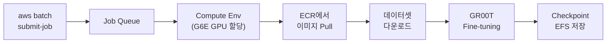
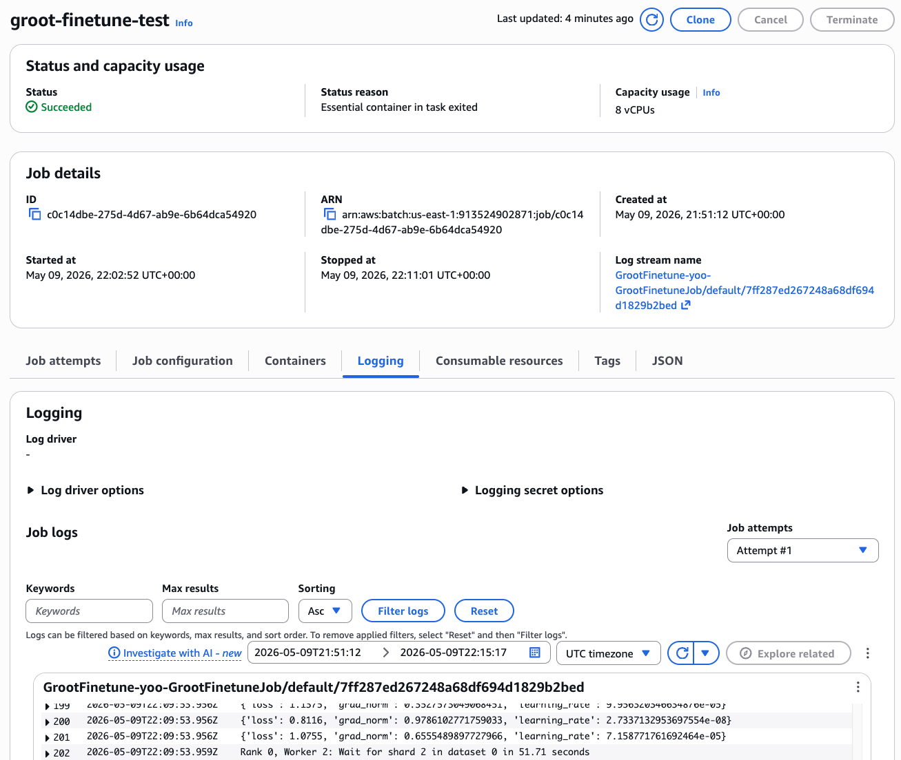
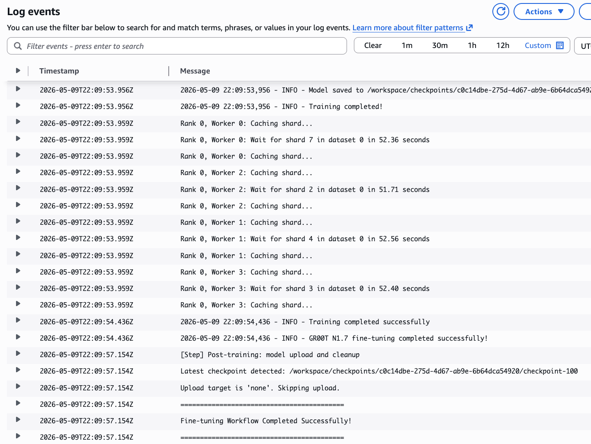
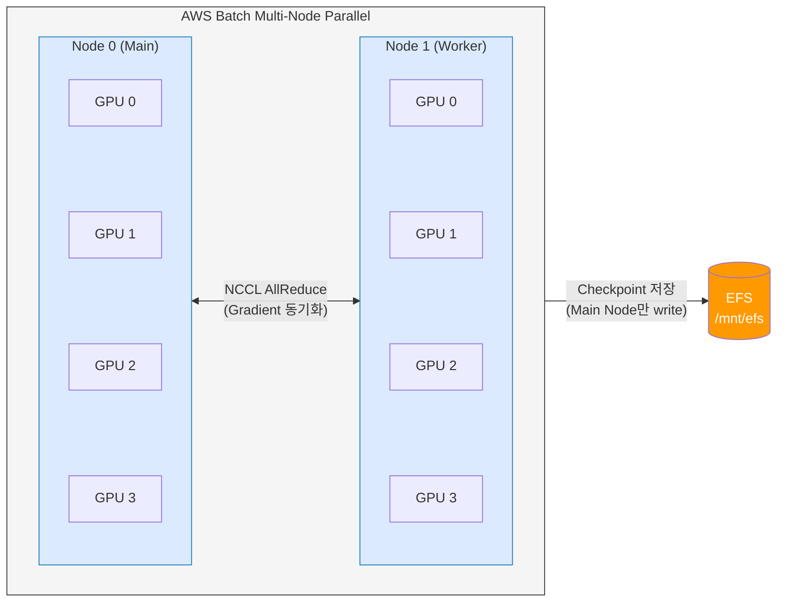

# 6. VLA Fine-tuning on AWS Batch

이 모듈에서는 AWS Batch를 사용하여 [NVIDIA GR00T N1](https://developer.nvidia.com/gr00t) VLA(Vision-Language-Action) 모델을 fine-tuning합니다. [모듈 5](5.-train-infra-setup.md)에서 사전학습된 GR00T 모델로 추론을 테스트했다면, 이번 모듈에서는 **커스텀 로봇 데이터셋**에 맞게 모델을 미세조정합니다.

[모듈 5.2](5.-train-infra-setup.md#5.2-gr00t-fine-tuning-cdk-배포)에서 배포한 `infra/groot` CDK의 CodeBuild가 빌드한 ECR 이미지를 그대로 사용합니다. 기본값은 **N1.6**이며, CDK 배포 시 `-c grootVersion=n1.7`을 지정했다면 N1.7 이미지가 사용됩니다.

기존 DCV 인스턴스와 EFS를 공유하므로, 학습 결과를 DCV에서 바로 확인할 수 있습니다.

| 서비스 | 쉬운 비유 |
|--------|-----------|
| [AWS Batch](https://docs.aws.amazon.com/batch/latest/userguide/what-is-batch.html) | 작업을 넣으면 알아서 GPU 서버를 켜고, 끝나면 꺼주는 자동 실행기 |
| [Amazon ECR](https://docs.aws.amazon.com/AmazonECR/latest/userguide/what-is-ecr.html) | Private Docker Hub — 컨테이너 이미지 저장소 |
| [AWS CodeBuild](https://docs.aws.amazon.com/codebuild/latest/userguide/welcome.html) | 클라우드에서 Docker 이미지를 자동으로 빌드해주는 서비스 |


[모듈 5](5.-train-infra-setup.md)에서 `infra/groot` CDK 배포와 CodeBuild 이미지 빌드가 완료된 상태여야 합니다. 아직 배포하지 않았다면 [모듈 5.2](5.-train-infra-setup.md#5.2-gr00t-fine-tuning-cdk-배포)을 먼저 진행하세요.


---

## 6.1 Fine-tuning Job 제출 (~15분)

샘플 데이터셋으로 짧은 테스트 학습을 실행하여 전체 파이프라인이 정상 동작하는지 확인합니다.




**N1.7 사용 시 `HF_TOKEN` 필수:** GR00T N1.7은 [nvidia/Cosmos-Reason2-2B](https://huggingface.co/nvidia/Cosmos-Reason2-2B) backbone을 사용하며, 이 모델은 HuggingFace gated model입니다. N1.7으로 배포한 경우 모델 초기화 시 인증이 필요하므로, `HF_TOKEN` 없이 제출된 Job은 즉시 실패합니다. Job 제출 전에:
1. HuggingFace 계정에서 [모델 라이선스에 동의](https://huggingface.co/nvidia/Cosmos-Reason2-2B)합니다
2. [Access Token](https://huggingface.co/settings/tokens)을 생성합니다

**N1.6 사용 시:** `HF_TOKEN`이 없어도 학습이 가능합니다. 단, HuggingFace 데이터셋(`HF_DATASET_ID`)을 사용하려면 토큰이 필요할 수 있습니다.


### 테스트 잡 제출 (100 steps, 약 10~15분):

**N1.6 (기본):**

```bash
aws batch submit-job \
  --job-name groot-batch-train-test \
  --job-queue groot-batch-train-<userId>-queue \
  --job-definition groot-batch-train-<userId>-job-single \
  --region us-east-1 \
  --container-overrides '{
    "environment": [
      {"name": "MAX_STEPS", "value": "100"},
      {"name": "SAVE_STEPS", "value": "50"},
      {"name": "RESUME", "value": "false"}
    ]
  }'
```

<details>
<summary><strong>HuggingFace 커스텀 데이터셋으로 학습</strong></summary>

`HF_DATASET_ID`를 지정하면 컨테이너가 자동으로 해당 데이터셋을 다운로드하여 학습합니다:

```bash
aws batch submit-job \
  --job-name groot-batch-train-custom \
  --job-queue groot-batch-train-<userId>-queue \
  --job-definition groot-batch-train-<userId>-job-single \
  --region us-east-1 \
  --container-overrides '{
    "environment": [
      {"name": "HF_TOKEN", "value": "<your-hf-token>"},
      {"name": "HF_DATASET_ID", "value": "LightwheelAI/leisaac-pick-orange"},
      {"name": "MAX_STEPS", "value": "6000"},
      {"name": "SAVE_STEPS", "value": "2000"}
    ]
  }'
```

</details>

<details>
<summary><strong>N1.7로 배포한 경우 (HF_TOKEN 필수)</strong></summary>

```bash
aws batch submit-job \
  --job-name groot-batch-train-test \
  --job-queue groot-batch-train-<userId>-queue \
  --job-definition groot-batch-train-<userId>-job-single \
  --region us-east-1 \
  --container-overrides '{
    "environment": [
      {"name": "HF_TOKEN", "value": "<your-hf-token>"},
      {"name": "MAX_STEPS", "value": "100"},
      {"name": "SAVE_STEPS", "value": "50"},
      {"name": "RESUME", "value": "false"}
    ]
  }'
```

</details>


`RESUME=false`는 기존 checkpoint가 있을 때 처음부터 학습을 시작합니다. 이전 학습을 이어서 하려면 이 값을 제거하거나 `true`로 설정하세요. 단, 이전 학습과 `DATA_CONFIG` 또는 `EMBODIMENT_TAG`가 달라지면 shape mismatch 에러가 발생할 수 있습니다.


정상 출력:

```json
{
    "jobArn": "arn:aws:batch:us-east-1:123456789012:job/xxxxxxxx-xxxx-xxxx-xxxx-xxxxxxxxxxxx",
    "jobName": "groot-batch-train-test",
    "jobId": "xxxxxxxx-xxxx-xxxx-xxxx-xxxxxxxxxxxx"
}
```

반환된 `jobId`를 메모합니다.

<details>
<summary>본격 학습 잡 제출 예시 (6000 steps, ~2시간)</summary>

```bash
aws batch submit-job \
  --job-name groot-batch-train-full \
  --job-queue groot-batch-train-<userId>-queue \
  --job-definition groot-batch-train-<userId>-job-single \
  --region us-east-1 \
  --container-overrides '{
    "environment": [
      {"name": "MAX_STEPS", "value": "6000"},
      {"name": "SAVE_STEPS", "value": "2000"},
      {"name": "GLOBAL_BATCH_SIZE", "value": "32"}
    ]
  }'
```

N1.7 사용 시에는 `{"name": "HF_TOKEN", "value": "<your-hf-token>"}`를 environment 배열에 추가합니다.

</details>

<details>
<summary>더 큰 인스턴스로 빠르게 학습하기 (GPU 스케일업)</summary>

Compute Environment에는 g6e.2xlarge ~ g6e.48xlarge까지 허용되어 있습니다. `--container-overrides`에 `resourceRequirements`를 추가하면 Batch가 요청에 맞는 큰 인스턴스를 자동 할당합니다:

```bash
# 4 GPU (g6e.12xlarge 자동 선택) — 단일 노드에서 4배 빠른 학습
aws batch submit-job \
  --job-name groot-batch-train-fast \
  --job-queue groot-batch-train-<userId>-queue \
  --job-definition groot-batch-train-<userId>-job-single \
  --region us-east-1 \
  --container-overrides '{
    "resourceRequirements": [
      {"type": "GPU", "value": "4"},
      {"type": "VCPU", "value": "48"},
      {"type": "MEMORY", "value": "393216"}
    ],
    "environment": [
      {"name": "NUM_GPUS", "value": "4"},
      {"name": "MAX_STEPS", "value": "100"},
      {"name": "SAVE_STEPS", "value": "50"},
      {"name": "RESUME", "value": "false"}
    ]
  }'
```

| GPU 요청 | 선택되는 인스턴스 | vCPU / Memory 설정 | 용도 |
|----------|-------------------|-------------------|------|
| 1 | g6e.2xlarge | 8 / 65536 | 기본 테스트 (기본값) |
| 1 | g6e.4xlarge | 16 / 131072 | 큰 배치 사이즈, 더 많은 DataLoader workers |
| 4 | g6e.12xlarge | 48 / 393216 | 빠른 학습 |
| 8 | g6e.48xlarge | 192 / 786432 | 최대 단일노드 성능 |


`resourceRequirements`의 GPU 수와 `environment`의 `NUM_GPUS` 값을 반드시 일치시켜야 합니다. GPU만 할당하고 `NUM_GPUS`를 올리지 않으면 일부 GPU가 유휴 상태가 됩니다.


</details>

<details>
<summary>주요 학습 파라미터 설명</summary>

| 파라미터 | 기본값 | 설명 |
|----------|--------|------|
| `MAX_STEPS` | 6000 | 총 학습 스텝 수 |
| `SAVE_STEPS` | 2000 | 체크포인트 저장 간격 |
| `GLOBAL_BATCH_SIZE` | 32 | 글로벌 배치 크기 (BATCH_SIZE도 alias로 사용 가능) |
| `LEARNING_RATE` | 1e-4 | 학습률 |
| `GRADIENT_ACCUMULATION_STEPS` | 1 | Gradient 누적 스텝 |
| `NUM_GPUS` | 1 | GPU 수 |
| `TUNE_PROJECTOR` | true | Projector 학습 여부 |
| `TUNE_DIFFUSION_MODEL` | true | Diffusion 모델 학습 여부 |
| `TUNE_LLM` | false | LLM 레이어 학습 여부 |
| `TUNE_VISUAL` | false | Vision 레이어 학습 여부 |
| `MODALITY_CONFIG_PATH` | /workspace/scripts/so101_modality_config.py | Modality config 경로 |
| `EMBODIMENT_TAG` | new_embodiment | 로봇 Embodiment 태그 |
| `HF_TOKEN` | (N1.7 필수) | HuggingFace Access Token (N1.7의 gated model 접근용, N1.6은 불필요) |
| `HF_DATASET_ID` | (없음) | HuggingFace 데이터셋 ID |

</details>

---

## 6.2 학습 모니터링

### Job 상태 확인

```bash
JOB_ID=<submit-job에서 반환된 jobId>

aws batch describe-jobs \
  --jobs $JOB_ID \
  --region us-east-1 \
  --query "jobs[0].{Status:status,Reason:statusReason}" \
  --output table
```

Job은 아래 순서로 상태가 전이됩니다:


| 상태 | 의미 | 예상 소요 |
|------|------|-----------|
| SUBMITTED → RUNNABLE | Job 등록 및 스케줄링 | 수초 |
| RUNNABLE → STARTING | GPU 인스턴스 프로비저닝 | 3~5분 |
| STARTING → RUNNING | 컨테이너 이미지 Pull + 시작 | 5~10분 (~15GB 이미지) |
| RUNNING → SUCCEEDED | 학습 실행 | 10~15분 (100 steps) |



### CloudWatch 로그 확인

```bash
aws logs tail /aws/batch/job \
  --region us-east-1 \
  --follow
```

학습이 정상 시작되면 아래와 같은 로그가 출력됩니다:

```
==========================================
Fine-tuning Workflow Starting
==========================================
...
EFS mount is accessible: /mnt/efs
Job output directory: /mnt/efs/gr00t/checkpoints/<JOB_ID>
Starting Python finetune script...
All required parameters validated successfully
Validating dataset...
Starting training...
Using 1 GPUs
Total parameters: 3,144,016,000
Trainable parameters: 1,620,515,968 (51.54%)
Current global step: 0
  0%|          | 0/100 [00:00<?, ?it/s]
```




Job이 RUNNABLE 상태에서 오래 멈추는 경우, 해당 AZ에서 G6E 인스턴스 용량이 부족할 수 있습니다. 잠시 대기하면 보통 해결됩니다.


---

## 6.3 DCV에서 Checkpoint 확인

학습이 완료되면 DCV 인스턴스에 접속하여 결과를 확인합니다. Batch Job과 DCV가 동일한 EFS를 마운트하므로, 학습 결과에 바로 접근할 수 있습니다.

DCV 접속 URL은 IsaacLab Stack의 `DcvUrl` Output에서 확인합니다 (예: `https://<IP>:8443`).

DCV 터미널에서:

```bash
# Job별 checkpoint 디렉토리 확인
ls -la /home/ubuntu/environment/efs/gr00t/checkpoints/

# 특정 Job의 checkpoint 내용 확인 (JOB_ID는 submit-job에서 반환된 값)
ls /home/ubuntu/environment/efs/gr00t/checkpoints/<JOB_ID>/checkpoint-*/
```

정상적으로 학습이 완료되었다면 아래와 같은 구조가 보입니다 (각 Job마다 고유 디렉토리 생성):

```
/home/ubuntu/environment/efs/gr00t/checkpoints/<JOB_ID>/
├── checkpoint-50/
│   ├── config.json
│   ├── model.safetensors
│   └── training_args.bin
├── checkpoint-100/
│   ├── config.json
│   ├── model.safetensors
│   └── training_args.bin
```

---

## 6.4 Multi-Node Multi-GPU 분산 학습

단일 GPU로 기본 동작을 확인했다면, 여러 노드와 GPU를 활용하여 학습 속도를 높일 수 있습니다. CDK는 단일 노드용(`groot-batch-train-<userId>-job-single`)과 멀티 노드용(`groot-batch-train-<userId>-job-multinode`) 두 개의 Job Definition을 생성합니다.

### 분산 학습 아키텍처



**동작 흐름:**
1. AWS Batch가 2개 노드를 프로비저닝하고 환경변수를 주입:
   - 모든 노드: `AWS_BATCH_JOB_NODE_INDEX` (0 또는 1)
   - Worker 노드만: `AWS_BATCH_JOB_MAIN_NODE_PRIVATE_IPV4_ADDRESS` (메인 노드 IP)
2. 엔트리포인트 스크립트가 이를 `MASTER_ADDR`, `NODE_RANK`로 변환 (Main 노드는 `hostname -i`로 자기 IP 사용)
3. `torchrun --nnodes=2 --nproc_per_node=4 --node-rank={0|1} --master-addr=...`로 분산 학습 실행

### Multi-GPU Job 제출 (2노드 × 4GPU = 총 8GPU)

CDK가 생성한 Multi-Node Job Definition에는 기본값(2노드 × 4GPU, g6e.12xlarge)이 설정되어 있으므로, 별도의 리소스 override 없이 바로 제출할 수 있습니다:

```bash
aws batch submit-job \
  --job-name groot-batch-train-distributed \
  --job-queue groot-batch-train-<userId>-queue \
  --job-definition groot-batch-train-<userId>-job-multinode \
  --region us-east-1
```

<details>
<summary><strong>환경변수를 override하여 제출하는 경우</strong></summary>

`--node-overrides`로 학습 파라미터를 변경할 수 있습니다:

```bash
aws batch submit-job \
  --job-name groot-batch-train-distributed \
  --job-queue groot-batch-train-<userId>-queue \
  --job-definition groot-batch-train-<userId>-job-multinode \
  --region us-east-1 \
  --node-overrides '{
    "nodePropertyOverrides": [{
      "targetNodes": "0:1",
      "containerOverrides": {
        "environment": [
          {"name": "MAX_STEPS", "value": "3000"},
          {"name": "SAVE_STEPS", "value": "1000"},
          {"name": "GLOBAL_BATCH_SIZE", "value": "64"}
        ]
      }
    }]
  }'
```

N1.7 사용 시에는 `{"name": "HF_TOKEN", "value": "<your-hf-token>"}`를 environment 배열에 추가합니다.

</details>


**Job Definition 구분:**
- `groot-batch-train-<userId>-job-single` — 단일 노드용. `--container-overrides`로 환경변수 override
- `groot-batch-train-<userId>-job-multinode` — 멀티 노드용. `--node-overrides`로 환경변수 override. `targetNodes: "0:1"`은 모든 노드(0번과 1번)에 동일한 override를 적용합니다


### 주요 설정 값 (Multi-Node Job Definition 기본값)

| 파라미터 | 값 | 설명 |
|----------|-----|------|
| `NUM_GPUS` | 4 | 노드당 GPU 수 (g6e.12xlarge 기준) |
| `NUM_NODES` | 2 | 총 노드 수 |
| `DATALOADER_NUM_WORKERS` | 2 | GPU 증가 시 shared memory 고갈 방지를 위해 줄여야 함 |
| GPU (resource) | 4 | 컨테이너에 할당할 GPU |
| VCPU (resource) | 48 | g6e.12xlarge의 48 vCPU |
| MEMORY (resource) | 393216 MB (384GB) | g6e.12xlarge의 메모리 |


**Compute Environment 확인사항:**
- 인스턴스 타입이 `g6e.12xlarge` (4 GPU) 이상이어야 합니다
- Service Quota에서 **Running On-Demand G and VT instances**가 최소 96 vCPU 이상 (48 vCPU × 2노드) 필요합니다
- Security Group에 노드 간 자기참조 인바운드 규칙이 있어야 NCCL 통신이 가능합니다


<details>
<summary>스케일링 구성 예시</summary>

| 구성 | 인스턴스 | 총 GPU | 적합한 경우 |
|------|----------|--------|-------------|
| 2노드 × 1GPU | g6e.xlarge | 2 | 기본 테스트, 소규모 데이터셋 |
| 2노드 × 4GPU | g6e.12xlarge | 8 | 프로덕션 학습 |
| 2노드 × 8GPU | g6e.48xlarge | 16 | 대규모 데이터셋, 빠른 수렴 필요 시 |

GPU 수가 많아질수록 `GLOBAL_BATCH_SIZE`를 키우거나 `GRADIENT_ACCUMULATION_STEPS`를 줄여 학습 효율을 높일 수 있습니다.

</details>

---

## 6.5 정리 (선택)

실습이 끝난 후 본인의 사용자 스택만 삭제합니다 (공유 ECR/CodeBuild 는 다른 참가자가 쓰므로 그대로 둡니다):

```bash
cd infra/groot
npx cdk destroy GrootBatchTrain -c userId=<userId>
```


**공유 스택 정리** (워크숍 종료 후 관리자):
```bash
npx cdk destroy GrootFinetuneShared
```
ECR 이미지를 포함해 한 번에 깔끔하게 삭제됩니다 (Custom Resource onDelete 핸들러가 자동 처리).


---

## 6.6 트러블슈팅

| 증상 | 원인 | 해결 |
|------|------|------|
| `Access to model nvidia/Cosmos-Reason2-2B is restricted` | N1.7 사용 시 HF_TOKEN 미설정 또는 라이선스 미동의 | [모델 페이지](https://huggingface.co/nvidia/Cosmos-Reason2-2B)에서 라이선스 동의 후 `HF_TOKEN` 환경변수 추가 |
| `size mismatch for action_head` | 이전 checkpoint와 현재 config 불일치 | `RESUME=false`로 재시도하거나 기존 checkpoint 삭제 |
| Job이 RUNNABLE에서 멈춤 | G6E 인스턴스 용량 부족 | 다른 AZ 또는 인스턴스 타입으로 조정. 또는 잠시 대기 |
| EFS 마운트 실패 | 보안 그룹 규칙 누락 | Batch SG → EFS SG로 TCP 2049 인바운드 허용 확인 |
| Container image not found | CodeBuild 빌드 미완료 | `Status: SUCCEEDED` 확인 후 재시도 |
| OOM (Out of Memory) | DataLoader shared memory 부족 | `DATALOADER_NUM_WORKERS=2`로 줄여서 재시도 |
| Loss가 줄지 않음 | 학습률 또는 배치 크기 부적절 | `LEARNING_RATE=5e-5`, `BATCH_SIZE=16`으로 조정 |

---

## References

* [AWS Batch User Guide - Managed Compute Environments](https://docs.aws.amazon.com/batch/latest/userguide/managed_compute_environments.html)
* [AWS Batch - EFS Volume Configuration](https://docs.aws.amazon.com/batch/latest/APIReference/API_EFSVolumeConfiguration.html)
* [AWS CodeBuild User Guide](https://docs.aws.amazon.com/codebuild/latest/userguide/welcome.html)
* [NVIDIA Isaac-GR00T Repository](https://github.com/NVIDIA/Isaac-GR00T)
* [GR00T N1.6 모델 (HuggingFace)](https://huggingface.co/nvidia/GR00T-N1.6-3B)
* [GR00T N1.7 모델 (HuggingFace)](https://huggingface.co/nvidia/GR00T-N1.7-3B)
* [infra/groot CDK](https://github.com/hi-space/aws-physical-ai-recipes/tree/main/e2e-workshop/infra/groot)
