# 7. SageMaker를 활용한 VLA 학습 및 배포 파이프라인

> 🟦 **BEST NX1 변경 요약** (2026-05-29 워크샵 v1):
> - **본 모듈의 모든 명령은 본인 Day1 인스턴스의 code-server (브라우저 VSCode :8888)** 에서 실행합니다. 모듈 5 §5.4의 환경변수 설정·코드 클론·sanity check를 끝낸 상태에서 시작합니다.
> - **SageMaker Studio JupyterLab 미사용** — NX1 Studio 도메인 EBS KMS 권한 제약으로 새 JupyterLab space 생성 실패. Studio 콘솔은 MLflow UI / Model Registry view 등 *읽기 전용* 으로만 (모듈 5 §5.4.5).
> - **CloudShell·CDK·`update-config.ts` 미사용** — `config.yaml`은 §7.2.4에서 직접 작성합니다.
> - **공유 vs per-user 인프라**: 공유 = `nx1-groot-shared`(강사 선배포, ECR ×2 + CodeBuild ×2 + 공유 MLflow `nx1-groot-mlflow`). per-user = `nx1-groot-<userId>`(본인 self-deploy, S3 + SageMakerRole + NotebookRole). per-user 스택은 user-profile을 만들지 않습니다.
> - **학습 Training Job**: `--no-spot`(On-Demand) + **VPC 미바인딩**(기본)으로 실행. ECR/S3는 `nx1/*`·`nx1-*` 네이밍 강제.
> - **MLflow tracking server**: 공유 1개로 `nx1-groot-mlflow` (prescribed name) — `config.yaml`에 직접 박힙니다.

이 모듈에서는 AWS SageMaker를 사용하여 [NVIDIA GR00T N1](https://developer.nvidia.com/gr00t) VLA(Vision-Language-Action) 모델을 fine-tuning합니다. [모듈 6](6.-vla-train-batch.md)(AWS Batch)과 달리, SageMaker는 **실시간 추론 엔드포인트**로 즉시 배포할 수 있어 로봇 시스템과의 통합이 용이합니다.

SageMaker Pipeline 한 번으로 **학습 → Model Registry 등록 → Endpoint 배포까지 자동 진행**됩니다. 같은 파이프라인 정의를 파라미터만 바꿔 재사용할 수 있고, 결과 endpoint는 [SageMaker Endpoint](https://docs.aws.amazon.com/sagemaker/latest/dg/realtime-endpoints.html) REST API로 즉시 호출 가능합니다. 동일한 데이터셋(LightwheelAI/leisaac-pick-orange, SO-101 로봇)으로 Batch 결과와 학습 곡선을 비교 검증할 수 있습니다.

| 서비스 | 설명 |
|--------|-----------|
| [Amazon SageMaker Training Job](https://docs.aws.amazon.com/sagemaker/latest/dg/train-model.html) | 클라우드에서 ML 모델을 학습시켜주는 관리형 서비스 (학습 스크립트를 컨테이너에 담아 제출하면 GPU 할당 + 자동 실행) |
| [Amazon SageMaker Model Registry](https://docs.aws.amazon.com/sagemaker/latest/dg/model-registry.html) | 학습된 모델 버전을 저장하고 승인/관리하는 카탈로그  |
| [Amazon SageMaker Endpoint](https://docs.aws.amazon.com/sagemaker/latest/dg/realtime-endpoints.html) | 배포된 모델을 REST API로 24/7 접근 가능하게 서빙하는 관리형 호스팅  |
| [Amazon ECR](https://docs.aws.amazon.com/AmazonECR/latest/userguide/what-is-ecr.html) | Private Docker Hub — 학습/추론 컨테이너 이미지 저장소 |
| [AWS CodeBuild](https://docs.aws.amazon.com/codebuild/latest/userguide/welcome.html) | 클라우드에서 Docker 이미지를 자동으로 빌드해주는 서비스 |
| [Amazon S3](https://docs.aws.amazon.com/s3/latest/userguide/Welcome.html) | 데이터셋, 모델, 체크포인트를 저장하는 객체 스토리지 |


이 모듈은 [모듈 5](5.-train-infra-setup.md)에서 `nx1-groot-shared`(강사 사전 배포)와 `nx1-groot-<userId>`(본인 self-deploy)가 모두 `CREATE_COMPLETE` 인 상태를 전제로 합니다.


---

## 7.1 사전 요구사항 (~5분)

**필요한 IAM 권한:**
- `sagemaker:CreateTrainingJob`, `sagemaker:DescribeTrainingJob`
- `sagemaker:CreateModel`, `sagemaker:CreateEndpoint`, `sagemaker:InvokeEndpoint`
- `ecr:DescribeRepositories`, `codebuild:StartBuild`, `codebuild:BatchGetBuilds`
- `s3:GetObject`, `s3:PutObject` (학습/모델 아티팩트 버킷)
- `cloudformation:*` (인프라 배포)


**AWS 계정 권한 확인:** `aws sts get-caller-identity`로 현재 계정과 권한을 확인합니다. Admin 또는 PowerUser 권한이 권장되며, 제한된 IAM 역할을 사용하는 경우 위 권한이 모두 포함되었는지 확인하세요.


---

## 7.2 인프라 배포 결과 확인 + config.yaml 작성 (~5분)

[모듈 5](5.-train-infra-setup.md)에서 이미 `nx1-groot-shared`(강사 선배포)와 `nx1-groot-<userId>`(본인 self-deploy)가 배포되어 있어야 합니다. 본 절에서는 결과만 확인하고 `config.yaml`을 작성합니다.

스택 구성 요약 (NX1):

| 스택 | 종류 | 모듈 7에서 사용하는 리소스 |
|---|---|---|
| `nx1-groot-shared` | 강사, 1회 | `nx1/groot-sm-training` / `nx1/groot-sm-inference` ECR, `groot-sm-training-build` / `groot-sm-inference-build` CodeBuild, 공유 MLflow `nx1-groot-mlflow` |
| `nx1-groot-<userId>` | 본인 self-deploy | S3 `nx1-groot-<userId>-<NX1_ACCOUNT>`, `nx1-GR00TSageMakerRole-<userId>`, `nx1-GR00TNotebookRole-<userId>`, LogGroup `/aws/sagemaker/groot-sm-<userId>` |

> 원본 가이드의 `update-config.ts` 자동 채움은 NX1에서 사용하지 않습니다 (CDK Outputs export 가정). 대신 본인 Day2 스택 Outputs를 boto3로 조회해 `config.yaml`을 직접 작성합니다.

### 7.2.1 사전 조건 — code-server 진입 + 환경변수

[모듈 5 §5.4](5.-train-infra-setup.md#5-4-학습-launch-환경--day1-인스턴스의-code-server-vscode-in-browser)에서 code-server 진입 + 워크샵 코드 클론(`~/aws-physical-ai-recipes`) + 환경변수(`USER_ID`, `NX1_ACCOUNT`, `AWS_DEFAULT_REGION`) 설정 + sanity check가 끝나 있어야 합니다. 본 모듈의 모든 명령은 그 code-server Terminal에서 실행합니다.

빠르게 재확인:

```bash
echo "USER_ID=$USER_ID  NX1_ACCOUNT=$NX1_ACCOUNT  REGION=$AWS_DEFAULT_REGION"
cd ~/aws-physical-ai-recipes/e2e-workshop/groot
```

세 환경변수가 비어있으면 모듈 5 §5.4.3을 다시 따르세요.

### 7.2.2 config.yaml 작성

`USER_ID` / `NX1_ACCOUNT` 환경변수가 설정되어 있다면 (모듈 5 §5.4.3) `config.yaml`을 한 번에 생성합니다. MLflow tracking server 이름은 `nx1-groot-mlflow`로 고정되어 직접 박혀 있습니다.

**먼저 환경변수가 현재 셸에서 보이는지 확인** (값이 비어있으면 yaml 안에 `${USER_ID}` 같은 raw 문자가 그대로 남아 line 2~ 파싱 에러로 이어집니다):

```bash
echo "USER_ID=$USER_ID  NX1_ACCOUNT=$NX1_ACCOUNT"   # 둘 다 값이 보여야 함. 비어있으면 export 다시:
# export USER_ID=<본인UserId>
# export NX1_ACCOUNT=737138011740
```

이제 here-doc으로 작성 (delimiter는 따옴표 없는 `<<EOF` — 변수 expansion 되어야 함):

```bash
cat > ~/aws-physical-ai-recipes/e2e-workshop/groot/config.yaml <<EOF
aws:
  account_id: '${NX1_ACCOUNT}'
  alias: ${USER_ID}
  bucket_name: nx1-groot-${USER_ID}-${NX1_ACCOUNT}
  region: us-east-1
  role_arn: arn:aws:iam::${NX1_ACCOUNT}:role/nx1-GR00TSageMakerRole-${USER_ID}
codebuild:
  inference_project: groot-sm-inference-build
  training_project: groot-sm-training-build
ecr:
  training_uri: ${NX1_ACCOUNT}.dkr.ecr.us-east-1.amazonaws.com/nx1/groot-sm-training:latest
  inference_uri: ${NX1_ACCOUNT}.dkr.ecr.us-east-1.amazonaws.com/nx1/groot-sm-inference:latest
inference:
  endpoint_name: groot-sm-endpoint-${USER_ID}
  model_package_group: groot-sm-models-${USER_ID}
mlflow:
  experiment_name: groot-sm-finetune
  tracking_server_arn: arn:aws:sagemaker:us-east-1:${NX1_ACCOUNT}:mlflow-tracking-server/nx1-groot-mlflow
  tracking_server_name: nx1-groot-mlflow
EOF

cat ~/aws-physical-ai-recipes/e2e-workshop/groot/config.yaml
```

> **검증**: 출력에서 `account_id: '737138011740'`, `alias: <본인UserId>`, `bucket_name: nx1-groot-<UserId>-737138011740` 처럼 **`${...}` 자리가 실제 값으로 치환**되어 보여야 합니다. `${USER_ID}` 같은 문자가 그대로 남아 있으면 환경변수가 셸에 없는 상태로 here-doc이 실행된 것 — `export USER_ID=...` 다시 하고 위 here-doc 재실행. 빠르게 확인:
>
> ```bash
> python -c "import yaml; c=yaml.safe_load(open('config.yaml')); print(c['aws']['bucket_name'])"
> # 정상이면 nx1-groot-<UserId>-737138011740 가 출력
> ```

이후 모든 명령은 본 `config.yaml`을 자동으로 읽으므로 추가 옵션이 필요 없습니다.

> **Studio 콘솔 접근 (선택)**: 학습 진행 모니터링은 SageMaker 콘솔/CloudWatch에서 충분합니다. Studio가 필요하면 IdC 포털 Applications → Amazon SageMaker Studio BEST NX1로 진입 가능하지만 *읽기 전용*으로만 사용하세요 (새 JupyterLab space 생성은 KMS 권한 부족으로 막힘 — 모듈 5 §5.4.4).

## 7.3 사전 환경 세팅 (code-server)

아래 내용은 본인 Day1 인스턴스의 **code-server (브라우저 VSCode)** 의 통합 터미널에서 진행합니다. (원본 가이드의 "Open JupyterLab" 단계는 NX1에서 사용하지 않습니다 — 모듈 5 §5.4 참고.)

워크샵 내용은 아래 환경을 요구합니다.

| 도구 | 버전 |
|------|------|
| AWS CLI | v2 이상 |
| Python | 3.10 이상 |
| [uv](https://docs.astral.sh/uv/) | 최신 |
| Git | 최신 |

**Terminal** 창에서 다음 명령어를 수행하세요.

```bash
# AWS CLI v2 설치 (이미 v2면 건너뛰세요)
# `aws --version`이 aws-cli/2.x를 보여주면 OK. v1이거나 미설치면 아래 실행:
curl -L "https://awscli.amazonaws.com/awscli-exe-linux-x86_64.zip" -o /tmp/awscliv2.zip
unzip -q /tmp/awscliv2.zip -d /tmp/awscliv2
sudo /tmp/awscliv2/aws/install --update
hash -r
export PATH=/usr/local/bin:$PATH        # /usr/local/bin/aws(v2)를 우선 잡도록
aws --version                            # aws-cli/2.x.x 확인

# uv 미설치 시
curl -LsSf https://astral.sh/uv/install.sh | sh
exec $SHELL   # PATH 갱신
source $HOME/.local/bin/env
```

시스템 `python`을 직접 쓰면 환경에 따라 버전 불일치(3.10 미만)나 의존성 충돌이 발생할 수 있습니다. 의존성은 `pyproject.toml` + `uv.lock`으로 관리되므로 `uv sync` 한 번이면 격리된 `.venv`가 lock된 버전으로 정확히 재현됩니다.

이후 가이드의 모든 python 명령은 venv가 활성화된 셸에서 실행한다고 가정합니다. §7.2에서 이미 워크샵 코드를 클론했으므로 venv만 만듭니다:

```bash
# §7.2.2에서 이미 git clone 했으므로 폴더 이동만
cd ~/aws-physical-ai-recipes/e2e-workshop/groot
uv sync                       # .venv 생성 + lock 기반 의존성 설치
```

새 터미널 탭에서 자동으로 venv가 켜지도록 `~/.bashrc`에 등록합니다.

```bash
cat >> ~/.bashrc <<'EOF'
source ~/aws-physical-ai-recipes/e2e-workshop/groot/.venv/bin/activate
EOF
source ~/.bashrc
```

### 환경 변수 등록 (이후 명령에서 재사용)

이 절 이후의 명령어는 **code-server 통합 터미널**에서 실행합니다 (NX1은 JupyterLab Terminal 사용 안 함).

`config.yaml`은 §7.2.2에서 이미 작성했으므로 여기서는 환경변수만 추출합니다:

```bash
cd ~/aws-physical-ai-recipes/e2e-workshop/groot
export USER_ID=<본인UserId>     # 예: seokjus
BUCKET=$(python -c "import yaml; print(yaml.safe_load(open('config.yaml'))['aws']['bucket_name'])")
REGION=$(python -c "import yaml; print(yaml.safe_load(open('config.yaml'))['aws']['region'])")
echo "USER_ID=$USER_ID  BUCKET=$BUCKET  REGION=$REGION"
```

추출한 값을 `~/.bashrc`에 추가해 두면 다음 세션부터 자동으로 로드됩니다:

```bash
cat >> ~/.bashrc <<EOF
export USER_ID=$USER_ID
export BUCKET=$BUCKET
export REGION=$REGION
EOF
source ~/.bashrc
```

<details>
<summary><strong>선택) SSM Parameter Store에 HuggingFace 토큰 저장</strong></summary>

N1.7 사용 시 또는 HuggingFace 데이터셋 사용 시, 토큰을 안전하게 저장합니다:

```bash
aws ssm put-parameter --name /groot/hf-token \
    --value hf_xxxxxxxxxxxxxxxxxxxx --type SecureString --overwrite --region us-east-1
```

학습 스크립트에서 `--hf-token ssm:/groot/hf-token`으로 지정하면 자동 로드됩니다.

</details>

---

## 7.3 컨테이너 이미지 빌드 (~30분)

컨테이너 빌드는 25–30분이 걸리는 가장 긴 단계이므로 **먼저 시작**해 두고, 빌드가 도는 동안 7.4 데이터셋 준비를 병행하면 전체 소요 시간을 줄일 수 있습니다.

학습과 추론용 Docker 이미지를 CodeBuild로 빌드하여 ECR에 푸시합니다. CodeBuild 프로젝트는 `NO_SOURCE`로 생성되어 있어, 빌드를 시작할 때 **소스 위치(S3 zip)를 매번 직접 지정**해야 합니다.

두 가지 흐름 중 편한 쪽을 고르세요:

- **A. 콘솔 흐름** (학습 목적, 단계별 시각 확인) — Step 1~4를 따라 진행
- **B. 스크립트 흐름** (빠르게 한 번에) — 아래 *대안: 스크립트로 한 번에* 펼쳐서 사용

어느 쪽이든 결과는 동일하게 ECR에 이미지가 푸시되고 `config.yaml`의 `ecr.*_uri`가 채워집니다.

<details>
<summary><strong>대안: 스크립트로 한 번에 (B)</strong></summary>

소스 업로드, 빌드 트리거, 완료 대기, `config.yaml` ECR URI 갱신을 모두 한 번에 수행합니다:

```bash
# training + inference 모두 빌드 (빌드 완료까지 대기)
python training/scripts/trigger_build.py --type all --bucket "${BUCKET}"
```

```bash
# training만 빌드
python training/scripts/trigger_build.py --type training --bucket "${BUCKET}"
```

```bash
# inference만 빌드, 완료 대기 없이 백그라운드 실행
python training/scripts/trigger_build.py --type inference --bucket "${BUCKET}" --no-wait
```

```bash
# GR00T n1.7 버전으로 training 빌드
python training/scripts/trigger_build.py --type training --bucket "${BUCKET}" --groot-version n1.7
```

스크립트가 끝나면 7.5로 바로 넘어가도 됩니다 (Step 4의 ECR URI 갱신도 자동으로 수행됨).

</details>

### Step 1. 소스 zip을 S3에 업로드

CodeBuild에 필요한 파일은 아래와 같습니다. 
 - `~/aws-physical-ai-recipes/e2e-workshop/groot/training/container/` — 학습 컨테이너 빌드 컨텍스트
 - `~/aws-physical-ai-recipes/e2e-workshop/groot/inference/sagemaker/container/` — 추론 컨테이너 빌드 컨텍스트
 - `~/aws-physical-ai-recipes/e2e-workshop/groot/config.yaml` — SageMaker 스크립트 공통 설정

반드시 `~/aws-physical-ai-recipes/e2e-workshop/groot/`로 이동한 뒤 실행하세요:

> 다른 디렉터리에서 zip을 만들면 buildspec에서 `training/container/Dockerfile` 또는 `inference/sagemaker/container/Dockerfile`을 못 찾아 빌드가 실패합니다. `pwd`로 위치 확인 후 진행하세요.

```bash
cd ~/aws-physical-ai-recipes/e2e-workshop/groot

SRC_KEY="codebuild-source/groot-sm-source.zip"
rm -f /tmp/groot-source.zip
zip -r /tmp/groot-source.zip training/container inference/sagemaker/container config.yaml
aws s3 cp /tmp/groot-source.zip "s3://${BUCKET}/${SRC_KEY}" --region "${REGION}"
echo "S3 source: s3://${BUCKET}/${SRC_KEY}"
```

마지막 출력의 S3 키(`codebuild-source/groot-sm-source.zip`)를 메모하세요. 다음 단계에서 콘솔에 그대로 입력합니다.

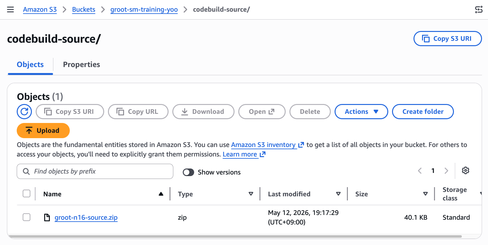

### Step 2. CodeBuild 콘솔에서 빌드 시작

[CodeBuild 콘솔](https://console.aws.amazon.com/codesuite/codebuild/projects)에 접속하고 우측 상단 리전이 `${REGION}`인지 확인합니다.

#### 2-1. 학습 컨테이너 빌드

1. 프로젝트 목록에서 **`groot-sm-training-build`** 를 클릭합니다. (모든 사용자가 같은 프로젝트를 공유하지만, 빌드 시작 시 각자의 S3 zip을 가리키므로 결과 이미지는 공용 ECR `groot-sm-training`에 같은 태그로 푸시됩니다 — 동시에 빌드 시 마지막 빌드가 latest를 차지하므로 시간 충돌은 피해 주세요).
2. 우측 상단 **Start build with overrides** 클릭 (단순 *Start build*가 아니라 반드시 *with overrides* — Source 위치와 Buildspec 경로를 **둘 다** 매번 지정해야 합니다. 둘 중 하나라도 비우면 CloudFormation에 들어있는 placeholder buildspec(`echo "소스 없음..."`)이 실행되어 빌드는 SUCCEEDED로 끝나지만 ECR에는 아무것도 푸시되지 않습니다).
3. 다음 항목만 변경하고 나머지는 기본값 유지:

   | 섹션 | 항목 | 값 |
   |------|------|----|
   | **Source** | Source provider | Amazon S3 |
   | **Source** | Bucket | `${BUCKET}` (예: `groot-sm-artifacts-yoo`) |
   | **Source** | S3 object key | Step 1에서 메모한 키 (`codebuild-source/groot-sm-source.zip`) |
   | **Buildspec** | Buildspec name | `training/container/buildspec.yml` |
   | **Environment variables** *(N1.7 빌드 시에만)* | `GROOT_VERSION` | `n1.7` |
   | **Environment variables** *(N1.7 빌드 시에만)* | `BASE_MODEL_PATH` | `nvidia/GR00T-N1.7-3B` |

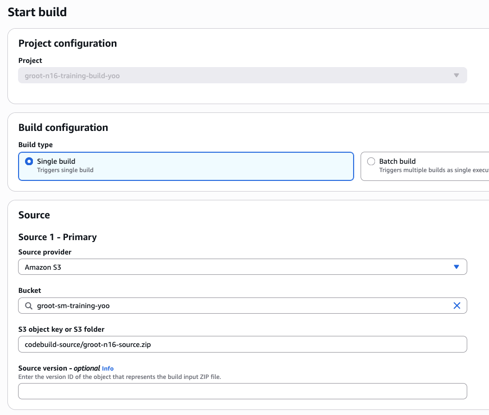

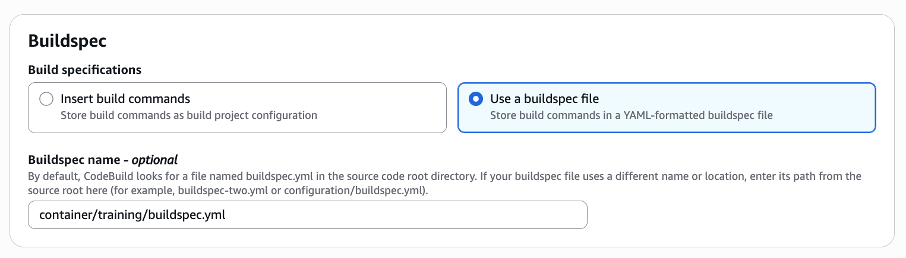

4. **Start build** 클릭. 약 25–30분 소요.

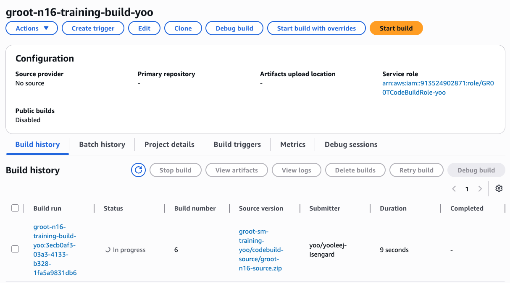

#### 2-2. 추론 컨테이너 빌드

학습 빌드와 동일한 방식으로 **`groot-sm-inference-build`** 프로젝트에서 *Start build with overrides*. 차이점은 buildspec 경로뿐:

  | 섹션 | 항목 | 값 |
   |------|------|----|
   | **Source** | Source provider | Amazon S3 |
   | **Source** | Bucket | `${BUCKET}` (예: `groot-sm-artifacts-yoo`) |
   | **Source** | S3 object key | Step 1에서 메모한 키 (`codebuild-source/groot-sm-source.zip`) |
   | **Buildspec** | Buildspec name | `inference/sagemaker/container/buildspec.yml` |

추론 빌드는 GROOT_VERSION 환경변수 override가 필요 없습니다. 약 15–20분 소요됩니다.

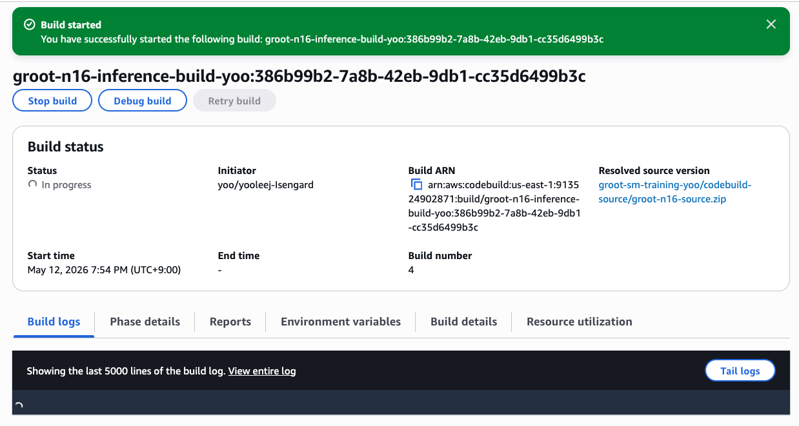

> 두 빌드는 독립적이라 동시에 실행해도 됩니다. 같은 S3 zip을 두 빌드에서 재사용하면 됩니다.

### Step 3. 빌드 진행 모니터링

콘솔의 **Build history** 탭에서 각 빌드의 phase 진행 상황을 실시간 확인할 수 있습니다. CLI를 선호하면:

```bash
aws logs tail "/aws/codebuild/groot-sm-training-build" \
    --follow --region "${REGION}"
```

빌드 성공 시 ECR(공용)에 이미지가 푸시됩니다:
- `<account>.dkr.ecr.us-east-1.amazonaws.com/nx1/groot-sm-training:latest`
- `<account>.dkr.ecr.us-east-1.amazonaws.com/nx1/groot-sm-inference:latest`

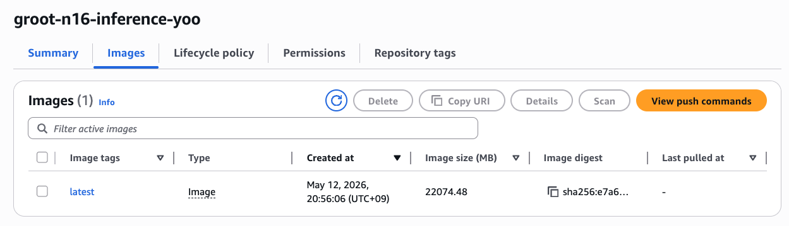

### Step 4. ECR URI를 config.yaml에 기록

콘솔로 빌드한 경우 `config.yaml`이 자동 갱신되지 않으므로 직접 채워야 합니다. 다음 블록이 `ecr.training_uri`/`ecr.inference_uri`를 계정·리전에 맞게 채워줍니다 (ECR 이름 자체는 사용자별 접미사 없음):

```bash
export ACCOUNT_ID=$(aws sts get-caller-identity --query Account --output text)
export REGION

python - <<'PY'
import os, yaml
account = os.environ["ACCOUNT_ID"]
region  = os.environ["REGION"]
cfg = yaml.safe_load(open("config.yaml"))
cfg.setdefault("ecr", {})
cfg["ecr"]["training_uri"]  = f"{account}.dkr.ecr.{region}.amazonaws.com/nx1/groot-sm-training:latest"
cfg["ecr"]["inference_uri"] = f"{account}.dkr.ecr.{region}.amazonaws.com/nx1/groot-sm-inference:latest"
yaml.safe_dump(cfg, open("config.yaml", "w"), allow_unicode=True, default_flow_style=False)
print(cfg["ecr"])
PY
```

이후 단계의 `run_training.py`, `deploy_endpoint.py`, `run_pipeline.py`는 `config.yaml`의 ECR URI를 자동으로 사용합니다.


**빌드 실패 시:** CloudWatch 로그에서 `flash-attn` 또는 `CUDA` 관련 에러를 확인하세요. 콘솔에서 *Start build with overrides*를 같은 설정으로 다시 누르면 보통 해결됩니다.


---

## 7.4 데이터셋 준비 및 업로드 (~5분)

7.3 의 컨테이너 빌드가 백그라운드에서 도는 동안 진행하면 됩니다. 새 터미널 창에서 SO-101 로봇의 leisaac-pick-orange 데이터셋을 S3에 업로드합니다:

**옵션 1: 사전 업로드 (로컬 테스트 또는 프라이빗 데이터셋)**

```bash
cd ~/aws-physical-ai-recipes/e2e-workshop/groot
python training/data/upload_dataset.py \
    --hf-dataset-id LightwheelAI/leisaac-pick-orange \
    --bucket "${BUCKET}" \
    --prefix datasets/leisaac-pick-orange
```

정상 출력:

```
Downloading dataset: LightwheelAI/leisaac-pick-orange
Converting LeRobot v3 → v2.1 format...
Uploading to S3: s3://<your-bucket>/datasets/leisaac-pick-orange/
Upload complete: 45 files, ~3.2 GB
Dataset metadata: meta/modality.json, meta/info.json
```

#### SO-101 (NEW_EMBODIMENT) modality 파일 업로드 (필수)

`LightwheelAI/leisaac-pick-orange`는 SO-101 로봇용 데이터셋이지만 GR00T 내장 embodiment가 아니므로 (`NEW_EMBODIMENT`로 학습), **modality 정의 파일을 데이터셋과 함께 S3에 올려야** 학습 컨테이너가 차원/키 매핑을 올바르게 인식합니다.

```bash
# meta/modality.json — 데이터셋 차원/키 매핑 정의
aws s3 cp training/data/configs/so101_modality.json \
    "s3://${BUCKET}/datasets/leisaac-pick-orange/meta/modality.json" \
    --region "${REGION}"

# 데이터셋 root의 modality_config.py — embodiment_tag 등록
aws s3 cp training/data/configs/so101_modality_config.py \
    "s3://${BUCKET}/datasets/leisaac-pick-orange/modality_config.py" \
    --region "${REGION}"
```

> 다른 로봇/데이터셋을 사용한다면 `training/data/configs/` 아래 해당 modality 파일을 참고해 직접 작성하세요 (아래 *커스텀 로봇 데이터셋 준비* 참고). GR00T 내장 embodiment(`LIBERO_PANDA` 등)는 이 단계를 생략해도 됩니다.

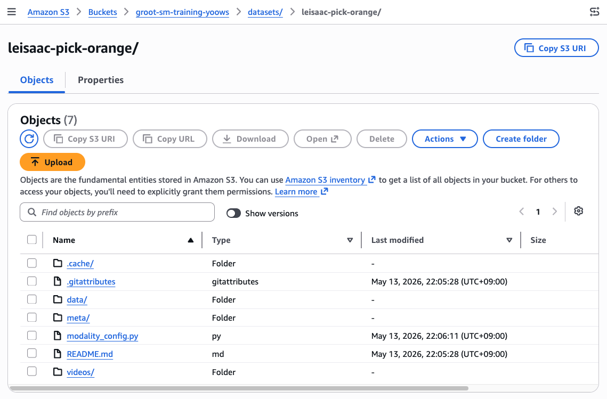

**옵션 2: HuggingFace에서 직접 다운로드**

이 경로를 선택하면 S3 업로드를 생략하고, 학습 중에 컨테이너가 HuggingFace에서 직접 받습니다.

`LightwheelAI/leisaac-pick-orange`는 공개 데이터셋이므로 토큰이 없어도 받을 수 있습니다. 비공개 또는 gated 데이터셋, 그리고 N1.7 backbone(`nvidia/Cosmos-Reason2-2B`, gated) 사용 시에는 SSM Parameter Store에 토큰을 저장해 두는 것이 안전합니다:

```bash
aws ssm put-parameter --name /groot/hf-token \
    --value hf_xxxxxxxxxxxxxxxxxxxx \
    --type SecureString --overwrite \
    --region "${REGION}"
```

나중에 학습할 때 `--hf-dataset-id LightwheelAI/leisaac-pick-orange --hf-token ssm:/groot/hf-token` 옵션으로 SSM에서 자동 로드합니다.

<details>
<summary><strong>커스텀 로봇 데이터셋 준비</strong></summary>

SO-101이 아닌 다른 로봇을 사용하려면:

1. 데이터셋을 LeRobot v2.1 형식으로 준비 (`meta/modality.json`, `meta/info.json`, `data/` 구조)
2. 데이터셋 root에 `modality_config.py` 생성 (참고: `training/data/configs/so101_modality_config.py`)
3. 업로드:
   ```bash
   python training/data/upload_dataset.py \
       --local-path ./my-robot-dataset \
       --bucket "${BUCKET}" \
       --prefix datasets/my-robot
   ```
4. 학습 시 `--embodiment-tag NEW_EMBODIMENT` 지정

기본 제공 embodiment (`LIBERO_PANDA`, `OXE_DROID` 등)는 `modality_config.py` 없이 동작합니다.

</details>

---

## 7.5 SageMaker Pipeline 정의 등록 (~3분)

[SageMaker Pipelines](https://docs.aws.amazon.com/sagemaker/latest/dg/pipelines.html)는 학습 → Model Registry 등록 → Endpoint 배포를 한 번의 정의로 묶고, 이후에는 파라미터만 바꿔 **재사용**하는 워크플로우입니다. 본 단계에서는 학습을 시작하지 않고 정의만 만들어 두며, 실제 학습은 7.6에서 *Start execution*으로 시작합니다.

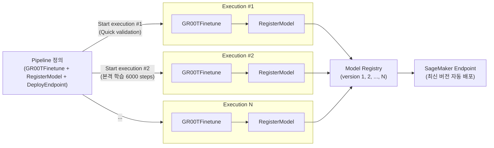
```mermaid
flowchart LR
    Definition["Pipeline 정의\n(GR00TFinetune + RegisterModel + DeployEndpoint)"]

    Definition -->|"Start execution #1\n(Quick validation)"| Exec1
    Definition -->|"Start execution #2\n(본격 학습 6000 steps)"| Exec2
    Definition -->|"..."| ExecN

    subgraph Exec1["Execution #1"]
        direction LR
        T1["GR00TFinetune"] --> R1["RegisterModel"]
    end
    subgraph Exec2["Execution #2"]
        direction LR
        T2["GR00TFinetune"] --> R2["RegisterModel"]
    end
    subgraph ExecN["Execution N"]
        direction LR
        TN["GR00TFinetune"] --> RN["RegisterModel"]
    end

    R1 --> Reg
    R2 --> Reg
    RN --> Reg
    Reg["Model Registry\n(version 1, 2, ..., N)"] --> EP["SageMaker Endpoint\n(최신 버전 자동 배포)"]
```

### Step 1. 학습 스크립트(`sourcedir.tar.gz`)를 S3에 업로드

[SageMaker Script Mode](https://docs.aws.amazon.com/sagemaker/latest/dg/adapt-training-script.html)는 학습 스크립트를 컨테이너 이미지에 박지 않고 런타임에 주입하는 방식입니다. 컨테이너에는 학습 의존성(PyTorch, flash-attn, GR00T 라이브러리)만 들어있고 진입점 스크립트는 별도 tarball로 받아옵니다. `train.py`를 수정해도 컨테이너 이미지 재빌드 없이 이 단계만 다시 하면 됩니다.

```bash
cd ~/aws-physical-ai-recipes/e2e-workshop/groot

SRC_KEY="codebuild-source/sourcedir.tar.gz"
rm -f /tmp/sourcedir.tar.gz
tar -czf /tmp/sourcedir.tar.gz -C training/container train.py
aws s3 cp /tmp/sourcedir.tar.gz "s3://${BUCKET}/${SRC_KEY}" --region "${REGION}"
echo "S3 source: s3://${BUCKET}/${SRC_KEY}"
```

Script Mode를 사용하면 `train.py`만 고치고 다시 업로드하면 되고 컨테이너 이미지를 재빌드할 필요가 없습니다. 컨테이너 안에는 학습 의존성(PyTorch, flash-attn, GR00T 라이브러리)만 들어있고, 진입점 스크립트는 런타임에 받아옵니다.

### Step 2. Pipeline 정의 등록

[Pipeline Step](https://docs.aws.amazon.com/sagemaker/latest/dg/build-and-manage-steps.html)은 워크플로우 안의 한 작업 단위입니다. 각 Step은 **타입**(Training / Processing / Model / Condition 등)에 따라 SageMaker가 자동으로 해당 리소스(Training Job, Processing Job, Model Package …)를 만들어 실행하고, 한 Step의 출력(예: `model.tar.gz`의 S3 경로)이 다음 Step의 입력으로 자연스럽게 연결됩니다.

본 가이드의 Pipeline은 세 Step으로 구성됩니다:

| Step | 타입 | 하는 일 |
|------|------|---------|
| `GR00TFinetune` | [TrainingStep](https://docs.aws.amazon.com/sagemaker/latest/dg/build-and-manage-steps.html#step-type-training) | SageMaker Training Job을 실행해 GR00T를 fine-tuning하고 결과를 `model.tar.gz`로 S3에 저장 |
| `RegisterModel` | [ModelStep](https://docs.aws.amazon.com/sagemaker/latest/dg/build-and-manage-steps.html#step-type-model) | 위에서 나온 `model.tar.gz`를 [Model Registry](https://docs.aws.amazon.com/sagemaker/latest/dg/model-registry.html)에 `Approved` 상태로 등록 |
| `DeployEndpoint` | [LambdaStep](https://docs.aws.amazon.com/sagemaker/latest/dg/build-and-manage-steps.html#step-type-lambda) | 같은 이름의 기존 endpoint가 있으면 삭제 후, training artifact로 SageMaker Model · EndpointConfig · Endpoint를 새로 생성. CFN 스택이 만든 `groot-deploy-endpoint-${USER_ID}` Lambda를 SageMaker가 직접 invoke (외부 노출 없음) |

이 단계에서는 위 정의를 SageMaker에 **등록**만 합니다 (실제 학습은 7.6에서 시작).

```bash
python pipeline/run_pipeline.py --upsert-only
```

정상 출력:

```
파이프라인 빌드 중...
Spot Instance 학습 활성화 (최대 대기: 86400초)
파이프라인 업서트 중 (정의 생성/업데이트)...
파이프라인 업서트 완료: groot-sm-finetuning-${USER_ID}
```

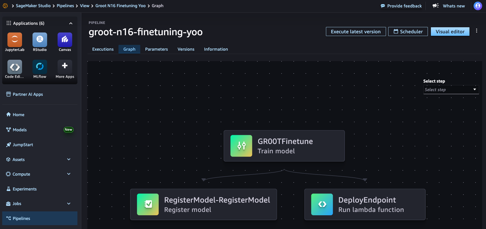

### Step 3. 콘솔에서 정의 확인

[SageMaker AI 콘솔 → Pipelines](https://console.aws.amazon.com/sagemaker/home#/pipelines)에 접속해 `groot-sm-finetuning-${USER_ID}`(예: `groot-sm-finetuning-yoo`)를 클릭합니다.

- **Graph** 탭: `GR00TFinetune` → `RegisterModel` / `DeployEndpoint` 흐름이 보입니다 (RegisterModel과 DeployEndpoint는 TrainingStep 뒤에서 병렬).
- **Parameters** 탭: 실행 시 변경 가능한 파라미터 목록 확인.

| 파라미터 | 기본값 | 설명 |
|----------|--------|------|
| `EmbodimentTag` | `NEW_EMBODIMENT` | 로봇 embodiment 식별자 |
| `DatasetS3Uri` | (비움) | 데이터셋 S3 URI (S3 채널) |
| `InstanceType` | `ml.g5.2xlarge` | 학습 인스턴스 타입 |
| `MaxSteps` | `6000` | 총 학습 스텝 수 |
| `GlobalBatchSize` | `32` | 글로벌 배치 크기 |
| `NumGpus` | `1` | 사용할 GPU 수 |
| `EndpointName` | `config.yaml.inference.endpoint_name` | 배포할 endpoint 이름 (고정 — 같은 이름 EP는 매 실행마다 삭제 후 재생성) |
| `EndpointInstanceType` | `ml.g5.2xlarge` | endpoint 인스턴스 타입 |

> Pipeline 정의는 한 번만 등록하면 됩니다. `train.py`를 수정한 경우에도 Step 1의 `sourcedir.tar.gz` 재업로드만으로 충분하고, 재정의(upsert)는 `run_pipeline.py` 자체를 수정했을 때만 다시 실행하세요.

---

## 7.6 Pipeline 실행으로 학습 시작 (~25분)

등록된 Pipeline을 실행해 Quick validation(100 스텝)부터 시작합니다. 한 번 실행하면 **학습 → Model Registry(Approved) → Endpoint 자동 배포**까지 자동으로 진행됩니다. 학습 완료 시 `s3://${BUCKET}/output/<job-name>/output/model.tar.gz`가 만들어지고, 같은 artifact로 Registry 등록과 endpoint 배포가 병렬로 진행됩니다.

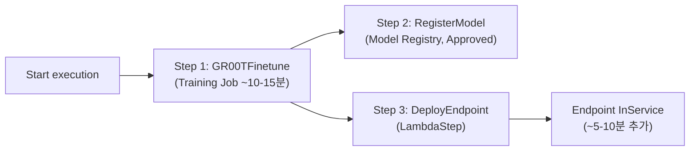
```mermaid
flowchart LR
    Start["Start execution"] --> Step1["Step 1: GR00TFinetune\n(Training Job ~10-15분)"]
    Step1 --> Step2["Step 2: RegisterModel\n(Model Registry, Approved)"]
    Step1 --> Step3["Step 3: DeployEndpoint\n(LambdaStep)"]
    Step3 --> EP["Endpoint InService\n(~5-10분 추가)"]
```

- **A. 콘솔 흐름** (Pipeline 정의를 시각적으로 확인하며 파라미터 입력) — Step 1~3 진행
- **B. 스크립트 흐름** (한 줄 명령) — 아래 *대안: 스크립트로 한 번에* 펼쳐서 사용

<details>
<summary><strong>대안: 스크립트로 한 번에 (B)</strong></summary>

`--start-only`로 등록된 정의를 그대로 실행합니다. 정의가 없으면 먼저 7.5 Step 2를 실행하세요.

**경로 1: S3에서 데이터셋 로드 (사전 업로드한 경우)**

```bash
python pipeline/run_pipeline.py --start-only \
    --dataset-s3-uri "s3://${BUCKET}/datasets/leisaac-pick-orange" \
    --max-steps 100
```

**경로 2: HuggingFace에서 직접 다운로드**

```bash
python pipeline/run_pipeline.py --start-only \
    --hf-dataset-id LightwheelAI/leisaac-pick-orange \
    --hf-token ssm:/groot/hf-token \
    --max-steps 100
```

본격 학습(6000 steps, multi-GPU):

```bash
python pipeline/run_pipeline.py --start-only \
    --dataset-s3-uri "s3://${BUCKET}/datasets/leisaac-pick-orange" \
    --max-steps 6000 \
    --num-gpus 4
```

> `--save-steps`는 노출되지 않습니다(컨테이너 학습 스크립트의 기본값 사용). `--instance-type` 변경은 정의 변경에 해당하므로 `--start-only` 대신 일반 실행(`run_pipeline.py --dataset-s3-uri ...`)으로 upsert+start를 한 번에 하세요.

정상 출력:

```
파이프라인 실행 중...
파이프라인 실행 시작!
  실행 ARN: arn:aws:sagemaker:us-east-1:<NX1_ACCOUNT>:pipeline/groot-sm-finetuning-yoo/execution/abc123...
```

</details>

### Step 1. 콘솔에서 Start execution

[SageMaker AI 콘솔 → Pipelines](https://console.aws.amazon.com/sagemaker/home#/pipelines) → `groot-sm-finetuning-${USER_ID}` 선택 → 우측 상단 **Execute latest version** (또는 **Start execution**) 클릭.

다음 항목만 채우고 나머지는 기본값을 유지합니다.

| 항목 | 값 |
|------|----|
| Execution name | `quickval-<날짜>` (예: `quickval-20260512`) |
| EmbodimentTag | `NEW_EMBODIMENT` |
| DatasetS3Uri | `s3://${BUCKET}/datasets/leisaac-pick-orange` (HF 직접 다운로드 시 빈 칸) |
| InstanceType | `ml.g5.2xlarge` (Quick validation) — 본격 학습은 `ml.g6e.12xlarge` |
| MaxSteps | `100` (Quick validation) — 본격 학습은 `6000` |
| GlobalBatchSize | `32` |
| NumGpus | `1` (`ml.g5.2xlarge`) — `ml.g6e.12xlarge`는 `4` |

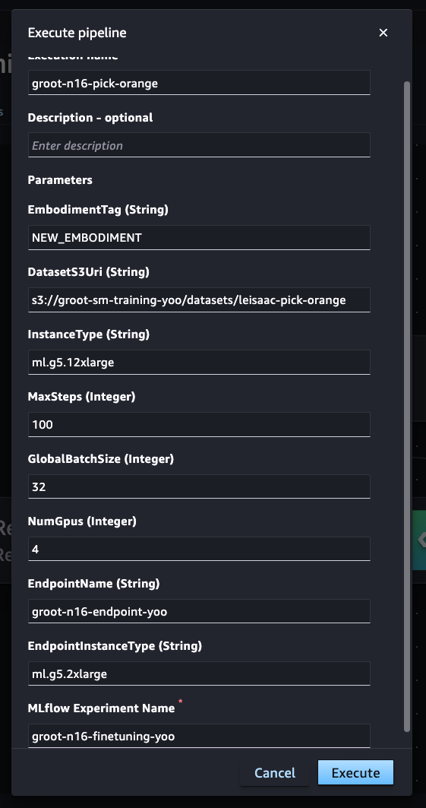

### Step 2. 실행 진행 상황 확인

**Execution** 화면에서 실행 중인 파이프라인을 확인할 수 있습니다. 해당 Execution을 선택해서 실행 중인 그래프 화면으로 들어갈 수 있습니다.

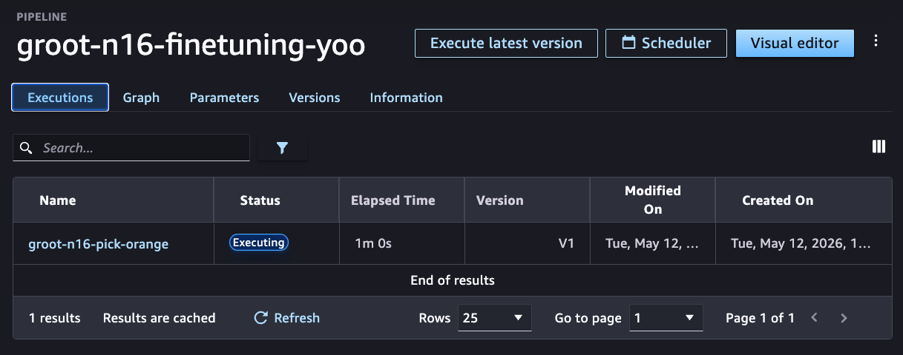

| 상태 | 의미 |
|------|------|
| `Executing` | 현재 실행 중 |
| `Succeeded` | Step 완료 |
| `Failed` | Step 실패 (CloudWatch 로그 확인) |
| `Stopped` | 사용자 중단 |

그래프의 `GR00TFinetune` Step이 `Executing`으로 바뀐 것을 확인할 수 있습니다.

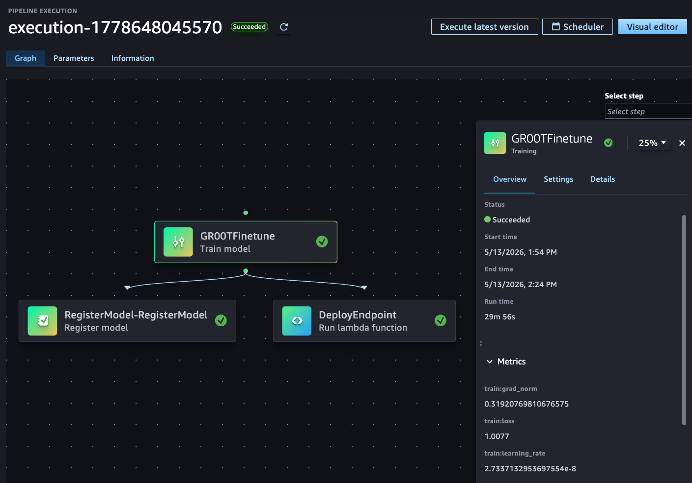

`GR00TFinetune` Step의 **Detail** - **Job name** 링크를 누르면 SageMaker → Training jobs 화면으로 이동해 인스턴스 프로비저닝/학습 로그를 직접 볼 수 있습니다.

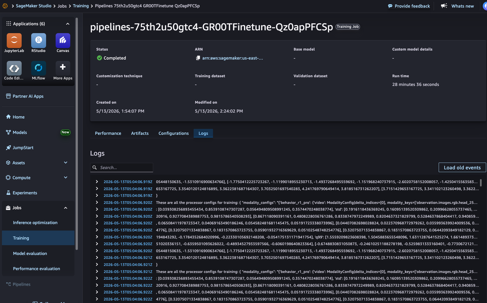

### Step 3. Execution 메타데이터 메모

다음 7.7 모니터링과 7.8 Model Registry 승인에서 사용합니다.

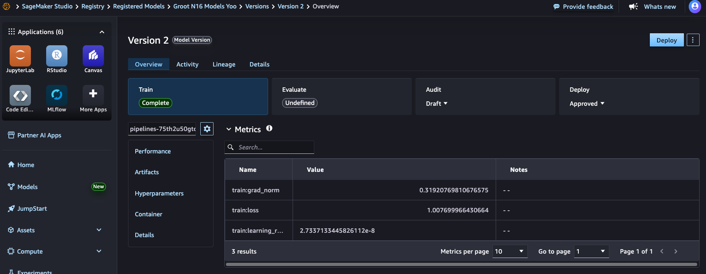

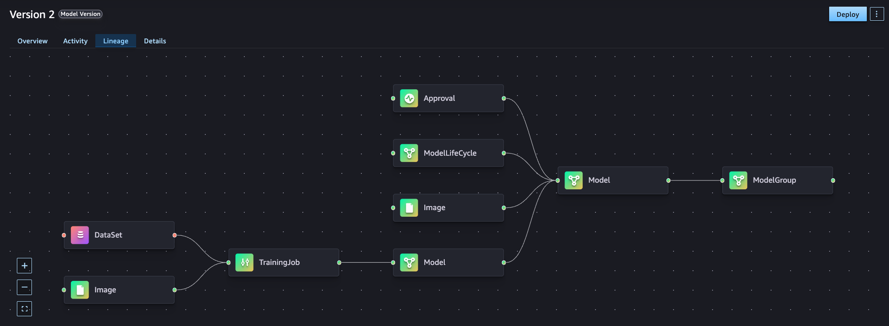

- **Execution name**: 위에서 입력한 이름
- **Training Job name**: Step 2의 *View training job*에서 확인 (`pipeline-execution-<id>-GR00TFinetune-...` 형태)
- **Output S3 location**: `s3://<your-bucket>/output/<job-name>/output/model.tar.gz` — 학습 완료 후 자동 생성

---

## 7.7 학습 모니터링 (~10-15분)

Pipeline 실행 중인 Training Job의 진행 상황을 확인합니다.

### 7.7.1 SageMaker 콘솔 확인

콘솔 → **Pipelines → 해당 Execution → `GR00TFinetune` Step → View training job** 경로로 들어가면 학습 인스턴스/로그/메트릭을 한 화면에서 볼 수 있습니다.

CLI로 가장 최근 Training Job의 상태를 확인하려면:

```bash
NAME_PREFIX="pipelines-"
JOB_NAME=$(aws sagemaker list-training-jobs \
    --region "${REGION}" \
    --name-contains "${NAME_PREFIX}" \
    --sort-by CreationTime --sort-order Descending \
    --max-results 1 \
    --query "TrainingJobSummaries[0].TrainingJobName" --output text)
echo "JOB_NAME=$JOB_NAME"

aws sagemaker describe-training-job \
    --training-job-name "$JOB_NAME" \
    --region "${REGION}" \
    --query "TrainingJobStatus" \
    --output text
```

> Pipeline이 만든 Training Job 이름은 `pipelines-<execution-id>-GR00TFinetune-...` 패턴이라 `--name-contains "pipelines-"`로 잡습니다.

Training Job 상태 전이:

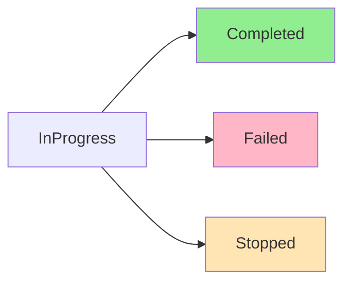
```mermaid
flowchart LR
    A["InProgress"] --> B["Completed"]
    A --> C["Failed"]
    A --> D["Stopped"]

    style B fill:#90EE90
    style C fill:#FFB6C6
    style D fill:#FFE5B4
```

| 상태 | 의미 | 예상 소요 |
|------|------|-----------|
| InProgress | 학습 실행 중 | 10-15분 (100 steps) |
| Completed | 학습 완료 → `RegisterModel` Step 자동 진행 | — |
| Failed | 학습 실패 (로그 확인) | — |
| Stopped | 사용자 중단 | — |

### 7.7.2 CloudWatch 로그 확인

```bash
aws logs tail /aws/sagemaker/TrainingJobs \
    --log-stream-name-prefix "${JOB_NAME}/" \
    --region "${REGION}" --follow
```

> SageMaker Training Job의 기본 로그 그룹은 `/aws/sagemaker/TrainingJobs`입니다. CloudFormation이 만든 `/aws/sagemaker/groot-sm-<userId>`는 사용되지 않으니 위 그룹을 참고하세요.

정상 학습 로그 예시:

```
==========================================
Fine-tuning Workflow Starting
==========================================
Dataset validation complete
Starting training...
Using 1 GPUs
Total parameters: 3,144,016,000
Trainable parameters: 1,620,515,968 (51.54%)
Current global step: 0
  0%|          | 0/100 [00:00<?, ?it/s]
...
Step 50/100, Loss: 2.341
...
Step 100/100, Loss: 1.523
Training completed successfully
Model saved to: s3://<your-bucket>/output/<job-name>/output/model.tar.gz
```

### 7.7.3 MLflow tracking — run/metric/param/artifact 추적

`nx1-groot-shared` 스택이 SageMaker managed MLflow tracking server(`nx1-groot-mlflow`)를 공유 1개로 미리 띄워둡니다. 본인 `config.yaml`의 `mlflow.tracking_server_arn`이 §7.2.4에서 채워졌고, 학습 스크립트가 이 ARN을 컨테이너 env(`MLFLOW_TRACKING_URI` / `MLFLOW_EXPERIMENT_NAME` / `HF_MLFLOW_LOG_ARTIFACTS=true`)로 자동 주입합니다.

**MLflow UI 접속 (presigned URL):**

```bash
aws sagemaker create-presigned-mlflow-tracking-server-url \
    --tracking-server-name "nx1-groot-mlflow" \
    --region "${REGION}" \
    --query AuthorizedUrl --output text
```

발급된 URL을 브라우저에 붙여 넣으면 experiment `groot-sm-finetune` 아래 run 별로 다음을 확인할 수 있습니다:

- **Metrics** — loss, grad_norm, learning_rate, train_runtime, train_samples_per_second, train_steps_per_second, total_flos, train_loss
- **Params** — HF `TrainingArguments` 233개+ (resume_from_checkpoint, learning_rate, batch_size, deepspeed config 등 전부)
- **Artifacts** — `checkpoint-100/` (safetensors 모델 ~9.9GB + DeepSpeed optimizer state) — `s3://<bucket>/mlflow-artifacts/<exp-id>/<run-id>/...`

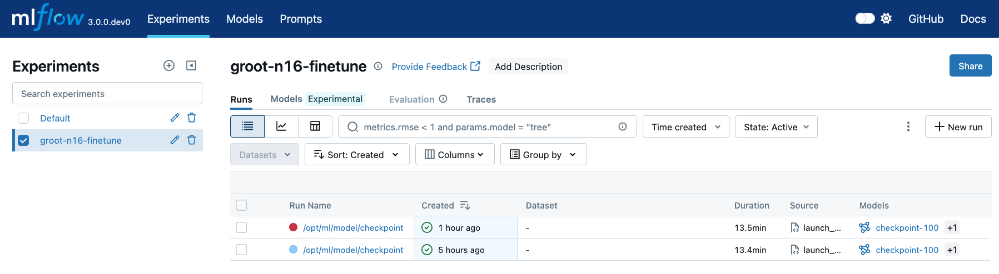

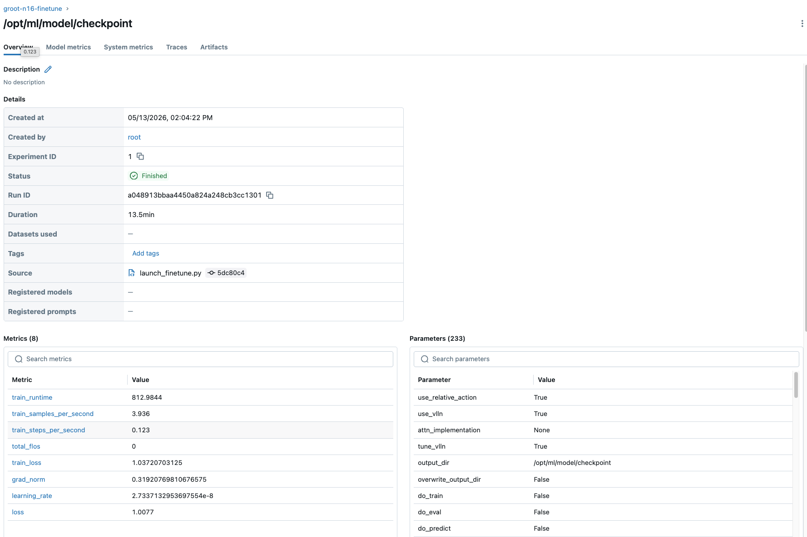

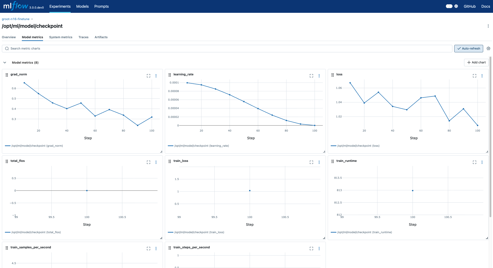

**비용 절감 — 안 쓸 때 정지:**

```bash
# 정지
aws sagemaker stop-mlflow-tracking-server \
    --tracking-server-name "nx1-groot-mlflow" --region "${REGION}"
```

```bash
# 다시 사용
aws sagemaker start-mlflow-tracking-server \
    --tracking-server-name "nx1-groot-mlflow" --region "${REGION}"
```

**대안 — Weights & Biases:** SSM `/groot/wandb-key`에 API 키를 넣고 학습 명령에 `--wandb-api-key ssm:/groot/wandb-key`를 추가하면 wandb로도 동시 로깅됩니다 (MLflow + wandb 병행 가능).

---

## 7.8 Model Registry 자동 승인 확인 (~1분)

`RegisterModel` Step은 학습 결과를 [Model Registry](https://docs.aws.amazon.com/sagemaker/latest/dg/model-registry.html)에 **`Approved` 상태로 자동 등록**합니다. 필요에 따라 수동으로 모델을 승인하고 배포하는 프로세스를 구축할 수 있습니다. 

[SageMaker AI 콘솔 → Model registry](https://console.aws.amazon.com/sagemaker/home#/model-registry) → Model groups → `groot-sm-models-${USER_ID}` 에서 최신 버전이 `Approved` 상태인지 확인하면 됩니다. 별도 승인 절차가 필요하지 않습니다.

---

### 재학습이 필요할 때

같은 데이터셋으로 다른 파라미터로 재학습하거나, 다른 데이터셋으로 학습하고 싶을 때는 **7.5는 건너뛰고** 7.6의 *Start execution*만 다시 실행하면 됩니다 (정의 재사용). 콘솔의 *Create execution* 폼이나 `python pipeline/run_pipeline.py --start-only ...`을 사용하세요.

`train.py`를 수정한 경우에는 7.5 Step 1(`sourcedir.tar.gz` 재업로드)만 다시 하면 다음 Execution부터 반영됩니다. Pipeline 자체의 정의를 바꿨다면 7.5 Step 2(`--upsert-only`)부터 다시 실행하세요.

<details>
<summary><strong>Pipeline 없이 단발 Training Job만 (디버깅용)</strong></summary>

Model Registry 등록 없이 빠르게 학습만 돌려보고 싶을 때 `training/scripts/run_training.py`를 사용할 수 있습니다. 이 경로는 7.8 Model Registry 승인을 건너뛰고, 7.9에서 `--model-s3-uri`로 model.tar.gz를 직접 지정해 배포해야 합니다.

```bash
python training/scripts/run_training.py \
    --dataset-s3-uri "s3://${BUCKET}/datasets/leisaac-pick-orange" \
    --max-steps 100 --save-steps 50
```

| 파라미터 | 기본값 | 설명 |
|----------|--------|------|
| `--dataset-s3-uri` 또는 `--hf-dataset-id` | (필수) | 데이터셋 경로 |
| `--max-steps` | 100 | 총 학습 스텝 수 |
| `--save-steps` | 50 | 체크포인트 저장 간격 |
| `--instance-type` | ml.g5.2xlarge | 인스턴스 타입 |
| `--num-gpus` | 1 | GPU 수 |
| `--groot-version` | (빌드 디폴트) | `n1.6` 또는 `n1.7` |

</details>

---

## 7.9 Endpoint 자동 배포 확인 (~10분)

`DeployEndpoint` LambdaStep이 파이프라인 마지막에 다음을 자동으로 수행합니다:

1. 같은 이름의 기존 endpoint가 있으면 삭제 (waiter 대기, ~1-2분)
2. Training artifact + 추론 컨테이너 이미지로 SageMaker Model 생성
3. EndpointConfig + Endpoint 생성

LambdaStep은 `create_endpoint` API 호출 성공으로 종료하므로 파이프라인은 빠르게 끝나지만, **endpoint가 InService가 되기까지는 추가 5-10분이 필요합니다** (이미지 pull + 모델 로드 + 헬스체크).

### 상태 확인

```bash
EP_NAME=$(python -c "import yaml; print(yaml.safe_load(open('config.yaml'))['inference']['endpoint_name'])")

aws sagemaker describe-endpoint --endpoint-name "${EP_NAME}" --region "${REGION}" \
    --query '{Status:EndpointStatus,Variant:ProductionVariants[0]}' --output json
```

정상 진행 시 `EndpointStatus`는 `Creating` → `InService`로 전이합니다. `InService`가 된 뒤 7.10 추론 테스트로 넘어가세요.

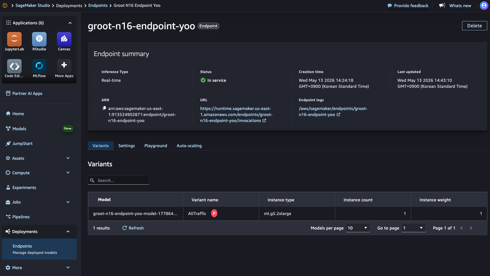


Endpoint는 InService 상태로 떠 있는 동안 비용이 발생합니다. 불필요한 경우 7.12 정리 섹션에서 삭제할 수 있습니다.


---

## 7.10 추론 테스트 (~5분)

배포된 Endpoint로 SO-101 로봇의 추론을 테스트합니다.

`inference/sagemaker/invoke_endpoint.py`는 `config.yaml`의 `inference.endpoint_name`을 자동으로 사용하므로 `--endpoint-name`을 생략할 수 있습니다.

### Quick start (이미지 + 지시문만)

```bash
python inference/sagemaker/invoke_endpoint.py \
    --images "front=./inference/sagemaker/sample/front.png;wrist=./inference/sagemaker/sample/wrist.png" \
    --instruction "pick up the orange"
```

### 실제 관절 상태로 호출 (SO-101 keyed proprioception)

실제 로봇의 현재 관절 상태를 함께 보내면 모델이 그 상태에 맞는 액션을 예측합니다:

```bash
python inference/sagemaker/invoke_endpoint.py \
    --image-path ./inference/sagemaker/sample/test.png \
    --proprioception "single_arm:0.1,0.2,0.3,0.4,0.5;gripper:0.0" \
    --instruction "pick up the orange"
```

정상 출력:

```json
{
    "actions": [[0.15, 0.22, 0.31, 0.42, 0.51, 0.05], [...], ...],
    "timestamp": "2026-05-13T05:21:09.477637+00:00"
}
```

`actions`는 모델이 예측한 16 step action 시퀀스입니다. 값 개수 (action dim)는 학습한 데이터셋의 modality 에 따라 결정됩니다 (SO-101: 6).

---

## 7.11 학습 결과 확인

SageMaker 결과는 S3의 `s3://${BUCKET}/output/<job-name>/` 디렉토리에 저장됩니다.

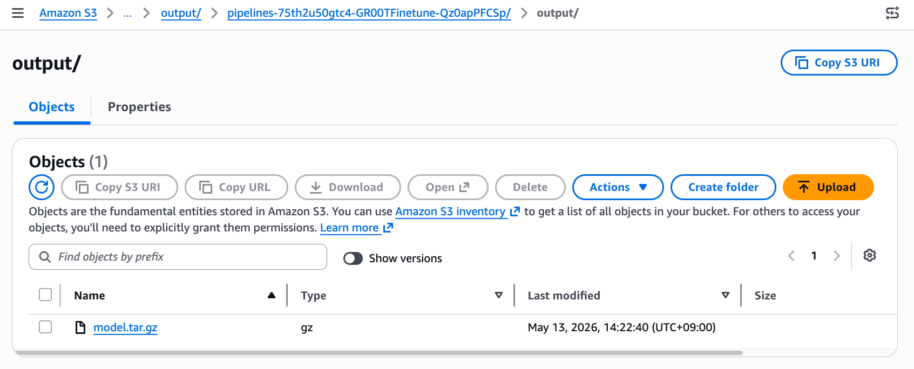

---

## 7.12 정리

실습이 끝난 후 리소스를 삭제하여 비용을 절감합니다.

### 1. Endpoint 삭제:

```bash
python inference/sagemaker/deploy_endpoint.py --action delete
```

정상 출력:

```
Deleting endpoint: groot-sm-endpoint-yoo
Endpoint deletion in progress...
Endpoint deleted successfully
```

### 2. SageMaker Studio 앱 정리 (NX1)

NX1 워크샵 v1은 Studio JupyterLab space를 사용하지 않으므로 IdC 자동생성 user-profile 아래에 활성 앱이 있을 가능성은 낮습니다. 그래도 본인이 Studio 콘솔에서 명시적으로 앱을 띄웠다면 다음으로 정리합니다 (자동생성 user-profile 이름은 IdC 첫 로그인 시 부여된 형태, 예: `seokjus-doosan-com-b7f`):

```bash
# 본인 자동생성 user-profile 이름 찾기
aws sagemaker list-user-profiles --domain-id-equals "<STUDIO_DOMAIN_ID>" \
    --region "${REGION}" --query "UserProfiles[].UserProfileName" --output text
# 결과 중 본인 ID 포함된 것을 SSO_PROFILE 변수로 export
export SSO_PROFILE=<본인 자동생성 프로파일 이름>

# 활성 앱 일괄 삭제
aws sagemaker list-apps --domain-id-equals "<STUDIO_DOMAIN_ID>" --region "${REGION}" \
    --query "Apps[?UserProfileName=='${SSO_PROFILE}' && Status!='Deleted'].[AppType,AppName]" --output text | \
while read -r TYPE APP; do
    aws sagemaker delete-app --domain-id "<STUDIO_DOMAIN_ID>" \
        --user-profile-name "${SSO_PROFILE}" --app-type "${TYPE}" --app-name "${APP}" \
        --region "${REGION}"
done
```

> **자동생성 user-profile 자체는 삭제하지 마세요** — Dimitri 영역(IdC 측 매핑) + 본인 권한 부족(`sagemaker:DeleteUserProfile` deny). 그대로 두면 워크샵 후 Dimitri가 일괄 정리합니다.

### 3. MLflow tracking server (강사 영역)

공유 MLflow `nx1-groot-mlflow`는 `nx1-groot-shared` 스택 소유라 본인이 정지·삭제하지 않습니다. 워크샵 후 강사가 `CreateMlflow=false`로 update-stack해서 시간당 과금을 멈춥니다.

### 4. 본인 Day2 per-user 스택 삭제

shared 스택은 그대로 두고 **본인 per-user 스택(`nx1-groot-<userId>`)만** 콘솔 또는 CLI로 삭제합니다.

```bash
aws cloudformation delete-stack \
    --stack-name "nx1-groot-${USER_ID}" \
    --region "${REGION}"
```


**ECR Repository (shared 소유):** `nx1/groot-sm-training`, `nx1/groot-sm-inference`는 `nx1-groot-shared` 스택 소유로 다른 사용자도 사용 중입니다. **삭제하지 마세요** — 본인 IAM에도 권한이 없습니다.

**S3 Bucket (per-user):** 객체가 있으면 스택 삭제가 막힙니다. 먼저 비우세요:

```bash
aws s3 rm "s3://${BUCKET}" --recursive
```



### 5. (선택) 로컬 가상환경 비활성화:

```bash
deactivate   # 현재 셸의 .venv 종료
# 디렉토리도 정리하려면:
# rm -rf .venv
```

---

## 7.13 트러블슈팅

| 증상 | 원인 | 해결 |
|------|------|------|
| `Access to model nvidia/Cosmos-Reason2-2B is restricted` | N1.7 사용 시 HF_TOKEN 미설정 또는 라이선스 미동의 | [모델 페이지](https://huggingface.co/nvidia/Cosmos-Reason2-2B)에서 라이선스 동의 후 `--hf-token ssm:/groot/hf-token` 추가 |
| `yaml.scanner.ScannerError: while scanning a simple key` (config.yaml 파싱 실패) + `BUCKET=` 빈 출력 | §7.2.2 here-doc 실행 시점에 `USER_ID` / `NX1_ACCOUNT` 셸 변수가 비어 있어서 `${USER_ID}` 같은 raw 문자가 yaml에 그대로 들어감. `cat -n config.yaml`로 보면 line 2~ 가 `'${NX1_ACCOUNT}'` 등 expand 안 된 상태 | `export USER_ID=<본인UserId>` + `export NX1_ACCOUNT=737138011740` 다시 실행 → `echo $USER_ID` 비어있지 않은지 확인 → §7.2.2 here-doc 재실행. venv 활성화 후 새 터미널을 열었거나 셸 세션이 바뀌었을 때 자주 발생 |
| ECR 인증 실패 (`Unauthorized`) | AWS 자격증명 만료 또는 권한 부족 | `aws sts get-caller-identity` 확인 후 자격증명 갱신 |
| CodeBuild 빌드 실패 | flash-attn 다운로드 실패, 네트워크 문제 | CloudWatch `/aws/codebuild/groot-sm-training-build` 확인 후 재시도 |
| `Resource of type 'AWS::ECR::Repository' with identifier 'groot-sm-...' already exists` | 옛 분리 스택에서 만든 SM ECR 잔재가 남아있음. 새 통합 shared 스택은 같은 이름을 쓰지 않으므로 일반적으로는 발생하지 않지만, 옛 스택을 같은 계정에서 운영했다면 ECR을 수동 삭제 후 `npm run deploy:shared` 재시도 | `aws ecr delete-repository --repository-name groot-sm-training --force` |
| Training Job ResourceLimitExceeded | 인스턴스 쿼터 부족 | AWS Service Quotas에서 "Running On-Demand ml.g6e instances" 증가 요청 |
| SageMaker Training Job 즉시 실패 | 컨테이너 이미지가 ECR에 없거나 IAM 역할 부족 | `aws ecr describe-repositories` 및 IAM 권한 확인 |
| Endpoint 5xx 에러 (`ModelInvocationTimeOut`) | model.tar.gz에 inference_metadata.json 누락 | Training Job 로그에서 모델 저장 완료 여부 확인 |
| Pipeline DeployEndpoint Step 실패 (`transient state` 에러) | 같은 이름 EP가 Creating/Updating 중 | EP가 InService/Failed가 될 때까지 대기 후 파이프라인 재실행 |
| Pipeline DeployEndpoint Step 실패 (`AccessDenied`) | Lambda IAM 권한 부족 또는 SageMakerRole의 lambda:InvokeFunction 누락 | `cd ~/aws-physical-ai-recipes/e2e-workshop/infra/groot && npm run deploy -- -c userId=${USER_ID}` 재실행으로 IAM 갱신, CloudWatch `/aws/lambda/groot-deploy-endpoint-${USER_ID}` 로그 확인 |
| 추론 차원 불일치 (`shape mismatch`) | proprioception 값 개수 ≠ 모델 기대값 | 에러 메시지의 올바른 입력 형식(keyed 또는 flat) 및 차원 확인 후 재시도 |
| Training Job 이후 model.tar.gz 없음 | 학습 스크립트 실패 또는 S3 권한 부족 | CloudWatch 로그에서 학습 완료 메시지 확인 및 IAM S3 권한 검증 |

---

## References

* [AWS SageMaker User Guide - Training Jobs](https://docs.aws.amazon.com/sagemaker/latest/dg/train-model.html)
* [AWS SageMaker Model Registry](https://docs.aws.amazon.com/sagemaker/latest/dg/model-registry.html)
* [AWS SageMaker Real-time Endpoints](https://docs.aws.amazon.com/sagemaker/latest/dg/realtime-endpoints.html)
* [AWS ECR User Guide](https://docs.aws.amazon.com/AmazonECR/latest/userguide/what-is-ecr.html)
* [AWS CodeBuild User Guide](https://docs.aws.amazon.com/codebuild/latest/userguide/welcome.html)
* [NVIDIA Isaac-GR00T Repository](https://github.com/NVIDIA/Isaac-GR00T)
* [GR00T N1.6 Model (HuggingFace)](https://huggingface.co/nvidia/GR00T-N1.6-3B)
* [GR00T N1.7 Model (HuggingFace)](https://huggingface.co/nvidia/GR00T-N1.7-3B)
* [LightwheelAI/leisaac-pick-orange Dataset](https://huggingface.co/datasets/LightwheelAI/leisaac-pick-orange)
* [모듈 6: VLA Fine-tuning on AWS Batch](6.-vla-train-batch.md)
