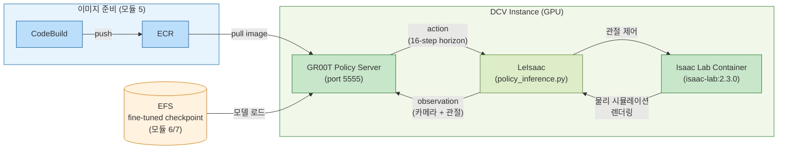
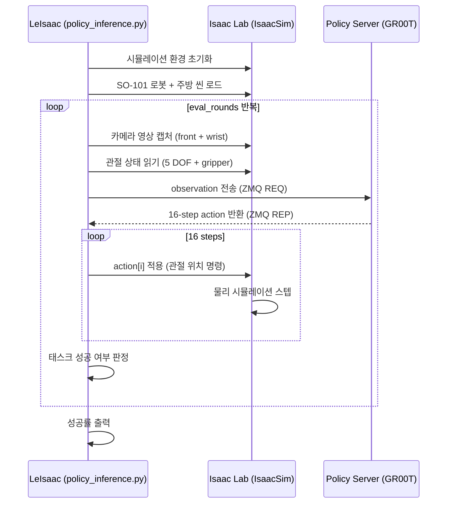
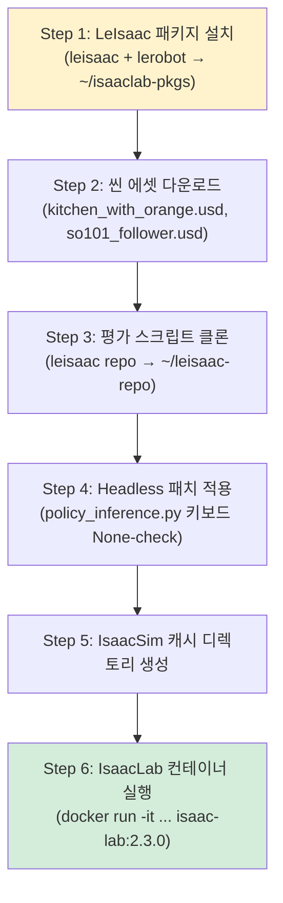
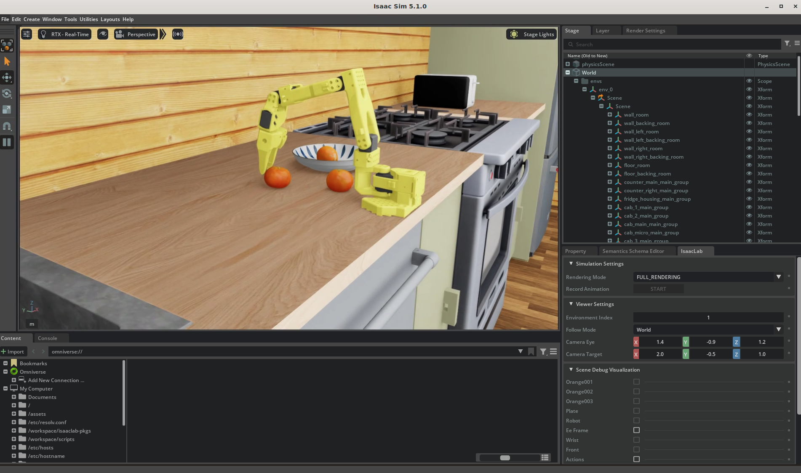

# 8. Closed-loop 평가

> 🟦 **BEST NX1**: closed-loop 평가(IsaacSim GUI 렌더링)는 [모듈 1 §1.4](1.-isaaclab-infra-setup.md#1-4-dcv-접속-ssm-포트포워딩)의 **DCV-over-SSM 포트포워딩 :8443** 으로 본인 Day1 인스턴스에 접속해야 합니다 (DCV 데스크탑 세션이 OpenGL 렌더링 컨텍스트를 제공). 명령 입력·docker 조작·로그 확인은 **code-server (:8888)** 또는 DCV 안의 터미널 어느 쪽으로도 가능. 본문의 "SSH" 언급은 *SSH로는 렌더링이 안 된다*는 주의이며, NX1은 SSH 자체가 차단이니 무조건 DCV로 IsaacSim 화면을 봅니다. **ECR 이미지 이름은 NX1에서 `<NX1_ACCOUNT>.dkr.ecr.us-east-1.amazonaws.com/nx1/groot-sm-inference:latest`** 형태입니다 (§8.2.2 참고). Policy Server·IsaacSim 둘 다 본인 Day1 인스턴스에서 ZMQ-local로 도는 워크플로 — 모듈 7 SageMaker Training Job 결과(체크포인트)는 본인 S3 버킷(`nx1-groot-<userId>-<NX1_ACCOUNT>`)에 저장되어 있으므로 Day1 인스턴스에서 그걸 다운로드해 로드합니다.

이전 모듈에서 fine-tuning한 GR00T 모델이 실제로 로봇을 제어할 수 있는지 검증합니다. Policy Server가 반환하는 action을 Isaac Lab 시뮬레이션에서 SO-101 로봇에 적용하고, 로봇이 주어진 태스크(오렌지 집기)를 성공적으로 수행하는지 **closed-loop**으로 평가합니다.

| 구분 | [모듈 5](5.-train-infra-setup.md) (추론 테스트) | 모듈 8 (Closed-loop 평가) |
|------|---------------------|--------------------------|
| 검증 방식 | 더미 데이터 → action shape 확인 | 실제 시뮬레이션 → 태스크 성공률 측정 |
| 시뮬레이션 | 없음 | Isaac Lab (IsaacSim + PhysX) |
| 환경 | ZMQ ping/inference만 | USD 씬 (주방 + 오렌지 + 로봇) |
| 평가 지표 | shape/dtype 확인 | `--eval_rounds` 기반 성공률 |

이 모듈에서는 [LeIsaac](https://github.com/LightwheelAI/leisaac)을 사용합니다. LeIsaac은 Isaac Lab 위에서 다양한 로봇의 closed-loop 평가 환경을 제공하는 오픈소스 패키지로, USD 씬과 로봇 모델을 조합해 시뮬레이션 평가를 쉽게 구성할 수 있습니다. 현재 SO-101(SO-ARM100의 후속 5 DOF + gripper 로봇)을 지원하며, 본 워크숍에서는 **주방 테이블 위의 오렌지를 집어 접시에 올려놓는 태스크**(LeIsaac-SO101-PickOrange-v0)로 평가합니다.

---

## 전체 아키텍처



[모듈 5](5.-train-infra-setup.md)에서 CodeBuild가 빌드한 GR00T 컨테이너 이미지(ECR)로 Policy Server를 실행하고, [모듈 6](6.-vla-train-batch.md)(AWS Batch) 또는 [모듈 7](7.-vla-train-sagemaker.md)(SageMaker)에서 fine-tuning한 checkpoint를 로드합니다. Isaac Lab 컨테이너는 NGC에서 직접 pull하며, LeIsaac 패키지와 씬 에셋은 `run-isaaclab.sh`가 자동으로 설치합니다.



Policy Server(추론, ~8GB VRAM)와 Isaac Lab(시뮬레이션 + 렌더링, ~10GB VRAM)을 별도 컨테이너로 분리하여 GPU 메모리를 격리합니다. 모델 checkpoint만 교체하면 동일 환경에서 바로 재평가할 수 있습니다. 두 컨테이너는 `--network=host`로 호스트 네트워크를 공유하므로 ZMQ 통신에 별도 설정이 필요 없습니다.

LeIsaac은 두 컨테이너를 ZMQ로 연결하는 평가 오케스트레이터입니다. 매 라운드마다 observation을 수집해 Policy Server에 전송하고, 반환된 16-step action을 시뮬레이션에 순차 적용합니다. 16스텝을 모두 실행한 뒤 새 observation을 수집해 다시 추론을 요청하며, 이를 반복해 실시간 피드백 루프를 형성합니다.

---

## 8.1 사전 조건

- [모듈 5](5.-train-infra-setup.md), [6](6.-vla-train-batch.md), 또는 [7](7.-vla-train-sagemaker.md) 완료 (Policy Server를 띄울 수 있는 상태)
- DCV 인스턴스 접속 가능 (DCV 데스크탑 세션 필요 — IsaacSim GUI)
- GPU 메모리 최소 20GB 이상 권장 (Policy Server ~8GB + IsaacSim ~10GB)

DCV 인스턴스에서 확인:

```bash
# GPU 메모리 확인
nvidia-smi --query-gpu=name,memory.total --format=csv

# Policy Server 실행 중인지 확인 (모듈 5/6/7에서 이미 시작했다면)
docker ps | grep groot-policy-server
ss -tlnp | grep 5555
```


Isaac Lab closed-loop은 **DCV 데스크탑 세션**에서 실행해야 합니다. SSH 터미널만으로는 IsaacSim의 렌더링 파이프라인이 동작하지 않습니다. `--headless` 모드도 지원되지만, `--enable_cameras`가 있으면 GPU 렌더링이 여전히 필요합니다.


---

## 8.2 Policy Server 실행

[모듈 6](6.-vla-train-batch.md)(AWS Batch) 또는 [모듈 7](7.-vla-train-sagemaker.md)(SageMaker)에서 fine-tuning한 checkpoint로 Policy Server를 띄웁니다. 이미 실행 중이면 이 단계를 건너뛰세요.

### 8.2.1 Checkpoint 준비

Policy Server를 실행하려면 fine-tuned checkpoint가 필요합니다.

**NX1 워크샵 v1**: 모듈 7 SageMaker Training Job 결과는 본인 S3 버킷에 저장됩니다. Day1 인스턴스로 다운로드:

```bash
# 본인 S3 버킷에서 최신 체크포인트 다운로드
export USER_ID=<본인UserId>
BUCKET=nx1-groot-${USER_ID}-<NX1_ACCOUNT>

mkdir -p /home/ubuntu/environment/efs/checkpoints
aws s3 sync s3://${BUCKET}/sagemaker/training/<TRAINING_JOB_NAME>/output/model.tar.gz \
  /home/ubuntu/environment/efs/checkpoints/

cd /home/ubuntu/environment/efs/checkpoints && tar xzf model.tar.gz
ls /home/ubuntu/environment/efs/checkpoints/checkpoint-6000   # 또는 학습한 step 번호
```

> 모듈 6(AWS Batch)은 NX1에서 사용하지 않습니다 — 본 워크샵 v1의 fine-tuned 체크포인트는 모두 모듈 7 SageMaker 경로에서 옵니다.

준비된 checkpoint가 없다면 (학습이 끝나기 전 평가 흐름만 먼저 보고 싶을 때) HuggingFace에서 직접 다운로드해서 진행할 수 있습니다:

```bash
pip install -U "huggingface_hub[cli]"

hf download hi-space/GR00T-N1.6-3B-Pick-Orange \
  --local-dir /home/ubuntu/environment/efs/GR00T-N1.6-3B-Pick-Orange
```

### 8.2.2 Policy Server 컨테이너 실행

기존 컨테이너를 정리하기 위해 아래 명령어를 수행합니다.

```bash
docker rm -f groot-policy-server 2>/dev/null
```

CodeBuild로 빌드된 이미지는 ECR에 저장되어 있습니다 (모듈 7에서 push 완료). ECR 로그인 후 이미지를 받아옵니다.

> NX1에서는 `nx1/` prefix가 붙은 ECR repo만 멤버 IAM이 접근 가능합니다. 정확한 이미지 이름은 `<NX1_ACCOUNT>.dkr.ecr.us-east-1.amazonaws.com/nx1/groot-sm-inference:latest` 입니다 (모듈 5 §5.2.1 표 참고).

```bash
# ECR 로그인
aws ecr get-login-password --region us-east-1 | \
  docker login --username AWS --password-stdin <NX1_ACCOUNT>.dkr.ecr.us-east-1.amazonaws.com

ECR_URI=<NX1_ACCOUNT>.dkr.ecr.us-east-1.amazonaws.com/nx1/groot-sm-inference:latest

# GR00T 이미지 Pull (~15GB, 약 5분)
docker pull $ECR_URI
```

로드할 체크포인트 경로를 설정하고 ECR 이미지로 Policy Server를 실행합니다.

```bash
# Fine-tuned 모델 체크포인트 경로 설정
CHECKPOINT=/home/ubuntu/environment/efs/GR00T-N1.6-3B-Pick-Orange

docker run -d --gpus all \
  --name groot-policy-server \
  --shm-size=8g \
  --network host \
  --entrypoint /bin/sh \
  -e PYTHONUNBUFFERED=1 \
  -v /home/ubuntu/.cache/huggingface:/root/.cache/huggingface \
  -v /home/ubuntu/environment/efs:/mnt/efs \
  $ECR_URI \
  -c "cd /workspace/gr00t-repo && python3 -m gr00t.eval.run_gr00t_server \
    --model-path /mnt/efs/${CHECKPOINT#/home/ubuntu/environment/efs/} \
    --embodiment-tag NEW_EMBODIMENT \
    --host 0.0.0.0 \
    --port 5555"
```

실행된 docker 로그를 확인하기 위해 아래 명령어를 실행합니다. 체크포인트가 로드 되고 Server가 실행되는 데에 약 1분 정도 소요됩니다.

```bash
# "Server ready" 확인 (약 30초~1분)
docker logs -f groot-policy-server
```

---

## 8.3 LeIsaac 환경 구성 및 IsaacLab 컨테이너 실행

[LeIsaac](https://github.com/LightwheelAI/leisaac)은 Isaac Lab 위에서 로봇 평가 환경을 제공하는 패키지입니다. 워크숍 리포지토리의 `run-isaaclab.sh` 스크립트가 **환경 구성부터 컨테이너 실행까지** 모두 자동으로 처리합니다.

### 8.3.1 시뮬레이션 환경 실행

DCV 데스크탑 터미널에서 `run-isaaclab.sh` 스크립트를 실행합니다. 최초 실행 시 환경 구성이 자동으로 진행되며, 완료 후 IsaacLab 컨테이너 쉘에 진입합니다.

```bash
cd ~/aws-physical-ai-recipes/e2e-workshop/groot/inference
./run-isaaclab.sh
```

최초 실행 시 약 5~8분이 소요됩니다. 이후 재실행은 즉시 컨테이너에 진입합니다.

<details>
<summary><strong>run-isaaclab.sh가 수행하는 작업 (상세)</strong></summary>

스크립트는 각 단계가 완료되면 마커 파일을 남기고 다음 실행 시 건너뜁니다.



| 단계 | 설명 | 마커 / 조건 |
|------|------|-------------|
| **1. 패키지 설치** | IsaacLab 컨테이너 내 Python으로 `leisaac[gr00t]` + `lerobot`을 `~/isaaclab-pkgs/`에 설치 | `~/isaaclab-pkgs/.leisaac-installed` |
| **2. 에셋 다운로드** | GitHub Releases에서 주방 씬(`kitchen_with_orange`)과 SO-101 로봇 USD를 `~/leisaac-assets/`에 저장 | `~/leisaac-assets/.assets-downloaded` |
| **3. 스크립트 클론** | LeIsaac 리포지토리를 클론하여 `policy_inference.py` 등 평가 스크립트를 `~/leisaac-repo/`에 배치 | `~/leisaac-repo/scripts/` 존재 여부 |
| **4. Headless 패치** | `policy_inference.py`의 키보드 초기화를 None-safe로 패치 (SSH에서도 실행 가능하게) | `self._appwindow.get_keyboard()` 존재 여부 |
| **5. 캐시 디렉토리** | IsaacSim이 사용하는 캐시 디렉토리를 호스트에 생성 (컨테이너 재시작 시에도 유지) | 항상 실행 |
| **6. 컨테이너 실행** | `--network=host`, `--gpus all`로 IsaacLab 컨테이너에 진입. 패키지·에셋·스크립트를 볼륨 마운트 | — |

**컨테이너 실행 시 마운트되는 볼륨:**

| 호스트 경로 | 컨테이너 경로 | 용도 |
|------------|--------------|------|
| `~/leisaac-assets/` | `/assets` (ro) | USD 씬 + 로봇 모델 |
| `~/isaaclab-pkgs/` | `/workspace/isaaclab-pkgs` (rw) | LeIsaac Python 패키지 |
| `~/leisaac-repo/scripts/` | `/workspace/scripts` (ro) | 평가 스크립트 |
| `~/docker/isaac-sim/cache/*` | 각 캐시 경로 (rw) | IsaacSim 캐시 (재사용) |

`--network=host`로 호스트 네트워크를 공유하므로, 컨테이너 내부에서 `localhost:5555`로 Policy Server에 접근할 수 있습니다.

</details>


스크립트 실행 결과로 **IsaacLab 컨테이너의 bash 쉘**에 진입합니다. 이후 8.4의 평가 명령은 이 컨테이너 내부에서 실행합니다.


---

## 8.4 Closed-loop 평가 실행

`run-isaaclab.sh` 실행 후 IsaacLab 컨테이너 쉘에 진입한 상태에서 아래 명령을 실행합니다.

컨테이너 쉘에 진입하면 아래 명령으로 closed-loop 평가를 실행합니다:

```bash
/workspace/isaaclab/_isaac_sim/python.sh /workspace/scripts/evaluation/policy_inference.py \
    --task=LeIsaac-SO101-PickOrange-v0 \
    --eval_rounds=10 \
    --policy_type=gr00tn1.6 \
    --policy_host=localhost \
    --policy_port=5555 \
    --policy_action_horizon=16 \
    --policy_language_instruction="Pick up the orange and place it on the plate" \
    --device=cuda \
    --enable_cameras
```

**주요 파라미터:**

| 파라미터 | 설명 |
|----------|------|
| `--task` | LeIsaac 태스크 ID (SO-101 + 오렌지 집기 환경) |
| `--eval_rounds` | 평가 반복 횟수 (성공률 = 성공/전체) |
| `--policy_type` | Policy 클라이언트 타입 (N1.7도 `gr00tn1.6` 사용 — 역호환) |
| `--policy_host` | Policy Server 주소 |
| `--policy_port` | Policy Server 포트 |
| `--policy_action_horizon` | GR00T이 한 번에 예측하는 action step 수 |
| `--policy_language_instruction` | 태스크 지시문 (자연어) |
| `--device` | 시뮬레이션 연산 장치 |
| `--enable_cameras` | 카메라 렌더링 파이프라인 활성화 (observation 생성에 필수) |


**N1.7 호환성 참고**: LeIsaac은 아직 `gr00tn1.7` policy client를 공식 지원하지 않습니다. N1.7 모델은 N1.6 observation 형식과 역호환되므로 `--policy_type=gr00tn1.6`으로 실행합니다. LeIsaac에서 N1.7을 정식 지원하면 업데이트됩니다.


### 8.4.3 정상 출력 예시

IsaacSim 초기화에 약 3~5분 소요된 후, 평가가 시작됩니다:



```
[INFO] Loading task: LeIsaac-SO101-PickOrange-v0
[INFO] Scene: /assets/scenes/kitchen_with_orange/scene.usd
[INFO] Robot: /assets/robots/so101_follower.usd
[INFO] Policy client connected to localhost:5555
[INFO] Starting evaluation round 1/10...
[INFO] Round 1: SUCCESS (picked orange in 245 steps)
[INFO] Round 2: SUCCESS (picked orange in 312 steps)
...
[INFO] Evaluation complete: 7/10 success (70%)
```

DCV 데스크탑에서 IsaacSim GUI 창이 뜨면서 로봇이 오렌지를 집는 동작을 시각적으로 확인할 수 있습니다.

---

## 8.5 트러블슈팅

| 증상 | 원인 | 해결 |
|------|------|------|
| `KeyError: 0` during eval | LeIsaac 클라이언트의 language key 불일치 | `sed -i 's/"annotation.human.task_description"/"annotation.human.action.task_description"/' ~/isaaclab-pkgs/leisaac/policy/service_policy_clients.py` |
| `No CUDA GPUs are available` | IsaacSim 캐시 충돌 | `rm -rf ~/docker/isaac-sim/cache/*` 후 재시도 |
| `omni.appwindow` returns None | SSH에서 실행 (GUI 없음) | DCV 데스크탑에서 실행하거나, 8.3.5 headless 패치 적용 |
| LeIsaac import 실패 | 패키지 마운트 누락 | `-v ~/isaaclab-pkgs:/workspace/isaaclab-pkgs` 확인, `.leisaac-installed` 존재 확인 |
| 씬 로딩 실패 (USD not found) | 에셋 미다운로드 | 8.3.3 단계 재실행, `LEISAAC_ASSETS_ROOT=/assets` 환경변수 확인 |
| ZMQ timeout (Policy Server 응답 없음) | 네트워크 설정 문제 | `--network=host` 확인, Policy Server가 `0.0.0.0`에 바인딩됐는지 확인 |
| GPU OOM | Policy Server + IsaacSim 동시 실행 | G6E (L40S 48GB) 이상 권장. G6 (L4 24GB)에서는 메모리 부족 가능 |
| 캐시 디렉토리 permission denied | 이전 root 실행 잔여 | `sudo chown -R $(whoami):$(whoami) ~/docker/ ~/isaaclab-pkgs/` |

---

## 8.6 정리

평가가 끝나면 컨테이너에서 `exit`으로 나옵니다 (`--rm` 플래그로 자동 삭제). Policy Server도 더 이상 필요 없다면 정리합니다:

```bash
docker stop groot-policy-server
docker rm groot-policy-server
```

설치한 LeIsaac 패키지와 에셋은 재사용 가능하므로 삭제하지 않아도 됩니다. 디스크 공간을 확보하려면:

```bash
# 선택적 정리
rm -rf ~/isaaclab-pkgs ~/leisaac-assets ~/leisaac-repo
rm -rf ~/docker/isaac-sim/cache
```

---

## References

* [LeIsaac GitHub](https://github.com/LightwheelAI/leisaac)
* [NVIDIA Isaac Lab Documentation](https://isaac-sim.github.io/IsaacLab/)
* [LeIsaac Releases (씬 에셋)](https://github.com/LightwheelAI/leisaac/releases/tag/v0.1.0)
* [NVIDIA Isaac Lab Container (NGC)](https://catalog.ngc.nvidia.com/orgs/nvidia/containers/isaac-lab)
