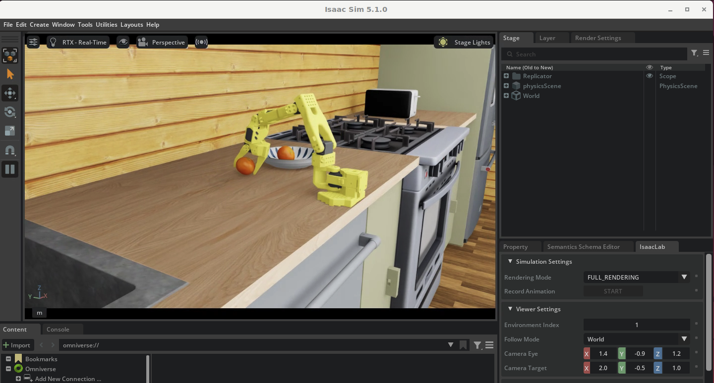

# 9. Edge Operation

> 🟦 **BEST NX1**: 이 모듈은 NX1 거버넌스에 맞게 적응되었습니다. 핵심 차이:
> - **접속**: code-server는 CloudFront가 아니라 [0. NX1 셀프 배포 가이드](0.-nx1-self-deploy.md)의 **SSM 포트포워딩(:8888)** 으로 접속합니다.
> - **자가프로비전 금지**: 워크샵 원본 스크립트의 런타임 자가프로비전(`put-role-policy`·`iot:*`·`iam:CreateRole`·`--provision true`)은 NX1에서 **차단**됩니다. 대신 **`day3-greengrass.yaml` CloudFormation**으로 IoT Thing/Policy + per-user TES role을 사전 생성하고(self-deploy), `setup-greengrass-nx1.sh`가 **`--provision false`** 로 설치합니다.
> - **네이밍**: 모든 리소스가 `nx1-groot-<userId>` / `nx1/groot-*` prefix를 따릅니다.
> - 본 절차는 2026-06-05 g6.4xlarge(L4) 인스턴스에서 end-to-end 실검증되었습니다.

이전 모듈에서 fine-tuning한 GR00T N1.6 모델을 [모듈 8](8.-evaluation.md)에서 시뮬레이션으로 검증했습니다. 이 모듈에서는 동일한 EC2 GPU 인스턴스에 **AWS IoT Greengrass**를 설치하여 **엣지 디바이스 환경을 가상으로 구축**하고, 학습된 모델을 Greengrass 컴포넌트로 배포하는 **MLOps 파이프라인**을 구성합니다.

### 이 모듈의 의의

실제 프로덕션에서는 학습된 모델을 Jetson AGX Thor 같은 엣지 디바이스에 배포해야 합니다. 하지만 워크숍 환경에서 물리 디바이스를 준비하기 어려우므로, **EC2 GPU 인스턴스를 엣지 디바이스로 간주**하여 동일한 배포 파이프라인을 체험합니다. 여기서 구축하는 Greengrass 기반 배포 구조는 실제 Jetson 디바이스에도 그대로 적용할 수 있습니다.

이를 통해 다음과 같은 **모델 학습 → 배포 → 운영**의 MLOps 전체 흐름을 완성합니다:

```
[모듈 7] 모델 학습 → [모듈 8] 시뮬레이션 검증 → [모듈 9] 엣지 배포 (본 모듈)
```

| 구분 | [모듈 8](8.-evaluation.md) (Closed-loop 평가) | 모듈 9 (Edge Operation) |
|------|----------------------------------------------|--------------------------|
| 목적 | 모델 품질 검증 (시뮬레이션) | 배포 파이프라인 구축 (MLOps) |
| 실행 환경 | Isaac Lab 컨테이너 (동일 인스턴스) | Greengrass Core (동일 인스턴스) |
| 모델 위치 | EFS / 로컬 | S3 → Greengrass 컴포넌트가 자동 다운로드 |
| 배포 방식 | docker run 수동 실행 | AWS IoT Greengrass 자동 배포 |
| 프로덕션 적용 | — | 동일 구조로 Jetson Thor fleet에 OTA 배포 가능 |

### 학습 목표

- AWS IoT Greengrass를 활용한 모델 배포 파이프라인 이해
- 컴포넌트 기반 배포 구조 (Docker 이미지 pull → 모델 준비 → TRT 최적화 → 추론 서버)
- TensorRT를 활용한 추론 가속 및 벤치마크
- 배포 상태 모니터링 (CloudWatch Logs, Greengrass CLI)
- **NX1 거버넌스 하에서의 사전 프로비전(CloudFormation) + `--provision false` 설치 패턴**


## 아키텍처 개요

```
┌─────────────────────────────────────────────────────────┐
│  AWS Cloud (NX1)                                        │
│  ┌──────────┐  ┌────────────────────────┐  ┌─────────┐ │
│  │ IoT Core │  │ ECR nx1/groot-edge-     │  │ S3      │ │
│  │ (CMK 암호화)│ │ inference:<userId>     │  │ day2버킷 │ │
│  └────┬─────┘  └───────────┬────────────┘  └────┬────┘ │
│       │                     │                     │      │
│  day3-greengrass.yaml (CFN, self-deploy):                │
│   IoT Thing/Group/Policy + per-user TES role             │
│  ┌────┴─────────────────────┴─────────────────────┴──┐  │
│  │         Greengrass Deployment                     │  │
│  │  ┌─────────────┐ ┌───────────┐ ┌──────────────┐ │  │
│  │  │ setup       │ │ inference │ │ benchmark    │ │  │
│  │  │ (모델+TRT)  │ │ (서빙)    │ │ (성능측정)   │ │  │
│  │  └─────────────┘ └───────────┘ └──────────────┘ │  │
│  └──────────────────────────────────────────────────┘  │
│                         │ MQTT / TES (mTLS)              │
└─────────────────────────┼───────────────────────────────┘
                          │
┌─────────────────────────┼───────────────────────────────┐
│  EC2 GPU Instance (L4 / 프로덕션: Jetson Thor)          │
│  ┌──────────────────────┴──────────────────────────┐   │
│  │  Greengrass Nucleus v2.17.0 + Cli, LogManager    │   │
│  └──────────────────────────────────────────────────┘   │
│  ┌──────────────────────────────────────────────────┐   │
│  │  Docker (groot-n16-inference) + TRT engine        │   │
│  └──────────────────────────────────────────────────┘   │
└─────────────────────────────────────────────────────────┘
```

## 인스턴스 접속

[모듈 1](../e2e-workshop/1.-isaaclab-infra-setup.md)에서 배포한 본인 Day1 GPU 인스턴스(`nx1-isaaclab-<userId>`)에서 작업합니다.

### code-server (VSCode) 접속 — SSM 포트포워딩

NX1은 SSH·CloudFront 직접 접속이 차단되므로 **SSM 포트포워딩**으로 code-server(:8888)에 접속합니다 ([모듈 0](0.-nx1-self-deploy.md) 패턴).

```bash
# 로컬 터미널에서 (인스턴스 ID는 본인 것으로)
aws ssm start-session --target <INSTANCE_ID> \
  --document-name AWS-StartPortForwardingSession \
  --parameters portNumber=8888,localPortNumber=8888 \
  --region us-east-1 --profile BESTNX1-Developer-<NX1_ACCOUNT>
```

브라우저에서 `http://localhost:8888` 접속 → Password는 Secrets Manager에 저장된 값(DCV 비밀번호와 동일). 시뮬레이션(IsaacSim GUI) 외 모든 명령은 이 code-server 터미널에서 실행합니다.


**code-server 웹터미널 붙여넣기 주의**: 긴 인라인 JSON은 줄바꿈이 삽입되어 `Invalid control character` 에러가 납니다. 또 heredoc(`<<'JSON'`)을 들여쓰기해 붙여넣으면 종료 마커가 인식되지 않아 셸이 멈춥니다. → 아래 배포 명령은 **`printf`로 JSON 파일을 만들고 `--components file://`** 로 전달합니다.


---

## 사전 요구사항

### 1. 공유 인프라 (강사가 1회 배포)

- `day2-shared.yaml` 배포 완료 — 공유 ECR repo `nx1/groot-edge-inference`(엣지 추론 이미지) 포함.
- 본인 day2 버킷 `nx1-groot-<userId>-<NX1_ACCOUNT>` 존재 (모듈 2/7에서 생성).

### 2. day3-greengrass CloudFormation 배포 (self-deploy)

NX1은 Greengrass 런타임 자가프로비전(`put-role-policy`·`iot:CreatePolicy`·`iam:CreateRole`·`--provision true`)을 차단합니다. 대신 **`day3-greengrass.yaml`** 을 CloudFormation으로 배포해 IoT Thing/Policy + per-user TES role을 사전 생성하고, 인스턴스 역할(`nx1-isaaclab-<userId>-role`)에 스코프드 `GreengrassProvision` 관리형 정책을 부착합니다.

먼저 아래 "워크샵 코드 가져오기"의 `git clone`을 수행한 뒤, clone한 템플릿을 `--template-body`로 배포합니다 (day3 템플릿은 ~12KB로 CLI 51KB 한도 내라 S3 업로드 불필요).

```bash
# 본인 shortname으로 치환 (예: jdoe)
export USER_ID=<본인UserId>

# IoT 데이터 CMK ARN을 alias로 resolve (소스에 ARN/account-id 하드코딩 회피)
IOT_KMS_ARN=$(aws kms describe-key --key-id alias/bestnx1/iot/data \
  --query KeyMetadata.Arn --output text --region us-east-1)

aws cloudformation create-stack \
  --stack-name nx1-groot-${USER_ID}-gg \
  --template-body file://$HOME/aws-physical-ai-recipes/e2e-workshop/infra/nx1/day3-greengrass.yaml \
  --parameters \
      ParameterKey=UserId,ParameterValue=${USER_ID} \
      ParameterKey=ModelArtifactBucket,ParameterValue=nx1-groot-${USER_ID}-<NX1_ACCOUNT> \
      ParameterKey=InstanceRoleName,ParameterValue=nx1-isaaclab-${USER_ID}-role \
      ParameterKey=IotDataKmsKeyArn,ParameterValue=${IOT_KMS_ARN} \
  --role-arn arn:aws:iam::<NX1_ACCOUNT>:role/CloudFormationDeployer \
  --tags Key=doosan:owner,Value=BEST_NX1 \
  --capabilities CAPABILITY_NAMED_IAM \
  --region us-east-1

aws cloudformation wait stack-create-complete --stack-name nx1-groot-${USER_ID}-gg --region us-east-1
```

> 이 스택이 생성하는 것: IoT Thing `nx1-groot-<userId>`, Thing Group `...-group`, 코어 IoT 정책 `...-ggcore-policy`(thing-name 스코프), per-user TES role `...-tes-role` + role alias `...-tes`, 그리고 인스턴스 역할에 붙는 `...-gg-provision` 관리형 정책. 이 정책에는 cert 생성·컴포넌트 배포에 필요한 스코프드 권한(IoT Core CMK `kms:Decrypt`, `greengrass:*` 배포 액션 + IoT Jobs 의존 액션 포함)이 들어있어, 설치/배포 시 추가 권한 부여가 필요 없습니다.

### 3. 기타 요구사항

- Docker (nvidia-container-toolkit) — Day1 AMI에 사전 설치됨
- Java (Greengrass Nucleus 실행용) — 스크립트가 자동 설치
- AWS CLI v2

## 설치

### 워크샵 코드 가져오기

code-server 터미널에서 워크샵 코드를 받습니다 (NX1 적응본은 `nx1` 브랜치).

```bash
cd ~
git clone -b nx1 https://github.com/seokjushin/aws-physical-ai-recipes.git
```

> day3 CloudFormation 템플릿(위 사전요구사항 2)도 이 repo의 `e2e-workshop/infra/nx1/day3-greengrass.yaml`에 있습니다. clone을 먼저 한 뒤 사전요구사항 2의 배포를 진행하면 `--template-body file://...`로 로컬 파일을 바로 쓸 수 있습니다.

### NX1 setup 스크립트 실행

```bash
cd ~/aws-physical-ai-recipes/e2e-workshop/edge/scripts
sudo bash setup-greengrass-nx1.sh ${USER_ID} 2>&1 | tee /tmp/nx1-setup.log
```

최초 실행 시 약 10~20분 소요됩니다 (모델 스테이징 + Docker 이미지 빌드/push). 재실행은 멱등 — 이미 있는 자원은 스킵합니다.

### 스크립트 실행 단계 (NX1)

| 단계 | 설명 |
|------|------|
| Step 0 | Preflight — IoT 엔드포인트 확인 (자원 존재는 day3 CFN으로 보장) |
| Step 1 | Prerequisites (JDK, unzip 등) |
| Step 2 | 모델 + 데이터셋을 hi-space → **본인 day2 S3 버킷**으로 스테이징 |
| Step 3 | Docker 이미지 빌드 → **공유 ECR `nx1/groot-edge-inference:<userId>`** push (런타임 repo 생성 없음) |
| Step 4 | Greengrass Nucleus 설치 — cert 생성(`create-keys-and-certificate`) + attach + **`--provision false`** + CLI 컴포넌트 배포 |
| Step 5 | `com.workshop.<userId>.*` 컴포넌트 등록 (recipe의 placeholder를 NX1 값으로 치환) |

> **자가프로비전 제거**: 원본의 `aws ecr create-repository`·`--provision true`·`put-role-policy`·IoT Thing/Policy/TES 생성 단계는 전부 제거되었습니다. 그 리소스는 day3 CFN이 이미 만들었습니다.

### 설치 후 생성/사용되는 리소스 (NX1)

| 리소스 | 이름 패턴 | 생성 주체 |
|--------|-----------|-----------|
| IoT Thing | `nx1-groot-<userId>` | day3 CFN |
| IoT Thing Group | `nx1-groot-<userId>-group` | day3 CFN |
| IoT 코어 정책 | `nx1-groot-<userId>-ggcore-policy` | day3 CFN |
| TES role / alias | `nx1-groot-<userId>-tes-role` / `nx1-groot-<userId>-tes` | day3 CFN |
| S3 Bucket (모델/데이터셋) | `nx1-groot-<userId>-<NX1_ACCOUNT>` | day2 (모듈 2/7) |
| ECR Repository | `nx1/groot-edge-inference` (per-user 태그 `:<userId>`) | day2-shared |
| Greengrass Core Device | `nx1-groot-<userId>` | 설치 시 등록 |

### 시스템 컴포넌트

| 컴포넌트 | 버전 | 비고 |
|----------|------|------|
| aws.greengrass.Nucleus | 2.17.0 | Greengrass 코어 |
| aws.greengrass.Cli | 2.17.0 | `--provision false`라 `--deploy-dev-tools` 불가 → 설치 후 별도 배포 |
| aws.greengrass.LogManager | 2.3.12 | CloudWatch 로그 업로드 (선택) |

## 컴포넌트 배포

### Workshop 컴포넌트

| 컴포넌트 | 버전 | 설명 |
|----------|------|------|
| com.workshop.<userId>.docker-build | 1.0.0 | 공유 ECR에서 Docker 이미지 Pull |
| com.workshop.<userId>.setup | **1.1.0** | 모델/데이터셋 다운로드(S3) + ONNX export + TRT 엔진 빌드 |
| com.workshop.<userId>.inference | 1.0.0 | Policy Server 실행 (ZMQ 포트 5555) |
| com.workshop.<userId>.benchmark | 1.0.0 | PyTorch vs TRT 벤치마크 |

> **setup은 1.1.0**: NX1판은 데이터셋을 S3(`s3://`)에서 받도록 수정되어 컴포넌트 버전이 1.1.0입니다 (Greengrass 컴포넌트는 불변이라 recipe 수정 시 버전업 필수).

#### 컴포넌트 의존성 체인

```
com.workshop.<userId>.docker-build (ECR pull)
    ↓ HARD dependency
com.workshop.<userId>.setup (모델 + TRT 빌드)
    ↓ HARD dependency
com.workshop.<userId>.inference (Policy Server)

com.workshop.<userId>.benchmark (setup에 HARD 의존, inference와 독립)
```

#### Inference 컴포넌트 주의사항

- **서버 스크립트**: `python -m gr00t.eval.run_gr00t_server` (ZMQ REQ/REP 서버). `standalone_inference_script.py`는 클라이언트라 서버 아님.
- **Lifecycle 유지**: `run` 스크립트가 종료되면 Greengrass가 shutdown을 호출하므로, 포트 확인 후 `docker wait`로 컨테이너 종료까지 대기.
- **Greengrass 컴포넌트는 immutable**: 같은 버전으로 recipe를 덮어쓸 수 없음. 수정 시 버전 번호를 올려야 함.

### 수동 배포 (설치 후)

> 아래 모든 배포는 code-server 터미널 붙여넣기 안정성을 위해 `printf`로 JSON 파일을 만들고 `--components file://`로 전달합니다.

#### 1단계: 환경 준비 (Docker 이미지 + 모델 + TRT 엔진)

ECR에서 이미지를 pull하고, S3에서 모델/데이터셋을 받은 뒤 TRT 엔진을 빌드합니다. 최초 약 10~15분 (모델 22GB 다운로드 + TRT 빌드 ~1분). 이후 재배포는 캐시로 스킵.

```bash
REGION=us-east-1; ACCT=<NX1_ACCOUNT>

printf '%s\n' \
'{' \
'  "aws.greengrass.Nucleus": {"componentVersion": "2.17.0"},' \
'  "aws.greengrass.Cli": {"componentVersion": "2.17.0"},' \
'  "com.workshop.'${USER_ID}'.docker-build": {"componentVersion": "1.0.0"},' \
'  "com.workshop.'${USER_ID}'.setup": {"componentVersion": "1.1.0"}' \
'}' > /tmp/setup-components.json
python3 -c "import json;json.load(open('/tmp/setup-components.json'));print('JSON OK')"

aws greengrassv2 create-deployment \
  --target-arn arn:aws:iot:${REGION}:${ACCT}:thinggroup/nx1-groot-${USER_ID}-group \
  --deployment-name "nx1-${USER_ID}-setup" \
  --components file:///tmp/setup-components.json \
  --deployment-policies '{"componentUpdatePolicy":{"action":"SKIP_NOTIFY_COMPONENTS"}}' \
  --region ${REGION}
```

**결과 확인:**

```bash
# 컴포넌트 상태
sudo /greengrass/v2/bin/greengrass-cli component list | grep -A2 "com.workshop.${USER_ID}.setup"
# → State: FINISHED

# TRT 엔진 생성 확인
ls -lh /opt/groot/trt_n16/dit_model_bf16.trt
# → 약 2.1GB
```

#### 2단계: 벤치마크 실행

PyTorch vs TRT(DiT Action Head) 성능을 비교합니다. **inference와 동시 실행 시 GPU OOM**이 나므로 inference 없이 배포합니다.

```bash
printf '%s\n' \
'{' \
'  "aws.greengrass.Nucleus": {"componentVersion": "2.17.0"},' \
'  "aws.greengrass.Cli": {"componentVersion": "2.17.0"},' \
'  "com.workshop.'${USER_ID}'.docker-build": {"componentVersion": "1.0.0"},' \
'  "com.workshop.'${USER_ID}'.setup": {"componentVersion": "1.1.0"},' \
'  "com.workshop.'${USER_ID}'.benchmark": {"componentVersion": "1.0.0"}' \
'}' > /tmp/benchmark-components.json

aws greengrassv2 create-deployment \
  --target-arn arn:aws:iot:${REGION}:${ACCT}:thinggroup/nx1-groot-${USER_ID}-group \
  --deployment-name "nx1-${USER_ID}-benchmark" \
  --components file:///tmp/benchmark-components.json \
  --deployment-policies '{"componentUpdatePolicy":{"action":"SKIP_NOTIFY_COMPONENTS"}}' \
  --region ${REGION}
```

```bash
# 벤치마크 결과
grep -A5 "BENCHMARK RESULTS" /greengrass/v2/logs/com.workshop.${USER_ID}.benchmark.log
```

#### 3단계: 추론 서버 배포

Policy Server(ZMQ 포트 5555)를 시작합니다. 모듈 8 Isaac Sim 평가에 사용됩니다. **벤치마크를 제외**하고 배포합니다.

```bash
printf '%s\n' \
'{' \
'  "aws.greengrass.Nucleus": {"componentVersion": "2.17.0"},' \
'  "aws.greengrass.Cli": {"componentVersion": "2.17.0"},' \
'  "com.workshop.'${USER_ID}'.docker-build": {"componentVersion": "1.0.0"},' \
'  "com.workshop.'${USER_ID}'.setup": {"componentVersion": "1.1.0"},' \
'  "com.workshop.'${USER_ID}'.inference": {"componentVersion": "1.0.0"}' \
'}' > /tmp/inference-components.json

aws greengrassv2 create-deployment \
  --target-arn arn:aws:iot:${REGION}:${ACCT}:thinggroup/nx1-groot-${USER_ID}-group \
  --deployment-name "nx1-${USER_ID}-inference" \
  --components file:///tmp/inference-components.json \
  --deployment-policies '{"componentUpdatePolicy":{"action":"SKIP_NOTIFY_COMPONENTS"}}' \
  --region ${REGION}
```

**결과 확인:**

```bash
# 컴포넌트 상태
sudo /greengrass/v2/bin/greengrass-cli component list | grep -A2 "com.workshop.${USER_ID}.inference"
# → State: RUNNING

# Policy Server 포트 확인
ss -tlnp | grep 5555
# → LISTEN 0.0.0.0:5555

docker ps | grep groot-workshop-inference
```

> **참고**: 상세 로그는 `docker logs groot-workshop-inference --tail 5` 또는 `/greengrass/v2/logs/com.workshop.${USER_ID}.inference.log`. `Policy Server ready on port 5555`가 나오면 정상입니다.

## 벤치마크 결과

> ⚠️ 아래 수치는 **hi-space 원본 검증값(L40S)** 입니다. NX1 워크샵은 g6.4xlarge(**L4**)라 절대 수치는 다릅니다 (TRT 엔진 빌드 자체는 L4에서 ~56초로 검증). 상대적 가속 경향(TRT > PyTorch)은 동일합니다.

### N1.6 (참고: EC2 g6e.xlarge, NVIDIA L40S)

| 모드 | Avg Latency | P50 | P95 | P99 | Std | Frequency | Speedup |
|------|-------------|-----|-----|-----|-----|-----------|---------|
| PyTorch (BF16) | 126.0 ms | 125.5 ms | 128.4 ms | 137.5 ms | 2.5 ms | **7.9 Hz** | — |
| TRT (DiT Action Head) | 60.1 ms | 60.0 ms | 60.6 ms | 61.9 ms | 0.4 ms | **16.6 Hz** | **2.10x** |

> TRT는 DiT Action Head만 가속 (N1.6 방식). Backbone(Qwen3 VL)은 PyTorch 유지.


## Isaac Sim Closed-loop 시뮬레이션 평가

Greengrass로 배포된 Policy Server(포트 5555)를 Isaac Sim과 연동하여 closed-loop 평가를 수행합니다. (상세는 [모듈 8](8.-evaluation.md))

### 사전 조건

- Policy Server가 포트 5555에서 실행 중 (위 3단계 또는 모듈 8 수동 docker run)
- DCV 데스크탑 세션 접속 — IsaacSim GUI 렌더링은 [모듈 1 §1.4](1.-isaaclab-infra-setup.md)의 **DCV-over-SSM 포트포워딩 :8443**
- GPU 메모리 최소 20GB (Policy Server ~8GB + IsaacSim ~10GB)

```bash
# Policy Server 동작 확인
ss -tlnp | grep 5555
```

### Step 1: IsaacLab 환경 구성 + 컨테이너 진입

DCV 데스크탑 터미널에서 실행합니다 (최초 5~8분).

```bash
cd ~/aws-physical-ai-recipes/e2e-workshop/groot/inference
./run-isaaclab.sh
```

### Step 2: Closed-loop 평가 실행

IsaacLab 컨테이너 내부에서:

```bash
/workspace/isaaclab/_isaac_sim/python.sh /workspace/scripts/evaluation/policy_inference.py \
    --task=LeIsaac-SO101-PickOrange-v0 \
    --eval_rounds=10 \
    --policy_type=gr00tn1.6 \
    --policy_host=localhost \
    --policy_port=5555 \
    --policy_action_horizon=16 \
    --policy_language_instruction="Pick up the orange and place it on the plate" \
    --device=cuda \
    --enable_cameras
```

### 정상 출력 예시

```
[INFO] Loading task: LeIsaac-SO101-PickOrange-v0
[INFO] Policy client connected to localhost:5555
[INFO] Starting evaluation round 1/10...
[INFO] Round 1: SUCCESS (picked orange in 245 steps)
...
[INFO] Evaluation complete: 7/10 success (70%)
```

<figure><figcaption>Isaac Sim Closed-loop 평가 실행 화면 (SO-101 + Pick Orange)</figcaption></figure>


## 모니터링

### 디바이스 배포 상태 확인

```bash
aws greengrassv2 list-effective-deployments \
  --core-device-thing-name nx1-groot-${USER_ID} \
  --region us-east-1
```

### 컴포넌트 로그 확인 (인스턴스에서)


Setup 스크립트가 컴포넌트 이름에 `<userId>`를 자동 삽입합니다. 로그 파일명도 `com.workshop.<userId>.<컴포넌트>.log` 형식입니다.


```bash
# Greengrass 전체 로그
sudo tail -f /greengrass/v2/logs/greengrass.log

# 개별 컴포넌트 로그
sudo tail -f /greengrass/v2/logs/com.workshop.${USER_ID}.setup.log
sudo tail -f /greengrass/v2/logs/com.workshop.${USER_ID}.inference.log
sudo tail -f /greengrass/v2/logs/com.workshop.${USER_ID}.benchmark.log
```

### Greengrass CLI (인스턴스에서)

```bash
# 설치된 컴포넌트 목록
sudo /greengrass/v2/bin/greengrass-cli component list

# 로컬 배포 상태
sudo /greengrass/v2/bin/greengrass-cli deployment status -l
```

> code-server SSM 세션에서는 `sudo`가 NOPASSWD로 동작합니다 (`sudo -n true`로 확인). 처음 한 번 비밀번호를 물으면 Ctrl+C 후 재시도하세요(sudo 타임스탬프 만료).

## 제거 (Uninstall)

```bash
# Greengrass 설치 + 컴포넌트 + cert 제거 (IoT Thing/TES는 CFN 소유라 유지)
cd ~/aws-physical-ai-recipes/e2e-workshop/edge/scripts
sudo bash setup-greengrass-nx1.sh ${USER_ID} --uninstall

# IoT/TES 자원까지 완전 제거하려면 day3 스택 삭제
aws cloudformation delete-stack --stack-name nx1-groot-${USER_ID}-gg \
  --role-arn arn:aws:iam::<NX1_ACCOUNT>:role/CloudFormationDeployer --region us-east-1
```

> `--uninstall`은 이 스크립트가 만든 것(Greengrass 설치·컴포넌트·cert·배포)만 제거합니다. IoT Thing/Policy/TES role은 CloudFormation이 소유하므로 day3 스택을 지워야 완전히 사라집니다.

### Docker 이미지 구성 (N1.6 — 검증 완료)

```
Base: nvcr.io/nvidia/pytorch:24.12-py3
  - CUDA 12.4, Python 3.12, system TRT 10.7
  - torch (uv sync), transformers (latest, Qwen3 지원)
  - onnxscript, onnx, onnxruntime (venv에 설치 필수 — ONNX export용)
  - gr00t N1.6 (Isaac-GR00T commit 5dc80c4)

⚠️ 핵심: pip TRT 10.16.0.72 제거 → system TRT 10.7 심볼릭 링크
   (pip wheel TRT 10.16.0.72에 CUDA 초기화 버그 존재)
```


## 트러블슈팅

### 배포가 디바이스에 적용 안 됨 (`No deployment job found`)

인스턴스 역할에 `greengrass:CreateDeployment` 또는 그 IoT Jobs 의존 액션(`iot:DescribeThingGroup` 등)이 없을 때. day3-greengrass.yaml 최신본으로 스택을 update하세요 (gg-provision 정책에 해당 권한 포함).

### cert 생성 실패: `Encryption/Decryption failed with Customer Managed Key`

NX1 IoT registry가 고객 CMK(`alias/bestnx1/iot/data`)로 암호화되어, IoT write 액션이 그 키의 `kms:Decrypt`를 요구합니다. day3-greengrass.yaml 최신본의 `IotDataCmk` 정책이 이를 부여합니다 (스택 update 필요).

### `--components`: `Invalid control character` / 셸이 `>`에서 멈춤

code-server 웹터미널의 긴 JSON 줄바꿈 / heredoc 들여쓰기 문제입니다. 위 배포 명령처럼 `printf`로 파일을 만들고 `--components file://`로 전달하세요.

### 배포 실패: `COMPONENT_VERSION_REQUIREMENTS_NOT_MET`

컴포넌트 간 의존성 버전 충돌. setup은 **1.1.0**, 나머지는 1.0.0으로 배포하세요.

### TRT 벤치마크 실패: `CUDA initialization failure with error: 35`

pip TRT 10.16.0.72 wheel의 CUDA 초기화 버그. Docker base `nvcr.io/nvidia/pytorch:24.12-py3`(system TRT 10.7) 사용 + venv에서 pip TRT 제거 후 system TRT 심볼릭 링크 (이미지에 반영됨).

### TRT 엔진 빌드 실패: OOM (exit code 137)

ONNX export 시 메모리 부족. 다른 GPU 컨테이너를 중지한 후 재배포. `com.workshop.<userId>.setup`은 재시작 시 자동 재시도됩니다.

### `greengrass-cli`가 없음

`--provision false` 설치라 `--deploy-dev-tools`를 못 씁니다. 스크립트가 CLI 컴포넌트를 별도 배포하지만 1~2분 걸립니다. 안 보이면 잠시 후 재시도.

---

## References

* [AWS IoT Greengrass V2 Developer Guide](https://docs.aws.amazon.com/greengrass/v2/developerguide/)
* [Manual resource provisioning (--provision false)](https://docs.aws.amazon.com/greengrass/v2/developerguide/manual-installation.html)
* [Device authentication — minimal core device IoT policy](https://docs.aws.amazon.com/greengrass/v2/developerguide/device-auth.html)
