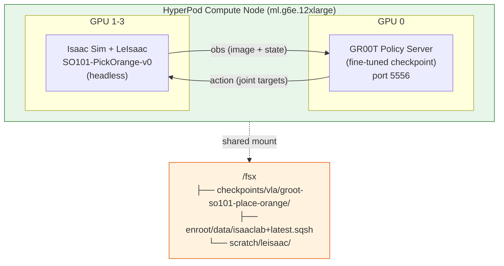

# 6. 시뮬레이션 검증 (Closed-loop Evaluation)

HyperPod에서 학습한 GR00T 모델이 실제로 orange를 pick하는 작업을 완수하는지, LeIsaac 시뮬레이션에서 closed-loop으로 검증합니다. HyperPod compute node(ml.g6e.12xlarge)에서 headless로 실행합니다.

---

## Open-loop vs Closed-loop 평가

| | Open-loop (4.8절) | Closed-loop (이 장) |
|--|--|--|
| 방식 | 데이터셋 관측값 → 예측 action과 정답 비교 | 시뮬레이션에서 모델이 직접 로봇 제어 |
| 측정 지표 | MSE (예측 오차) | 태스크 성공률, 에피소드 길이 |
| 결론 | "모델이 데이터를 잘 피팅했나?" | **"로봇이 실제로 작업을 완수하나?"** |

---

## 6.1 아키텍처 개요



**단일 노드에서 모든 것이 실행됩니다:**
1. GPU 0: GR00T policy server (fine-tuned checkpoint 로드, ZMQ 서빙)
2. GPU 1-3: Isaac Sim + LeIsaac PickOrange 환경 (headless 물리 시뮬레이션)
3. ZMQ 통신: observation → policy → action 루프

---

## 6.2 사전 준비

| 요구사항 | 확인 방법 |
|----------|-----------|
| VLA 학습 완료 (4장) | `ls /fsx/checkpoints/vla/groot-so101-place-orange/checkpoint-2000/` |
| Isaac Lab 환경 설치 | `ls /fsx/enroot/data/isaaclab+latest.sqsh` |
| LeIsaac 설치 | `ls /fsx/scratch/leisaac/` |

### Isaac Lab + LeIsaac 환경 설치 (최초 1회)

```bash
bash /fsx/scratch/aws-physical-ai-recipes/hyperpod-training/scripts/setup_isaaclab_env.sh
```

이 스크립트가 Isaac Sim 컨테이너 import + LeIsaac clone + 패키지 설치를 자동 처리합니다 (~15분).

---

## 6.3 Closed-loop 평가 실행

### SLURM 작업 제출

```bash
sbatch /fsx/scratch/aws-physical-ai-recipes/hyperpod-training/slurm-templates/vla/eval_closed_loop.sbatch
```

기본 설정:
- **Model**: `/fsx/checkpoints/vla/groot-so101-place-orange/checkpoint-2000`
- **Environment**: `LeIsaac-SO101-PickOrange-v0`
- **Instruction**: "pick up the orange"
- **Episodes**: 10회
- **GPU**: 4x L40S (1개 policy, 3개 simulation)

### 커스텀 설정

```bash
# 다른 체크포인트 사용
MODEL_PATH=/fsx/checkpoints/vla/groot-so101-place-orange/checkpoint-1000 \
  sbatch /fsx/scratch/aws-physical-ai-recipes/hyperpod-training/slurm-templates/vla/eval_closed_loop.sbatch

# 더 많은 에피소드 평가
NUM_EPISODES=50 \
  sbatch /fsx/scratch/aws-physical-ai-recipes/hyperpod-training/slurm-templates/vla/eval_closed_loop.sbatch
```

### 환경 변수

| 변수 | 기본값 | 설명 |
|------|--------|------|
| `MODEL_PATH` | /fsx/checkpoints/vla/groot-so101-place-orange/checkpoint-2000 | 체크포인트 |
| `EMBODIMENT_TAG` | new_embodiment | 로봇 태그 |
| `INSTRUCTION` | pick up the orange | 태스크 지시문 |
| `NUM_EPISODES` | 10 | 평가 에피소드 수 |
| `MAX_STEPS_PER_EPISODE` | 1000 | 에피소드 당 최대 스텝 |
| `POLICY_PORT` | 5556 | ZMQ 포트 |

---

## 6.4 실행 과정

작업 제출 후 로그를 확인합니다:

```bash
tail -f /fsx/scratch/logs/closed-loop-<JOB_ID>.out
```

**정상 진행 시 로그:**
```
==================================================
GR00T Closed-loop Evaluation — LeIsaac PickOrange
==================================================
Job ID: 42
Node: ip-10-0-1-153
Model: /fsx/checkpoints/vla/groot-so101-place-orange/checkpoint-2000
Instruction: pick up the orange
Episodes: 10
Start: Fri May  9 10:30:00 UTC 2026
==================================================

[1/4] Starting GR00T Policy Server (port 5556, GPU 0)...
  Waiting for policy server (PID: 12345)...
  Policy server ready! (took 95s)

[3/4] Running LeIsaac PickOrange closed-loop evaluation...
  Episode  1/10: SUCCESS (steps: 342)
  Episode  2/10: SUCCESS (steps: 289)
  Episode  3/10: TIMEOUT (steps: 1000)
  ...
  Episode 10/10: SUCCESS (steps: 456)

[4/4] Stopping policy server...

==================================================
Closed-loop evaluation completed successfully!

Results (/fsx/checkpoints/vla/groot-so101-place-orange/metrics.json):
{"success_rate": 0.7, "episodes": 10, "avg_episode_length": 534.2}

End: Fri May  9 10:45:00 UTC 2026
==================================================
```

---

## 6.5 평가 결과 해석

결과는 `metrics.json`으로 자동 저장됩니다:

```bash
cat /fsx/checkpoints/vla/groot-so101-place-orange/metrics.json
```

```json
{"success_rate": 0.7, "episodes": 10, "avg_episode_length": 534.2}
```

| 지표 | 의미 | 목표 |
|------|------|------|
| success_rate | 태스크 완수 비율 | > 0 (학습 효과 확인) |
| episodes | 총 평가 에피소드 수 | - |
| avg_episode_length | 평균 완수 스텝 수 | 낮을수록 효율적 |


**success_rate > 0** 이면 fine-tuned GR00T 모델이 시뮬레이션에서 orange를 성공적으로 pick하는 것을 확인한 것입니다. 워크숍의 최종 목표 달성!



**Sim-to-Real gap**: 시뮬레이션 성공률이 높더라도 실제 로봇에서는 다를 수 있습니다. 시뮬레이션은 모델의 기본 동작 능력을 검증하는 용도입니다.


---

## 6.6 트러블슈팅

| 증상 | 원인 | 해결 방법 |
|------|------|----------|
| Policy server crashed during startup | 체크포인트 손상 또는 메모리 부족 | checkpoint 파일 확인, `du -sh` 크기 비교 |
| Policy server not ready after 180s | Cosmos encoder 로딩 느림 | 대기 시간 늘리기 또는 재시도 |
| LeIsaac not found | setup_isaaclab_env.sh 미실행 | 스크립트 재실행 |
| Isaac Sim container not found | Enroot 이미지 미생성 | `setup_isaaclab_env.sh` 재실행 |
| success_rate = 0 | 학습 부족 또는 데이터셋 불일치 | MAX_STEPS 늘려서 재학습 |
| ZMQ connection refused | 포트 충돌 | `POLICY_PORT=5557` 등 변경 |
| GPU OOM in simulation | L40S 메모리 부족 | `MAX_STEPS_PER_EPISODE` 줄이기 |

---

## References

* [LeIsaac Documentation](https://lightwheelai.github.io/leisaac/)
* [Isaac-GR00T Evaluation](https://github.com/NVIDIA/Isaac-GR00T/tree/main/gr00t/eval)
* [LightwheelAI/so101-place-orange Dataset](https://huggingface.co/datasets/LightwheelAI/so101-place-orange)
