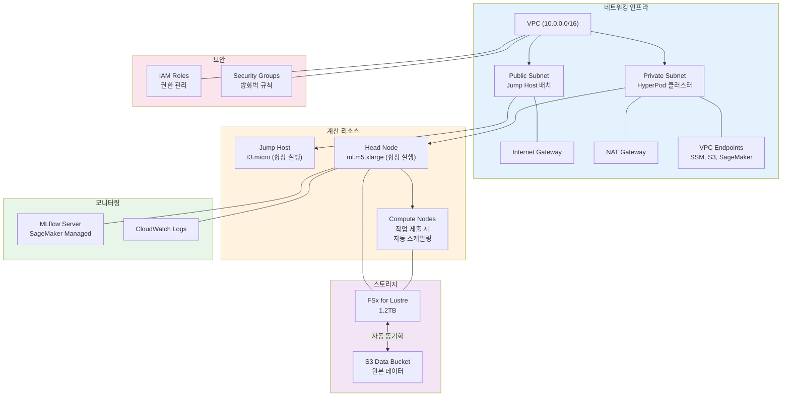
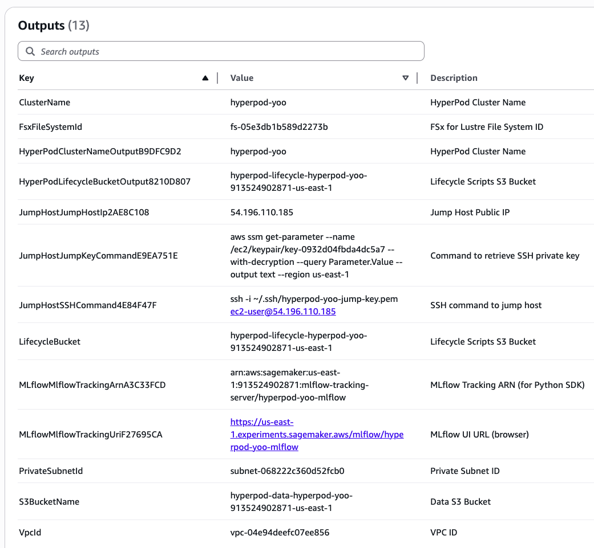
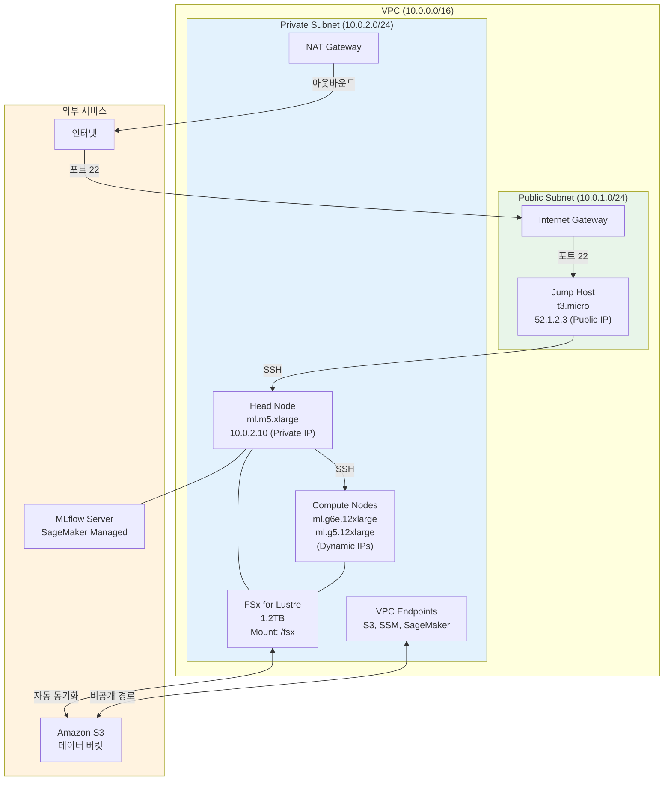

# 1. 인프라 배포

AWS CDK를 사용하여 SageMaker HyperPod 분산 학습 환경을 자동으로 프로비저닝합니다. HyperPod 클러스터, FSx for Lustre, Jump Host, MLflow 서버가 한 번의 명령으로 생성됩니다.

## CDK 배포 개요

AWS CDK (Cloud Development Kit)는 Python이나 TypeScript로 클라우드 인프라를 코드로 정의합니다. `cdk deploy` 명령 실행 시 다음 구성 요소들이 자동으로 생성됩니다:



### 배포되는 주요 컴포넌트

| 컴포넌트 | 역할 | 지속 시간 |
|---------|------|---------|
| **VPC** | 격리된 네트워크 환경 | 계속 실행 |
| **Jump Host (t3.micro)** | 인터넷에서 SSH로 접속하는 게이트웨이 | 계속 실행 |
| **HyperPod Head Node** | SLURM 스케줄러 및 클러스터 컨트롤러 | 계속 실행 |
| **FSx for Lustre** | 고성능 공유 스토리지 (S3와 동기화) | 계속 실행 |
| **MLflow 서버** | 학습 메트릭 추적 및 실험 관리 | 계속 실행 |
| **Compute Nodes** | 실제 학습이 실행되는 노드들 | 작업 제출 시만 생성 |

### 비용 고려사항

- **고정 비용**: Jump Host, Head Node, FSx, MLflow (항상 실행)
- **변동 비용**: Compute Nodes (작업 실행 시에만 과금)
- 장시간 분산 학습을 자주 실행할 때 비용 효율적

---

## 사전 요구 사항

### AWS 계정 및 권한

* AWS 계정 및 관리자 권한 (또는 SageMaker, EC2, VPC, IAM, FSx 권한)
* 권장 리전: **`us-east-1`** (US East N. Virginia)

### 서비스 할당량 확인

AWS 콘솔 → [Service Quotas](https://console.aws.amazon.com/servicequotas/) 에서 다음 GPU 인스턴스 할당량을 확인합니다:

```
EC2 → "Running On-Demand <GPU 타입> instances" 확인
```

필요한 vCPU 수:
- `ml.m5.xlarge` (head): 4 vCPU
- `ml.g6e.12xlarge` (GPU): 48 vCPU × 원하는 개수
- `ml.g6.12xlarge` (GPU fallback): 48 vCPU × 원하는 개수
- `ml.g5.12xlarge` (GPU fallback): 48 vCPU × 원하는 개수


새 AWS 계정은 GPU 할당량이 0일 수 있습니다. 필요한 만큼 증량 요청하세요 (처리 시간: 1~24시간).


### 선택 사항

* Session Manager Plugin: EC2 콘솔에서 쉽게 접속하려면 설치 ([설치 가이드](https://docs.aws.amazon.com/systems-manager/latest/userguide/session-manager-working-with-install-plugin.html))

---

## 1.1 CloudShell 환경 설정 (~5분)

1. [AWS 콘솔](https://console.aws.amazon.com)에 로그인합니다.

2. 우측 상단 리전을 **US East (N. Virginia) `us-east-1`** 으로 설정합니다.

3. 상단 `>_` 아이콘을 클릭하여 CloudShell을 실행합니다.

4. 아래 명령어를 실행합니다:

```bash
# 리포지토리 클론
git clone --depth 1 https://github.com/hi-space/aws-physical-ai-recipes.git ~/aws-physical-ai-recipes

# CDK 프로젝트 디렉토리 이동
cd ~/aws-physical-ai-recipes/training/hyperpod/cdk

# 의존성 설치
npm install
```


CloudShell에는 Node.js 18+와 AWS CDK CLI가 기본 설치되어 있습니다. `npm install`만 실행하면 됩니다.


---

## 1.2 CDK Bootstrap (최초 1회)

해당 계정/리전에서 CDK를 처음 사용하는 경우에만 실행합니다:

```bash
cdk bootstrap aws://$(aws sts get-caller-identity --query Account --output text)/us-east-1
```

이 명령은:
- CloudFormation 스택 저장용 S3 버킷 생성
- IAM 역할 및 권한 설정
- CDK 배포 위한 기본 인프라 프로비저닝

---

## 1.3 인프라 배포 (~20분)

```bash
npx cdk deploy \
  -c userId=<본인이름> \
  -c region=us-east-1 \
  --require-approval never
```

**예시:**

```bash
npx cdk deploy \
  -c userId=alice \
  -c region=us-east-1 \
  --require-approval never
```

배포 중 진행 상황을 확인하려면:

```bash
# 별도 터미널에서 CloudFormation 스택 상태 모니터링
aws cloudformation describe-stacks \
  --stack-name HyperPod-<userId> \
  --region us-east-1 \
  --query "Stacks[0].StackStatus" \
  --output text
```


`userId`는 **영문 소문자, 숫자, 하이픈(-)만** 사용 가능합니다. 이 값이 모든 리소스 이름에 포함됩니다.


<details>

<summary><strong>배포 파라미터 커스터마이즈</strong></summary>

| 파라미터 | 기본값 | 설명 |
|---------|--------|------|
| `userId` | (필수) | 사용자 식별자 |
| `region` | us-east-1 | 배포 리전 |
| `gpuMaxCount` | 4 | GPU 인스턴스 그룹별 최대 노드 수 |
| `gpuUseSpot` | false | Spot 인스턴스 사용 여부 |
| `fsxCapacityGiB` | 1200 | FSx 스토리지 용량 (GiB) |
| `enableMlflow` | true | MLflow 서버 생성 여부 |
| `createVpc` | true | 새 VPC 생성 여부 (기존 VPC 사용 시 false) |
| `vpcCidr` | 10.0.0.0/16 | VPC CIDR 블록 |

GPU 인스턴스는 Fallback 우선순위로 자동 구성됩니다:

| 순위 | 인스턴스 | GPU | VRAM | 비고 |
|------|---------|-----|------|------|
| 1 | ml.g6e.12xlarge | 4× L40S | 192GB | 대용량, 안정적 |
| 2 | ml.g6.12xlarge | 4× L4 | 96GB | 가성비 |
| 3 | ml.g7e.12xlarge | 4× RTX PRO 6000 | 384GB | 최신, Physical AI 최적 |
| 4 | ml.g5.12xlarge | 4× A10G | 96GB | 최후 fallback |

**소규모 테스트 배포:**

```bash
npx cdk deploy \
  -c userId=alice \
  -c region=us-east-1 \
  -c gpuMaxCount=1 \
  -c fsxCapacityGiB=600 \
  --require-approval never
```

**대규모 학습 배포:**

```bash
npx cdk deploy \
  -c userId=alice \
  -c region=us-east-1 \
  -c gpuMaxCount=8 \
  -c fsxCapacityGiB=2400 \
  --require-approval never
```

</details>

---

## 1.4 배포 확인

배포가 완료되면 CloudFormation Outputs이 출력됩니다. 이후 실습에서 사용하므로 메모해둡니다:

```bash
aws cloudformation describe-stacks \
  --stack-name HyperPod-<userId> \
  --region us-east-1 \
  --query "Stacks[0].Outputs[*].{Key:OutputKey,Value:OutputValue}" \
  --output table
```

### 주요 출력값

| Output | 설명 | 예시 |
|--------|------|------|
| `JumpHostIp` | Jump Host Public IP | 54.224.204.194 |
| `JumpKeyCommand` | SSH 키 다운로드 명령 | `aws ssm get-parameter ...` |
| `ClusterName` | HyperPod 클러스터 이름 | hyperpod-alice |
| `S3BucketName` | 데이터 S3 버킷 | hyperpod-data-hyperpod-alice-... |
| `FsxFileSystemId` | FSx 파일시스템 ID | fs-0e5c6b6f5fa8413fc |
| `MLflowTrackingUri` | MLflow UI URL (브라우저) | https://us-east-1.experiments... |
| `MlflowTrackingArn` | MLflow ARN (Python SDK용) | arn:aws:sagemaker:us-east-1:... |

또는 콘솔의 Cloudformation의 Output에서 확인할 수 있습니다.



---

## 1.5 클러스터 상태 확인

배포 완료 후 클러스터 상태를 확인합니다:

```bash
CLUSTER_NAME="hyperpod-<userId>"

aws sagemaker describe-cluster \
  --cluster-name ${CLUSTER_NAME} \
  --region us-east-1 \
  --query "{Status:ClusterStatus,Groups:InstanceGroups[*].{Name:InstanceGroupName,Count:CurrentCount}}"
```

**예상 결과:**

```json
{
  "Status": "InService",
  "Groups": [
    { "Name": "head",    "Count": 1 },
    { "Name": "gpu-g6e", "Count": 0 },
    { "Name": "gpu-g6",  "Count": 0 },
    { "Name": "gpu-g7e", "Count": 0 },
    { "Name": "gpu-g5",  "Count": 0 },
    { "Name": "debug",   "Count": 0 }
  ]
}
```


`Status: InService`가 확인되면 배포 성공입니다. head 노드 1대만 상시 운영되고, 나머지 compute 노드는 작업 제출 시 자동 스케일링됩니다.


---

## 1.6 배포된 인프라 이해하기

### VPC와 네트워킹

- **VPC (Virtual Private Cloud)**: 격리된 사설 네트워크 (10.0.0.0/16)
  - AWS 리소스들이 안전하게 통신할 수 있는 네트워크 경계
  - [VPC 개념](https://docs.aws.amazon.com/vpc/latest/userguide/what-is-amazon-vpc.html)

- **Public Subnet**: Jump Host가 위치하는 외부 접근 가능 영역
  - 인터넷 게이트웨이(IGW)를 통해 인터넷과 연결
  - 사용자가 SSH로 접속하는 진입점

- **Private Subnet**: HyperPod와 FSx가 위치하는 격리된 영역
  - 직접 인터넷 접속 불가능 (보안)
  - Jump Host를 경유해서만 접속 가능
  - NAT Gateway를 통해 아웃바운드 인터넷 연결만 가능 (패키지 다운로드 등)

### 보안 설정

- **Security Groups**: 포트 기반 방화벽
  - Jump Host: SSH(22)만 허용
  - Head Node: Jump Host에서만 SSH 허용
  - HyperPod 노드 간: 모든 통신 허용

- **IAM Roles**: 권한 관리
  - EC2/HyperPod 노드: S3, FSx, SageMaker API 접근 권한
  - 최소 권한 원칙(Least Privilege) 적용

- **VPC Endpoints**: AWS 서비스 비공개 접속
  - S3 Endpoint: 인터넷 거치지 않고 S3 접근
  - SSM Endpoint: Systems Manager를 통한 안전한 관리
  - 데이터가 공인 인터넷을 거치지 않으므로 안전 및 빠름

### 스토리지

- **FSx for Lustre**: 고성능 병렬 파일시스템
  - 여러 GPU 노드에서 동시에 빠르게 읽고 쓰기 가능
  - S3와 자동 동기화: S3 업로드 → FSx 자동 입수, FSx 저장 → S3 자동 백업
  - /fsx 마운트 포인트로 모든 노드에서 접근 가능
  - [FSx 개념](https://docs.aws.amazon.com/fsx/latest/LustreGuide/what-is.html)

- **S3 Data Bucket**: 원본 데이터 저장소
  - 영구 저장소로 사용 (FSx는 임시 고성능 캐시)
  - 비용 최적화: 자주 사용하지 않는 오래된 데이터는 S3 Glacier로 전환 가능

<details>

<summary><strong>고급: VPC 아키텍처 다이어그램</strong></summary>



</details>

---

## 1.7 다음 단계

배포가 완료되면 [**2. 클러스터 접속 및 확인**](2.-cluster-access.md)으로 진행하여 Jump Host를 통해 Head Node에 SSH 접속하고 SLURM 상태를 확인합니다.

---

## 트러블슈팅

### CDK 배포 실패

```bash
# 1. 배포 로그 확인
aws cloudformation describe-stack-events \
  --stack-name HyperPod-<userId> \
  --region us-east-1 \
  --query "StackEvents[?ResourceStatus=='CREATE_FAILED']"

# 2. 서비스 할당량 확인
aws service-quotas get-service-quota \
  --service-code sagemaker \
  --quota-code L-<QUOTA-ID> \
  --region us-east-1
```

### GPU 할당량 부족

```bash
# 현재 할당량 확인
aws service-quotas list-service-quotas \
  --service-code ec2 \
  --region us-east-1 \
  --query "ServiceQuotas[?contains(QuotaName, 'ml.')]"

# 증량 요청 (AWS 콘솔이 더 빠름)
```

### 롤백 (배포 취소)

```bash
aws cloudformation delete-stack \
  --stack-name HyperPod-<userId> \
  --region us-east-1
```

---

## References

* [**[AWS SageMaker HyperPod]** Official Documentation](https://docs.aws.amazon.com/sagemaker/latest/dg/sagemaker-hyperpod.html)
* [**[AWS CDK]** Infrastructure as Code Guide](https://docs.aws.amazon.com/cdk/v2/guide/home.html)
* [**[Amazon FSx for Lustre]** User Guide](https://docs.aws.amazon.com/fsx/latest/LustreGuide/what-is.html)
* [**[GitHub]** AWS Physical AI Recipes — HyperPod CDK](https://github.com/hi-space/aws-physical-ai-recipes/tree/main/training/hyperpod/cdk)
