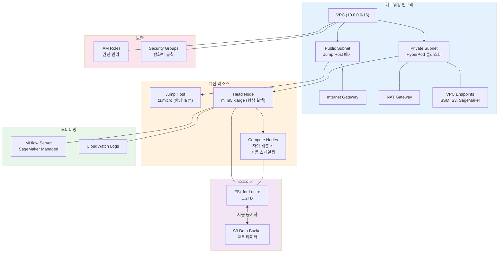
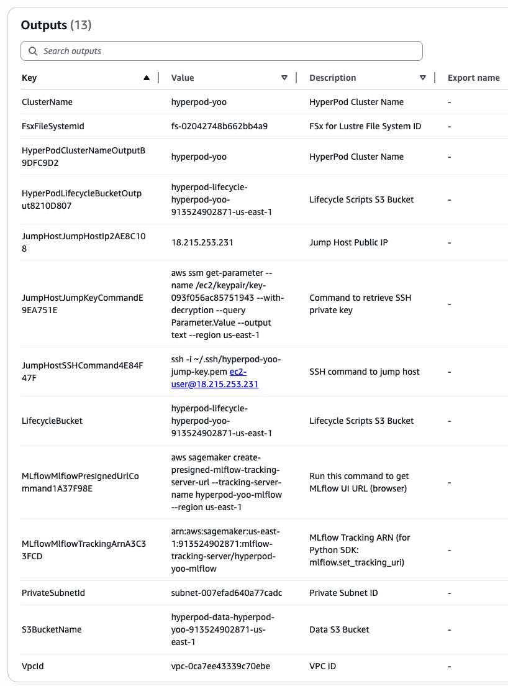
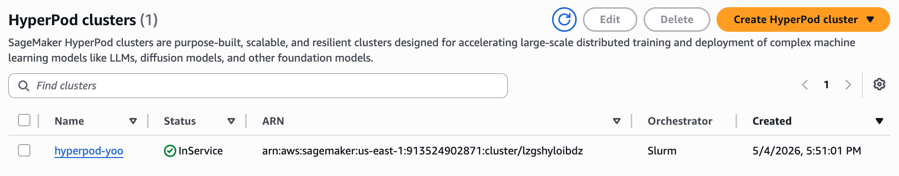
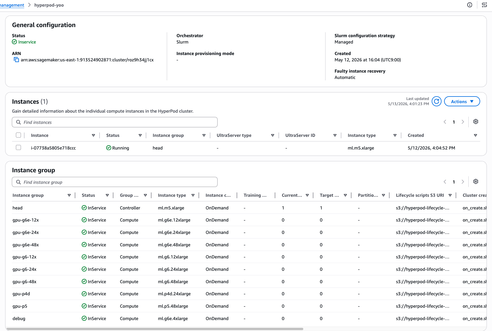

# 1. 인프라 배포

AWS CDK를 사용하여 SageMaker HyperPod 분산 학습 환경을 자동으로 프로비저닝합니다. HyperPod 클러스터, FSx for Lustre, Jump Host, MLflow 서버가 한 번의 명령으로 생성됩니다.

## CDK 배포 개요

AWS CDK (Cloud Development Kit)는 Python이나 TypeScript로 클라우드 인프라를 코드로 정의합니다. `cdk deploy` 명령 실행 시 다음 구성 요소들이 자동으로 생성됩니다:



### 배포되는 주요 컴포넌트

| 컴포넌트 | 역할 | 지속 시간 |
|---------|------|---------|
| **VPC** | 격리된 네트워크 환경 | 계속 실행 |
| **Jump Host (t3.micro)** | 인터넷에서 SSH로 접속하는 게이트웨이 | 계속 실행 |
| **HyperPod Head Node** | SLURM 스케줄러 및 클러스터 컨트롤러 | 계속 실행 |
| **FSx for Lustre** | 고성능 공유 스토리지 (S3와 동기화) | 계속 실행 |
| **MLflow 서버** | 학습 메트릭 추적 및 실험 관리 | 계속 실행 |
| **Compute Nodes** | 실제 학습이 실행되는 노드들 | 작업 제출 시만 생성 |

### 비용 고려사항

- **고정 비용**: Jump Host, Head Node, FSx, MLflow (항상 실행)
- **변동 비용**: Compute Nodes (작업 실행 시에만 과금)
- 장시간 분산 학습을 자주 실행할 때 비용 효율적

---

## 사전 요구 사항

### AWS 계정 및 권한

* AWS 계정 및 관리자 권한 (또는 SageMaker, EC2, VPC, IAM, FSx 권한)
* 권장 리전: **`us-east-1`** (US East N. Virginia)

### 서비스 할당량 확인


**HyperPod는 EC2 vCPU quota와 별개의 SageMaker 전용 quota를 사용합니다.** EC2 quota를 올려도 HyperPod에서 해당 인스턴스를 쓸 수 없습니다. 반드시 SageMaker 서비스 할당량을 확인하세요.


AWS 콘솔 → [Service Quotas](https://console.aws.amazon.com/servicequotas/) → **Amazon SageMaker** 에서 `ml.<타입> for cluster usage` 형식으로 검색하여 할당량을 확인합니다. 본 워크샵에 필요한 최소 항목은 다음과 같습니다:

- `ml.m5.xlarge for cluster usage`: 1개 이상 (head node)
- `ml.g6e.12xlarge for cluster usage` 또는 `ml.g6.12xlarge for cluster usage`: 원하는 GPU 노드 수


**승인까지 1~3 영업일 소요될 수 있으므로, 워크샵 최소 1주일 전에 요청해 주세요.** 새 AWS 계정은 g6/g6e/p 시리즈 GPU 할당량이 **0**으로 시작합니다.


<details>

<summary><strong>SageMaker HyperPod Quota 승인 요청 가이드 (us-east-1)</strong></summary>

HyperPod 학습 워크샵 참여 전, 아래 GPU 인스턴스에 대한 Service Quota 증가 요청이 필요합니다.

#### 사전 준비

- AWS 계정에 로그인
- 리전: **us-east-1 (N. Virginia)** 확인
- AWS CLI 사용 시 credential 설정 완료

#### 요청 권장 수량

신규 계정은 account age/spend history에 따라 SQI 한도가 제한됩니다. 인스턴스 크기별로 차등 요청하면 승인 확률이 높습니다.

| 티어 | 인스턴스 크기 | 권장 요청 값 |
|---|---|---|
| 소형 | xlarge ~ 2xlarge | 64 |
| 중형 | 8xlarge ~ 12xlarge | 32 |
| 대형 | 24xlarge ~ 48xlarge | 16 |
| 프리미엄 | p4de, p5 | 8 |

> 승인 후 추가 증가 요청이 가능하므로, 우선 위 값으로 요청하세요.

#### 요청 대상 Quota 목록

**On-Demand Instance (for cluster usage)** — HyperPod 클러스터의 On-Demand compute node로 사용됩니다.

| Quota Code | Instance Type | GPU | 요청 값 |
|---|---|---|---|
| L-6F0EC0FD | ml.g6.xlarge | L4 x1 | 64 |
| L-F63839BF | ml.g6.2xlarge | L4 x1 | 64 |
| L-8BC5FA3F | ml.g6.12xlarge | L4 x4 | 32 |
| L-513D1D07 | ml.g6.24xlarge | L4 x4 | 16 |
| L-B896E0F0 | ml.g6.48xlarge | L4 x8 | 16 |
| L-DE7D3776 | ml.g6e.xlarge | L40S x1 | 64 |
| L-69F95BD9 | ml.g6e.8xlarge | L40S x1 | 32 |
| L-A15DF696 | ml.g6e.12xlarge | L40S x4 | 32 |
| L-CCEE4B8C | ml.g6e.24xlarge | L40S x4 | 16 |
| L-177AF1AD | ml.g6e.48xlarge | L40S x8 | 16 |
| L-0F9E0C66 | ml.g7e.8xlarge | L40S x1 | 32 |
| L-3B7F2FD0 | ml.p4de.24xlarge | A100 x8 | 8 |
| L-8762A75F | ml.p5.48xlarge | H100 x8 | 8 |

**Spot Instance (for cluster spot instance usage)** — HyperPod 클러스터의 Spot compute node로 사용됩니다. 비용 절감 시 활용합니다.

| Quota Code | Instance Type | GPU | 요청 값 |
|---|---|---|---|
| L-8BC5FA3F | ml.g6.12xlarge | L4 x4 | 32 |
| L-513D1D07 | ml.g6.24xlarge | L4 x4 | 16 |
| L-B896E0F0 | ml.g6.48xlarge | L4 x8 | 16 |
| L-AF730FBA | ml.g6e.8xlarge | L40S x1 | 32 |
| L-3B7F2FD0 | ml.p4de.24xlarge | A100 x8 | 8 |

#### 요청 방법 1: AWS Console

1. [Service Quotas 콘솔](https://console.aws.amazon.com/servicequotas/home/services/sagemaker/quotas) 접속
2. 리전이 **us-east-1** 인지 확인
3. 검색창에 quota code (예: `L-6F0EC0FD`) 또는 인스턴스 타입 입력
4. 해당 quota 선택 → **Request increase at account-level** 클릭
5. 위 테이블의 **요청 값** 참고하여 입력 → 제출

#### 요청 방법 2: AWS CLI (일괄 요청)

아래 스크립트를 실행하면 인스턴스 크기별 차등 값으로 한 번에 요청합니다.

```bash
# On-Demand (for cluster usage) - 소형 (64)
for code in L-6F0EC0FD L-F63839BF L-DE7D3776; do
  aws service-quotas request-service-quota-increase \
    --service-code sagemaker \
    --quota-code "$code" \
    --desired-value 64 \
    --region us-east-1
done

# On-Demand - 중형 (32)
for code in L-8BC5FA3F L-69F95BD9 L-A15DF696 L-0F9E0C66; do
  aws service-quotas request-service-quota-increase \
    --service-code sagemaker \
    --quota-code "$code" \
    --desired-value 32 \
    --region us-east-1
done

# On-Demand - 대형 (16)
for code in L-513D1D07 L-B896E0F0 L-CCEE4B8C L-177AF1AD; do
  aws service-quotas request-service-quota-increase \
    --service-code sagemaker \
    --quota-code "$code" \
    --desired-value 16 \
    --region us-east-1
done

# On-Demand - 프리미엄 (8)
for code in L-3B7F2FD0 L-8762A75F; do
  aws service-quotas request-service-quota-increase \
    --service-code sagemaker \
    --quota-code "$code" \
    --desired-value 8 \
    --region us-east-1
done
```

```bash
# Spot - 중형 (32)
for code in L-8BC5FA3F L-AF730FBA; do
  aws service-quotas request-service-quota-increase \
    --service-code sagemaker \
    --quota-code "$code" \
    --desired-value 32 \
    --region us-east-1
done

# Spot - 대형 (16)
for code in L-513D1D07 L-B896E0F0; do
  aws service-quotas request-service-quota-increase \
    --service-code sagemaker \
    --quota-code "$code" \
    --desired-value 16 \
    --region us-east-1
done

# Spot - 프리미엄 (8)
for code in L-3B7F2FD0; do
  aws service-quotas request-service-quota-increase \
    --service-code sagemaker \
    --quota-code "$code" \
    --desired-value 8 \
    --region us-east-1
done
```

#### 요청 상태 확인

```bash
aws service-quotas list-requested-service-quota-change-history-by-quota \
  --service-code sagemaker \
  --quota-code L-6F0EC0FD \
  --region us-east-1
```

상태값:
- `PENDING` — 검토 중
- `CASE_OPENED` — AWS Support 케이스 생성됨 (대형 인스턴스)
- `APPROVED` — 승인 완료
- `DENIED` — 거절 (사유 확인 후 재요청 또는 Support 케이스 오픈)

#### 주의 사항

- **p5.48xlarge (H100)** 등 대형 인스턴스는 자동 승인이 안 될 수 있습니다. `CASE_OPENED` 상태가 되면 AWS Support 케이스에서 용도를 설명해 주세요.
- 이미 동일 quota에 대한 pending 요청이 있으면 새 요청이 거절됩니다. 기존 요청이 완료된 후 재요청하세요.
- Quota 승인 후에도 실제 용량(capacity) 확보는 별도입니다. 워크샵 일정이 정해지면 미리 알려주세요.
- EC2 vCPU quota와 SageMaker cluster quota는 **완전히 별개**입니다. EC2 quota를 올렸더라도 SageMaker HyperPod에서 쓰려면 `ml.<타입> for cluster usage` quota를 별도로 올려야 합니다.

</details>

### 선택 사항

* Session Manager Plugin: EC2 콘솔에서 쉽게 접속하려면 설치 ([설치 가이드](https://docs.aws.amazon.com/systems-manager/latest/userguide/session-manager-working-with-install-plugin.html))

---

## 1.1 CloudShell 환경 설정 (~5분)

1. [AWS 콘솔](https://console.aws.amazon.com)에 로그인합니다.

2. 우측 상단 리전을 **US East (N. Virginia) `us-east-1`** 으로 설정합니다.

3. 상단 `>_` 아이콘을 클릭하여 CloudShell을 실행합니다.

4. 아래 명령어를 실행합니다:

```bash
# 본인 식별자 설정 (영문 소문자/숫자/하이픈만 사용)
export USER_ID=<본인이름>

# 리포지토리 클론
git clone --depth 1 https://github.com/hi-space/aws-physical-ai-recipes.git ~/aws-physical-ai-recipes

# CDK 프로젝트 디렉토리 이동
cd ~/aws-physical-ai-recipes/training/hyperpod/cdk

# 의존성 설치
npm install
```


CloudShell에는 Node.js 18+와 AWS CDK CLI가 기본 설치되어 있습니다. `npm install`만 실행하면 됩니다.



이후 모든 단계에서 `${USER_ID}` 변수가 사용됩니다. 새 셸 세션을 열거나 SSH 재접속할 때마다 `export USER_ID=<본인이름>`을 다시 실행하거나 `~/.bashrc`에 추가해 두세요.


---

## 1.2 CDK Bootstrap (최초 1회)

해당 계정/리전에서 CDK를 처음 사용하는 경우에만 실행합니다:

```bash
cdk bootstrap aws://$(aws sts get-caller-identity --query Account --output text)/us-east-1
```

이 명령은:
- CloudFormation 스택 저장용 S3 버킷 생성
- IAM 역할 및 권한 설정
- CDK 배포 위한 기본 인프라 프로비저닝

---

## 1.3 인프라 배포 (~20분)

**이전 실습에서 IsaacLab 인프라를 이미 배포한 경우**, 동일한 `userId`로 VPC가 이미 생성되어 있습니다. HyperPod는 `UserId` 태그로 기존 VPC를 자동 탐색하므로, IsaacLab 배포 시 사용한 것과 **동일한 `userId`** 를 지정해야 합니다. 이 경우 `-c createVpc=false`를 추가하면 기존 VPC를 재사용하여 중복 생성을 방지합니다:

```bash
npx cdk deploy \
  -c userId=${USER_ID} \
  -c region=us-east-1 \
  -c createVpc=false \
  --require-approval never
```

독립적으로 새로운 VPC에 HyerPod을 배포하는 경우 아래 명령어를 사용합니다:

```bash
npx cdk deploy \
  -c userId=${USER_ID} \
  -c region=us-east-1 \
  --require-approval never
```


`userId`는 **영문 소문자, 숫자, 하이픈(-)만** 사용 가능합니다. 이 값이 모든 리소스 이름에 포함됩니다.


배포 중 진행 상황을 확인하려면:

```bash
# 별도 터미널에서 CloudFormation 스택 상태 모니터링
aws cloudformation describe-stacks \
  --stack-name HyperPod-${USER_ID} \
  --region us-east-1 \
  --query "Stacks[0].StackStatus" \
  --output text
```

<details>

<summary><strong>배포 파라미터 커스터마이즈</strong></summary>

| 파라미터 | 기본값 | 설명 |
|---------|--------|------|
| `userId` | (필수) | 사용자 식별자 |
| `region` | us-east-1 | 배포 리전 |
| `gpuMaxCount` | 4 | GPU 인스턴스 그룹별 최대 노드 수 |
| `gpuUseSpot` | false | Spot 인스턴스 사용 여부 |
| `fsxCapacityGiB` | 1200 | FSx 스토리지 용량 (GiB) |
| `enableMlflow` | true | MLflow 서버 생성 여부 |
| `createVpc` | true | 새 VPC 생성 여부 (기존 VPC 사용 시 false) |
| `vpcCidr` | 10.0.0.0/16 | VPC CIDR 블록 |

GPU 인스턴스는 Fallback 우선순위로 자동 구성됩니다:

| 순위 | 인스턴스 | GPU | VRAM | 비고 |
|------|---------|-----|------|------|
| 1 | ml.g6e.12xlarge | 4× L40S | 192GB | 기본 학습 |
| 2 | ml.g6e.48xlarge | 8× L40S | 384GB | 대규모 학습 |
| 3 | ml.g6.12xlarge | 4× L4 | 96GB | 가성비 |
| 4 | ml.p4d.24xlarge | 8× A100 | 320GB | NVLink 대규모 |
| 5 | ml.p5.48xlarge | 8× H100 | 640GB | 최대 성능 |

**소규모 테스트 배포:**

```bash
npx cdk deploy \
  -c userId=${USER_ID} \
  -c region=us-east-1 \
  -c gpuMaxCount=1 \
  -c fsxCapacityGiB=600 \
  --require-approval never
```

**대규모 학습 배포:**

```bash
npx cdk deploy \
  -c userId=${USER_ID} \
  -c region=us-east-1 \
  -c gpuMaxCount=8 \
  -c fsxCapacityGiB=2400 \
  --require-approval never
```

</details>

---

## 1.4 배포 확인

배포가 완료되면 CloudFormation Outputs이 출력됩니다. 이후 실습에서 사용하므로 메모해둡니다:

```bash
aws cloudformation describe-stacks \
  --stack-name HyperPod-${USER_ID} \
  --region us-east-1 \
  --query "Stacks[0].Outputs[*].{Key:OutputKey,Value:OutputValue}" \
  --output table
```

### 주요 출력값

| Output | 설명 | 예시 |
|--------|------|------|
| `JumpHostIp` | Jump Host Public IP | 54.224.204.194 |
| `JumpKeyCommand` | SSH 키 다운로드 명령 | `aws ssm get-parameter ...` |
| `ClusterName` | HyperPod 클러스터 이름 | hyperpod-alice |
| `S3BucketName` | 데이터 S3 버킷 | hyperpod-data-hyperpod-alice-... |
| `FsxFileSystemId` | FSx 파일시스템 ID | fs-0e5c6b6f5fa8413fc |
| `MLflowTrackingUri` | MLflow UI URL (브라우저) | https://us-east-1.experiments... |
| `MlflowTrackingArn` | MLflow ARN (Python SDK용) | arn:aws:sagemaker:us-east-1:... |

또는 콘솔의 Cloudformation의 Output에서 확인할 수 있습니다.



---

## 1.5 클러스터 상태 확인

배포 완료 후 클러스터 상태를 확인합니다:

```bash
CLUSTER_NAME="hyperpod-${USER_ID}"

aws sagemaker describe-cluster \
  --cluster-name ${CLUSTER_NAME} \
  --region us-east-1 \
  --query "{Status:ClusterStatus,Groups:InstanceGroups[*].{Name:InstanceGroupName,Count:CurrentCount}}"
```

`Status: InService`가 확인되면 배포 성공입니다. head 노드 1대만 상시 운영되고, 나머지 compute 노드는 작업 제출 시 자동 스케일링됩니다.

콘솔에서 `SageMaker AI`를 검색산 후, 좌측의 **HyperPod clusters** 메뉴를 선택하면 아래와 같이 생성된 클러스터를 확인할 수 있습니다.



생성된 클러스터를 선택해 들어오면, 클러스터 상태와 Orchestrator가 Slurm으로 생성된 것, 그리고 노드들을 확인할 수 있습니다. 



---

## 1.6 다음 단계

배포가 완료되면 [**2. 클러스터 접속 및 확인**](2.-cluster-access.md)으로 진행하여 Jump Host를 통해 Head Node에 SSH 접속하고 SLURM 상태를 확인합니다.

---

## 트러블슈팅

### CDK 배포 실패

```bash
# 1. 배포 로그 확인
aws cloudformation describe-stack-events \
  --stack-name HyperPod-${USER_ID} \
  --region us-east-1 \
  --query "StackEvents[?ResourceStatus=='CREATE_FAILED']"

# 2. 서비스 할당량 확인
aws service-quotas get-service-quota \
  --service-code sagemaker \
  --quota-code L-<QUOTA-ID> \
  --region us-east-1
```

### GPU 할당량 부족 (InsufficientCapacity / ResourceLimitExceeded)

HyperPod에서 인스턴스를 띄울 수 없는 경우 두 가지 원인이 있습니다:

**1) Quota 부족 (`ResourceLimitExceeded`)**

```bash
# HyperPod 전용 할당량 확인
aws service-quotas list-service-quotas \
  --service-code sagemaker \
  --region us-east-1 \
  --query "Quotas[?contains(QuotaName, 'cluster') && Value > \`0\`].[QuotaName, Value]" \
  --output table

# 증량 요청
aws service-quotas request-service-quota-increase \
  --service-code sagemaker \
  --quota-code <QUOTA_CODE> \
  --desired-value <원하는 수량> \
  --region us-east-1
```

**2) Capacity 부족 (`InsufficientCapacity`)**

해당 리전/AZ에 물리적 인스턴스가 부족한 경우입니다. 이 경우:
- 다른 인스턴스 타입으로 시도 (g5 → g6e 등)
- 시간을 두고 재시도
- 다른 리전 사용


EC2 vCPU quota와 SageMaker cluster quota는 **완전히 별개**입니다. EC2 quota를 올렸더라도 SageMaker HyperPod에서 쓰려면 `ml.<타입> for cluster usage` quota를 별도로 올려야 합니다.


### 롤백 (배포 취소)

```bash
aws cloudformation delete-stack \
  --stack-name HyperPod-${USER_ID} \
  --region us-east-1
```

---

## References

* [**[AWS SageMaker HyperPod]** Official Documentation](https://docs.aws.amazon.com/sagemaker/latest/dg/sagemaker-hyperpod.html)
* [**[AWS CDK]** Infrastructure as Code Guide](https://docs.aws.amazon.com/cdk/v2/guide/home.html)
* [**[Amazon FSx for Lustre]** User Guide](https://docs.aws.amazon.com/fsx/latest/LustreGuide/what-is.html)
* [**[GitHub]** AWS Physical AI Recipes — HyperPod CDK](https://github.com/hi-space/aws-physical-ai-recipes/tree/main/training/hyperpod/cdk)
