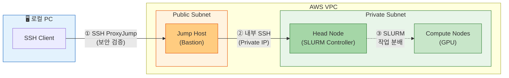

# 2. 클러스터 접속 및 확인

HyperPod 클러스터 노드는 Private Subnet에 위치합니다. 보안 및 네트워크 아키텍처상의 이유로, Public Subnet의 Jump Host를 경유하여 SSH로 접속합니다.

## 왜 Jump Host를 경유해야 할까?

**HyperPod의 네트워크 보안 설계:**
- **Private Subnet의 노드**: Head Node와 Compute 노드는 Private Subnet에 있어 Public IP가 없습니다. 외부 인터넷에서 직접 접근이 불가능합니다. 이는 의도적인 설계로, 데이터 유출 방지 및 미승인 접근 차단을 위한 보안 best practice입니다.
- **Jump Host (Bastion Host)**: Public Subnet의 Jump Host는 인터넷과 Private 네트워크 사이의 단일 진입점(Single Entry Point) 역할을 합니다. 모든 인바운드 접속을 Jump Host에서 검증한 후 내부 노드로 전달합니다.
- **프록시 기반 통신**: SSH ProxyJump를 사용하면 로컬에서 한 번의 명령으로 최종 노드에 접속되지만, 실제로는 Jump Host 경유의 다단계 인증이 수행됩니다.

**아키텍처:**



---

## SLURM이란 무엇인가?

SLURM (Simple Linux Utility for Resource Management)은 고성능 컴퓨팅(HPC) 및 분산 시스템을 위한 작업 스케줄러입니다.

- **역할**: 여러 사용자가 공유하는 컴퓨팅 자원(CPU, GPU, 메모리)을 공정하게 분배합니다.
- **분산 학습에서의 역할**: GPU 학습 작업을 제출하면, SLURM이 필요한 리소스를 자동으로 할당하고 실행 순서를 관리합니다.
- **HyperPod의 자동 스케일링**: SLURM 작업을 제출하면 HyperPod가 자동으로 필요한 GPU 노드를 프로비저닝하고, 작업 완료 후 불필요한 노드는 자동으로 종료하여 비용을 절감합니다.

**예시:**
```bash
# SLURM으로 8개 GPU를 사용하는 학습 작업 제출
srun --gpus-per-node=8 python train.py

# SLURM이 자동으로:
# 1. 8개 GPU를 가진 노드를 HyperPod에 요청
# 2. 노드 프로비저닝 대기
# 3. 작업 실행
# 4. 작업 완료 후 자동 리소스 해제
```

---

## HyperPod의 SLURM Managed 모드

AWS SageMaker HyperPod는 **SLURM Managed 모드**를 사용합니다. 이는 다음을 의미합니다:

- **자동 관리**: `slurmctld` (SLURM 컨트롤러)는 AWS의 `SageMakerClusterAgent`에 의해 자동으로 관리되며, 사용자가 수동으로 시작/종료할 필요가 없습니다.
- **SSH를 통한 작업 제출**: Jump Host를 경유해 SSH로 Head Node에 접속한 후 `sbatch` 또는 `srun` 명령으로 작업을 제출합니다. 이것이 HyperPod 워크플로우의 표준입니다.
- **SSM(Systems Manager) 주의**: AWS 콘솔의 Session Manager로 HyperPod 노드에 접속하는 방식은 신뢰할 수 없으며, 실패할 가능성이 높습니다. 반드시 SSH를 사용하세요.
- **Compute 노드 자동 스케일링**: Compute 노드(`ml.g6e.12xlarge`, `ml.g5.12xlarge` 등)는 초기에 `instanceCount=0`으로 시작하며, 작업 제출 시에만 자동으로 프로비저닝됩니다. 학습이 끝나면 자동으로 종료되어 비용이 발생하지 않습니다.

---

### 2.1 Jump Host SSH 키 다운로드

CDK 배포(`cdk deploy`) 완료 시 터미널에 출력되는 `JumpHostJumpKeyCommand` 값을 사용합니다.

**CDK 출력 예시:**
```
HyperPod-<userId>.JumpHostJumpKeyCommand... = aws ssm get-parameter --name /ec2/keypair/key-0932d04fbda4dc5a7 --with-decryption --query Parameter.Value --output text --region us-east-1
```

CDK Output의 `JumpHostJumpKeyCommand` 값을 **그대로 복사**한 뒤, `> ~/.ssh/hyperpod-<userId>-jump-key.pem`만 뒤에 붙여 실행하면 됩니다.

**실행 방법:**
```bash
# JumpHostJumpKeyCommand 값 + 파일 저장
aws ssm get-parameter \
  --name /ec2/keypair/key-0932d04fbda4dc5a7 \
  --with-decryption \
  --query Parameter.Value \
  --output text \
  --region us-east-1 > ~/.ssh/hyperpod-<userId>-jump-key.pem

chmod 600 ~/.ssh/hyperpod-<userId>-jump-key.pem
```

**예상 출력:**
```
ls -la ~/.ssh/hyperpod-<userId>-jump-key.pem
# -rw------- 1 user user 1679 May 3 10:00 ~/.ssh/hyperpod-<userId>-jump-key.pem
```

---

### 2.2 Jump Host 접속

CDK Output의 `JumpHostJumpHostIp` 또는 `JumpHostSSHCommand` 값을 사용합니다.

```bash
# JumpHostJumpHostIp 값 사용
ssh -i ~/.ssh/hyperpod-<userId>-jump-key.pem ec2-user@54.196.110.185
```

**예상 출력:**
```
The authenticity of host '<IP>' can't be established.
ECDSA key fingerprint is SHA256:...
Are you sure you want to continue connecting (yes/no)? yes
Warning: Permanently added '<IP>' (ECDSA) to the known_hosts file.

       __|  __|_  )
       _|  (     /   Amazon Linux 2023
      ___|\___|___|

ec2-user@ip-10-x-x-x:~$
```

---

### 2.3 Head Node 접속

Jump Host에는 Head Node 접속용 SSH 키(`~/.ssh/cluster_access_key`)가 자동으로 배포되어 있습니다.

```bash
# Head Node Private IP 확인
aws sagemaker describe-cluster-node \
  --cluster-name hyperpod-<userId> \
  --node-id <INSTANCE_ID> \
  --region us-east-1 \
  --query "NodeDetails.PrivatePrimaryIp" --output text
```

**예상 출력:**
```
10.0.1.123
```

```bash
# Jump Host에서 Head Node로 접속
ssh -i ~/.ssh/cluster_access_key ubuntu@<HEAD_NODE_IP>
```

**예상 출력:**
```
Welcome to Ubuntu 20.04.6 LTS (GNU/Linux 5.15.0-1065-aws x86_64)

ubuntu@hyperpod-head:~$
```

---

### 2.4 SSH Config 설정 (권장)

로컬 PC의 `~/.ssh/config`에 아래를 추가하면 `ssh hyperpod`로 한 번에 접속할 수 있습니다:

```
Host hyperpod-jump
    HostName <JUMP_HOST_IP>
    User ec2-user
    IdentityFile ~/.ssh/hyperpod-<userId>-jump-key.pem

Host hyperpod
    HostName <HEAD_NODE_PRIVATE_IP>
    User ubuntu
    IdentityFile ~/.ssh/cluster_access_key
    ProxyJump hyperpod-jump
```

`cluster_access_key`는 S3에서 다운로드합니다:

```bash
aws s3 cp s3://hyperpod-lifecycle-hyperpod-<userId>-<ACCOUNT_ID>-us-east-1/ssh/cluster_access_key \
  ~/.ssh/cluster_access_key
chmod 600 ~/.ssh/cluster_access_key
```

**예상 출력:**
```
download: s3://hyperpod-lifecycle-hyperpod-...-us-east-1/ssh/cluster_access_key to ~/.ssh/cluster_access_key
```

이후 로컬에서 바로 접속:

```bash
ssh hyperpod
```

---

### 2.5 클러스터 환경 확인

Head Node에 접속한 후 아래를 확인합니다:

```bash
# SLURM 상태 확인
sinfo

# FSx 마운트 확인
df -h /fsx

# 디렉토리 구조 확인
ls /fsx/
```

**SLURM 출력 예상:**

```
PARTITION AVAIL  TIMELIMIT  NODES  STATE NODELIST
dev*         up   infinite      0    n/a
```


현재 compute 노드가 0대인 것은 정상입니다. SLURM 작업을 제출하면 HyperPod가 자동으로 필요한 GPU 노드를 프로비저닝합니다.


**FSx 출력 예상:**

```
Filesystem            Size  Used Avail Use% Mounted on
10.0.x.x@tcp:/fsx   1.2T  100G  1.1T  8% /fsx
```

**FSx 디렉토리 구조:**

```bash
ls /fsx/
# datasets  checkpoints  scratch
```

| 디렉토리 | 용도 |
|---------|------|
| `/fsx/datasets` | 학습 데이터 (S3에서 자동 동기화) |
| `/fsx/checkpoints` | 모델 체크포인트 (학습 중간 저장) |
| `/fsx/scratch` | 임시 작업 파일 |

---

### 2.6 워크숍 환경 초기화

Head Node에 접속한 후 한 번만 실행합니다:

```bash
# 레포지토리 클론
git clone --depth 1 https://github.com/hi-space/aws-physical-ai-recipes.git /fsx/scratch/aws-physical-ai-recipes

# GR00T 학습 환경 설치 (venv 방식, ~5-10분)
bash /fsx/scratch/aws-physical-ai-recipes/training/hyperpod/scripts/setup_groot_env.sh
```

이 스크립트가 수행하는 작업:
- 시스템 패키지 설치 (`ffmpeg`, `git-lfs`)
- `uv` 패키지 매니저 설치
- Isaac-GR00T 저장소 클론 (`/fsx/scratch/Isaac-GR00T`)
- Python 3.10 가상환경 생성 (`/fsx/envs/gr00t`)
- GR00T 패키지 + 의존성 설치 (`bitsandbytes`, `flash-attn` 등)


**HuggingFace 토큰도 함께 설정하세요:**
GR00T N1.7은 gated model이므로 학습 전 토큰이 필요합니다.
```bash
echo "hf_xxxxxxxxxxxx" > /fsx/scratch/.hf_token
```


---

### 2.7 VS Code Remote-SSH (선택)

VS Code에서 원격으로 작업하려면:

1. VS Code에서 **Remote-SSH** 확장 설치
2. `Ctrl+Shift+P` → **Remote-SSH: Connect to Host...** → `hyperpod` 선택
3. 원격 폴더 열기: `/fsx/scratch`

이렇게 하면 파일 편집, 터미널, 디버깅을 로컬과 동일하게 사용할 수 있습니다.

**연결 확인:**

```bash
# VS Code 터미널에서 실행 (원격 Host 내)
whoami
# ubuntu

pwd
# /fsx/scratch
```
