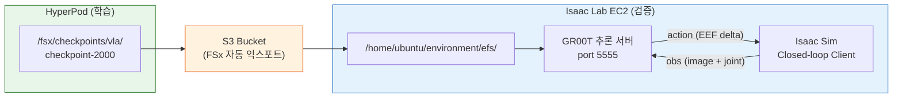

# 6. 시뮬레이션 검증 (Closed-loop Evaluation)

HyperPod에서 학습한 VLA/RL 모델이 실제로 작업을 완수하는지 시뮬레이션에서 검증합니다. [Isaac Lab on AWS](../nvidia-isaac-lab-on-aws/) 트랙으로 배포한 EC2 인스턴스를 활용하면, 이미 구성된 GR00T 추론 서버와 Isaac Sim 환경에서 바로 테스트할 수 있습니다.

---

## Open-loop vs Closed-loop 평가

| | Open-loop (4.8절) | Closed-loop (이 장) |
|--|--|--|
| 방식 | 데이터셋의 관측값을 입력 → 예측 action과 정답 비교 | 시뮬레이션에서 모델이 직접 로봇 제어 |
| 측정 지표 | MSE (예측 오차) | 태스크 성공률, 에피소드 길이 |
| 한계 | 누적 오차 미반영 | 시뮬레이션 환경 필요 |
| 결론 | "모델이 데이터를 잘 피팅했나?" | "로봇이 실제로 작업을 완수하나?" |

---

## 6.1 아키텍처 개요



**흐름:**
1. HyperPod FSx → S3 자동 익스포트 (DRA)
2. EC2에서 S3 체크포인트 다운로드
3. Fine-tuned 모델로 GR00T 추론 서버 시작
4. Isaac Sim에서 closed-loop 평가 실행

---

## 6.2 사전 준비

| 요구사항 | 확인 방법 |
|----------|-----------|
| Isaac Lab on AWS EC2 배포 완료 | [Isaac Lab on AWS 가이드](../nvidia-isaac-lab-on-aws/) 참조 |
| GR00T 추론 서버 동작 확인 | `ss -tlnp | grep 5555` |
| HyperPod에서 VLA 학습 완료 | `ls /fsx/checkpoints/vla/groot-demo_data/checkpoint-2000/` |
| S3 익스포트 완료 | `aws s3 ls s3://${BUCKET}/checkpoints/vla/` |

---

## 6.3 체크포인트를 EC2에서 접근

HyperPod FSx의 체크포인트를 EC2에서 접근하는 방법은 두 가지입니다.

### 방법 A: FSx를 EC2에 직접 마운트 (권장)

EC2와 HyperPod가 같은 VPC(또는 VPC 피어링)에 있으면 FSx Lustre를 EC2에 마운트하여 체크포인트에 즉시 접근할 수 있습니다. 복사 대기 없이 바로 사용 가능합니다.

```bash
# EC2 인스턴스에서 실행

# Lustre 클라이언트 설치 (Ubuntu 24.04)
sudo apt-get update && sudo apt-get install -y lustre-client-modules-aws

# 마운트 포인트 생성
sudo mkdir -p /fsx

# FSx 마운트 (FSx DNS 이름은 AWS 콘솔에서 확인)
sudo mount -t lustre <FSX_DNS_NAME>@tcp:/fsx /fsx

# 체크포인트 확인
ls /fsx/checkpoints/vla/groot-demo_data/checkpoint-2000/
# config.json  model-00001-of-00002.safetensors  ...
```


FSx DNS 이름은 AWS 콘솔 → FSx → 파일 시스템 → 네트워크 & 보안 탭에서 확인할 수 있습니다.
EC2의 Security Group에서 FSx의 Security Group으로 TCP 988 포트 인바운드가 허용되어야 합니다.


### 방법 B: S3 경유 다운로드

EC2가 다른 VPC에 있거나 FSx 마운트가 어려운 경우, S3를 경유합니다. HyperPod FSx의 체크포인트는 DRA를 통해 S3로 자동 익스포트됩니다 (수분 소요).

```bash
# EC2 인스턴스에서 실행
aws s3 cp s3://${BUCKET}/checkpoints/vla/groot-demo_data/checkpoint-2000 \
  ~/groot-finetuned/checkpoint-2000 \
  --recursive --region us-east-1

# 다운로드 확인
ls ~/groot-finetuned/checkpoint-2000/
# config.json  model-00001-of-00002.safetensors  ...
```

---

## 6.4 GR00T 추론 서버 재시작 (Fine-tuned 모델)

EC2에는 CDK 배포 시 사전학습된 GR00T N1.6 모델로 추론 서버가 자동 실행되어 있습니다. Fine-tuned 체크포인트로 교체합니다. CDK가 빌드한 `groot-n1:latest` Docker 이미지를 그대로 사용합니다.

```bash
# 기존 추론 서버 중지
sudo systemctl stop groot-inference.service

# Fine-tuned 체크포인트로 Docker 컨테이너 시작
docker run --rm --gpus all --name groot-finetuned \
  --network=host \
  -v ~/groot-finetuned:/workspace/weights \
  groot-n1:latest \
  gr00t/eval/run_gr00t_server.py \
    --model_path /workspace/weights/checkpoint-2000 \
    --embodiment_tag OXE_DROID_RELATIVE_EEF_RELATIVE_JOINT \
    --host 0.0.0.0 \
    --port 5555

# FSx 마운트한 경우 -v 옵션을 변경:
# -v /fsx/checkpoints/vla/groot-demo_data:/workspace/weights
```

서버 시작 후 정상 동작 확인:

```bash
# 별도 터미널에서 ping 테스트
docker run --rm --network=host groot-n1:latest -c "
import zmq, msgpack
ctx = zmq.Context()
sock = ctx.socket(zmq.REQ)
sock.connect('tcp://localhost:5555')
sock.send(msgpack.packb({'endpoint': 'ping'}))
print(msgpack.unpackb(sock.recv(), raw=False))
"
# {'status': 'ok', 'message': 'Server is running'}
```

---

## 6.5 Closed-loop 시뮬레이션 실행

별도 터미널에서 Isaac Sim 클라이언트를 실행합니다. 모델이 카메라 영상 + 관절 상태를 받아 action을 출력하고, 시뮬레이션에서 로봇을 직접 제어하는 루프가 반복됩니다.

### Headless 모드 (성공률 측정)

```bash
cd /home/ubuntu/environment/Isaac-GR00T
uv run python gr00t/eval/run_closed_loop_eval.py \
  --policy_host localhost \
  --policy_port 5555 \
  --instruction "pick up the cube" \
  --num_steps 5000 \
  --headless
```

### GUI 모드 (시각적 확인, DCV 필요)

DCV 원격 데스크톱으로 접속한 상태에서 `--headless`를 제거하면 시뮬레이션 화면을 직접 볼 수 있습니다:

```bash
cd /home/ubuntu/environment/Isaac-GR00T
uv run python gr00t/eval/run_closed_loop_eval.py \
  --policy_host localhost \
  --policy_port 5555 \
  --instruction "pick up the cube" \
  --num_steps 5000
```


DCV 접속 방법은 [Isaac Lab on AWS - 1. Infra Setup](../nvidia-isaac-lab-on-aws/1.-infra-setup.md) 가이드를 참조하세요.


---

## 6.6 평가 결과 해석

```
Episode 1/10: SUCCESS (steps: 342)
Episode 2/10: SUCCESS (steps: 289)
Episode 3/10: FAIL (steps: 5000, timeout)
...
Success Rate: 7/10 (70%)
Average Episode Length: 1245 steps
```

| 지표 | 의미 | 목표 |
|------|------|------|
| Success Rate | 태스크 완수 비율 | 70%+ (시뮬레이션 기준) |
| Episode Length | 완수까지 걸린 스텝 수 | 낮을수록 효율적 |
| Timeout | 제한 스텝 내 미완수 | 0에 가까울수록 좋음 |


Sim-to-Real gap으로 인해 시뮬레이션 성공률이 높더라도 실제 로봇에서는 다를 수 있습니다. 시뮬레이션은 모델의 기본 동작 능력을 확인하는 용도입니다.


---

## 6.7 사전학습 모델 vs Fine-tuned 모델 비교

동일한 태스크에서 Base 모델과 Fine-tuned 모델의 성능을 비교합니다:

```bash
# 1. Base 모델로 테스트 (systemd 기본값 복원)
sudo systemctl start groot-inference.service

uv run python gr00t/eval/run_closed_loop_eval.py \
  --policy_host localhost --policy_port 5555 \
  --instruction "pick up the cube" --num_steps 5000 --headless

# 2. Fine-tuned 모델로 테스트 (6.4절 방식)
sudo systemctl stop groot-inference.service
docker run --rm -d --gpus all --name groot-finetuned \
  --network=host \
  -v ~/groot-finetuned:/workspace/weights \
  groot-n1:latest \
  gr00t/eval/run_gr00t_server.py \
    --model_path /workspace/weights/checkpoint-2000 \
    --embodiment_tag OXE_DROID_RELATIVE_EEF_RELATIVE_JOINT \
    --host 0.0.0.0 --port 5555

uv run python gr00t/eval/run_closed_loop_eval.py \
  --policy_host localhost --policy_port 5555 \
  --instruction "pick up the cube" --num_steps 5000 --headless
```

---

## 6.8 원래 모델로 복원

검증이 끝난 후 CDK가 배포한 기본 GR00T 서버로 복원합니다:

```bash
# Fine-tuned 컨테이너 종료
docker stop groot-finetuned

# 기본 systemd 서비스 재시작
sudo systemctl start groot-inference.service

# 정상 복원 확인
ss -tlnp | grep 5555
```

---

## 6.9 트러블슈팅

| 증상 | 원인 | 해결 방법 |
|------|------|----------|
| ZMQ connection refused | 서버 미시작 또는 포트 불일치 | `ss -tlnp | grep 5555`로 확인, 서버 로그 점검 |
| `embodiment_tag mismatch` | 학습과 추론의 태그 불일치 | HyperPod 학습 시 사용한 태그와 동일하게 지정 |
| S3 다운로드 AccessDenied | IAM 권한 부족 | EC2 인스턴스 역할에 S3 읽기 권한 추가 |
| 추론 속도 느림 (< 10Hz) | GPU 미사용 | `nvidia-smi`로 GPU 활용 확인, `--device cuda:0` 지정 |
| 시뮬레이션 화면 안 뜸 | headless 모드 또는 DCV 미접속 | `--headless` 제거 + DCV로 접속 |
| 모델 로드 시 shape mismatch | 체크포인트 손상 또는 불완전 다운로드 | S3에서 재다운로드, 파일 크기 비교 |

---

## References

* [Isaac-GR00T Evaluation](https://github.com/NVIDIA/Isaac-GR00T/tree/main/gr00t/eval)
* [Isaac Lab on AWS 가이드](../nvidia-isaac-lab-on-aws/)
* [GR00T N1.6 Model Card](https://huggingface.co/nvidia/GR00T-N1.6-3B)
* [NICE DCV Documentation](https://docs.aws.amazon.com/dcv/)
