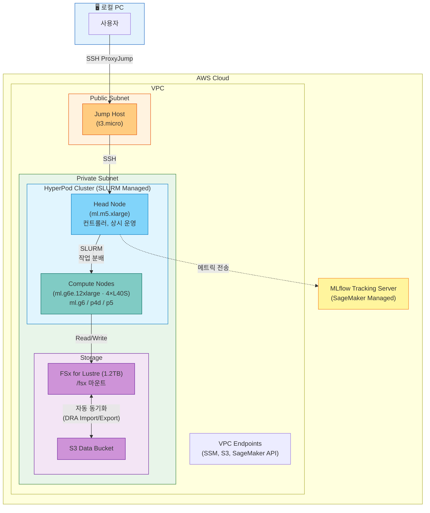

# HyperPod 분산 학습

이 실습에서는 AWS SageMaker HyperPod를 활용해 Physical AI (VLA/RL) 모델의 분산 학습 환경을 구축하고, 데이터 준비부터 학습 실행, MLflow 모니터링까지 전체 파이프라인을 실습합니다.

## Physical AI와 분산 학습

**Physical AI**는 로봇과 같은 물리적 에이전트가 실제 세계에서 동작하도록 하는 AI입니다. Physical AI 모델(VLA: Vision Language Action 또는 강화학습 정책)은 수백만 개의 학습 데이터와 수시간~수일의 GPU 연산이 필요합니다.

**분산 학습**이 중요한 이유:
- **속도**: 단일 GPU에서 수일 걸리는 학습을 여러 GPU에서 병렬 처리하여 수시간으로 단축
- **스케일**: 수백만 개 규모의 대규모 데이터셋을 여러 노드에 분산하여 처리 가능
- **비용 효율**: 장시간 학습이 필요할 때 상시 운영 클러스터를 유지하는 것이 단발성 학습보다 경제적

이 워크숍에서는 AWS 인프라를 활용해 분산 학습의 전체 사이클을 실습합니다.

### AWS 서비스 소개

* **[Amazon SageMaker HyperPod](https://docs.aws.amazon.com/sagemaker/latest/dg/sagemaker-hyperpod.html)**
  - 상시 운영 GPU 클러스터를 SLURM(Simple Linux Utility for Resource Management)으로 관리
  - 자동 복구: 노드 장애 시 자동으로 대체 노드 생성
  - 탄력적 스케일링: 학습 작업 규모에 따라 자동으로 계산 노드 추가/제거
  - 왜 사용?: 장시간 학습에 최적화된 상시 클러스터로, SSH 접속과 SLURM 작업 제출이 자유로움
  - [AWS 문서](https://docs.aws.amazon.com/sagemaker/latest/dg/sagemaker-hyperpod.html)

* **[Amazon FSx for Lustre](https://docs.aws.amazon.com/fsx/latest/LustreGuide/what-is.html)**
  - 고성능 병렬 파일시스템 (HPC/ML 워크로드 최적화)
  - S3와 자동 동기화: S3에 업로드된 데이터가 /fsx에 자동으로 동기화되고, 체크포인트가 자동으로 S3에 백업
  - 왜 사용?: 대규모 데이터셋(GB~TB)을 여러 GPU 노드에서 동시에 빠르게 읽고 쓰기 위해 필요
  - [AWS 문서](https://docs.aws.amazon.com/fsx/latest/LustreGuide/what-is.html)

* **[Amazon SageMaker MLflow 추적 서버](https://docs.aws.amazon.com/sagemaker/latest/dg/mlflow.html)**
  - 관리형 MLflow 서버: 실험 추적, 메트릭 비교, 모델 버전 관리
  - 학습 실행 중 메트릭(손실, 정확도 등)을 자동으로 기록하고 웹 UI에서 실시간 모니터링
  - 왜 사용?: 여러 GPU 노드에서 동시에 실행되는 학습의 진행 상황과 성능을 중앙에서 추적
  - [AWS 문서](https://docs.aws.amazon.com/sagemaker/latest/dg/mlflow.html)

* **[AWS CDK (Cloud Development Kit)](https://docs.aws.amazon.com/cdk/v2/guide/home.html)**
  - Python/TypeScript 등 프로그래밍 언어로 클라우드 인프라를 코드로 정의
  - 한 번의 `cdk deploy` 명령으로 VPC, HyperPod, FSx, Jump Host, MLflow, IAM 역할 등을 자동 프로비저닝
  - 왜 사용?: 복잡한 인프라 설정을 자동화하고, 재현 가능하며, 버전 관리 가능
  - [AWS 문서](https://docs.aws.amazon.com/cdk/v2/guide/home.html)

### 왜 HyperPod인가?

Physical AI 모델(GR00T, RT-2 등)의 학습은 일반적인 ML 학습과 다른 특성을 가집니다:

- **학습 시간이 길다**: VLA 모델은 수시간~수일 동안 학습이 지속되며, 중간에 하이퍼파라미터를 조정하거나 디버깅이 필요한 경우가 빈번합니다.
- **반복 실험이 잦다**: 데이터셋을 바꿔가며 여러 번 학습을 돌리고, 결과를 비교해야 합니다.
- **GPU 노드에 직접 접속**해야 할 때가 많습니다: 학습 중간에 로그를 확인하거나, 환경을 디버깅하거나, 체크포인트를 검사하는 작업이 필요합니다.

**SageMaker HyperPod**는 이런 요구사항에 최적화된 상시 운영 GPU 클러스터 서비스입니다:

| 특징 | 설명 |
|------|------|
| **SLURM 기반 작업 관리** | HPC 업계 표준 스케줄러로, `sbatch`/`srun` 명령으로 작업을 제출하고 GPU 자원을 자동 분배 |
| **탄력적 스케일링** | Compute 노드는 작업이 없으면 0대로 축소, 제출하면 자동 프로비저닝 → 유휴 비용 최소화 |
| **자동 복구 (Auto-Resume)** | 노드 장애 발생 시 자동으로 대체 노드를 생성하고 체크포인트에서 학습 재개 |
| **SSH 상시 접속** | Head Node에 항상 SSH 접속 가능 → 디버깅, 환경 설정, 실시간 모니터링이 자유로움 |
| **FSx 공유 스토리지** | 모든 노드가 동일한 `/fsx` 파일시스템을 공유 → 데이터 복사 없이 즉시 학습 시작 |
| **MLflow 통합** | 관리형 MLflow 서버와 연동하여 분산 학습 메트릭을 중앙에서 추적 |

### HyperPod vs AWS Batch

| 구분 | HyperPod (이 실습) | AWS Batch ([Isaac Lab 실습](../nvidia-isaac-lab-on-aws/README.md)) |
|------|-------------------|--------------------------|
| 클러스터 수명 | 상시 운영 (Head Node 항상 가동) | 작업 시에만 생성/삭제 |
| 스케줄러 | SLURM (HPC 표준) | AWS Batch Scheduler |
| 노드 접속 | SSH (상시 접속 가능) | 없음 (작업 제출만) |
| 장애 복구 | 자동 복구 + 체크포인트 재개 | 작업 재시도 (처음부터) |
| 적합한 작업 | 장시간 학습, 디버깅, 반복 실험 | 단발성 대규모 학습 |
| 비용 모델 | Head Node 상시 + Compute 사용분만 | 작업 시간만 과금 |


VLA Fine-tuning은 데이터셋을 바꿔가며 반복 학습하고, 중간 결과를 확인하며, 하이퍼파라미터를 조정하는 과정이 핵심입니다. SSH로 직접 접속하여 실시간으로 작업을 관리할 수 있는 HyperPod가 이 워크플로우에 가장 적합합니다.


## 아키텍처

## 실습 과정

### 전제 조건

이 실습을 시작하기 전에 다음을 확인하세요:

- AWS 계정 및 적절한 권한 (IAM 관리자 또는 SageMaker, EC2, VPC 권한)
- **[NVIDIA Isaac Lab on AWS](../nvidia-isaac-lab-on-aws/README.md)** 워크숍 완료 (권장)
  - Physical AI와 로봇 시뮬레이션의 기본 개념을 이해하는 데 도움
  - Isaac Lab의 RL 학습 방식과 HyperPod의 분산 학습을 비교 가능

---

[**1. 인프라 배포**](1.-infra-deploy.md)

CloudShell에서 CDK로 HyperPod 클러스터, FSx, Jump Host, MLflow를 한 번에 배포합니다.

[**2. 클러스터 접속 및 확인**](2.-cluster-access.md)

Jump Host를 경유해 Head Node에 SSH 접속하고, SLURM과 FSx 상태를 확인합니다.

[**3. 데이터 준비**](3.-data-preparation.md)

S3에 학습 데이터를 업로드하면 FSx에 자동 동기화됩니다. LeRobot v2 형식의 데이터셋 구조를 준비합니다.

[**4. VLA 학습 실행 (GR00T Fine-tuning)**](4.-vla-training.md)

SLURM을 사용해 GR00T VLA 모델 Fine-tuning 작업을 제출하고 모니터링합니다. N1.6 (기본, HF 권한 불필요) 또는 N1.7 (gated) 중 선택할 수 있으며, 두 버전 모두 동일한 워크플로우를 사용합니다.

[**5. RL 학습 (Isaac Lab — Advanced)**](5.-rl-training.md)

Isaac Sim 컨테이너에서 SO-101 로봇 RL 학습을 headless로 실행합니다. GR00T 학습 결과의 closed-loop 시뮬레이션 검증도 포함합니다.

[**6. MLflow 실험 추적**](6.-mlflow-tracking.md)

학습 메트릭을 MLflow로 추적하고, 실험 결과를 비교합니다.

[**7. 리소스 정리**](7.-cleanup.md)

실습 후 CDK로 전체 인프라를 삭제합니다.

---

## References

* [**[GitHub]** AWS Physical AI Recipes — HyperPod Workshop CDK](https://github.com/hi-space/aws-physical-ai-recipes/tree/main/training/hyperpod/cdk)
* [**[NVIDIA GR00T]** GR00T N1.7 Documentation](https://docs.nvidia.com/isaac/foundation_models/gr00t/gr00t-n1/)
* [**[AWS SageMaker HyperPod]** Official Documentation](https://docs.aws.amazon.com/sagemaker/latest/dg/sagemaker-hyperpod.html)
* [**[Companion Workshop]** NVIDIA Isaac Lab on AWS](../nvidia-isaac-lab-on-aws/README.md)
