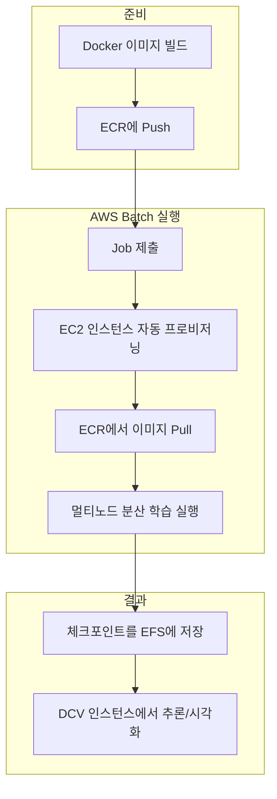
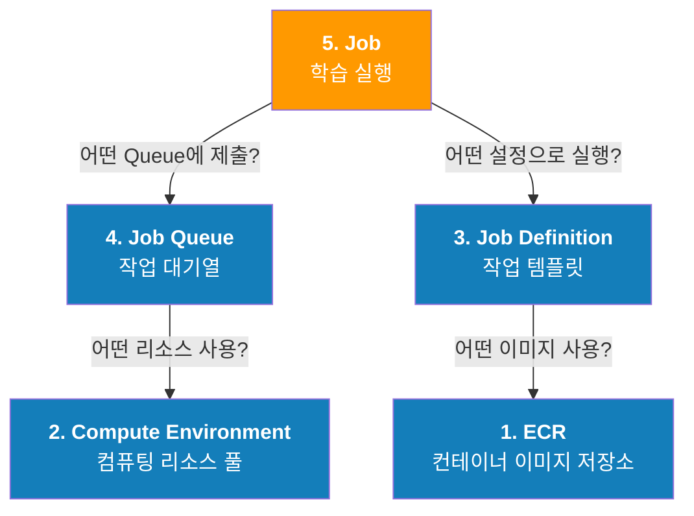
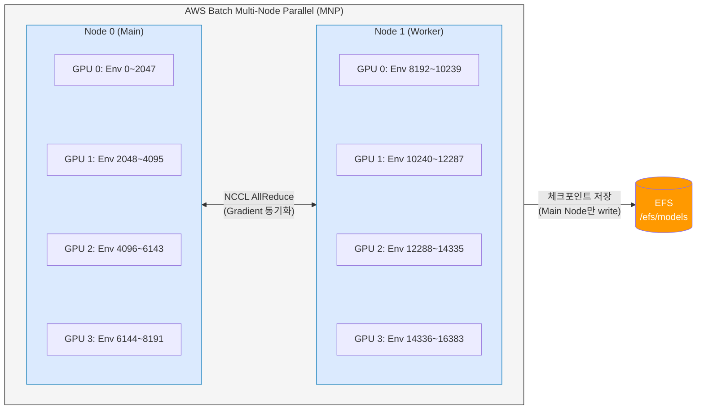

# 3. AWS Batch를 활용한 대규모 학습

AWS Batch는 AWS 클라우드에서 워크로드의 양과 규모에 따라 컴퓨팅 리소스를 자동으로 프로비저닝하고 워크로드 분산을 최적화합니다. 모든 규모의 학습 작업을 실행할 수 있도록 지원합니다.

학습을 가속화하기 위해 4개의 GPU가 장착된 두 개의 노드에서 Isaac Lab의 RL을 실행합니다.

## 3.1 전체 파이프라인 흐름

아래 다이어그램은 이 챕터에서 수행하는 전체 워크플로우를 보여줍니다. Docker 이미지를 ECR에 업로드하고, AWS Batch가 해당 이미지를 가져와 멀티노드 학습을 실행하며, 학습 결과는 EFS에 저장되어 DCV 인스턴스에서 바로 확인할 수 있습니다.



## 3.2 AWS Batch 구성요소 관계

AWS Batch는 4개의 핵심 구성요소로 이루어져 있으며, **아래에서 위로** 순서대로 생성해야 합니다. 각 구성요소가 하위 구성요소를 참조하기 때문입니다.



> **왜 이렇게 분리되어 있나요?**
> - **Compute Environment**: 인프라 관리자가 "어떤 하드웨어를 쓸지"를 한 번 정의하면 여러 팀이 재사용
> - **Job Definition**: "어떤 작업을 어떻게 실행할지"를 템플릿으로 저장. 동일 작업을 파라미터만 바꿔 반복 실행 가능
> - **Job Queue**: 우선순위 기반으로 여러 작업을 스케줄링. 급한 작업을 먼저 실행하도록 제어
> - **Job**: 실제 실행. 위 3개를 조합해서 "지금 실행"하는 행위

---

## 3.3 왜 분산 학습이 필요한가?

단일 GPU에서 2048개의 병렬 환경으로 H1 로봇을 학습하면 72,000 iteration에 약 3시간이 소요됩니다. 그러나 더 복잡한 태스크나 더 많은 환경 수가 필요한 경우, 단일 노드의 GPU 메모리와 연산 능력이 한계에 도달합니다.

**분산 학습의 이점:**
* **GPU 메모리 확장** — 환경을 여러 GPU에 분산하여 더 많은 환경을 동시 실행 (예: 2노드 × 4GPU = 8GPU에서 16,384 환경)
* **학습 시간 단축** — 더 많은 경험 데이터를 동시에 수집하여 iteration당 소요 시간 감소
* **더 큰 배치 사이즈** — PPO 알고리즘에서 배치 크기가 클수록 정책 업데이트가 안정적

## 3.4 분산 학습 아키텍처



**NCCL (NVIDIA Collective Communications Library):**
노드 간 GPU 텐서 통신을 담당합니다. 각 GPU가 독립적으로 시뮬레이션과 순전파를 수행한 뒤, NCCL의 AllReduce 연산으로 그래디언트를 집계합니다. `NCCL_SOCKET_IFNAME=eth0` 환경변수는 노드 간 통신에 사용할 네트워크 인터페이스를 지정합니다.

**PyTorch Distributed (`torch.distributed.run`):**
Isaac Lab의 `distributed_run.bash` 스크립트는 내부적으로 `torchrun`을 사용하여 각 노드에서 GPU 수만큼의 프로세스를 생성합니다. AWS Batch MNP가 제공하는 `AWS_BATCH_JOB_MAIN_NODE_INDEX`와 `AWS_BATCH_JOB_NODE_INDEX` 환경변수를 활용해 메인 노드 주소와 각 노드의 역할을 자동으로 설정합니다.

***

## 3.5 ECR - Docker 이미지 저장

학습 수행을 위해 설정한 Dockerfile을 [ECR(Elastic Container Registry)](https://docs.aws.amazon.com/ko_kr/AmazonECR/latest/userguide/what-is-ecr.html)에 푸시합니다. 이를 통해 AWS Batch 작업 실행 시 여러 노드가 중앙 저장소에서 동일한 컨테이너 이미지를 가져와 일관된 환경에서 학습을 진행할 수 있습니다.

AWS 콘솔에서 AWS ECR 에 들어와 **`isaaclab-batch`** - **View push commands** 를 선택해, ECR에 푸시하기 위한 명령어를 확인합니다.

<figure><figcaption></figcaption></figure>

인스턴스의 터미널 창에서 아래와 같은 명령어를 입력하여 ECR에 로그인 합니다. 아래 커맨드는 예시로, 실제로는 콘솔에서 보여지는 커맨드를 복사하여 입력해야 합니다.

```bash
# 인증 토큰을 가져와 Docker 클라이언트를 ECR 레지스트리에 인증
aws ecr get-login-password --region us-east-1 | docker login --username AWS --password-stdin <AWS Account ID>.dkr.ecr.us-east-1.amazonaws.com

# Docker 이미지 빌드 (이미지가 이미 빌드된 경우 이 단계 skip)
docker build -t isaaclab-batch .

# 빌드가 완료되면 해당 이미지에 태그
docker tag isaaclab-batch:latest <AWS Account ID>.dkr.ecr.us-east-1.amazonaws.com/isaaclab-batch:latest 

# 이 이미지를 ECR 레포지토리에 푸시
docker push <AWS Account ID>.dkr.ecr.us-east-1.amazonaws.com/isaaclab-batch:latest
```

<figure><figcaption></figcaption></figure>

***

## 3.6 CDK가 생성한 Batch 리소스 확인

CDK 스택 배포 시 Batch Compute Environment에서 참조할 리소스들이 자동 생성됩니다. AWS CloudFormation 콘솔에서 배포된 스택의 **Outputs** 탭을 열면 아래 값들을 확인할 수 있습니다.

| Output Key | 설명 |
| --- | --- |
| `BatchLaunchTemplateId` | Batch EC2 Launch Template ID |
| `BatchInstanceProfileArn` | Batch EC2 Instance Profile ARN |
| `BatchSecurityGroupId` | Batch 전용 Security Group ID |
| `PrivateSubnetId` | Batch 노드가 배치될 Private Subnet ID |
| `EfsFileSystemId` | 학습 결과 저장용 EFS File System ID |

### Launch Template 구성 내용

CDK가 생성한 Launch Template은 다음 두 가지만 정의합니다:

| 항목 | 값 | 설명 |
| --- | --- | --- |
| AMI | ECS Optimized GPU AMI (Amazon Linux 2) | NVIDIA GPU 드라이버, ECS Agent, Docker가 사전 설치된 AWS 관리형 AMI |
| EBS | 250GB gp3, 암호화, 종료 시 삭제 | Isaac Sim 컨테이너 이미지(~50GB)와 학습 중 임시 데이터를 위한 충분한 디스크 |

UserData, IAM, Security Group, Subnet 등 나머지 설정은 Launch Template에 포함되지 않으며, Compute Environment 생성 시 별도로 지정합니다.

### Instance Profile에 포함된 IAM 권한

| 관리형 정책 | 용도 |
| --- | --- |
| `AmazonS3ReadOnlyAccess` | S3에서 데이터셋/모델 다운로드 |
| `AmazonEC2ContainerServiceforEC2Role` | ECS Agent가 ECR 이미지 풀, CloudWatch 로그 전송 |
| `AmazonElasticFileSystemFullAccess` | EFS 마운트 및 읽기/쓰기 |
| `AmazonSSMManagedInstanceCore` | SSM을 통한 인스턴스 접속 (디버깅용) |

### Batch Security Group 규칙

| 방향 | 프로토콜 | 소스/대상 | 용도 |
| --- | --- | --- | --- |
| Inbound | 전체 (자기 참조) | Batch SG 자신 | 노드 간 NCCL 통신, PyTorch distributed rendezvous |
| Outbound | 전체 | 0.0.0.0/0 | ECR 이미지 풀, NAT 경유 인터넷 접근 |

또한 EFS Security Group에 Batch SG를 소스로 하는 NFS(TCP 2049) 인그레스 규칙이 자동 추가되어, Batch 노드에서 EFS에 접근할 수 있습니다.

***

## 3.7 Compute Environment 생성

AWS Batch의 Compute Environment는 작업이 실행되는 컴퓨팅 리소스 모음입니다. 작업이 제출되면 Batch가 자동으로 필요한 EC2 인스턴스를 프로비저닝하고, 작업 완료 후 리소스를 해제하여 비용을 최적화합니다.

AWS Batch는 두 가지 유형의 컴퓨팅 환경을 지원합니다:

* **관리형(Managed)**: AWS가 인스턴스 프로비저닝, 스케일링, 종료를 자동 관리. 이 워크숍에서 사용
* **비관리형(Unmanaged)**: 고객이 직접 EC2 인스턴스를 관리. 특수한 AMI나 설정이 필요한 경우 사용

<figure><figcaption></figcaption></figure>

1. AWS Console에서 **AWS Batch** 선택
2. 왼쪽 탐색 창에서 **Ènvironment** 을 선택하고, 오른쪽 상단에서 **Create environment** - **Compute environment** 선택
3. 컴퓨팅 환경 구성에서 **Amazon Elastic Compute Cloud(EC2)** 선택

| 설정 | 값 | 이유 |
| --- | --- | --- |
| Orchestration type | `Managed` | AWS가 인스턴스 수명주기(생성/스케일링/종료)를 자동 관리하여 운영 부담 최소화 |
| Name | `IsaacLabComputeResource` | 컴퓨팅 환경 식별자 |
| Instance role | CDK Stack Output `BatchInstanceProfileArn` 값 참조 | CDK가 생성한 Instance Profile. S3 읽기, ECS 컨테이너 서비스, EFS 전체 접근, SSM 권한 포함 |

### 3.7.1 Instance configuration

분산 학습에 적합한 GPU 인스턴스 타입과 Launch Template을 지정합니다.

<figure><figcaption></figcaption></figure>

| 설정 | 값 | 이유 |
| --- | --- | --- |
| Allowed instance types | `g6.12xlarge` | NVIDIA L4 GPU 4개 탑재, 48 vCPU, 192GB RAM. 멀티 GPU 분산 학습에 필요한 GPU 수와 충분한 CPU/메모리를 제공하면서 비용 효율적 |
| Launch templates | CDK Stack Output `BatchLaunchTemplateId` 값 참조 | CDK가 생성한 템플릿. ECS Optimized AMI(NVIDIA 드라이버 포함)와 250GB gp3 암호화 EBS 볼륨을 설정 |

### 3.7.2 Network configuration

Batch 노드가 EFS에 접근하고, 노드 간 NCCL 통신이 가능하도록 네트워크를 설정합니다.

<figure><figcaption></figcaption></figure>

| 설정 | 값 | 이유 |
| --- | --- | --- |
| VPC ID | CDK가 생성한 VPC (Name 태그: `{prefix}-VPC`) | DCV 인스턴스, EFS와 동일 네트워크에 위치해야 EFS 접근 가능 |
| Subnets | CDK Stack Output `PrivateSubnetId` 값 참조 | Private Subnet에 배치하여 인터넷에서 직접 접근 불가. NAT Gateway를 통해 ECR 이미지 풀 수행 |
| Security groups | CDK Stack Output `BatchSecurityGroupId` 값 참조 | Batch 전용 SG. 노드 간 자기참조 인그레스(NCCL 통신)와 EFS NFS(2049) 접근 규칙이 설정됨 |

**Create compute environment** 를 선택하여 생성을 완료합니다.

***

## 3.8 Job Definition 생성

Job Definition은 작업의 실행 스펙을 미리 정의해둔 템플릿입니다. 어떤 Docker 이미지를 사용할지, CPU/GPU/메모리를 얼마나 할당할지, 어떤 명령을 실행할지를 한 곳에 모아 관리합니다. 한 번 만들어두면 동일한 설정으로 반복 실행하거나, 환경변수만 바꿔서 다른 태스크를 학습할 수 있습니다.

1. **Job definitions** 선택 - **Create** 버튼
2. **Job과 오케스트레이션 타입 설정**

<figure><figcaption></figcaption></figure>

| 설정 | 값 | 이유 |
| --- | --- | --- |
| Orchestration type | EC2 | GPU 인스턴스를 직접 사용. Fargate는 GPU를 지원하지 않음 |
| Job type | `multi-node parallel` | 여러 노드에 걸쳐 분산 학습을 수행하기 위해 MNP(Multi-Node Parallel) 모드 필요. 단일 노드면 `single` 선택 |

3. **Job definition 설정**

<figure><figcaption></figcaption></figure>

| 설정 | 값 | 이유 |
| --- | --- | --- |
| Name | `IsaacLabJobDefinition` | Job Definition 식별자 |
| Execution timeout | `3600` (초 = 1시간) | 워크숍에서는 100 iteration으로 약 12분 소요. 1시간이면 충분한 여유를 두면서도 무한 실행 방지 |
| Number of nodes | `2` | 노드 2개 × GPU 4개 = 총 8 GPU. 분산 학습 효과를 확인하면서도 리소스 비용을 적정하게 유지 |
| Instance type | `g6.12xlarge` | Compute Environment에서 허용한 인스턴스와 동일. 노드 간 동일 하드웨어로 학습 속도 균일화 |

### 3.8.1 Storage

멀티노드 환경에서 학습 결과물(체크포인트, 로그)을 영구 저장하고 노드 간 공유하기 위해 EFS 볼륨을 연결합니다. 컨테이너는 종료되면 내부 데이터가 사라지므로, EFS를 마운트하지 않으면 학습 결과를 잃게 됩니다.

| 설정 | 값 | 이유 |
| --- | --- | --- |
| Volumes - Name | `efs` | Mount points에서 참조할 볼륨 이름. 임의 지정 가능하나 용도를 명확히 표현 |
| Volumes - Filesystem ID | `fs-xxxxxxxx` | CDK가 생성한 EFS 파일시스템 ID (EFS 콘솔에서 확인). DCV 인스턴스와 동일한 EFS를 공유하여 학습 결과를 바로 추론에 활용 |
| Volumes - Root directory | `/` | EFS 루트를 마운트. 컨테이너 내부에서 하위 경로를 자유롭게 구성 가능 |

<figure><figcaption></figcaption></figure>

### 3.8.2 Container properties

각 노드에서 실행될 컨테이너의 리소스 할당량과 실행 명령을 정의합니다. GPU 기반 물리 시뮬레이션은 CPU, 메모리, GPU를 모두 많이 사용하므로, 인스턴스 스펙에 맞게 충분히 할당해야 합니다.

| 설정 | 값 | 이유 |
| --- | --- | --- |
| Image | isaaclab-batch ECR 이미지 | Step 1에서 ECR에 푸시한 이미지. Isaac Sim + Isaac Lab + 학습 스크립트가 포함 |
| vCPUs | `16` | g6.12xlarge의 48 vCPU 중 노드당 컨테이너에 할당할 CPU 수. 물리 시뮬레이션의 데이터 전처리와 환경 리셋에 사용 |
| Memory | `60000` (MB ≈ 60GB) | GPU 텐서 공유를 위한 shared memory와 PyTorch DataLoader 버퍼를 위해 충분한 메모리 확보 |
| GPU | `4` | g6.12xlarge에 탑재된 L4 GPU 4개를 모두 할당. 각 GPU가 독립적으로 환경을 시뮬레이션 |
| Command | `["./distributed_run.bash"]` | Isaac Lab의 분산 학습 진입점. 내부적으로 `torchrun`을 호출하여 GPU 수만큼 프로세스 생성 |

### 3.8.3 EFS에 학습 결과 저장하기

멀티노드 분산학습 시, 학습된 모델(.pt 파일)을 EFS에 공유 저장하려면 Command를 아래와 같이 설정합니다. 이렇게 하면 학습 완료 후 DCV 인스턴스에서 별도 파일 복사 없이 바로 추론에 활용할 수 있습니다.

```json
[
  "/bin/bash", "-c",
  "mkdir -p /efs/models \
  && mkdir -p /workspace/IsaacLab/logs \
  && ln -sf /efs/models /workspace/IsaacLab/logs/skrl \
  && cd /workspace/IsaacLab \
  && ./distributed_run.bash"
]
```

| 순서 | 명령 | 목적 |
| --- | --- | --- |
| 1 | `mkdir -p /efs/models` | EFS에 모델 저장 디렉토리 생성 |
| 2 | `mkdir -p /workspace/IsaacLab/logs` | 컨테이너 내부에 로그 디렉토리 생성 |
| 3 | `ln -sf /efs/models .../logs/skrl` | skrl 체크포인트 경로를 EFS로 심볼릭 링크. 코드 수정 없이 저장 위치 변경 |
| 4 | `./distributed_run.bash` | 분산 학습 스크립트 실행 |

### 3.8.4 Environment variables

컨테이너 실행 시 주입되는 환경변수입니다. 분산 학습에서 각 노드가 동일한 태스크와 통신 설정을 공유해야 하므로, Job Definition 수준에서 환경변수로 일괄 지정합니다.

| Environment variable | Value                      | Description                                                                                                                                    |
| -------------------- | -------------------------- | ---------------------------------------------------------------------------------------------------------------------------------------------- |
| TASK                 | Isaac-Velocity-Rough-H1-v0 | 학습할 Isaac Lab 태스크. H1 로봇의 거친 지형 보행 학습                                                                                                                |
| NCCL\_SOCKET\_IFNAME | eth0                       | NCCL이 노드 간 GPU 텐서 통신에 사용할 네트워크 인터페이스. eth0은 Batch MNP가 자동 구성하는 ENI                                                                                                  |
| ACCEPT\_EULA         | Y                          | [NVIDIA Omniverse License Agreement ](https://docs.omniverse.nvidia.com/isaacsim/latest/common/NVIDIA_Omniverse_License_Agreement.html)라이센스 동의 |
| PRIVACY\_CONSENT     | Y                          | 데이터 수집 동의 ([Omniverse Data Collection & Use FAQ](https://docs.omniverse.nvidia.com/utilities/latest/common/data-collection.html))              |
| PROC\_PER\_NODE      | 4                          | 노드당 프로세스 수 = GPU 수. g6.12xlarge는 L4 GPU 4개 탑재. 각 프로세스가 하나의 GPU를 점유하여 독립적으로 환경을 시뮬레이션                                                                                                                               |
| MAX\_ITERATIONS      | 100                        | 학습 반복 횟수. 워크숍에서는 시간 단축을 위해 100으로 설정. 실제 production 학습은 72,000+ iteration 필요                                                                                                                             |

### 3.8.5 Linux parameters

Docker 컨테이너의 리눅스 커널 수준 설정입니다. GPU 기반 물리 시뮬레이션은 프로세스 간 대용량 데이터를 공유 메모리(`/dev/shm`)로 주고받기 때문에, Docker 기본값(64MB)으로는 부족합니다.

| 설정 | 값 | 이유 |
| --- | --- | --- |
| Shared memory size | `60000` (MB ≈ 60GB) | Isaac Sim은 GPU↔CPU 간 대용량 물리 시뮬레이션 데이터를 `/dev/shm`을 통해 전달. Docker 기본값 64MB로는 OOM 발생. PyTorch의 DataLoader 멀티프로세스 통신에도 사용 |

<figure><figcaption></figcaption></figure>

### 3.8.6 Mount points configuration

위에서 정의한 EFS 볼륨을 컨테이너 내부의 어떤 경로에 연결할지 지정합니다. 이 설정으로 컨테이너 안에서 `/efs` 경로를 통해 EFS 파일시스템에 읽기/쓰기할 수 있게 됩니다.

| 설정 | 값 | 이유 |
| --- | --- | --- |
| Source volume | `efs` | 위에서 정의한 EFS 볼륨 이름을 참조 |
| Container path | `/efs` | 컨테이너 내부에서 EFS에 접근하는 경로. Command에서 `/efs/models`로 체크포인트를 저장하므로 이 경로와 일치해야 함 |

***

## 3.9 Job Queue 생성

Job이 제출되면 Queue에서 대기하다가, 연결된 Compute Environment에 리소스가 확보되면 실행됩니다. 여러 개의 Queue를 만들어 우선순위를 다르게 설정할 수 있습니다. 예를 들어, 긴급 학습용 Queue(우선순위 높음)와 실험용 Queue(우선순위 낮음)를 분리하면 중요한 작업이 먼저 리소스를 할당받습니다.

1. **Job queues** 선택 - **Create** 선택

| 설정 | 값 | 이유 |
| --- | --- | --- |
| Orchestration type | EC2 | GPU 사용을 위해 EC2 기반. Job Definition과 동일한 오케스트레이션 타입이어야 함 |
| Name | `IsaacLabJobQueue` | Job Queue 식별자 |
| Connected compute environments | `IsaacLabComputeResource` | 위에서 생성한 Compute Environment를 연결. Queue에 제출된 Job이 이 환경의 리소스를 사용 |

<figure><figcaption></figcaption></figure>

***

## 3.10 Job 시작

Job Queue를 생성한 후에는 Queue에 Job을 제출할 수 있습니다.

Isaac Lab 강화 학습을 위한 멀티 노드 및 멀티 GPU Job을 생성하고, AWS Batch의 Job Queue 에 제출합니다. Job definitions에 지정된 여러 매개변수를 런타임에 재정의할 수 있습니다.

1. **Job** 선택 - **Submit new job** 선택

| 설정 | 값 | 이유 |
| --- | --- | --- |
| Name | `IsaacLab-HumanoidJob` | 실행할 Job 이름. CloudWatch 로그에서 식별 용도 |
| Job definition | `IsaacLabJobDefinition` | 위에서 생성한 Job Definition 선택. 컨테이너 이미지, 리소스, 환경변수 설정을 참조 |
| Job queue | `IsaacLabJobQueue` | 위에서 생성한 Job Queue 선택. 연결된 Compute Environment의 리소스를 할당받아 실행 |

<figure><figcaption></figcaption></figure>

2. Running 상태가 되면 Nodes 탭에서 2개의 EC2 노드를 확인할 수 있습니다.

<figure><figcaption></figcaption></figure>

3. Log stream을 선택해서 CloudWatch Log Group에 기록되는 학습 매트릭 정보를 확인할 수 있습니다.

<figure><figcaption></figcaption></figure>


Job이 시작되면 사용 중인 2개 노드의 8개 GPU에서 완료하는 데 약 12분이 소요됩니다. 다만, GPU 할당이 되지 않아 Job 시작이 늦어질 수 있습니다.

