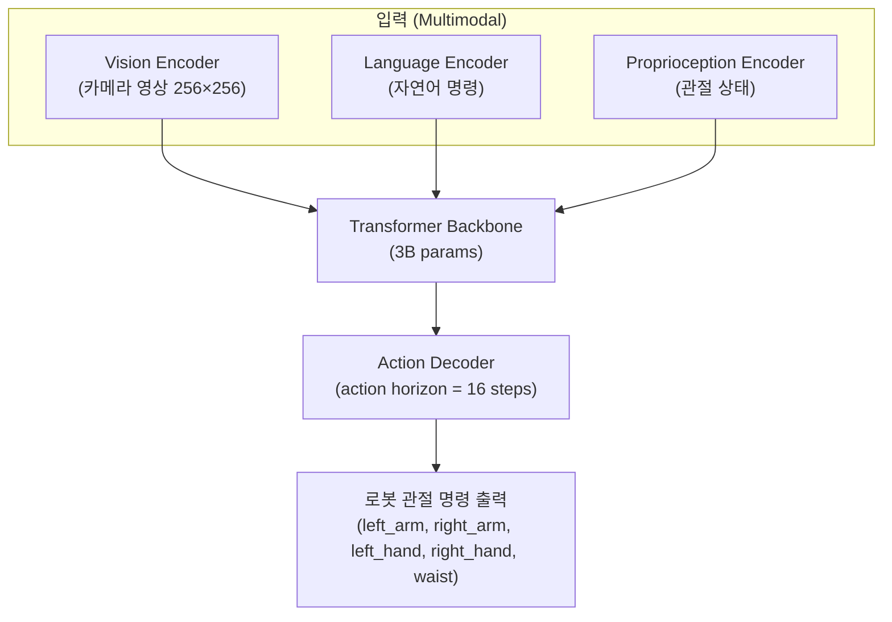
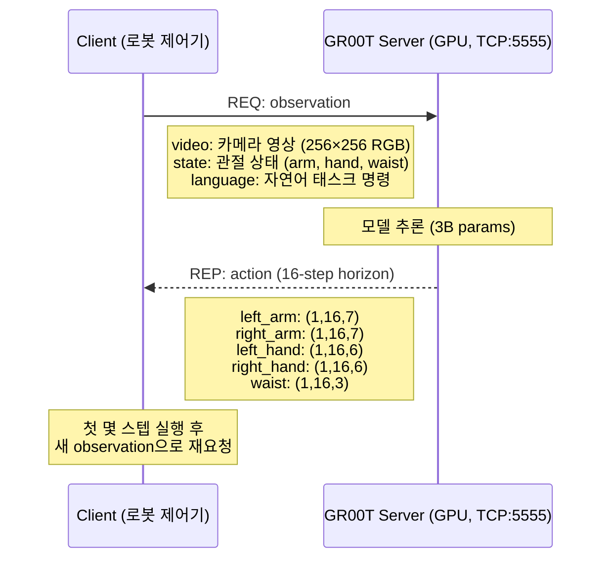
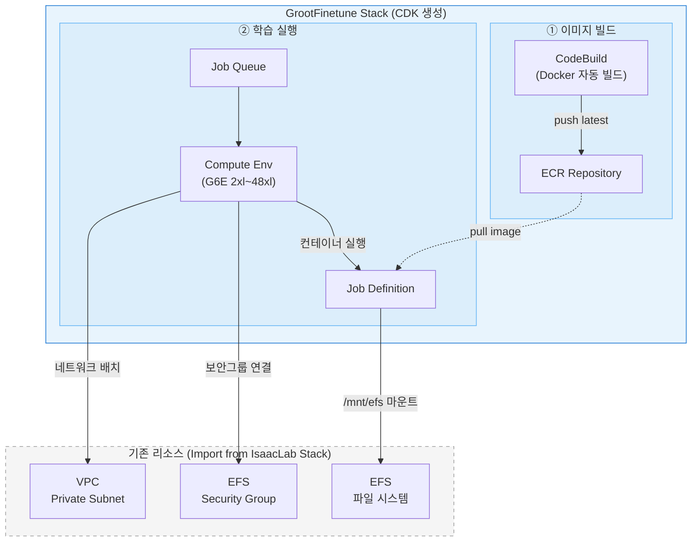
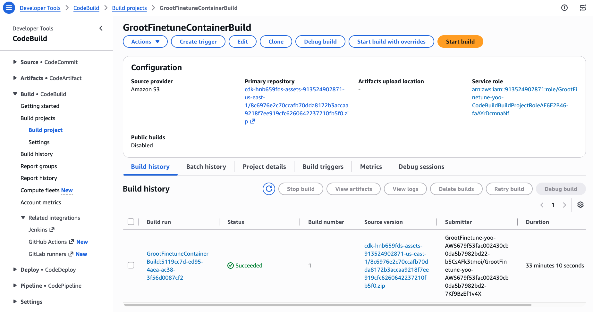
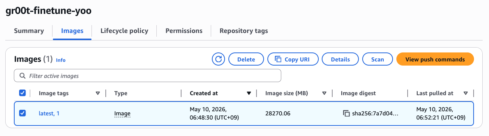

# 5. VLA Fine-tuning 인프라 배포

## 5.1 GR00T N1 개요

[NVIDIA GR00T N1](https://developer.nvidia.com/gr00t)은 범용 휴머노이드 로봇을 위한 **Vision-Language-Action (VLA) 모델**입니다. 이전 모듈에서 학습한 강화학습 기반 Policy(PPO)가 특정 태스크에 특화된 제어기라면, GR00T N1은 자연어 명령과 카메라 영상을 입력으로 받아 로봇 관절 명령을 직접 생성하는 **Foundation Model**입니다.

**GR00T N1 아키텍처:**



**추론 서버 구조 (ZMQ REQ/REP):**



모델은 한 번의 추론으로 **16 스텝의 미래 액션**(action horizon)을 출력합니다. 로봇 제어기는 이 중 첫 몇 스텝만 실행하고, 새로운 관측 데이터로 다시 추론을 요청하는 방식(receding horizon)으로 동작합니다.

***

## 5.2 infra-groot-finetune CDK 배포

GR00T Fine-tuning에 사용할 컨테이너 이미지를 빌드하고 AWS Batch 인프라를 구성합니다. 이 이미지에는 Isaac-GR00T SDK, PyTorch, Flash Attention 등이 포함되어 있으며, 추론 테스트에도 사용합니다.

### 5.2.0 사전 조건

- [모듈 1](1.-infra-setup.md)~[2](2.-isaac-lab.md)가 완료된 상태 (IsaacLab Stack 배포 완료)
- AWS CLI 설치 및 인증 완료
- Node.js 18+ 설치
- CDK CLI 설치 (`npm install -g aws-cdk`)
- (N1.7 사용 시) **HuggingFace Access Token** 준비 ([발급 페이지](https://huggingface.co/settings/tokens))
    - [nvidia/Cosmos-Reason2-2B](https://huggingface.co/nvidia/Cosmos-Reason2-2B) 모델 라이선스 동의 (GR00T N1.7 backbone)

### 5.2.1 CDK 배포 (~5분)

[모듈 1](1.-infra-setup.md)과 동일하게 **AWS CloudShell**에서 실행합니다. CloudShell은 AWS 자격증명이 자동 주입되고 CDK CLI/Node.js가 미리 설치되어 있어 별도 환경 구성 없이 바로 배포할 수 있습니다.

```bash
source ~/aws-physical-ai-recipes/isaac-lab-workshop/infra-multiuser-groot/scripts/setup-cloudshell.sh

cd aws-physical-ai-recipes/isaac-lab-workshop/infra-groot-finetune
npm install
```

배포 명령 — `userId`만 지정하면 나머지 파라미터는 부모 스택에서 자동 조회됩니다:

```bash
# 1. 부모 스택(IsaacLab-Stable/Latest-<userId>)에서 파라미터 자동 조회
npx ts-node bin/resolve-parent-stack.ts <userId>

# 2. 배포 (기본값: N1.6)
npx cdk deploy --require-approval never > deploy.log 2>&1 &

# N1.7로 배포하려면:
npx cdk deploy -c grootVersion=n1.7
```

| 파라미터 | 기본값 | 설명 |
| --- | --- | --- |
| `grootVersion` | `n1.6` | GR00T 모델 버전 (`n1.6` 또는 `n1.7`) |
| `useStableGroot` | `true` | 검증된 릴리스 커밋 사용 여부 |

`resolve-parent-stack.ts`가 부모 스택의 Outputs에서 VPC, EFS, Subnet, 리전 정보를 조회하여 `cdk.context.json`에 저장합니다.

**정상 출력:**

```
 ✅  GrootFinetune-<userId>

Outputs:
GrootFinetune-<userId>.EcrRepositoryUri = 123456789012.dkr.ecr.us-east-1.amazonaws.com/gr00t-finetune-<userId>
GrootFinetune-<userId>.JobQueueName = GrootFinetune-<userId>-GrootFinetuneQueue
GrootFinetune-<userId>.JobDefinitionName = GrootFinetune-<userId>-GrootFinetuneJob
```

<details>
<summary>파라미터를 수동으로 지정하는 방법 (선택)</summary>

```bash
CDK_DEFAULT_REGION=us-east-1 npx cdk deploy \
  -c vpcId=<VpcId> \
  -c efsFileSystemId=<EfsFileSystemId> \
  -c efsSecurityGroupId=<EfsSecurityGroupId> \
  -c privateSubnetId=<PrivateSubnetId> \
  -c availabilityZone=us-east-1a \
  -c userId=<userId> \
  -c useStableGroot=true \
  -c grootVersion=n1.6
```

</details>

<details>
<summary><strong>CDK가 생성하는 리소스</strong></summary>



</details>

### 5.2.2 컨테이너 이미지 빌드 확인 (~30분)

CDK 배포와 동시에 CodeBuild가 GR00T 컨테이너 이미지를 자동으로 빌드합니다. 약 15GB 크기의 이미지를 생성하므로 25~35분이 소요됩니다.

<details>
<summary><strong>수동으로 CodeBuild 재빌드 (버전 변경 시)</strong></summary>

`grootVersion`을 변경한 후 재배포(`npx cdk deploy`)하면 CodeBuild가 자동으로 다시 트리거됩니다. 수동으로 재빌드만 하려면:

```bash
aws codebuild start-build \
    --region $REGION \
    --project-name GrootFinetuneContainerBuild \
    --environment-variables-override "name=GROOT_VERSION,value=n1.6,type=PLAINTEXT"
```

</details>

<details>
<summary><strong>CLI로 빌드 상태 확인</strong></summary>

```bash
aws codebuild list-builds-for-project \
  --project-name GrootFinetuneContainerBuild \
  --region us-east-1 \
  --query "ids[0]" --output text | \
xargs -I{} aws codebuild batch-get-builds --ids {} \
  --region us-east-1 \
  --query "builds[0].{Status:buildStatus,Phase:currentPhase}" \
  --output table
```

</details>

빌드가 완료되면 콘솔의 CodeBuild 에서 아래와 같이 확인할 수 있습니다.



빌드가 완료되면 모듈 4에서 사용했던 **DCV 인스턴스**에 접속하여, ECR에서 이미지를 Pull합니다:



```bash
# ECR 로그인
aws ecr get-login-password --region $REGION | \
  docker login --username AWS --password-stdin $ACCOUNT_ID.dkr.ecr.$REGION.amazonaws.com

# GR00T 이미지 Pull (~15GB, 약 5분)
USER_ID=<userId>
ECR_URI=$ACCOUNT_ID.dkr.ecr.$REGION.amazonaws.com/gr00t-finetune-$USER_ID:latest
docker pull $ECR_URI
```

Pull 완료 확인:

```bash
docker images | grep gr00t-finetune
```


CodeBuild 빌드가 완료될 때까지 (~30분) 아래 5.3의 추론 테스트는 진행할 수 없습니다.


***

## 5.3 추론 서버 실행

ECR에서 Pull한 이미지로 GR00T **base 모델**의 추론 서버를 실행합니다. 인스턴스에는 모듈 1에서 자동 구성된 `groot-inference.service`가 GPU와 5555 포트를 점유하고 있으므로, 새 컨테이너를 띄우기 전에 **먼저 기존 서비스를 중지**합니다.

```bash
# 기존 GR00T 추론 서비스 중지 (GPU 해제)
sudo systemctl stop groot-inference.service
docker rm -f groot-inference 2>/dev/null
docker rm -f groot-policy-server 2>/dev/null
```

EFS에 이미 받아져 있는 N1.6 체크포인트를 직접 로딩합니다. HF_TOKEN이 불필요하며 다운로드 대기 시간이 없습니다.

```bash
CHECKPOINT=/home/ubuntu/environment/efs/GR00T-N1.6-3B

docker run -d --gpus all --name groot-policy-server \
  --shm-size=8g --network host \
  --entrypoint /bin/sh \
  -e PYTHONUNBUFFERED=1 \
  -v /home/ubuntu/environment/efs:/mnt/efs \
  $ECR_URI \
  -c 'cd /workspace/gr00t-repo&& python3 -m gr00t.eval.run_gr00t_server \
    --model-path /mnt/efs/GR00T-N1.6-3B \
    --embodiment-tag GR1 \
    --host 0.0.0.0 \
    --port 5555'
```

**주요 파라미터:**

| 파라미터 | 설명 |
| --- | --- |
| `--entrypoint /bin/sh` | 이미지 기본 ENTRYPOINT를 override하여 쉘 명령 실행 |
| `--model-path` | EFS의 모델 체크포인트 경로 |
| `--embodiment-tag` | 로봇 관절 구성 식별자 |
| `--shm-size=8g` | 공유 메모리 확장 (DataLoader 충돌 방지) |
| `--network host` | 호스트 네트워크 공유 (5555 포트 직접 노출) |
| `-v .../efs:/mnt/efs` | EFS 모델 가중치를 컨테이너에 마운트 |
| `--host 0.0.0.0` | 모든 네트워크 인터페이스에서 접속 허용 |
| `--port 5555` | ZMQ REP 소켓 포트 |
| `-e PYTHONUNBUFFERED=1` | Python 출력 버퍼링 비활성화 — `docker logs`에서 로그가 즉시 표시됨 |

<details>
<summary><strong>GR00T N1.7을 HuggingFace에서 다운로드하여 실행하는 방법</strong></summary>

최신 N1.7 base 모델을 HuggingFace에서 자동 다운로드하여 실행합니다.

```bash
HF_TOKEN=<your-huggingface-token>

docker run -d --gpus all --name groot-policy-server \
  --shm-size=8g --network host \
  --entrypoint /bin/sh \
  -e PYTHONUNBUFFERED=1 \
  -e HF_TOKEN=$HF_TOKEN \
  $ECR_URI \
  -c 'cd /workspace/gr00t-repo && python3 -m gr00t.eval.run_gr00t_server \
    --model-path nvidia/GR00T-N1.7-3B \
    --embodiment-tag OXE_DROID_RELATIVE_EEF_RELATIVE_JOINT \
    --host 0.0.0.0 \
    --port 5555'
```


**HF_TOKEN 필수**: GR00T N1.7은 [nvidia/Cosmos-Reason2-2B](https://huggingface.co/nvidia/Cosmos-Reason2-2B) backbone을 사용하며, 이 모델은 HuggingFace gated model입니다. [모델 페이지](https://huggingface.co/nvidia/Cosmos-Reason2-2B)에서 라이선스에 동의하고, [Access Token](https://huggingface.co/settings/tokens)을 발급받아 사용합니다.


</details>

### 서버 준비 확인

모델 로딩에 약 1~2분이 소요됩니다. 로그에서 "Server ready" 메시지를 확인합니다:

```bash
# 로그 확인 (Ctrl+C로 종료, 서버는 계속 실행)
docker logs -f groot-policy-server
```

정상 출력:

```
Starting GR00T inference server...
  Embodiment tag: EmbodimentTag.NEW_EMBODIMENT
  Model path: nvidia/GR00T-N1.7-3B
  Device: cuda
  Host: 0.0.0.0
  Port: 5555
Loading checkpoint shards: 100%|██████████| 3/3 [00:03<00:00,  1.01s/it]

✓ Server ready — listening on tcp://0.0.0.0:5555
```

```bash
# 포트 리스닝 확인
ss -tlnp | grep 5555
```

***

## 5.4 추론 테스트

Policy Server가 정상 동작하는지 확인합니다. ECR 이미지에 모든 의존성이 포함되어 있으므로 **동일 이미지로 테스트 컨테이너**를 띄워 검증합니다.

### 5.4.1 Ping 테스트 (연결 확인)

서버가 정상적으로 응답하는지 간단히 확인합니다.

```bash
# ECR 이미지로 테스트용 컨테이너 실행 (호스트 네트워크 공유)
docker run --rm --network=host $ECR_URI -c '                                    
python3 -c "                                                                    
import zmq, msgpack                                                             
ctx = zmq.Context()                                                             
sock = ctx.socket(zmq.REQ)                                                      
sock.connect(\"tcp://localhost:5555\")                                          
sock.send(msgpack.packb({\"endpoint\": \"ping\"}))                              
print(\"Server response:\", msgpack.unpackb(sock.recv(), raw=False))            
"'
```

**정상 출력:**

```
Server response: {'status': 'ok', 'message': 'Server is running'}
```

### 5.4.2 공식 PolicyClient로 테스트

ECR 이미지 내부에서 Isaac-GR00T의 공식 클라이언트를 사용하여 테스트합니다.

```bash

docker run --rm --network=host $ECR_URI -c '                                    
python3 -c "                                                                    
from gr00t.policy.server_client import PolicyClient                             
policy = PolicyClient(host=\"localhost\", port=5555)                            
if policy.ping():                                                               
    print(\"GR00T 서버 연결 성공\")                                             
else:                                                                           
    print(\"서버 응답 없음\")                                                   
"'
```

## 5.5 전체 상태 확인 (Quick Check)

```bash
echo "=== GPU ==="
nvidia-smi --query-gpu=name,memory.used,memory.total --format=csv

echo "=== Docker Images ==="
docker images | grep -E 'groot|isaac'

echo "=== Policy Server ==="
docker ps | grep groot-policy-server

echo "=== Port 5555 ==="
ss -tlnp | grep 5555
```

***

## References

* [NVIDIA Isaac-GR00T GitHub](https://github.com/NVIDIA/Isaac-GR00T)
* [GR00T N1.7 모델 (HuggingFace)](https://huggingface.co/nvidia/GR00T-N1.7-3B)
* [Cosmos-Reason2-2B (backbone)](https://huggingface.co/nvidia/Cosmos-Reason2-2B)
