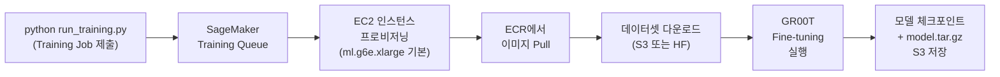
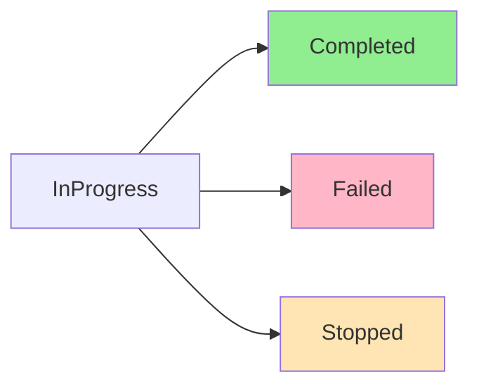

# 6-5. GR00T Fine-tuning on AWS SageMaker

이 모듈에서는 AWS SageMaker를 사용하여 [NVIDIA GR00T N1](https://developer.nvidia.com/gr00t) VLA(Vision-Language-Action) 모델을 fine-tuning합니다. 모듈 6(AWS Batch)과 달리, SageMaker는 **실시간 추론 엔드포인트**로 즉시 배포할 수 있어 로봇 시스템과의 통합이 용이합니다.

SageMaker Training Job을 통해 학습한 모델은 [Model Registry](https://docs.aws.amazon.com/sagemaker/latest/dg/model-registry.html)에 등록되고, 승인된 모델은 [SageMaker Endpoint](https://docs.aws.amazon.com/sagemaker/latest/dg/realtime-endpoints.html)로 배포되어 REST API로 접근할 수 있습니다. 동일한 데이터셋(LightwheelAI/leisaac-pick-orange, SO-101 로봇)으로 Batch 결과와 학습 곡선을 비교 검증할 수 있습니다.

### 모듈 6(Batch) vs 모듈 6-5(SageMaker) 비교

| 항목 | 모듈 6 (AWS Batch) | 모듈 6-5 (SageMaker) |
|------|-------------------|---------------------|
| **운영 환경** | 배치 처리 / 학습 결과만 필요 | 실시간 추론 필요 / 로봇 통합 |
| **비용 모델** | Spot Instance + On-Demand (선택) | On-Demand 또는 Spot (Self-Managed) |
| **자동 스케일링** | Compute Environment의 Batch 자체 관리 | 사용자 수동 설정 또는 비활성화 |
| **데이터 입력 방식** | S3 채널 또는 HF 직접 다운로드 (Job내 정의) | S3 채널 또는 HF 직접 다운로드 (Job내 정의) |
| **모델 저장 위치** | EFS + S3 선택적 | **반드시 S3** (Endpoint 배포용) |
| **학습 후 다음 단계** | DCV 인스턴스에서 수동 확인 | Endpoint 자동 배포 → REST API 호출 |
| **모니터링** | CloudWatch 로그 + Batch Job 상태 | CloudWatch 로그 + SageMaker Endpoint 메트릭 |

| 서비스 | 설명 |
|--------|-----------|
| [Amazon SageMaker Training Job](https://docs.aws.amazon.com/sagemaker/latest/dg/train-model.html) | 클라우드에서 ML 모델을 학습시켜주는 관리형 서비스 (학습 스크립트를 컨테이너에 담아 제출하면 GPU 할당 + 자동 실행) |
| [Amazon SageMaker Model Registry](https://docs.aws.amazon.com/sagemaker/latest/dg/model-registry.html) | 학습된 모델 버전을 저장하고 승인/관리하는 카탈로그  |
| [Amazon SageMaker Endpoint](https://docs.aws.amazon.com/sagemaker/latest/dg/realtime-endpoints.html) | 배포된 모델을 REST API로 24/7 접근 가능하게 서빙하는 관리형 호스팅  |
| [Amazon ECR](https://docs.aws.amazon.com/AmazonECR/latest/userguide/what-is-ecr.html) | Private Docker Hub — 학습/추론 컨테이너 이미지 저장소 |
| [AWS CodeBuild](https://docs.aws.amazon.com/codebuild/latest/userguide/welcome.html) | 클라우드에서 Docker 이미지를 자동으로 빌드해주는 서비스 |
| [Amazon S3](https://docs.aws.amazon.com/s3/latest/userguide/Welcome.html) | 데이터셋, 모델, 체크포인트를 저장하는 객체 스토리지 |


모듈 5에서 `infra-groot-finetune` CDK 배포가 완료된 상태여야 합니다(선택사항). 본 모듈은 독립적으로 실행 가능하며, 모든 리소스를 CloudFormation으로 생성합니다. 아직 배포하지 않았다면 [모듈 5.3](5.-gr00t-n1.md#5.3-infra-groot-finetune-cdk-배포)을 참고하세요.


---

## 6-5.1 사전 요구사항 (~5분)

groot-sagemaker 리포지토리 설정:

```bash
cd training/groot-sagemaker
pip install -r requirements-dev.txt
aws configure   # AWS 자격증명 설정 (또는 환경변수: AWS_ACCESS_KEY_ID, AWS_SECRET_ACCESS_KEY, AWS_DEFAULT_REGION)
```

**필요한 IAM 권한:**
- `sagemaker:CreateTrainingJob`, `sagemaker:DescribeTrainingJob`
- `sagemaker:CreateModel`, `sagemaker:CreateEndpoint`, `sagemaker:InvokeEndpoint`
- `ecr:DescribeRepositories`, `codebuild:StartBuild`, `codebuild:BatchGetBuilds`
- `s3:GetObject`, `s3:PutObject` (학습/모델 아티팩트 버킷)
- `cloudformation:*` (인프라 배포)


**AWS 계정 권한 확인:** `aws sts get-caller-identity`로 현재 계정과 권한을 확인합니다. Admin 또는 PowerUser 권한이 권장되며, 제한된 IAM 역할을 사용하는 경우 위 권한이 모두 포함되었는지 확인하세요.


---

## 6-5.2 AWS 인프라 배포 (~10분)

CloudFormation 스택을 생성하여 필요한 모든 리소스를 프로비저닝합니다.

### 단일 사용자 (기본)

```bash
python infra/deploy_stack.py \
    --bucket-name <전 세계 고유한 S3 버킷 이름> \
    --region us-east-1
```

스택 이름은 기본값 `GrootSMTrainingJob`이 사용됩니다.

### 멀티 사용자 / 동일 계정 충돌 방지 (`--alias`)

같은 AWS 계정에 두 명 이상이 배포하거나 한 사람이 여러 환경(dev/staging)을 분리하려면 `--alias`를 지정합니다. 모든 리소스 이름에 `-<alias>` postfix가 자동으로 붙고, 스택 이름은 `GrootSMTrainingJob-<alias>`가 됩니다.

```bash
export USER_ID=<본인이름>
python infra/deploy_stack.py \
    --alias ${USER_ID} \
    --bucket-name groot-sm-training-${USER_ID} \
    --region us-east-1
```


ECR 리포지토리, IAM 역할, CodeBuild 프로젝트는 계정 단위 글로벌 네임스페이스를 사용합니다. 같은 계정에 두 사람이 alias 없이 배포하면 두 번째 배포가 `Resource ... already exists` 에러로 실패합니다. 워크숍/팀 환경에서는 항상 `--alias`를 지정하세요.


정상 출력:

```
스택 'GrootSMTrainingJob-yoo' 생성 중...
배포 완료 대기 중... (수 분 소요될 수 있습니다)
스택 배포 완료!

============================================================
  GR00T 인프라 배포 완료!
============================================================
  AWS 계정 ID  : 123456789012
  리전          : us-east-1
  S3 버킷       : groot-sm-training-yoo
  SageMaker 역할: arn:aws:iam::123456789012:role/GR00TSageMakerRole-yoo
  학습 ECR URI  : 123456789012.dkr.ecr.us-east-1.amazonaws.com/groot-n16-training-yoo
  추론 ECR URI  : 123456789012.dkr.ecr.us-east-1.amazonaws.com/groot-n16-inference-yoo
============================================================
config.yaml 업데이트 완료
```

생성되는 리소스 이름 규칙 (alias=yoo 기준):

| 리소스 | alias 미사용 | alias=yoo |
|--------|--------------|-----------|
| Stack | `GrootSMTrainingJob` | `GrootSMTrainingJob-yoo` |
| ECR (training) | `groot-n16-training` | `groot-n16-training-yoo` |
| ECR (inference) | `groot-n16-inference` | `groot-n16-inference-yoo` |
| IAM Role (SageMaker) | `GR00TSageMakerRole` | `GR00TSageMakerRole-yoo` |
| IAM Role (CodeBuild) | `GR00TCodeBuildRole` | `GR00TCodeBuildRole-yoo` |
| CodeBuild (training) | `groot-n16-training-build` | `groot-n16-training-build-yoo` |
| CodeBuild (inference) | `groot-n16-inference-build` | `groot-n16-inference-build-yoo` |
| Endpoint | `groot-n16-endpoint` | `groot-n16-endpoint-yoo` |
| Model Package Group | `groot-n16-models` | `groot-n16-models-yoo` |
| Pipeline | `groot-n16-finetuning` | `groot-n16-finetuning-yoo` |

> SSM 파라미터(`/groot/hf-token`, `/groot/wandb-key`)는 계정 공유 자원이므로 alias가 붙지 않습니다.

생성된 `config.yaml`을 확인하여 리소스 정보를 메모합니다:

```bash
cat config.yaml
```

출력 예 (alias=yoo):

```yaml
aws:
  account_id: '123456789012'
  alias: yoo
  bucket_name: groot-sm-training-yoo
  region: us-east-1
  role_arn: arn:aws:iam::123456789012:role/GR00TSageMakerRole-yoo
codebuild:
  inference_project: groot-n16-inference-build-yoo
  training_project: groot-n16-training-build-yoo
ecr:
  training_uri: 123456789012.dkr.ecr.us-east-1.amazonaws.com/groot-n16-training-yoo
  inference_uri: 123456789012.dkr.ecr.us-east-1.amazonaws.com/groot-n16-inference-yoo
inference:
  endpoint_name: groot-n16-endpoint-yoo
  model_package_group: groot-n16-models-yoo
```

이후 단계에서 `scripts/trigger_build.py`, `scripts/run_training.py`, `pipeline/run_pipeline.py`, `scripts/deploy_endpoint.py`는 모두 `config.yaml`을 자동으로 읽으므로 추가 옵션 없이 alias가 반영됩니다.

<details>
<summary><strong>선택) SSM Parameter Store에 HuggingFace 토큰 저장</strong></summary>

N1.7 사용 시 또는 HuggingFace 데이터셋 사용 시, 토큰을 안전하게 저장합니다:

```bash
aws ssm put-parameter --name /groot/hf-token \
    --value hf_xxxxxxxxxxxxxxxxxxxx --type SecureString --overwrite --region us-east-1
```

학습 스크립트에서 `--hf-token ssm:/groot/hf-token`으로 지정하면 자동 로드됩니다.

</details>

---

## 6-5.3 데이터셋 준비 및 업로드 (~5분)

SO-101 로봇의 leisaac-pick-orange 데이터셋을 S3에 업로드합니다:

**경로 1: HuggingFace에서 직접 다운로드 (권장, 인프라 간단)**

이 경로를 선택하면 S3 업로드를 생략하고, 학습 중에 컨테이너가 HuggingFace에서 직접 받습니다:

```bash
# HF 토큰 설정 (선택사항, 공개 데이터셋은 불필요)
export HF_TOKEN=hf_xxxxxxxxxxxxxxxxxxxx
# 또는
aws ssm put-parameter --name /groot/hf-token --value hf_xxxxxxxxxxxxxxxxxxxx --type SecureString --overwrite
```

나중에 학습할 때 `--hf-dataset-id LightwheelAI/leisaac-pick-orange` 옵션으로 지정합니다.

**경로 2: 사전 업로드 (로컬 테스트 또는 프라이빗 데이터셋)**

```bash
python data/upload_dataset.py \
    --hf-dataset-id LightwheelAI/leisaac-pick-orange \
    --bucket-name <stack_config의 bucket_name> \
    --prefix datasets/leisaac-pick-orange
```

정상 출력:

```
Downloading dataset: LightwheelAI/leisaac-pick-orange
Converting LeRobot v3 → v2.1 format...
Uploading to S3: s3://groot-sm-training-yoo/datasets/leisaac-pick-orange/
Upload complete: 45 files, ~3.2 GB
Dataset metadata: meta/modality.json, meta/info.json
```

<details>
<summary><strong>커스텀 로봇 데이터셋 준비</strong></summary>

SO-101이 아닌 다른 로봇을 사용하려면:

1. 데이터셋을 LeRobot v2.1 형식으로 준비 (`meta/modality.json`, `meta/info.json`, `data/` 구조)
2. 데이터셋 root에 `modality_config.py` 생성 (참고: `data/configs/so101_modality_config.py`)
3. 업로드:
   ```bash
   python data/upload_dataset.py \
       --local-path ./my-robot-dataset \
       --prefix datasets/my-robot
   ```
4. 학습 시 `--embodiment-tag NEW_EMBODIMENT` 지정

기본 제공 embodiment (`LIBERO_PANDA`, `OXE_DROID` 등)는 `modality_config.py` 없이 동작합니다.

</details>

---

## 6-5.4 컨테이너 이미지 빌드 (~30분)

학습과 추론용 Docker 이미지를 CodeBuild로 빌드하여 ECR에 푸시합니다:

### 기본 빌드 (N1.6):

```bash
python scripts/trigger_build.py --type all
```

### N1.7로 빌드:

```bash
python scripts/trigger_build.py --type training --groot-version n1.7
python scripts/trigger_build.py --type inference --groot-version n1.7
```

정상 출력 (alias=yoo 기준 — alias 미사용 시 `-yoo` postfix 없음):

```
Triggering CodeBuild project: groot-n16-training-build-yoo
Build ID: groot-n16-training-build-yoo:xxxxxxxxxxxxxxxxxxxxxxxxxxxxxxxx
Build status: IN_PROGRESS

Triggering CodeBuild project: groot-n16-inference-build-yoo
Build ID: groot-n16-inference-build-yoo:xxxxxxxxxxxxxxxxxxxxxxxxxxxxxxxx
Build status: IN_PROGRESS

Waiting for builds to complete...
[Training] Build succeeded (약 25-30분)
[Inference] Build succeeded (약 15-20분)

ECR images pushed:
  Training: 123456789012.dkr.ecr.us-east-1.amazonaws.com/groot-n16-training-yoo:latest
  Training: 123456789012.dkr.ecr.us-east-1.amazonaws.com/groot-n16-training-yoo:n1.6
  Inference: 123456789012.dkr.ecr.us-east-1.amazonaws.com/groot-n16-inference-yoo:latest
  Inference: 123456789012.dkr.ecr.us-east-1.amazonaws.com/groot-n16-inference-yoo:n1.6
```

빌드 진행 상황을 CloudWatch에서 확인합니다 (alias 사용 시 로그 그룹 이름에도 postfix가 붙음):

```bash
# alias 미사용
aws logs tail /aws/codebuild/groot-n16-training-build --follow --region us-east-1
# alias=yoo
aws logs tail /aws/codebuild/groot-n16-training-build-yoo --follow --region us-east-1
```


**빌드 실패 시:** CloudWatch 로그에서 `flash-attn` 또는 `CUDA` 관련 에러를 확인하세요. 재시도하면 보통 해결됩니다:
```bash
python scripts/trigger_build.py --type training --retry
```


---

## 6-5.5 SageMaker Training Job 제출 (~15분)

학습을 시작합니다. Quick validation(100 스텝)부터 시작하여 파이프라인이 정상 동작하는지 확인합니다.

### Quick Validation (100 steps, ~10-15분):

**경로 1: S3에서 데이터셋 로드 (사전 업로드한 경우)**

```bash
python scripts/run_training.py \
    --dataset-s3-uri s3://groot-sm-training-yoo/datasets/leisaac-pick-orange \
    --max-steps 100 --save-steps 50
```

**경로 2: HuggingFace에서 직접 다운로드**

```bash
python scripts/run_training.py \
    --hf-dataset-id LightwheelAI/leisaac-pick-orange \
    --hf-token ssm:/groot/hf-token \
    --max-steps 100 --save-steps 50
```

정상 출력 (Training Job 이름은 SageMaker가 ECR 이미지 이름 기반으로 자동 생성하므로 alias가 자연 반영됩니다):

```json
{
    "TrainingJobName": "groot-n16-training-yoo-2025-05-12-120000",
    "TrainingJobArn": "arn:aws:sagemaker:us-east-1:123456789012:training-job/groot-n16-training-yoo-2025-05-12-120000",
    "ModelArtifacts": {
        "S3ModelArtifacts": "s3://groot-sm-training-yoo/output/groot-n16-training-yoo-2025-05-12-120000/output/model.tar.gz"
    },
    "TrainingJobStatus": "InProgress"
}
```

반환된 `TrainingJobName`을 메모합니다.



<details>
<summary><strong>본격 학습 (6000 steps, ~2시간)</strong></summary>

데이터가 충분하고 시간이 있으면 전체 학습을 실행합니다:

```bash
python scripts/run_training.py \
    --dataset-s3-uri s3://groot-sm-training-yoo/datasets/leisaac-pick-orange \
    --max-steps 6000 --save-steps 2000 \
    --instance-type ml.g6e.12xlarge --num-gpus 4
```

| 파라미터 | 기본값 | 설명 |
|----------|--------|------|
| `--dataset-s3-uri` 또는 `--hf-dataset-id` | (필수) | 데이터셋 경로 (S3 또는 HF) |
| `--max-steps` | 6000 | 총 학습 스텝 수 |
| `--save-steps` | 2000 | 체크포인트 저장 간격 |
| `--instance-type` | ml.g6e.xlarge | SageMaker 인스턴스 타입 |
| `--num-gpus` | 1 | 사용할 GPU 수 (instance-type에 따라 제한) |
| `--learning-rate` | 1e-4 | 학습률 |
| `--global-batch-size` | 32 | 글로벌 배치 크기 |
| `--groot-version` | n1.6 | GR00T 버전 (n1.6 또는 n1.7) |

</details>

<details>
<summary><strong>N1.7로 학습</strong></summary>

N1.7은 HuggingFace gated model(`nvidia/Cosmos-Reason2-2B`)을 사용하므로 HF 토큰과 라이선스 동의가 필수입니다:

```bash
# 1. HuggingFace에서 모델 라이선스 동의:
#    https://huggingface.co/nvidia/Cosmos-Reason2-2B 방문 후 "Agree and access repository" 클릭

# 2. SSM에 토큰 저장:
aws ssm put-parameter --name /groot/hf-token \
    --value hf_xxxxxxxxxxxxxxxxxxxx --type SecureString --overwrite

# 3. N1.7로 학습 제출:
python scripts/run_training.py \
    --hf-dataset-id LightwheelAI/leisaac-pick-orange \
    --hf-token ssm:/groot/hf-token \
    --groot-version n1.7 \
    --max-steps 100 --save-steps 50
```


HF_TOKEN이 없거나 라이선스에 동의하지 않았다면 Training Job이 즉시 실패합니다.


</details>

---

## 6-5.6 학습 모니터링 (~10-15분)

Training Job의 진행 상황을 확인합니다.

### SageMaker 콘솔 확인:

```bash
# 가장 최근 Training Job 상태 확인
JOB_NAME=$(python scripts/run_training.py --status | jq -r '.TrainingJobName')

aws sagemaker describe-training-job \
    --training-job-name $JOB_NAME \
    --region us-east-1 \
    --query "TrainingJobStatus" \
    --output text
```

Training Job 상태 전이:



| 상태 | 의미 | 예상 소요 |
|------|------|-----------|
| InProgress | 학습 실행 중 | 10-15분 (100 steps) |
| Completed | 학습 완료 | — |
| Failed | 학습 실패 (로그 확인) | — |
| Stopped | 사용자 중단 | — |

### CloudWatch 로그 확인:

```bash
# alias 미사용
aws logs tail /aws/sagemaker/groot-n16 --region us-east-1 --follow
# alias=yoo
aws logs tail /aws/sagemaker/groot-n16-yoo --region us-east-1 --follow
```

정상 학습 로그 예시:

```
==========================================
Fine-tuning Workflow Starting
==========================================
Dataset validation complete
Starting training...
Using 1 GPUs
Total parameters: 3,144,016,000
Trainable parameters: 1,620,515,968 (51.54%)
Current global step: 0
  0%|          | 0/100 [00:00<?, ?it/s]
...
Step 50/100, Loss: 2.341
...
Step 100/100, Loss: 1.523
Training completed successfully
Model saved to: s3://groot-sm-training-yoo/output/groot-n16-training-yoo-2025-05-12-120000/output/model.tar.gz
```

---

## 6-5.7 Model Registry 등록 및 승인 (~5분)

학습이 완료되면 모델을 Model Registry에 등록하고 승인합니다. 이를 통해 Endpoint 배포와 버전 관리가 체계적으로 이루어집니다.

### SageMaker Pipeline으로 자동 등록:

```bash
python pipeline/run_pipeline.py \
    --dataset-s3-uri s3://groot-sm-training-yoo/datasets/leisaac-pick-orange \
    --max-steps 100 --save-steps 50
```

정상 출력 (Pipeline / Model Group 이름은 `config.yaml`의 alias가 자동 반영):

```
파이프라인 업서트 완료: groot-n16-finetuning-yoo
파이프라인 실행 시작!
  실행 ARN: arn:aws:sagemaker:us-east-1:123456789012:pipeline/groot-n16-finetuning-yoo/execution/...

진행 상황 확인:
  AWS 콘솔 → SageMaker → Pipelines → groot-n16-finetuning-yoo

학습 완료 후:
  1. SageMaker → Model Registry → groot-n16-models-yoo에서 모델 승인
  2. python scripts/deploy_endpoint.py 로 엔드포인트 배포
```

<details>
<summary><strong>콘솔에서 수동 승인</strong></summary>

1. AWS Console 접속 → SageMaker → Model Groups → `groot-n16-models[-{alias}]`
2. 최신 모델 패키지 선택 → "Update status" → "Approved" 선택
3. 또는 CLI:

```bash
# alias=yoo 예시
MODEL_PACKAGE_ARN="arn:aws:sagemaker:us-east-1:123456789012:model-package/groot-n16-models-yoo/1"

aws sagemaker update-model-package \
    --model-package-arn $MODEL_PACKAGE_ARN \
    --model-approval-status Approved \
    --region us-east-1
```

</details>

---

## 6-5.8 Endpoint 배포 (~10분)

승인된 모델을 SageMaker Endpoint로 배포하여 REST API를 통해 추론을 제공합니다.

```bash
python scripts/deploy_endpoint.py
```

정상 출력 (alias=yoo 기준):

```
Fetching approved models from Model Registry...
Latest approved model: groot-n16-models-yoo (version 1)
Creating SageMaker Endpoint: groot-n16-endpoint-yoo
Endpoint creation in progress...
Waiting for endpoint to be InService (약 5-10분)

Endpoint Status:
  Name: groot-n16-endpoint-yoo
  Status: InService
  Creation Time: 2025-05-12T12:30:00Z
  Variant: AllTraffic (ml.g6e.xlarge, instance count: 1)

Endpoint is ready for inference!
Endpoint URL: https://runtime.sagemaker.us-east-1.amazonaws.com/
```

메모: Endpoint 이름(alias 미사용 시 `groot-n16-endpoint`, 사용 시 `groot-n16-endpoint-<alias>`)을 추론 테스트에 사용합니다. `config.yaml`의 `inference.endpoint_name`에서도 확인할 수 있습니다.

<details>
<summary><strong>특정 모델 S3 URI에서 배포</strong></summary>

Model Registry를 건너뛰고 직접 배포하려면:

```bash
python scripts/deploy_endpoint.py \
    --model-s3-uri s3://groot-sm-training-yoo/output/groot-n16-training-yoo-2025-05-12-120000/output/model.tar.gz \
    --instance-type ml.g6e.xlarge --instance-count 1
```

</details>


Endpoint는 배포되는 동안 비용이 발생합니다. 불필요한 경우 6-5.11 정리 섹션에서 삭제할 수 있습니다.


---

## 6-5.9 추론 테스트 (~5분)

배포된 Endpoint로 SO-101 로봇의 추론을 테스트합니다.

### SO-101 Keyed Proprioception (권장):

```bash
python scripts/invoke_endpoint.py \
    --image-path ./sample/test.png \
    --proprioception "single_arm:0.1,0.2,0.3,0.4,0.5;gripper:0.0" \
    --instruction "pick up the orange"
```

정상 출력:

```json
{
    "action": {
        "single_arm": [0.15, 0.22, 0.31, 0.42, 0.51],
        "gripper": [0.05]
    },
    "latency_ms": 245.3
}
```

### Flat Proprioception (단일 상태 벡터):

```bash
python scripts/invoke_endpoint.py \
    --image-path ./sample/test.png \
    --proprioception "0.1,0.2,0.3,0.4,0.5,0.0" \
    --instruction "pick up the orange"
```

<details>
<summary><strong>배치 추론 (여러 이미지)</strong></summary>

```bash
python scripts/invoke_endpoint.py \
    --batch-dir ./sample/images/ \
    --proprioception "single_arm:0.1,0.2,0.3,0.4,0.5;gripper:0.0" \
    --instruction "pick up the orange" \
    --output-file ./results/predictions.jsonl
```

</details>


**차원 불일치 에러:** 추론 입력 차원이 학습 모델과 일치하지 않으면 에러가 발생합니다. 에러 메시지에 올바른 입력 형식(keyed 또는 flat)과 차원이 출력되므로 참고하세요.


---

## 6-5.10 모듈 6(Batch)과 학습 결과 비교

동일한 데이터셋과 설정으로 모듈 6(Batch)과 모듈 6-5(SageMaker)를 실행하여 결과를 비교할 수 있습니다.

### 비교 시나리오:

| 항목 | 모듈 6 (Batch) | 모듈 6-5 (SageMaker) |
|------|----------------|---------------------|
| 데이터셋 | LightwheelAI/leisaac-pick-orange | LightwheelAI/leisaac-pick-orange |
| 로봇 | SO-101 | SO-101 |
| GR00T 버전 | N1.6 | N1.6 |
| 학습 스텝 | 100 (테스트) | 100 (테스트) |
| 배치 크기 | 32 | 32 |
| 학습률 | 1e-4 | 1e-4 |
| GPU | 1× g6e.2xlarge | 1× ml.g6e.xlarge |

### Loss 곡선 비교:

Batch 결과는 EFS의 `checkpoint-*/` 디렉토리에 저장되고, SageMaker 결과는 S3의 `output/*/` 디렉토리에 저장됩니다. 두 경로에서 `training_args.bin` 및 로그를 추출하여 TensorBoard 또는 wandb로 시각화할 수 있습니다.

<details>
<summary><strong>Loss 곡선 추출 및 비교</strong></summary>

```bash
# Batch 결과 (DCV 인스턴스에서)
JOB_ID=<batch-job-id>
tensorboard --logdir=/home/ubuntu/environment/efs/gr00t/checkpoints/$JOB_ID/

# SageMaker 결과 (로컬에서)
aws s3 sync s3://groot-sm-training-yoo/output/<job-name>/ ./sm-results/
tensorboard --logdir=./sm-results/
```

TensorBoard 포트 6006으로 접속하여 loss 곡선을 비교합니다.

</details>

---

## 6-5.11 정리

실습이 끝난 후 리소스를 삭제하여 비용을 절감합니다.

### 1. Endpoint 삭제:

```bash
python scripts/deploy_endpoint.py --action delete
```

정상 출력 (alias=yoo 기준):

```
Deleting endpoint: groot-n16-endpoint-yoo
Endpoint deletion in progress...
Endpoint deleted successfully
```

### 2. CloudFormation 스택 삭제:

```bash
# alias 미사용
aws cloudformation delete-stack --stack-name GrootSMTrainingJob --region us-east-1
# alias=yoo
aws cloudformation delete-stack --stack-name GrootSMTrainingJob-yoo --region us-east-1
```

정상 출력:

```
Stack deletion initiated
Deletion in progress...
Stack GrootSMTrainingJob-yoo deleted successfully
```


**ECR Repository:** Repository는 기본값으로 자동 삭제되지 않습니다. 수동 삭제가 필요하면 (alias=yoo 기준):

```bash
aws ecr delete-repository \
    --repository-name groot-n16-training-yoo \
    --region us-east-1 --force

aws ecr delete-repository \
    --repository-name groot-n16-inference-yoo \
    --region us-east-1 --force
```

**S3 Bucket:** 객체가 있으면 스택 삭제 시 실패합니다. 필요하면:

```bash
aws s3 rm s3://groot-sm-training-yoo --recursive
```



---

## 6-5.12 트러블슈팅

| 증상 | 원인 | 해결 |
|------|------|------|
| `Access to model nvidia/Cosmos-Reason2-2B is restricted` | N1.7 사용 시 HF_TOKEN 미설정 또는 라이선스 미동의 | [모델 페이지](https://huggingface.co/nvidia/Cosmos-Reason2-2B)에서 라이선스 동의 후 `--hf-token ssm:/groot/hf-token` 추가 |
| ECR 인증 실패 (`Unauthorized`) | AWS 자격증명 만료 또는 권한 부족 | `aws sts get-caller-identity` 확인 후 자격증명 갱신 |
| CodeBuild 빌드 실패 | flash-attn 다운로드 실패, 네트워크 문제 | CloudWatch `/aws/codebuild/groot-n16-training-build[-{alias}]` 확인 후 재시도 |
| `Resource of type 'AWS::ECR::Repository' with identifier 'groot-n16-...' already exists` | 같은 계정에 이미 누군가 alias 없이 배포함 | `--alias <yourid>`를 지정하여 다시 배포 |
| Training Job ResourceLimitExceeded | 인스턴스 쿼터 부족 | AWS Service Quotas에서 "Running On-Demand ml.g6e instances" 증가 요청 |
| SageMaker Training Job 즉시 실패 | 컨테이너 이미지가 ECR에 없거나 IAM 역할 부족 | `aws ecr describe-repositories` 및 IAM 권한 확인 |
| Endpoint 5xx 에러 (`ModelInvocationTimeOut`) | model.tar.gz에 inference_metadata.json 누락 | Training Job 로그에서 모델 저장 완료 여부 확인 |
| 추론 차원 불일치 (`shape mismatch`) | proprioception 값 개수 ≠ 모델 기대값 | 에러 메시지의 올바른 입력 형식(keyed 또는 flat) 및 차원 확인 후 재시도 |
| Training Job 이후 model.tar.gz 없음 | 학습 스크립트 실패 또는 S3 권한 부족 | CloudWatch 로그에서 학습 완료 메시지 확인 및 IAM S3 권한 검증 |

---

## References

* [AWS SageMaker User Guide - Training Jobs](https://docs.aws.amazon.com/sagemaker/latest/dg/train-model.html)
* [AWS SageMaker Model Registry](https://docs.aws.amazon.com/sagemaker/latest/dg/model-registry.html)
* [AWS SageMaker Real-time Endpoints](https://docs.aws.amazon.com/sagemaker/latest/dg/realtime-endpoints.html)
* [AWS ECR User Guide](https://docs.aws.amazon.com/AmazonECR/latest/userguide/what-is-ecr.html)
* [AWS CodeBuild User Guide](https://docs.aws.amazon.com/codebuild/latest/userguide/welcome.html)
* [NVIDIA Isaac-GR00T Repository](https://github.com/NVIDIA/Isaac-GR00T)
* [GR00T N1.6 Model (HuggingFace)](https://huggingface.co/nvidia/GR00T-N1.6-3B)
* [GR00T N1.7 Model (HuggingFace)](https://huggingface.co/nvidia/GR00T-N1.7-3B)
* [LightwheelAI/leisaac-pick-orange Dataset](https://huggingface.co/datasets/LightwheelAI/leisaac-pick-orange)
* [모듈 6: GR00T Fine-tuning on AWS Batch](6.-gr00t-finetune.md)
