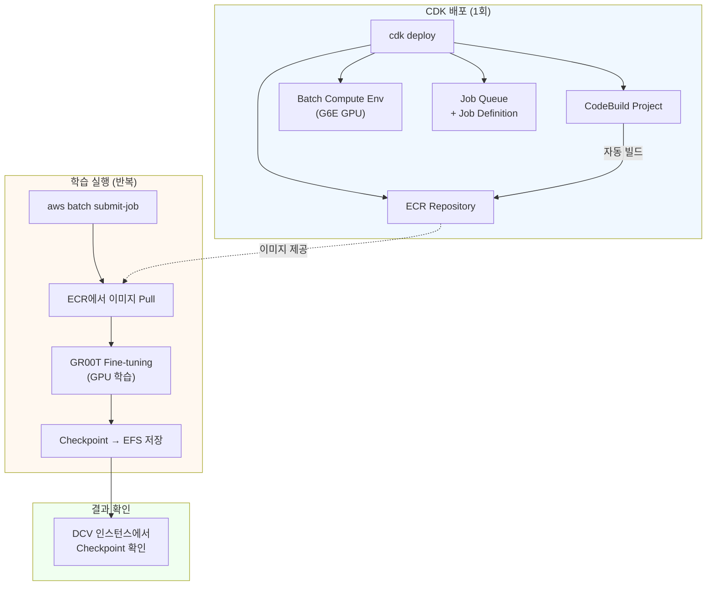
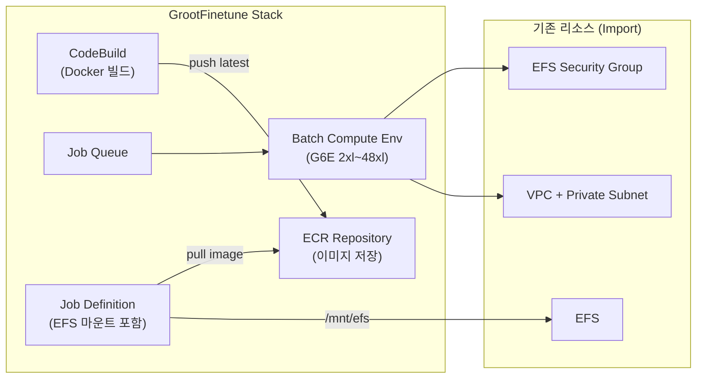
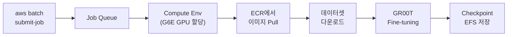
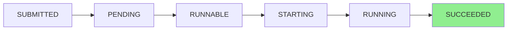

# 6. GR00T Fine-tuning on AWS Batch

이 모듈에서는 AWS Batch를 사용하여 [NVIDIA GR00T N1.7](https://huggingface.co/nvidia/GR00T-N1.7-3B) VLA(Vision-Language-Action) 모델을 fine-tuning합니다. 모듈 5에서 사전학습된 GR00T 모델로 추론을 테스트했다면, 이번 모듈에서는 **커스텀 로봇 데이터셋**에 맞게 모델을 미세조정합니다.

기존 DCV 인스턴스와 EFS를 공유하므로, 학습 결과를 DCV에서 바로 확인할 수 있습니다.

**GR00T N1.7 주요 특징:**

| 항목 | 내용 |
|------|------|
| 모델 크기 | 3B 파라미터 |
| Backbone | [Cosmos-Reason2-2B](https://huggingface.co/nvidia/Cosmos-Reason2-2B) (Qwen3-VL 아키텍처) |
| Action 표현 | Relative EEF (현재 자세 대비 상대 변위) |
| 사전학습 데이터 | 20K 시간 EgoScale 인간 영상 + 로봇 데모 |
| Fine-tuning 방식 | Projector + Diffusion Model 선택적 학습 (backbone freeze) |

GR00T N1.7은 이전 버전(N1.5/N1.6) 대비 **Relative EEF Action Space**를 도입하여 로봇-인간 간 cross-embodiment 전이 성능이 크게 향상되었습니다. Fine-tuning 시에는 전체 3B 파라미터를 학습하는 대신, Action Head의 Projector와 Diffusion Model만 선택적으로 학습하여 GPU 1장에서도 효율적으로 학습할 수 있습니다.

| 서비스 | 쉬운 비유 |
|--------|-----------|
| [AWS Batch](https://docs.aws.amazon.com/batch/latest/userguide/what-is-batch.html) | 작업을 넣으면 알아서 GPU 서버를 켜고, 끝나면 꺼주는 자동 실행기 |
| [Amazon ECR](https://docs.aws.amazon.com/AmazonECR/latest/userguide/what-is-ecr.html) | Private Docker Hub — 컨테이너 이미지 저장소 |
| [AWS CodeBuild](https://docs.aws.amazon.com/codebuild/latest/userguide/welcome.html) | 클라우드에서 Docker 이미지를 자동으로 빌드해주는 서비스 |

**모듈 3 (Isaac Lab Batch)과의 차이:**

| 구분 | 모듈 3 (Isaac Lab RL) | 모듈 6 (GR00T Fine-tuning) |
|------|----------------------|---------------------------|
| 학습 대상 | PPO 강화학습 Policy | VLA Foundation Model |
| 컨테이너 | Isaac Lab + Isaac Sim (~25GB) | Isaac-GR00T + CUDA (~15GB) |
| GPU 요구사항 | 다수 GPU (분산 학습) | 단일 GPU (L4/L40S) |
| 학습 시간 | 수시간 (수만 iterations) | 10분~2시간 (수백~수천 steps) |
| ECR 이미지 관리 | 수동 빌드 & Push | CodeBuild 자동 빌드 |

---

## 6.1 전체 파이프라인 흐름



모듈 3에서는 Docker 이미지를 수동으로 빌드하여 ECR에 Push했지만, 이번 모듈에서는 **CDK가 CodeBuild를 자동으로 트리거**하여 이미지를 빌드합니다. 따라서 CDK 배포만 하면 컨테이너 이미지까지 자동으로 준비됩니다.

---

## 6.2 사전 조건

이 모듈을 시작하기 전에 아래 조건이 충족되어야 합니다:

- **모듈 1~2**가 완료된 상태 (IsaacLab Stack 배포 완료)
- AWS CLI 설치 및 인증 완료
- Node.js 18+ 설치
- CDK CLI 설치 (`npm install -g aws-cdk`)
- **HuggingFace Access Token** 준비 ([발급 페이지](https://huggingface.co/settings/tokens))
- [nvidia/Cosmos-Reason2-2B](https://huggingface.co/nvidia/Cosmos-Reason2-2B) 모델 라이선스 동의 (GR00T N1.7 backbone)

이전 모듈의 Stack Outputs에서 아래 값을 확인합니다:

```bash
# 스택 이름은 배포 시 선택한 versionProfile에 따라 다릅니다:
# stable → IsaacLab-Stable-<userId>, latest → IsaacLab-Latest-<userId>
aws cloudformation describe-stacks \
  --stack-name IsaacLab-Stable-<userId> \
  --region us-east-1 \
  --query "Stacks[0].Outputs" \
  --output table
```

필요한 값:

| 파라미터 | 설명 | 확인 방법 |
|----------|------|-----------|
| `vpcId` | VPC ID | Stack Output `VpcId` 또는 Subnet에서 추출 |
| `efsFileSystemId` | EFS 파일 시스템 ID | Stack Output `EfsFileSystemId` |
| `efsSecurityGroupId` | EFS 보안 그룹 ID | Stack Output `EfsSecurityGroupId` 또는 직접 조회 |
| `privateSubnetId` | Private Subnet ID | Stack Output `PrivateSubnetId` |


최신 버전의 IsaacLab Stack은 `VpcId`와 `EfsSecurityGroupId`를 Output으로 제공합니다. 이전 버전 Stack에서 해당 Output이 없는 경우, 아래 명령으로 조회합니다:


```bash
# VPC ID 조회 (Subnet에서 추출)
aws ec2 describe-subnets \
  --subnet-ids <PrivateSubnetId> \
  --query "Subnets[0].VpcId" --output text

# EFS Security Group 조회
aws ec2 describe-security-groups \
  --filters "Name=vpc-id,Values=<VpcId>" "Name=description,Values=*EFS*" \
  --query "SecurityGroups[0].GroupId" --output text
```

---

## 6.3 CDK 배포 (~5분)

GR00T Fine-tuning 인프라를 배포합니다. 이 스택은 기존 IsaacLab Stack의 VPC/EFS를 자동으로 Import하여 사용합니다.

```bash
cd infra-groot-finetune
npm install
```

배포 명령 — `userId`만 지정하면 나머지 파라미터는 부모 스택에서 자동 조회됩니다:

```bash
# 1. 부모 스택(IsaacLab-Stable/Latest-<userId>)에서 파라미터 자동 조회
npx ts-node bin/resolve-parent-stack.ts <userId>

# 2. 배포
npx cdk deploy
```

`resolve-parent-stack.ts`가 부모 스택의 Outputs에서 VPC, EFS, Subnet, 리전 정보를 조회하여 `cdk.context.json`에 저장합니다. 이후 `cdk deploy`는 이 파일을 자동으로 읽어 배포합니다.

<details>
<summary>파라미터를 수동으로 지정하는 방법 (선택)</summary>

자동 조회 대신 모든 파라미터를 직접 지정할 수도 있습니다:

```bash
CDK_DEFAULT_REGION=us-east-1 npx cdk deploy \
  -c vpcId=<VpcId> \
  -c efsFileSystemId=<EfsFileSystemId> \
  -c efsSecurityGroupId=<EfsSecurityGroupId> \
  -c privateSubnetId=<PrivateSubnetId> \
  -c availabilityZone=us-east-1a \
  -c userId=<userId> \
  -c useStableGroot=true
```

</details>


`resolve-parent-stack.ts`는 부모 스택 이름을 `IsaacLab-Latest-<userId>`, `IsaacLab-Stable-<userId>` 순으로 자동 탐색합니다. 두 패턴 모두 없는 경우 수동 파라미터 지정을 사용하세요.


**CDK가 생성하는 리소스:**



정상 출력:

```
 ✅  GrootFinetune-<userId>

Outputs:
GrootFinetune-<userId>.EcrRepositoryUri = 123456789012.dkr.ecr.us-east-1.amazonaws.com/gr00t-finetune-<userId>
GrootFinetune-<userId>.CodeBuildProjectName = GrootFinetuneContainerBuild
GrootFinetune-<userId>.JobQueueName = GrootFinetune-<userId>-GrootFinetuneQueue
GrootFinetune-<userId>.JobDefinitionName = GrootFinetune-<userId>-GrootFinetuneJob
GrootFinetune-<userId>.CheckpointPath = /mnt/efs/gr00t/checkpoints (Batch) = /home/ubuntu/environment/efs/gr00t/checkpoints (DCV)
```

---

## 6.4 컨테이너 이미지 빌드 확인 (~30분)

CDK 배포와 동시에 CodeBuild가 자동으로 GR00T fine-tuning 컨테이너 이미지를 빌드합니다. NVIDIA CUDA, Isaac-GR00T 라이브러리, Flash Attention 등을 포함하는 약 15GB 크기의 이미지를 생성하므로 25~35분이 소요됩니다.

**모듈 3과의 차이점:** 모듈 3에서는 DCV 인스턴스에서 수동으로 `docker build`와 `docker push`를 실행했습니다. 이번 모듈에서는 CodeBuild가 모든 과정을 자동으로 처리합니다.

```bash
# 빌드 상태 확인
aws codebuild list-builds-for-project \
  --project-name GrootFinetuneContainerBuild \
  --region us-east-1 \
  --query "ids[0]" --output text | \
xargs -I{} aws codebuild batch-get-builds --ids {} \
  --region us-east-1 \
  --query "builds[0].{Status:buildStatus,Phase:currentPhase}" \
  --output table
```

정상 출력 (완료 시):

```
--------------------------
|     BatchGetBuilds     |
+--------+---------------+
|  Phase |    Status     |
+--------+---------------+
|  COMPLETED |  SUCCEEDED  |
+--------+---------------+
```

빌드가 완료되면 ECR에 이미지가 있는지 확인합니다:

```bash
aws ecr describe-images \
  --repository-name gr00t-finetune-<userId> \
  --region us-east-1 \
  --query "imageDetails[0].imageTags" \
  --output text
```


빌드가 완료될 때까지 다음 단계로 진행할 수 없습니다. `Status: SUCCEEDED`가 될 때까지 주기적으로 확인합니다. 빌드 실패 시 CodeBuild 콘솔에서 로그를 확인하세요.


---

## 6.5 Fine-tuning Job 제출 (~15분)

샘플 데이터셋으로 짧은 테스트 학습을 실행하여 전체 파이프라인이 정상 동작하는지 확인합니다.




**`HF_TOKEN`은 모든 Job에 필수입니다.** GR00T N1.7은 [nvidia/Cosmos-Reason2-2B](https://huggingface.co/nvidia/Cosmos-Reason2-2B) backbone을 사용하며, 이 모델은 HuggingFace gated model입니다. 샘플 데이터셋을 사용하는 테스트 Job에서도 모델 초기화 시 인증이 필요하므로, `HF_TOKEN` 없이 제출된 Job은 즉시 실패합니다. Job 제출 전에:
1. HuggingFace 계정에서 [모델 라이선스에 동의](https://huggingface.co/nvidia/Cosmos-Reason2-2B)합니다
2. [Access Token](https://huggingface.co/settings/tokens)을 생성합니다


### 테스트 잡 제출 (100 steps, 약 10~15분):

```bash
aws batch submit-job \
  --job-name groot-finetune-test \
  --job-queue GrootFinetune-<userId>-GrootFinetuneQueue \
  --job-definition GrootFinetune-<userId>-GrootFinetuneJob \
  --region us-east-1 \
  --container-overrides '{
    "environment": [
      {"name": "HF_TOKEN", "value": "<your-hf-token>"},
      {"name": "MAX_STEPS", "value": "100"},
      {"name": "SAVE_STEPS", "value": "50"},
      {"name": "RESUME", "value": "false"}
    ]
  }'
```


`RESUME=false`는 기존 checkpoint가 있을 때 처음부터 학습을 시작합니다. 이전 학습을 이어서 하려면 이 값을 제거하거나 `true`로 설정하세요. 단, 이전 학습과 `DATA_CONFIG` 또는 `EMBODIMENT_TAG`가 달라지면 shape mismatch 에러가 발생할 수 있습니다.


정상 출력:

```json
{
    "jobArn": "arn:aws:batch:us-east-1:123456789012:job/xxxxxxxx-xxxx-xxxx-xxxx-xxxxxxxxxxxx",
    "jobName": "groot-finetune-test",
    "jobId": "xxxxxxxx-xxxx-xxxx-xxxx-xxxxxxxxxxxx"
}
```

반환된 `jobId`를 메모합니다.

<details>
<summary>본격 학습 잡 제출 예시 (6000 steps, ~2시간)</summary>

```bash
aws batch submit-job \
  --job-name groot-finetune-full \
  --job-queue GrootFinetune-<userId>-GrootFinetuneQueue \
  --job-definition GrootFinetune-<userId>-GrootFinetuneJob \
  --region us-east-1 \
  --container-overrides '{
    "environment": [
      {"name": "HF_TOKEN", "value": "<your-hf-token>"},
      {"name": "MAX_STEPS", "value": "6000"},
      {"name": "SAVE_STEPS", "value": "2000"},
      {"name": "BATCH_SIZE", "value": "64"}
    ]
  }'
```

</details>

<details>
<summary>HuggingFace 커스텀 데이터셋으로 학습</summary>

`HF_DATASET_ID`를 지정하면 컨테이너가 자동으로 해당 데이터셋을 다운로드하여 학습합니다:

```bash
aws batch submit-job \
  --job-name groot-finetune-custom \
  --job-queue GrootFinetune-<userId>-GrootFinetuneQueue \
  --job-definition GrootFinetune-<userId>-GrootFinetuneJob \
  --region us-east-1 \
  --container-overrides '{
    "environment": [
      {"name": "HF_TOKEN", "value": "<your-hf-token>"},
      {"name": "HF_DATASET_ID", "value": "lerobot/aloha_mobile_cabinet"},
      {"name": "MAX_STEPS", "value": "6000"},
      {"name": "SAVE_STEPS", "value": "2000"}
    ]
  }'
```

</details>

<details>
<summary>주요 학습 파라미터 설명</summary>

| 파라미터 | 기본값 | 설명 |
|----------|--------|------|
| `MAX_STEPS` | 10000 | 총 학습 스텝 수 |
| `SAVE_STEPS` | 2000 | 체크포인트 저장 간격 |
| `BATCH_SIZE` | 64 | 배치 크기 |
| `LEARNING_RATE` | 1e-4 | 학습률 |
| `NUM_GPUS` | 1 | GPU 수 |
| `TUNE_PROJECTOR` | true | Projector 학습 여부 |
| `TUNE_DIFFUSION_MODEL` | true | Diffusion 모델 학습 여부 |
| `TUNE_LLM` | false | LLM 레이어 학습 여부 |
| `TUNE_VISUAL` | false | Vision 레이어 학습 여부 |
| `DATA_CONFIG` | so100_dualcam | 로봇/카메라 구성 |
| `EMBODIMENT_TAG` | new_embodiment | 로봇 Embodiment 태그 |
| `HF_TOKEN` | (필수) | HuggingFace Access Token (gated model 접근용) |
| `HF_DATASET_ID` | (없음) | HuggingFace 데이터셋 ID |

</details>

---

## 6.6 학습 모니터링

### Job 상태 확인

```bash
JOB_ID=<submit-job에서 반환된 jobId>

aws batch describe-jobs \
  --jobs $JOB_ID \
  --region us-east-1 \
  --query "jobs[0].{Status:status,Reason:statusReason}" \
  --output table
```

Job은 아래 순서로 상태가 전이됩니다:



| 상태 | 의미 | 예상 소요 |
|------|------|-----------|
| SUBMITTED → RUNNABLE | Job 등록 및 스케줄링 | 수초 |
| RUNNABLE → STARTING | GPU 인스턴스 프로비저닝 | 3~5분 |
| STARTING → RUNNING | 컨테이너 이미지 Pull + 시작 | 5~10분 (~15GB 이미지) |
| RUNNING → SUCCEEDED | 학습 실행 | 10~15분 (100 steps) |

### CloudWatch 로그 확인

```bash
aws logs tail /aws/batch/job \
  --region us-east-1 \
  --follow
```

학습이 정상 시작되면 아래와 같은 로그가 출력됩니다:

```
==========================================
Fine-tuning Workflow Starting
==========================================
...
EFS mount is accessible: /mnt/efs
[Step] Using cached model from EFS: /mnt/efs/gr00t/models/GR00T-N1.7-3B
[Step] Using cached Cosmos backbone from EFS: /mnt/efs/gr00t/models/Cosmos-Reason2-2B
Starting Python finetune script...
Total parameters: 3,144,016,000
Trainable parameters: 1,620,515,968 (51.54%)
🚀 Starting training...
Current global step: 0
  0%|          | 0/100 [00:00<?, ?it/s]
```


Job이 RUNNABLE 상태에서 오래 멈추는 경우, 해당 AZ에서 G6E 인스턴스 용량이 부족할 수 있습니다. 잠시 대기하면 보통 해결됩니다.


---

## 6.7 DCV에서 Checkpoint 확인

학습이 완료되면 DCV 인스턴스에 접속하여 결과를 확인합니다. Batch Job과 DCV가 동일한 EFS를 마운트하므로, 학습 결과에 바로 접근할 수 있습니다.

DCV 접속 URL은 IsaacLab Stack의 `DcvUrl` Output에서 확인합니다 (예: `https://<IP>:8443`).

DCV 터미널에서:

```bash
# Checkpoint 디렉토리 확인
ls -la /home/ubuntu/environment/efs/gr00t/checkpoints/

# 최신 checkpoint 내용 확인
ls /home/ubuntu/environment/efs/gr00t/checkpoints/checkpoint-*/

# TensorBoard 로그 확인
ls /home/ubuntu/environment/efs/gr00t/checkpoints/runs/
```

정상적으로 학습이 완료되었다면 아래와 같은 구조가 보입니다:

```
/home/ubuntu/environment/efs/gr00t/checkpoints/
├── checkpoint-50/
│   ├── config.json
│   ├── model.safetensors
│   └── training_args.bin
├── checkpoint-100/
│   ├── config.json
│   ├── model.safetensors
│   └── training_args.bin
└── runs/
    └── (TensorBoard 로그 파일)
```

<details>
<summary>TensorBoard로 학습 곡선 시각화</summary>

DCV 인스턴스에서 TensorBoard를 실행하여 학습 loss를 시각화할 수 있습니다:

```bash
pip install tensorboard
tensorboard --logdir /home/ubuntu/environment/efs/gr00t/checkpoints/runs --port 6006 --bind_all
```

DCV 브라우저에서 `http://localhost:6006`으로 접속합니다.

</details>

<details>
<summary>Fine-tuned 모델로 추론 테스트 (모듈 5 활용)</summary>

모듈 5의 추론 서버에서 fine-tuned checkpoint를 로드할 수 있습니다:

```bash
cd /home/ubuntu/environment/Isaac-GR00T

uv run python gr00t/eval/run_gr00t_server.py \
  --embodiment-tag new_embodiment \
  --model-path /home/ubuntu/environment/efs/gr00t/checkpoints/checkpoint-100 \
  --device cuda:0 \
  --host 0.0.0.0 \
  --port 5555
```

이후 모듈 5의 테스트 스크립트로 fine-tuned 모델의 추론 결과를 확인합니다.

</details>

---

## 6.8 정리 (선택)

실습이 끝난 후 리소스를 삭제하여 비용을 방지합니다. 배포 시 생성된 `cdk.context.json`이 남아있으므로 별도 파라미터 없이 삭제할 수 있습니다:

```bash
cd infra-groot-finetune
npx cdk destroy
```


ECR Repository는 `RETAIN` 정책으로 자동 삭제되지 않습니다. 수동 삭제가 필요합니다:
```bash
aws ecr delete-repository \
  --repository-name gr00t-finetune-<userId> \
  --region us-east-1 --force
```


---

## 6.9 트러블슈팅

| 증상 | 원인 | 해결 |
|------|------|------|
| `Access to model nvidia/Cosmos-Reason2-2B is restricted` | HF_TOKEN 미설정 또는 라이선스 미동의 | [모델 페이지](https://huggingface.co/nvidia/Cosmos-Reason2-2B)에서 라이선스 동의 후 `HF_TOKEN` 환경변수 추가 |
| `size mismatch for action_head` | 이전 checkpoint와 현재 config 불일치 | `RESUME=false`로 재시도하거나 기존 checkpoint 삭제 |
| Job이 RUNNABLE에서 멈춤 | G6E 인스턴스 용량 부족 | 다른 AZ 또는 인스턴스 타입으로 조정. 또는 잠시 대기 |
| EFS 마운트 실패 | 보안 그룹 규칙 누락 | Batch SG → EFS SG로 TCP 2049 인바운드 허용 확인 |
| Container image not found | CodeBuild 빌드 미완료 | `Status: SUCCEEDED` 확인 후 재시도 |
| OOM (Out of Memory) | DataLoader shared memory 부족 | `DATALOADER_NUM_WORKERS=2`로 줄여서 재시도 |
| Loss가 줄지 않음 | 학습률 또는 배치 크기 부적절 | `LEARNING_RATE=5e-5`, `BATCH_SIZE=16`으로 조정 |

---

## References

* [AWS Batch User Guide - Managed Compute Environments](https://docs.aws.amazon.com/batch/latest/userguide/managed_compute_environments.html)
* [AWS Batch - EFS Volume Configuration](https://docs.aws.amazon.com/batch/latest/APIReference/API_EFSVolumeConfiguration.html)
* [AWS CodeBuild User Guide](https://docs.aws.amazon.com/codebuild/latest/userguide/welcome.html)
* [NVIDIA Isaac-GR00T Repository](https://github.com/NVIDIA/Isaac-GR00T)
* [infra-groot-finetune CDK](https://github.com/hi-space/aws-physical-ai-recipes/tree/main/isaac-lab-workshop/infra-groot-finetune)
