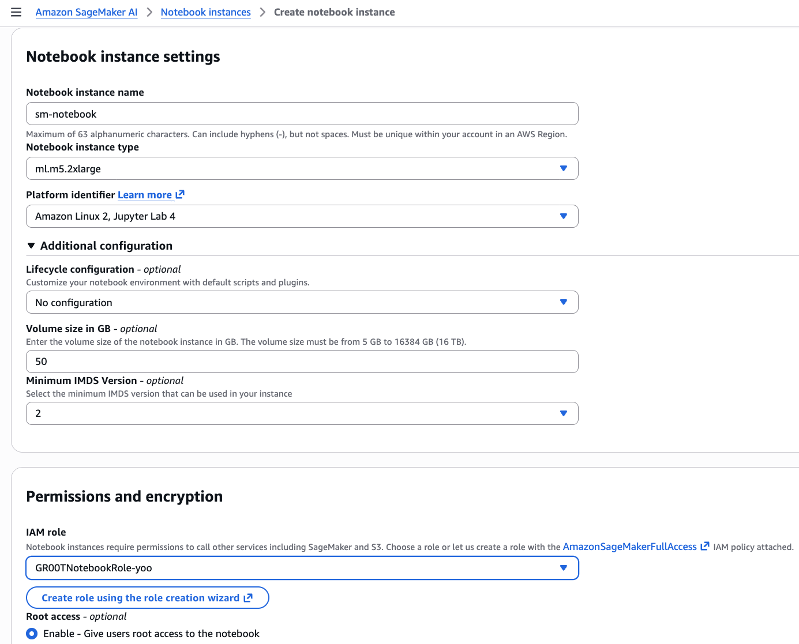
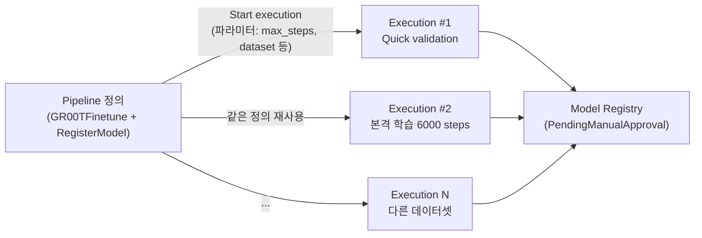
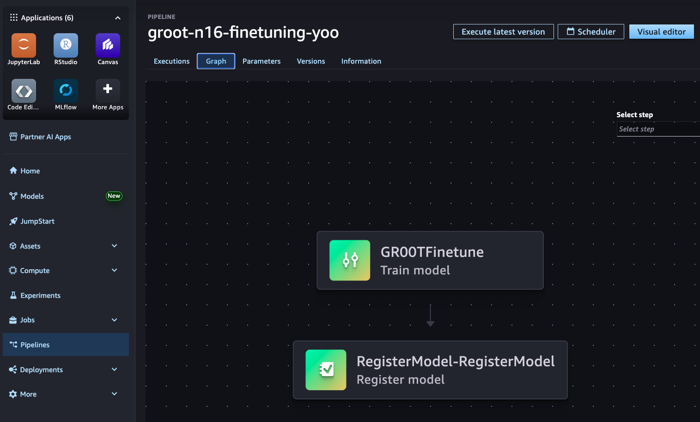
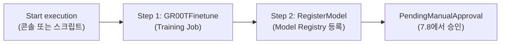
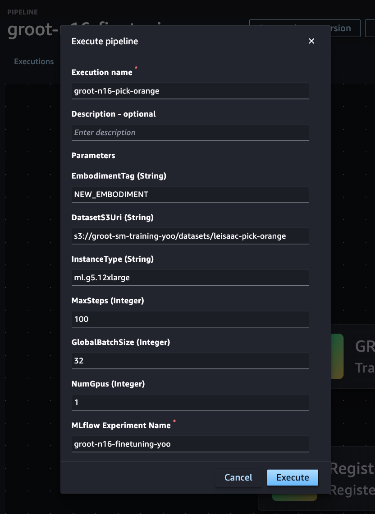
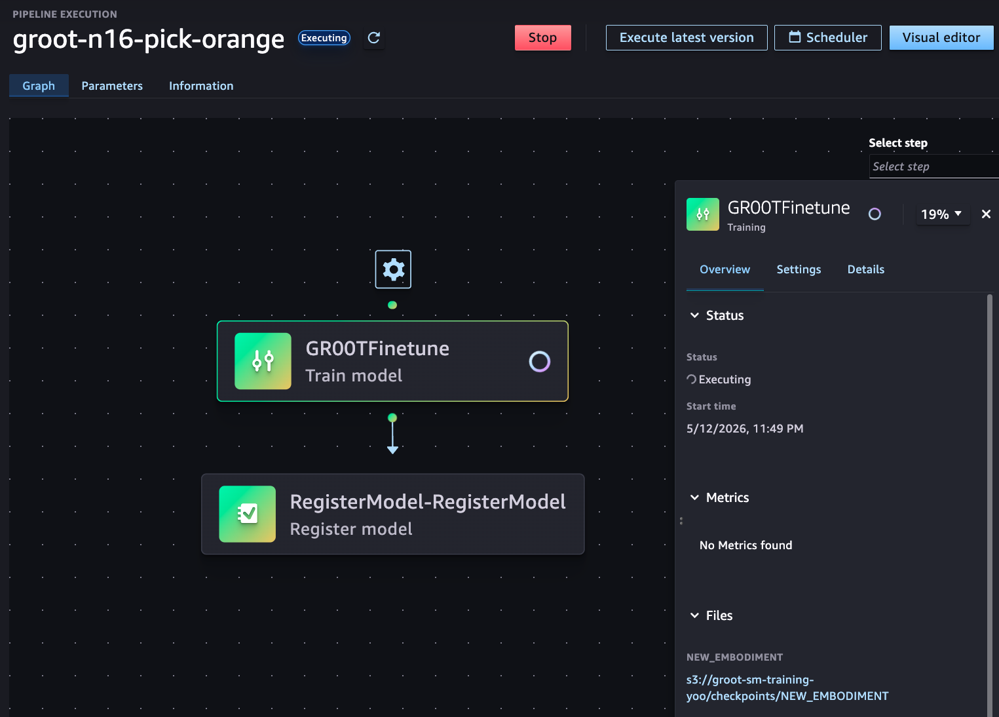
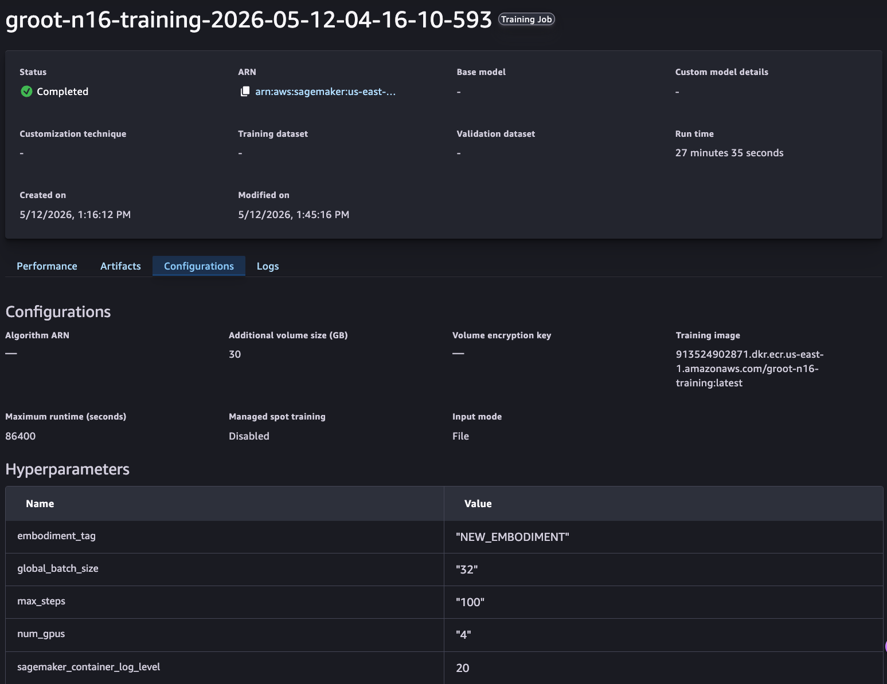
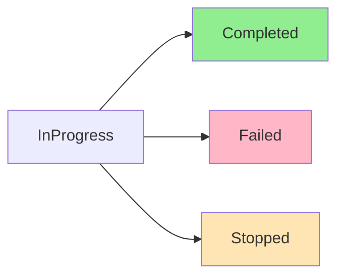

# 7. VLA Fine-tuning on SageMaker

이 모듈에서는 AWS SageMaker를 사용하여 [NVIDIA GR00T N1](https://developer.nvidia.com/gr00t) VLA(Vision-Language-Action) 모델을 fine-tuning합니다. [모듈 6](6.-finetune-batch.md)(AWS Batch)과 달리, SageMaker는 **실시간 추론 엔드포인트**로 즉시 배포할 수 있어 로봇 시스템과의 통합이 용이합니다.

SageMaker Training Job을 통해 학습한 모델은 [Model Registry](https://docs.aws.amazon.com/sagemaker/latest/dg/model-registry.html)에 등록되고, 승인된 모델은 [SageMaker Endpoint](https://docs.aws.amazon.com/sagemaker/latest/dg/realtime-endpoints.html)로 배포되어 REST API로 접근할 수 있습니다. 동일한 데이터셋(LightwheelAI/leisaac-pick-orange, SO-101 로봇)으로 Batch 결과와 학습 곡선을 비교 검증할 수 있습니다.

| 서비스 | 설명 |
|--------|-----------|
| [Amazon SageMaker Training Job](https://docs.aws.amazon.com/sagemaker/latest/dg/train-model.html) | 클라우드에서 ML 모델을 학습시켜주는 관리형 서비스 (학습 스크립트를 컨테이너에 담아 제출하면 GPU 할당 + 자동 실행) |
| [Amazon SageMaker Model Registry](https://docs.aws.amazon.com/sagemaker/latest/dg/model-registry.html) | 학습된 모델 버전을 저장하고 승인/관리하는 카탈로그  |
| [Amazon SageMaker Endpoint](https://docs.aws.amazon.com/sagemaker/latest/dg/realtime-endpoints.html) | 배포된 모델을 REST API로 24/7 접근 가능하게 서빙하는 관리형 호스팅  |
| [Amazon ECR](https://docs.aws.amazon.com/AmazonECR/latest/userguide/what-is-ecr.html) | Private Docker Hub — 학습/추론 컨테이너 이미지 저장소 |
| [AWS CodeBuild](https://docs.aws.amazon.com/codebuild/latest/userguide/welcome.html) | 클라우드에서 Docker 이미지를 자동으로 빌드해주는 서비스 |
| [Amazon S3](https://docs.aws.amazon.com/s3/latest/userguide/Welcome.html) | 데이터셋, 모델, 체크포인트를 저장하는 객체 스토리지 |


[모듈 5](5.-gr00t-n1.md)에서 `infra-groot-finetune` CDK 배포가 완료된 상태여야 합니다(선택사항). 본 모듈은 독립적으로 실행 가능하며, 모든 리소스를 CloudFormation으로 생성합니다. 아직 배포하지 않았다면 [모듈 5.3](5.-gr00t-n1.md#5.3-infra-groot-finetune-cdk-배포)을 참고하세요.


---

## 7.1 사전 요구사항 (~5분)

| 도구 | 버전 |
|------|------|
| AWS CLI | v2 이상 |
| Python | 3.10 이상 |
| [uv](https://docs.astral.sh/uv/) | 최신 |
| Git | 최신 |

```bash
# AWS CLI v2 설치 (이미 v2면 건너뛰세요)
# `aws --version`이 aws-cli/2.x를 보여주면 OK. v1이거나 미설치면 아래 실행:
curl -L "https://awscli.amazonaws.com/awscli-exe-linux-x86_64.zip" -o /tmp/awscliv2.zip
unzip -q /tmp/awscliv2.zip -d /tmp/awscliv2
sudo /tmp/awscliv2/aws/install --update
hash -r
export PATH=/usr/local/bin:$PATH        # /usr/local/bin/aws(v2)를 우선 잡도록
aws --version                            # aws-cli/2.x.x 확인

# uv 미설치 시
curl -LsSf https://astral.sh/uv/install.sh | sh
exec $SHELL   # PATH 갱신
```

시스템 `python`을 직접 쓰면 환경에 따라 버전 불일치(3.10 미만)나 의존성 충돌이 발생할 수 있습니다. 의존성은 `pyproject.toml` + `uv.lock`으로 관리되므로 `uv sync` 한 번이면 격리된 `.venv`가 lock된 버전으로 정확히 재현됩니다.

이후 가이드의 모든 `python ...` 명령은 위에서 활성화한 venv가 켜진 셸에서 실행한다고 가정합니다. 새 터미널을 열었을 때는 다음으로 다시 진입하세요:

```bash
# groot-sagemaker 리포지토리로 이동 후 동기화
git clone https://github.com/hi-space/aws-physical-ai-recipes.git
cd aws-physical-ai-recipes/training/groot-sagemaker
uv sync                       # .venv 생성 + lock 기반 의존성 설치
source .venv/bin/activate
```

**필요한 IAM 권한:**
- `sagemaker:CreateTrainingJob`, `sagemaker:DescribeTrainingJob`
- `sagemaker:CreateModel`, `sagemaker:CreateEndpoint`, `sagemaker:InvokeEndpoint`
- `ecr:DescribeRepositories`, `codebuild:StartBuild`, `codebuild:BatchGetBuilds`
- `s3:GetObject`, `s3:PutObject` (학습/모델 아티팩트 버킷)
- `cloudformation:*` (인프라 배포)


**AWS 계정 권한 확인:** `aws sts get-caller-identity`로 현재 계정과 권한을 확인합니다. Admin 또는 PowerUser 권한이 권장되며, 제한된 IAM 역할을 사용하는 경우 위 권한이 모두 포함되었는지 확인하세요.


---

## 7.2 AWS 인프라 배포 (~10분)

CloudFormation 스택을 생성하여 필요한 모든 리소스를 프로비저닝합니다. CloudShell에서 실행해주세요.

### 단일 사용자 (기본)

```bash
python infra/deploy_stack.py \
    --bucket-name <전 세계 고유한 S3 버킷 이름> \
    --region us-east-1
```

스택 이름은 기본값 `GrootSMTrainingJob`이 사용됩니다.

### 멀티 사용자 / 동일 계정 충돌 방지 (`--alias`)

같은 AWS 계정에 두 명 이상이 배포하거나 한 사람이 여러 환경(dev/staging)을 분리하려면 `--alias`를 지정합니다. 모든 리소스 이름에 `-<alias>` postfix가 자동으로 붙고, 스택 이름은 `GrootSMTrainingJob-<alias>`가 됩니다.

```bash
export USER_ID=<본인이름>
python infra/deploy_stack.py \
    --alias ${USER_ID} \
    --bucket-name groot-sm-training-${USER_ID} \
    --region us-east-1
```

ECR 리포지토리, IAM 역할, CodeBuild 프로젝트는 계정 단위 글로벌 네임스페이스를 사용합니다. 같은 계정에 두 사람이 alias 없이 배포하면 두 번째 배포가 `Resource ... already exists` 에러로 실패합니다. 워크숍/팀 환경에서는 항상 `--alias`를 지정하세요.

`--alias` 만 주면 `IsaacLab-Stable-${USER_ID}` (또는 `IsaacLab-Latest-${USER_ID}`) 스택의 VPC/Subnet 을 자동으로 재사용합니다. 해당되는 VPC가 없는 경우에는 자동으로 계정 default VPC 로 배치됩니다.

**정상 출력**:

```
IsaacLab 부모 스택 발견: IsaacLab-Stable-yoo (VPC=vpc-0ca7..., subnet=subnet-007e...)
스택 'GrootSMTrainingJob-yoo' 생성 중...
배포 완료 대기 중... (수 분 소요될 수 있습니다)
스택 배포 완료!

============================================================
  GR00T 인프라 배포 완료!
============================================================
  AWS 계정 ID  : 123456789012
  리전          : us-east-1
  S3 버킷       : groot-sm-training-yoo
  SageMaker 역할: arn:aws:iam::123456789012:role/GR00TSageMakerRole-yoo
  Notebook 역할 : arn:aws:iam::123456789012:role/GR00TNotebookRole-yoo
  학습 ECR URI  : 123456789012.dkr.ecr.us-east-1.amazonaws.com/groot-n16-training-yoo
  추론 ECR URI  : 123456789012.dkr.ecr.us-east-1.amazonaws.com/groot-n16-inference-yoo
  Studio 도메인 : d-xxxxxxxxxxx
  Studio URL    : https://us-east-1.console.aws.amazon.com/sagemaker/home?region=us-east-1#/studio/d-xxxxxxxxxxx
  Studio 사용자 : groot-yoo
============================================================
config.yaml 업데이트 완료
```

배포가 끝나면 AWS 콘솔 → SageMaker → Studio → `groot-n16-studio-${USER_ID}` 도메인에서 "Open Studio" 로 접속하면 학습 잡 / 파이프라인 / 모델 레지스트리 진행 상황을 시각적으로 확인할 수 있습니다. CLI 에서 presigned URL 을 직접 발급하려면:

```bash
aws sagemaker create-presigned-domain-url \
    --domain-id <위 출력의 Studio 도메인 ID> \
    --user-profile-name groot-${USER_ID} \
    --region us-east-1
```

생성된 `config.yaml`을 확인하여 리소스 정보를 메모합니다:

```bash
cat config.yaml
```

출력 예:

```yaml
aws:
  account_id: '123456789012'
  alias: yoo
  bucket_name: groot-sm-training-yoo
  region: us-east-1
  role_arn: arn:aws:iam::123456789012:role/GR00TSageMakerRole-yoo
codebuild:
  inference_project: groot-n16-inference-build-yoo
  training_project: groot-n16-training-build-yoo
ecr:
  training_uri: 123456789012.dkr.ecr.us-east-1.amazonaws.com/groot-n16-training-yoo
  inference_uri: 123456789012.dkr.ecr.us-east-1.amazonaws.com/groot-n16-inference-yoo
inference:
  endpoint_name: groot-n16-endpoint-yoo
  model_package_group: groot-n16-models-yoo
```

이후 단계에서는 모두 `config.yaml`을 자동으로 읽으므로 추가 옵션 없이 alias가 반영됩니다.

### SageMaker AI Notebook에서 작업하는 경우

작업 환경을 위해 **SageMaker AI** 콘솔에 접속하여 **Notebook 인스턴스**를 생성합니다. 



- **Notebook instance type**: `ml.m5.2xlarge`
- **Additional configuration - Volume size**: `50`
- **IAM role**: `GR00TNotebookRole-${USER_ID}`

노트북이 생성되면 **Open JupyterLab** 을 선택하여 접속합니다.

### 다른 환경(EC2/로컬)으로 작업을 이어가는 경우

`deploy_stack.py`는 실행한 머신의 `config.yaml`만 채웁니다. CloudShell에서 인프라를 배포한 뒤 EC2/로컬에서 빌드·학습·배포를 이어가려면 두 환경의 `config.yaml`을 동기화해야 합니다.

CloudShell에서 출력값을 그대로 복사한 뒤 작업 환경의 `training/groot-sagemaker/config.yaml`에 붙여넣으세요:

```bash
# CloudShell
cat config.yaml
```

```bash
# 작업 환경 (EC2/로컬)
cd training/groot-sagemaker
nano config.yaml      # 위 내용 그대로 붙여넣기
```

### 환경 변수 추출 (이후 명령에서 재사용)

가이드의 다음 단계들은 사용자 버킷 이름·리전·alias가 반복적으로 등장합니다. `config.yaml`에서 셸 변수로 추출해 두면 복사-붙여넣기 그대로 동작합니다:

```bash
BUCKET=$(python -c "import yaml; print(yaml.safe_load(open('config.yaml'))['aws']['bucket_name'])")
ALIAS=$(python -c "import yaml; print(yaml.safe_load(open('config.yaml'))['aws'].get('alias','') or '')")
REGION=$(python -c "import yaml; print(yaml.safe_load(open('config.yaml'))['aws']['region'])")
echo "BUCKET=$BUCKET  ALIAS=${ALIAS:-<none>}  REGION=$REGION"
```

> 새 터미널을 열 때마다 위 블록을 다시 실행하세요. `${ALIAS:+-$ALIAS}` 패턴은 alias가 비어있으면 빈 문자열, 값이 있으면 `-<alias>` postfix로 자동 확장됩니다.

<details>
<summary><strong>선택) SSM Parameter Store에 HuggingFace 토큰 저장</strong></summary>

N1.7 사용 시 또는 HuggingFace 데이터셋 사용 시, 토큰을 안전하게 저장합니다:

```bash
aws ssm put-parameter --name /groot/hf-token \
    --value hf_xxxxxxxxxxxxxxxxxxxx --type SecureString --overwrite --region us-east-1
```

학습 스크립트에서 `--hf-token ssm:/groot/hf-token`으로 지정하면 자동 로드됩니다.

</details>

---

## 7.3 데이터셋 준비 및 업로드 (~5분)

SO-101 로봇의 leisaac-pick-orange 데이터셋을 S3에 업로드합니다:

**옵션 1: 사전 업로드 (로컬 테스트 또는 프라이빗 데이터셋)**

```bash
python data/upload_dataset.py \
    --hf-dataset-id LightwheelAI/leisaac-pick-orange \
    --bucket "${BUCKET}" \
    --prefix datasets/leisaac-pick-orange
```

정상 출력:

```
Downloading dataset: LightwheelAI/leisaac-pick-orange
Converting LeRobot v3 → v2.1 format...
Uploading to S3: s3://<your-bucket>/datasets/leisaac-pick-orange/
Upload complete: 45 files, ~3.2 GB
Dataset metadata: meta/modality.json, meta/info.json
```

**옵션 2: HuggingFace에서 직접 다운로드**

이 경로를 선택하면 S3 업로드를 생략하고, 학습 중에 컨테이너가 HuggingFace에서 직접 받습니다.

`LightwheelAI/leisaac-pick-orange`는 공개 데이터셋이므로 토큰이 없어도 받을 수 있습니다. 비공개 또는 gated 데이터셋, 그리고 N1.7 backbone(`nvidia/Cosmos-Reason2-2B`, gated) 사용 시에는 SSM Parameter Store에 토큰을 저장해 두는 것이 안전합니다:

```bash
aws ssm put-parameter --name /groot/hf-token \
    --value hf_xxxxxxxxxxxxxxxxxxxx \
    --type SecureString --overwrite \
    --region "${REGION}"
```

나중에 학습할 때 `--hf-dataset-id LightwheelAI/leisaac-pick-orange --hf-token ssm:/groot/hf-token` 옵션으로 SSM에서 자동 로드합니다.

<details>
<summary><strong>커스텀 로봇 데이터셋 준비</strong></summary>

SO-101이 아닌 다른 로봇을 사용하려면:

1. 데이터셋을 LeRobot v2.1 형식으로 준비 (`meta/modality.json`, `meta/info.json`, `data/` 구조)
2. 데이터셋 root에 `modality_config.py` 생성 (참고: `data/configs/so101_modality_config.py`)
3. 업로드:
   ```bash
   python data/upload_dataset.py \
       --local-path ./my-robot-dataset \
       --bucket "${BUCKET}" \
       --prefix datasets/my-robot
   ```
4. 학습 시 `--embodiment-tag NEW_EMBODIMENT` 지정

기본 제공 embodiment (`LIBERO_PANDA`, `OXE_DROID` 등)는 `modality_config.py` 없이 동작합니다.

</details>

---

## 7.4 컨테이너 이미지 빌드 (~30분)

학습과 추론용 Docker 이미지를 CodeBuild로 빌드하여 ECR에 푸시합니다. CodeBuild 프로젝트는 `NO_SOURCE`로 생성되어 있어, 빌드를 시작할 때 **소스 위치(S3 zip)를 매번 직접 지정**해야 합니다.

두 가지 흐름 중 편한 쪽을 고르세요:

- **A. 콘솔 흐름** (학습 목적, 단계별 시각 확인) — Step 1~4를 따라 진행
- **B. 스크립트 흐름** (빠르게 한 번에) — 아래 *대안: 스크립트로 한 번에* 펼쳐서 사용

어느 쪽이든 결과는 동일하게 ECR에 이미지가 푸시되고 `config.yaml`의 `ecr.*_uri`가 채워집니다.

<details>
<summary><strong>대안: 스크립트로 한 번에 (B)</strong></summary>

소스 업로드, 빌드 트리거, 완료 대기, `config.yaml` ECR URI 갱신을 모두 한 번에 수행합니다:

```bash
# training + inference 모두 빌드 (빌드 완료까지 대기)
python scripts/trigger_build.py --type all --bucket "${BUCKET}"

# training만 빌드
python scripts/trigger_build.py --type training --bucket "${BUCKET}"

# inference만 빌드, 완료 대기 없이 백그라운드 실행
python scripts/trigger_build.py --type inference --bucket "${BUCKET}" --no-wait

# GR00T n1.7 버전으로 training 빌드
python scripts/trigger_build.py --type training --bucket "${BUCKET}" --groot-version n1.7
```

스크립트가 끝나면 7.5로 바로 넘어가도 됩니다 (Step 4의 ECR URI 갱신도 자동으로 수행됨).

</details>

### Step 1. 소스 zip을 S3에 업로드

CodeBuild에 필요한 파일은 아래와 같습니다. 
 - `training/groot-sagemaker/container/`
 -  `training/groot-sagemaker/container/config.yaml`

반드시 `training/groot-sagemaker/`로 이동한 뒤 실행하세요:

> 다른 디렉터리에서 zip을 만들면 buildspec에서 `container/training/Dockerfile`을 못 찾아 빌드가 실패합니다. `pwd`로 위치 확인 후 진행하세요.

```bash
cd training/groot-sagemaker

SRC_KEY="codebuild-source/groot-n16-source.zip"
rm -f /tmp/groot-source.zip
zip -r /tmp/groot-source.zip container config.yaml
aws s3 cp /tmp/groot-source.zip "s3://${BUCKET}/${SRC_KEY}" --region "${REGION}"
echo "S3 source: s3://${BUCKET}/${SRC_KEY}"
```

마지막 출력의 S3 키(`codebuild-source/groot-n16-source.zip`)를 메모하세요. 다음 단계에서 콘솔에 그대로 입력합니다.


### Step 2. CodeBuild 콘솔에서 빌드 시작

[CodeBuild 콘솔](https://console.aws.amazon.com/codesuite/codebuild/projects)에 접속하고 우측 상단 리전이 `${REGION}`인지 확인합니다.

#### 2-1. 학습 컨테이너 빌드

1. 프로젝트 목록에서 **`groot-n16-training-build${ALIAS:+-$ALIAS}`** (예: `groot-n16-training-build-yoo`)를 클릭합니다.
2. 우측 상단 **Start build with overrides** 클릭 (단순 *Start build*가 아니라 반드시 *with overrides* — Source 위치와 Buildspec 경로를 **둘 다** 매번 지정해야 합니다. 둘 중 하나라도 비우면 CloudFormation에 들어있는 placeholder buildspec(`echo "소스 없음..."`)이 실행되어 빌드는 SUCCEEDED로 끝나지만 ECR에는 아무것도 푸시되지 않습니다).
3. 다음 항목만 변경하고 나머지는 기본값 유지:

   | 섹션 | 항목 | 값 |
   |------|------|----|
   | **Source** | Source provider | Amazon S3 |
   | **Source** | Bucket | `${BUCKET}` (예: `groot-sm-training-yoo`) |
   | **Source** | S3 object key | Step 1에서 메모한 키 (`codebuild-source/groot-n16-source.zip`) |
   | **Buildspec** | Buildspec name | `container/training/buildspec.yml` |
   | **Environment variables** *(N1.7 빌드 시에만)* | `GROOT_VERSION` | `n1.7` |
   | **Environment variables** *(N1.7 빌드 시에만)* | `BASE_MODEL_PATH` | `nvidia/GR00T-N1.7-3B` |


4. **Start build** 클릭. 약 25–30분 소요.


#### 2-2. 추론 컨테이너 빌드

학습 빌드와 동일한 방식으로 **`groot-n16-inference-build${ALIAS:+-$ALIAS}`** 프로젝트에서 *Start build with overrides*. 차이점은 buildspec 경로뿐:

  | 섹션 | 항목 | 값 |
   |------|------|----|
   | **Source** | Source provider | Amazon S3 |
   | **Source** | Bucket | `${BUCKET}` (예: `groot-sm-training-yoo`) |
   | **Source** | S3 object key | Step 1에서 메모한 키 (`codebuild-source/groot-n16-source.zip`) |
   | **Buildspec** | Buildspec name | `container/inference/buildspec.yml` |

추론 빌드는 GROOT_VERSION 환경변수 override가 필요 없습니다. 약 15–20분 소요됩니다.


> 두 빌드는 독립적이라 동시에 실행해도 됩니다. 같은 S3 zip을 두 빌드에서 재사용하면 됩니다.

### Step 3. 빌드 진행 모니터링

콘솔의 **Build history** 탭에서 각 빌드의 phase 진행 상황을 실시간 확인할 수 있습니다. CLI를 선호하면:

```bash
aws logs tail "/aws/codebuild/groot-n16-training-build${ALIAS:+-$ALIAS}" \
    --follow --region "${REGION}"
```

빌드 성공 시 ECR에 이미지가 푸시됩니다:
- `<account>.dkr.ecr.us-east-1.amazonaws.com/groot-n16-training-${USER_ID}$:latest`
- `<account>.dkr.ecr.us-east-1.amazonaws.com/groot-n16-inference-${USER_ID}:latest`


### Step 4. ECR URI를 config.yaml에 기록

콘솔로 빌드한 경우 `config.yaml`이 자동 갱신되지 않으므로 직접 채워야 합니다. 다음 블록이 `ecr.training_uri`/`ecr.inference_uri`를 alias·계정·리전에 맞게 채워줍니다:

```bash
export ACCOUNT_ID=$(aws sts get-caller-identity --query Account --output text)
export ALIAS REGION   # 7.2에서 추출한 값을 Python에 전달

python - <<'PY'
import os, yaml
alias  = os.environ.get("ALIAS", "")
suffix = f"-{alias}" if alias else ""
account = os.environ["ACCOUNT_ID"]
region  = os.environ["REGION"]
cfg = yaml.safe_load(open("config.yaml"))
cfg.setdefault("ecr", {})
cfg["ecr"]["training_uri"]  = f"{account}.dkr.ecr.{region}.amazonaws.com/groot-n16-training{suffix}:latest"
cfg["ecr"]["inference_uri"] = f"{account}.dkr.ecr.{region}.amazonaws.com/groot-n16-inference{suffix}:latest"
yaml.safe_dump(cfg, open("config.yaml", "w"), allow_unicode=True, default_flow_style=False)
print(cfg["ecr"])
PY
```

이후 단계의 `run_training.py`, `deploy_endpoint.py`, `run_pipeline.py`는 `config.yaml`의 ECR URI를 자동으로 사용합니다.


**빌드 실패 시:** CloudWatch 로그에서 `flash-attn` 또는 `CUDA` 관련 에러를 확인하세요. 콘솔에서 *Start build with overrides*를 같은 설정으로 다시 누르면 보통 해결됩니다.


---

## 7.5 SageMaker Pipeline 정의 등록 (~3분)

[SageMaker Pipelines](https://docs.aws.amazon.com/sagemaker/latest/dg/pipelines.html)는 학습 → Model Registry 등록을 한 번의 정의로 묶고, 이후에는 파라미터만 바꿔 **재사용**하는 워크플로우입니다. 본 단계에서는 학습을 시작하지 않고 정의만 만들어 두며, 실제 학습은 7.6에서 *Start execution*으로 시작합니다.



### Step 1. 학습 스크립트(`sourcedir.tar.gz`)를 S3에 업로드

[SageMaker Script Mode](https://docs.aws.amazon.com/sagemaker/latest/dg/adapt-training-script.html)는 학습 스크립트를 컨테이너 이미지에 박지 않고 런타임에 주입하는 방식입니다. 컨테이너에는 학습 의존성(PyTorch, flash-attn, GR00T 라이브러리)만 들어있고 진입점 스크립트는 별도 tarball로 받아옵니다. `train.py`를 수정해도 컨테이너 이미지 재빌드 없이 이 단계만 다시 하면 됩니다.

```bash
cd training/groot-sagemaker

SRC_KEY="codebuild-source/sourcedir.tar.gz"
rm -f /tmp/sourcedir.tar.gz
tar -czf /tmp/sourcedir.tar.gz -C container/training train.py
aws s3 cp /tmp/sourcedir.tar.gz "s3://${BUCKET}/${SRC_KEY}" --region "${REGION}"
echo "S3 source: s3://${BUCKET}/${SRC_KEY}"
```

Script Mode를 사용하면 `train.py`만 고치고 다시 업로드하면 되고 컨테이너 이미지를 재빌드할 필요가 없습니다. 컨테이너 안에는 학습 의존성(PyTorch, flash-attn, GR00T 라이브러리)만 들어있고, 진입점 스크립트는 런타임에 받아옵니다.

### Step 2. Pipeline 정의 등록

[Pipeline Step](https://docs.aws.amazon.com/sagemaker/latest/dg/build-and-manage-steps.html)은 워크플로우 안의 한 작업 단위입니다. 각 Step은 **타입**(Training / Processing / Model / Condition 등)에 따라 SageMaker가 자동으로 해당 리소스(Training Job, Processing Job, Model Package …)를 만들어 실행하고, 한 Step의 출력(예: `model.tar.gz`의 S3 경로)이 다음 Step의 입력으로 자연스럽게 연결됩니다.

본 가이드의 Pipeline은 두 Step으로 구성됩니다:

| Step | 타입 | 하는 일 |
|------|------|---------|
| `GR00TFinetune` | [TrainingStep](https://docs.aws.amazon.com/sagemaker/latest/dg/build-and-manage-steps.html#step-type-training) | SageMaker Training Job을 실행해 GR00T를 fine-tuning하고 결과를 `model.tar.gz`로 S3에 저장 |
| `RegisterModel` | [ModelStep](https://docs.aws.amazon.com/sagemaker/latest/dg/build-and-manage-steps.html#step-type-model) | 위에서 나온 `model.tar.gz`를 [Model Registry](https://docs.aws.amazon.com/sagemaker/latest/dg/model-registry.html)에 `PendingManualApproval` 상태로 등록 |

이 단계에서는 위 정의를 SageMaker에 **등록**만 합니다 (실제 학습은 7.6에서 시작).

```bash
python pipeline/run_pipeline.py --upsert-only
```

정상 출력:

```
파이프라인 빌드 중...
Spot Instance 학습 활성화 (최대 대기: 86400초)
파이프라인 업서트 중 (정의 생성/업데이트)...
파이프라인 업서트 완료: groot-n16-finetuning-yoo
```



### Step 3. 콘솔에서 정의 확인

[SageMaker AI 콘솔 → Pipelines](https://console.aws.amazon.com/sagemaker/home#/pipelines)에 접속해 `groot-n16-finetuning${ALIAS:+-$ALIAS}`(예: `groot-n16-finetuning-yoo`)를 클릭합니다.

- **Graph** 탭: `GR00TFinetune` → `RegisterModel` 두 Step이 직렬로 연결된 그래프가 보입니다.
- **Parameters** 탭: 실행 시 변경 가능한 파라미터 목록 확인.

| 파라미터 | 기본값 | 설명 |
|----------|--------|------|
| `EmbodimentTag` | `NEW_EMBODIMENT` | 로봇 embodiment 식별자 |
| `DatasetS3Uri` | (비움) | 데이터셋 S3 URI (S3 채널) |
| `InstanceType` | `ml.g5.12xlarge` | 학습 인스턴스 타입 |
| `MaxSteps` | `6000` | 총 학습 스텝 수 |
| `GlobalBatchSize` | `32` | 글로벌 배치 크기 |
| `NumGpus` | `1` | 사용할 GPU 수 |

> Pipeline 정의는 한 번만 등록하면 됩니다. `train.py`를 수정한 경우에도 Step 1의 `sourcedir.tar.gz` 재업로드만으로 충분하고, 재정의(upsert)는 `run_pipeline.py` 자체를 수정했을 때만 다시 실행하세요.

---

## 7.6 Pipeline 실행으로 학습 시작 (~15분)

등록된 Pipeline을 실행해 Quick validation(100 스텝)부터 시작합니다. 어느 흐름이든 결과는 동일하게 SageMaker Training Job → Model Registry 등록(`PendingManualApproval`)이 자동으로 진행되고, 완료 시 `s3://${BUCKET}/output/<job-name>/output/model.tar.gz`가 만들어집니다.



- **A. 콘솔 흐름** (Pipeline 정의를 시각적으로 확인하며 파라미터 입력) — Step 1~3 진행
- **B. 스크립트 흐름** (한 줄 명령) — 아래 *대안: 스크립트로 한 번에* 펼쳐서 사용

<details>
<summary><strong>대안: 스크립트로 한 번에 (B)</strong></summary>

`--start-only`로 등록된 정의를 그대로 실행합니다. 정의가 없으면 먼저 7.5 Step 2를 실행하세요.

**경로 1: S3에서 데이터셋 로드 (사전 업로드한 경우)**

```bash
python pipeline/run_pipeline.py --start-only \
    --dataset-s3-uri "s3://${BUCKET}/datasets/leisaac-pick-orange" \
    --max-steps 100
```

**경로 2: HuggingFace에서 직접 다운로드**

```bash
python pipeline/run_pipeline.py --start-only \
    --hf-dataset-id LightwheelAI/leisaac-pick-orange \
    --hf-token ssm:/groot/hf-token \
    --max-steps 100
```

본격 학습(6000 steps, multi-GPU):

```bash
python pipeline/run_pipeline.py --start-only \
    --dataset-s3-uri "s3://${BUCKET}/datasets/leisaac-pick-orange" \
    --max-steps 6000 \
    --num-gpus 4
```

> `--save-steps`는 노출되지 않습니다(컨테이너 학습 스크립트의 기본값 사용). `--instance-type` 변경은 정의 변경에 해당하므로 `--start-only` 대신 일반 실행(`run_pipeline.py --dataset-s3-uri ...`)으로 upsert+start를 한 번에 하세요.

정상 출력:

```
파이프라인 실행 중...
파이프라인 실행 시작!
  실행 ARN: arn:aws:sagemaker:us-east-1:123456789012:pipeline/groot-n16-finetuning-yoo/execution/abc123...
```

</details>

### Step 1. 콘솔에서 Start execution

[SageMaker AI 콘솔 → Pipelines](https://console.aws.amazon.com/sagemaker/home#/pipelines) → `groot-n16-finetuning${ALIAS:+-$ALIAS}` 선택 → 우측 상단 **Execute latest version** (또는 **Start execution**) 클릭.

다음 항목만 채우고 나머지는 기본값을 유지합니다.

| 항목 | 값 |
|------|----|
| Execution name | `quickval-<날짜>` (예: `quickval-20260512`) |
| EmbodimentTag | `NEW_EMBODIMENT` |
| DatasetS3Uri | `s3://${BUCKET}/datasets/leisaac-pick-orange` (HF 직접 다운로드 시 빈 칸) |
| InstanceType | `ml.g5.2xlarge` (Quick validation) — 본격 학습은 `ml.g6e.12xlarge` |
| MaxSteps | `100` (Quick validation) — 본격 학습은 `6000` |
| GlobalBatchSize | `32` |
| NumGpus | `1` (`ml.g5.2xlarge`) — `ml.g6e.12xlarge`는 `4` |



### Step 2. 실행 진행 상황 확인

**Execution** 화면에서 실행 중인 파이프라인을 확인할 수 있습니다. 해당 Execution을 선택해서 실행 중인 그래프 화면으로 들어갈 수 있습니다.


| 상태 | 의미 |
|------|------|
| `Executing` | 현재 실행 중 |
| `Succeeded` | Step 완료 |
| `Failed` | Step 실패 (CloudWatch 로그 확인) |
| `Stopped` | 사용자 중단 |

그래프의 `GR00TFinetune` Step이 `Executing`으로 바뀐 것을 확인할 수 있습니다.



`GR00TFinetune` Step의 **Detail** - **Job name** 링크를 누르면 SageMaker → Training jobs 화면으로 이동해 인스턴스 프로비저닝/학습 로그를 직접 볼 수 있습니다.



### Step 3. Execution 메타데이터 메모

다음 7.7 모니터링과 7.8 Model Registry 승인에서 사용합니다.

- **Execution name**: 위에서 입력한 이름
- **Training Job name**: Step 2의 *View training job*에서 확인 (`pipeline-execution-<id>-GR00TFinetune-...` 형태)
- **Output S3 location**: `s3://<your-bucket>/output/<job-name>/output/model.tar.gz` — 학습 완료 후 자동 생성

---

## 7.7 학습 모니터링 (~10-15분)

Pipeline 실행 중인 Training Job의 진행 상황을 확인합니다.

### SageMaker 콘솔 확인

콘솔 → **Pipelines → 해당 Execution → `GR00TFinetune` Step → View training job** 경로로 들어가면 학습 인스턴스/로그/메트릭을 한 화면에서 볼 수 있습니다.

CLI로 가장 최근 Training Job의 상태를 확인하려면:

```bash
NAME_PREFIX="pipelines-"
JOB_NAME=$(aws sagemaker list-training-jobs \
    --region "${REGION}" \
    --name-contains "${NAME_PREFIX}" \
    --sort-by CreationTime --sort-order Descending \
    --max-results 1 \
    --query "TrainingJobSummaries[0].TrainingJobName" --output text)
echo "JOB_NAME=$JOB_NAME"

aws sagemaker describe-training-job \
    --training-job-name "$JOB_NAME" \
    --region "${REGION}" \
    --query "TrainingJobStatus" \
    --output text
```

> Pipeline이 만든 Training Job 이름은 `pipelines-<execution-id>-GR00TFinetune-...` 패턴이라 `--name-contains "pipelines-"`로 잡습니다.

Training Job 상태 전이:



| 상태 | 의미 | 예상 소요 |
|------|------|-----------|
| InProgress | 학습 실행 중 | 10-15분 (100 steps) |
| Completed | 학습 완료 → `RegisterModel` Step 자동 진행 | — |
| Failed | 학습 실패 (로그 확인) | — |
| Stopped | 사용자 중단 | — |

### CloudWatch 로그 확인

```bash
aws logs tail /aws/sagemaker/TrainingJobs \
    --log-stream-name-prefix "${JOB_NAME}/" \
    --region "${REGION}" --follow
```

> SageMaker Training Job의 기본 로그 그룹은 `/aws/sagemaker/TrainingJobs`입니다. CloudFormation이 만든 `/aws/sagemaker/groot-n16-<alias>`는 사용되지 않으니 위 그룹을 참고하세요.

정상 학습 로그 예시:

```
==========================================
Fine-tuning Workflow Starting
==========================================
Dataset validation complete
Starting training...
Using 1 GPUs
Total parameters: 3,144,016,000
Trainable parameters: 1,620,515,968 (51.54%)
Current global step: 0
  0%|          | 0/100 [00:00<?, ?it/s]
...
Step 50/100, Loss: 2.341
...
Step 100/100, Loss: 1.523
Training completed successfully
Model saved to: s3://<your-bucket>/output/<job-name>/output/model.tar.gz
```

---

## 7.8 Model Registry 승인 (~3분)

`GR00TFinetune` Step이 끝나면 Pipeline의 `RegisterModel` Step이 자동으로 학습 결과를 [Model Registry](https://docs.aws.amazon.com/sagemaker/latest/dg/model-registry.html)에 `PendingManualApproval` 상태로 등록합니다. Endpoint로 배포하려면 사람의 승인 단계를 거쳐야 합니다.

### 콘솔에서 승인

1. [SageMaker AI 콘솔 → Model registry](https://console.aws.amazon.com/sagemaker/home#/model-registry) → Model groups → `groot-n16-models${ALIAS:+-$ALIAS}` 선택
2. 가장 위(최신) **Version 1** 등 모델 패키지 클릭
3. 우측 상단 **Update status** → Status를 `Approved`로 변경 → **Save and update**

### CLI로 승인

```bash
MODEL_PACKAGE_ARN=$(aws sagemaker list-model-packages \
    --model-package-group-name "groot-n16-models${ALIAS:+-$ALIAS}" \
    --region "${REGION}" \
    --sort-by CreationTime --sort-order Descending \
    --max-results 1 \
    --query "ModelPackageSummaryList[0].ModelPackageArn" --output text)
echo "MODEL_PACKAGE_ARN=$MODEL_PACKAGE_ARN"

aws sagemaker update-model-package \
    --model-package-arn "$MODEL_PACKAGE_ARN" \
    --model-approval-status Approved \
    --region "${REGION}"
```

승인된 모델은 7.9의 `deploy_endpoint.py`가 자동으로 가져갑니다.

---

### 재학습이 필요할 때

같은 데이터셋으로 다른 파라미터로 재학습하거나, 다른 데이터셋으로 학습하고 싶을 때는 **7.5는 건너뛰고** 7.6의 *Start execution*만 다시 실행하면 됩니다 (정의 재사용). 콘솔의 *Create execution* 폼이나 `python pipeline/run_pipeline.py --start-only ...`을 사용하세요.

`train.py`를 수정한 경우에는 7.5 Step 1(`sourcedir.tar.gz` 재업로드)만 다시 하면 다음 Execution부터 반영됩니다. Pipeline 자체의 정의를 바꿨다면 7.5 Step 2(`--upsert-only`)부터 다시 실행하세요.

<details>
<summary><strong>Pipeline 없이 단발 Training Job만 (디버깅용)</strong></summary>

Model Registry 등록 없이 빠르게 학습만 돌려보고 싶을 때 `scripts/run_training.py`를 사용할 수 있습니다. 이 경로는 7.8 Model Registry 승인을 건너뛰고, 7.9에서 `--model-s3-uri`로 model.tar.gz를 직접 지정해 배포해야 합니다.

```bash
python scripts/run_training.py \
    --dataset-s3-uri "s3://${BUCKET}/datasets/leisaac-pick-orange" \
    --max-steps 100 --save-steps 50
```

| 파라미터 | 기본값 | 설명 |
|----------|--------|------|
| `--dataset-s3-uri` 또는 `--hf-dataset-id` | (필수) | 데이터셋 경로 |
| `--max-steps` | 100 | 총 학습 스텝 수 |
| `--save-steps` | 50 | 체크포인트 저장 간격 |
| `--instance-type` | ml.g5.2xlarge | 인스턴스 타입 |
| `--num-gpus` | 1 | GPU 수 |
| `--groot-version` | (빌드 디폴트) | `n1.6` 또는 `n1.7` |

</details>

---

## 7.9 Endpoint 배포 (~10분)

승인된 모델을 SageMaker Endpoint로 배포하여 REST API를 통해 추론을 제공합니다.

```bash
python scripts/deploy_endpoint.py
```

정상 출력:

```
Fetching approved models from Model Registry...
Latest approved model: groot-n16-models-yoo (version 1)
Creating SageMaker Endpoint: groot-n16-endpoint-yoo
Endpoint creation in progress...
Waiting for endpoint to be InService (약 5-10분)

Endpoint Status:
  Name: groot-n16-endpoint-yoo
  Status: InService
  Creation Time: 2025-05-12T12:30:00Z
  Variant: AllTraffic (ml.g5.2xlarge, instance count: 1)

Endpoint is ready for inference!
Endpoint URL: https://runtime.sagemaker.us-east-1.amazonaws.com/
```

**Endpoint 이름**은 추론 테스트에 사용합니다. `config.yaml`의 `inference.endpoint_name`에서도 확인할 수 있습니다. 

<details>
<summary><strong>특정 모델 S3 URI에서 배포</strong></summary>

Model Registry를 건너뛰고 직접 배포하려면:

```bash
python scripts/deploy_endpoint.py \
    --model-s3-uri "s3://${BUCKET}/output/<job-name>/output/model.tar.gz" \
    --instance-type ml.g5.2xlarge
```

> 인스턴스 카운트는 SageMaker SDK 기본값 1로 고정됩니다 (`scripts/deploy_endpoint.py`는 `--instance-count` 옵션을 노출하지 않음). 스케일아웃이 필요하면 배포 후 SageMaker 콘솔의 Endpoint Configuration에서 조정하세요.

</details>


Endpoint는 배포되는 동안 비용이 발생합니다. 불필요한 경우 7.12 정리 섹션에서 삭제할 수 있습니다.


---

## 7.10 추론 테스트 (~5분)

배포된 Endpoint로 SO-101 로봇의 추론을 테스트합니다.

### SO-101 Keyed Proprioception (권장):

`scripts/invoke_endpoint.py`는 `config.yaml`의 `inference.endpoint_name`을 자동으로 사용하므로 `--endpoint-name`을 생략할 수 있습니다. 다른 엔드포인트를 호출하려면 명시 지정합니다:

```bash
python scripts/invoke_endpoint.py \
    --image-path ./sample/test.png \
    --proprioception "single_arm:0.1,0.2,0.3,0.4,0.5;gripper:0.0" \
    --instruction "pick up the orange"
```

정상 출력:

```json
{
    "action": {
        "single_arm": [0.15, 0.22, 0.31, 0.42, 0.51],
        "gripper": [0.05]
    },
    "latency_ms": 245.3
}
```

### Flat Proprioception (단일 상태 벡터):

```bash
python scripts/invoke_endpoint.py \
    --image-path ./sample/test.png \
    --proprioception "0.1,0.2,0.3,0.4,0.5,0.0" \
    --instruction "pick up the orange"
```

<details>
<summary><strong>배치 추론 (여러 이미지)</strong></summary>

`invoke_endpoint.py`는 단일 이미지 호출만 지원합니다. 여러 이미지를 처리하려면 셸 루프로 호출하세요:

```bash
mkdir -p ./results
for img in ./sample/images/*.png; do
    echo "=== $img ==="
    python scripts/invoke_endpoint.py \
        --image-path "$img" \
        --proprioception "single_arm:0.1,0.2,0.3,0.4,0.5;gripper:0.0" \
        --instruction "pick up the orange" \
    | tee -a ./results/predictions.jsonl
done
```

</details>

---

## 7.11 학습 결과 확인

SageMaker 결과는 S3의 `s3://${BUCKET}/output/<job-name>/` 디렉토리에 저장됩니다.

---

## 7.12 정리

실습이 끝난 후 리소스를 삭제하여 비용을 절감합니다.

### 1. Endpoint 삭제:

```bash
python scripts/deploy_endpoint.py --action delete
```

정상 출력:

```
Deleting endpoint: groot-n16-endpoint-yoo
Endpoint deletion in progress...
Endpoint deleted successfully
```

### 2. SageMaker Studio 앱·UserProfile 정리 (도메인 삭제 전):

CloudFormation 은 활성 KernelGateway/JupyterServer 앱이나 UserProfile 이 남아 있는 도메인을 삭제하지 못합니다. 다음 순서로 비워주세요.

```bash
DOMAIN_ID=$(aws sagemaker list-domains --region "${REGION}" \
    --query "Domains[?DomainName=='groot-n16-studio${ALIAS:+-$ALIAS}'].DomainId" --output text)

# 활성 앱 일괄 삭제
aws sagemaker list-apps --domain-id-equals "${DOMAIN_ID}" --region "${REGION}" \
    --query "Apps[?Status!='Deleted'].[UserProfileName,AppType,AppName]" --output text | \
while read -r UP TYPE APP; do
    aws sagemaker delete-app --domain-id "${DOMAIN_ID}" \
        --user-profile-name "${UP}" --app-type "${TYPE}" --app-name "${APP}" \
        --region "${REGION}"
done

# UserProfile 삭제 (앱이 모두 Deleted 상태가 된 뒤)
aws sagemaker delete-user-profile --domain-id "${DOMAIN_ID}" \
    --user-profile-name "groot${ALIAS:+-$ALIAS}" --region "${REGION}"
```

### 3. CloudFormation 스택 삭제:

```bash
aws cloudformation delete-stack \
    --stack-name "GrootSMTrainingJob${ALIAS:+-$ALIAS}" \
    --region "${REGION}"
```

정상 출력:

```
Stack deletion initiated
Deletion in progress...
Stack GrootSMTrainingJob-yoo deleted successfully
```


**ECR Repository:** Repository는 기본값으로 자동 삭제되지 않습니다. 수동 삭제하려면:

```bash
aws ecr delete-repository \
    --repository-name "groot-n16-training${ALIAS:+-$ALIAS}" \
    --region "${REGION}" --force

aws ecr delete-repository \
    --repository-name "groot-n16-inference${ALIAS:+-$ALIAS}" \
    --region "${REGION}" --force
```

**S3 Bucket:** 객체가 있으면 스택 삭제 시 실패합니다. 필요하면:

```bash
aws s3 rm "s3://${BUCKET}" --recursive
```



### 4. (선택) 로컬 가상환경 비활성화:

```bash
deactivate   # 현재 셸의 .venv 종료
# 디렉토리도 정리하려면:
# rm -rf .venv
```

---

## 7.13 트러블슈팅

| 증상 | 원인 | 해결 |
|------|------|------|
| `Access to model nvidia/Cosmos-Reason2-2B is restricted` | N1.7 사용 시 HF_TOKEN 미설정 또는 라이선스 미동의 | [모델 페이지](https://huggingface.co/nvidia/Cosmos-Reason2-2B)에서 라이선스 동의 후 `--hf-token ssm:/groot/hf-token` 추가 |
| ECR 인증 실패 (`Unauthorized`) | AWS 자격증명 만료 또는 권한 부족 | `aws sts get-caller-identity` 확인 후 자격증명 갱신 |
| CodeBuild 빌드 실패 | flash-attn 다운로드 실패, 네트워크 문제 | CloudWatch `/aws/codebuild/groot-n16-training-build[-{alias}]` 확인 후 재시도 |
| `Resource of type 'AWS::ECR::Repository' with identifier 'groot-n16-...' already exists` | 같은 계정에 이미 누군가 alias 없이 배포함 | `--alias <yourid>`를 지정하여 다시 배포 |
| Training Job ResourceLimitExceeded | 인스턴스 쿼터 부족 | AWS Service Quotas에서 "Running On-Demand ml.g6e instances" 증가 요청 |
| SageMaker Training Job 즉시 실패 | 컨테이너 이미지가 ECR에 없거나 IAM 역할 부족 | `aws ecr describe-repositories` 및 IAM 권한 확인 |
| Endpoint 5xx 에러 (`ModelInvocationTimeOut`) | model.tar.gz에 inference_metadata.json 누락 | Training Job 로그에서 모델 저장 완료 여부 확인 |
| 추론 차원 불일치 (`shape mismatch`) | proprioception 값 개수 ≠ 모델 기대값 | 에러 메시지의 올바른 입력 형식(keyed 또는 flat) 및 차원 확인 후 재시도 |
| Training Job 이후 model.tar.gz 없음 | 학습 스크립트 실패 또는 S3 권한 부족 | CloudWatch 로그에서 학습 완료 메시지 확인 및 IAM S3 권한 검증 |

---

## References

* [AWS SageMaker User Guide - Training Jobs](https://docs.aws.amazon.com/sagemaker/latest/dg/train-model.html)
* [AWS SageMaker Model Registry](https://docs.aws.amazon.com/sagemaker/latest/dg/model-registry.html)
* [AWS SageMaker Real-time Endpoints](https://docs.aws.amazon.com/sagemaker/latest/dg/realtime-endpoints.html)
* [AWS ECR User Guide](https://docs.aws.amazon.com/AmazonECR/latest/userguide/what-is-ecr.html)
* [AWS CodeBuild User Guide](https://docs.aws.amazon.com/codebuild/latest/userguide/welcome.html)
* [NVIDIA Isaac-GR00T Repository](https://github.com/NVIDIA/Isaac-GR00T)
* [GR00T N1.6 Model (HuggingFace)](https://huggingface.co/nvidia/GR00T-N1.6-3B)
* [GR00T N1.7 Model (HuggingFace)](https://huggingface.co/nvidia/GR00T-N1.7-3B)
* [LightwheelAI/leisaac-pick-orange Dataset](https://huggingface.co/datasets/LightwheelAI/leisaac-pick-orange)
* [모듈 6: VLA Fine-tuning on AWS Batch](6.-finetune-batch.md)
