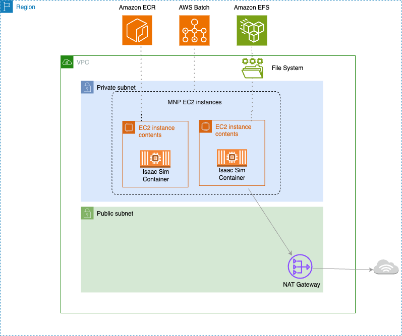

# NVIDIA Isaac Lab on AWS

이 실습에서는 AWS에서 Isaac Lab을 활용해 로봇 행동을 학습하는 방법을 배웁니다. 시뮬레이션된 로봇이 작업을 수행하도록 학습시키고, AWS Batch로 여러 컴퓨팅 노드에 걸쳐 학습을 확장하여 프로세스를 가속화합니다.

* [**AWS Batch**](https://docs.aws.amazon.com/ko_kr/batch/latest/userguide/what-is-batch.html): 워크로드 양과 규모에 따라 컴퓨팅 리소스를 자동으로 프로비저닝하고 워크로드 분산을 최적화하여, 비용을 절감하면서도 단일 GPU 인스턴스보다 훨씬 짧은 시간에 정교한 로봇 학습을 수행할 수 있습니다.
* [**Amazon ECR**](https://docs.aws.amazon.com/ko_kr/AmazonECR/latest/userguide/what-is-ecr.html): Docker 컨테이너를 활용하면 설정 시간을 크게 줄이고, 대규모 분산 학습과 시뮬레이션 프로그램 전반에 걸쳐 재사용 가능한 자산과 일관된 표준을 제공할 수 있습니다.
* [**Amazon EFS**](https://docs.aws.amazon.com/ko_kr/efs/latest/ug/whatisefs.html): 배치 작업 실행 간 학습 체크포인트와 결과를 영구적으로 보관하여 작업 중단 없이 지속적인 학습이 가능합니다.
* [**AWS CDK**](https://docs.aws.amazon.com/ko_kr/cdk/v2/guide/home.html): 프로그래밍 언어로 클라우드 인프라를 정의하고, 한 번의 명령으로 전체 환경을 자동 프로비저닝하여 팀 간 표준화된 환경을 빠르게 공유할 수 있습니다.

### Physical AI와 Sim-to-Real 파이프라인

Physical AI는 실제 물리 세계에서 동작하는 로봇을 위한 AI입니다. 로봇이 걷기, 물건 잡기 등의 동작을 학습하려면 수백만 번의 시행착오가 필요한데, 실제 로봇으로 이를 수행하면 시간과 비용이 막대하고 로봇이 파손될 위험이 있습니다.

**Sim-to-Real** 접근법은 이 문제를 해결합니다:
1. **시뮬레이션 환경 구축** — GPU 가속 물리 엔진(PhysX)으로 현실과 유사한 환경을 생성
2. **대규모 병렬 학습** — 수천 개의 가상 로봇을 동시에 시뮬레이션하며 강화학습 수행
3. **분산 학습으로 가속** — 여러 GPU/노드에 걸쳐 학습을 분산하여 수일 걸릴 작업을 수시간으로 단축
4. **실제 로봇에 배포** — 학습된 정책(Policy)을 실제 로봇 하드웨어에 전이(Transfer)

이 워크숍에서는 1~4단계를 AWS 인프라에서 실습합니다.

### 아키텍처 설명

<figure><figcaption></figcaption></figure>

AWS Batch에 NVIDIA Isaac Lab을 배포하는 전체 아키텍처 입니다. 인프라는 [AWS CDK](https://github.com/hi-space/aws-physical-ai-recipes/tree/main/isaac-lab-workshop/infra-multiuser-groot)로 정의되어 있으며, 한 번의 배포로 전체 환경이 자동 구성됩니다.

* NVIDIA Isaac Sim 도커 이미지와 Isaac Lab Github 레포지토리로 Custom 도커 컨테이터를 빌드하고 테스트합니다. 이 작업은 Amazon DCV가 설치된 EC2 인스턴스에서 원격 데스크톱으로 진행할 수 있습니다. 검증된 컨테이너는 Amazon ECR에 업로드됩니다.
* [AWS Batch 멀티노드 병렬 작업 (MNP, Multi-node parallel jobs)](https://docs.aws.amazon.com/batch/latest/userguide/multi-node-parallel-jobs.html)을 시작하면, 필요한 노드 수만큼 컴퓨팅과 네트워킹 리소스가 자동으로 프로비저닝됩니다. NVIDIA Isaac Lab이 노드 간 통신을 조율하여 분산 학습을 진행합니다.
* [Amazon EFS](https://docs.aws.amazon.com/ko_kr/efs/latest/ug/whatisefs.html)는 배치 작업 실행 간 데이터를 영구 보관합니다. 메인 노드가 MNP 클러스터 전체의 학습 결과를 수집하고, 학습된 모델의 체크포인트와 로그를 EFS에 저장합니다.
* 저장된 데이터는 추후 다른 AWS Batch 작업이나 EC2 인스턴스에서 분석 및 평가에 활용할 수 있습니다.

### **실습 과정**

[**1. 클라우드 인프라 준비 및 환경 확인**](1.-infra-setup.md)

AWS CDK로 환경을 자동으로 프로비저닝합니다. VPC, EC2 GPU 인스턴스(DCV), AWS Batch, EFS, ECR 등 모든 리소스가 한 번의 명령으로 생성됩니다. EC2 단일 인스턴스에서 시뮬레이션과 학습이 정상 작동하는지 확인한 후, 검증된 컨테이너를 Amazon ECR에 업로드합니다.

[**2. Isaac Lab 강화학습 실행**](2.-isaac-lab.md)

Isaac Lab을 사용하여 GPU 가속 물리 시뮬레이션 환경에서 휴머노이드 로봇의 보행을 강화학습(PPO)으로 학습합니다. 수천 개의 가상 로봇을 동시에 시뮬레이션하며 제어 정책(Policy)을 최적화합니다.

[**3. AWS Batch를 활용한 대규모 학습**](3.-aws-batch.md)

검증된 컨테이너로 AWS Batch 멀티노드 병렬 작업을 시작합니다. 여러 노드로 자동 확장되며, AWS Batch가 오케스트레이션을 담당합니다. 학습 중 체크포인트와 결과는 EFS에 저장되고, 로그는 CloudWatch에 기록됩니다.

[**4. IsaacSim에서 학습된 모델 로드**](4.-isaacsim.md)

EC2 인스턴스에서 학습된 모델을 IsaacSim에 로드하여 시각적으로 성능을 확인합니다. 개선점을 파악하고 다시 학습하는 과정을 AWS Batch로 빠르게 반복하여, 새로운 로봇 동작을 신속하게 개발할 수 있습니다.

[**5. GR00T N1 추론 테스트**](5.-gr00t-n1.md)

NVIDIA GR00T N1 Foundation Model을 활용하여 자연어 명령과 카메라 영상 기반의 로봇 제어를 테스트합니다. RL Policy와 VLA Model의 차이를 비교하고, Foundation Model 기반 로봇 제어의 가능성을 확인합니다.

[**6. GR00T Fine-tuning on AWS Batch**](6.-gr00t-finetune.md)

커스텀 로봇 데이터셋에 맞게 GR00T VLA 모델을 fine-tuning합니다. CDK가 CodeBuild를 자동으로 트리거하여 학습 컨테이너를 빌드하고, AWS Batch에서 GPU 학습을 실행합니다. 학습 결과는 EFS를 통해 DCV에서 바로 확인할 수 있습니다.

[**부록. 실무 팁 및 참고 사항**](99-tips.md)

S3, EFS, ECR 등 워크숍에서 활용하는 AWS 서비스의 사용법과 EC2 인스턴스 SSH 접속 방법을 정리합니다.

***

### References

* [**\[GitHub\]** AWS Physical AI Recipes — Isaac Lab Workshop CDK](https://github.com/hi-space/aws-physical-ai-recipes/tree/main/isaac-lab-workshop/infra-multiuser-groot)
* [**\[Workshop Studio\]** NVIDIA Isaac Lab on AWS](https://catalog.us-east-1.prod.workshops.aws/workshops/075ce3fe-6888-4ea9-986e-5bdd1b767ef7/en-US)
* [**\[AWS Blog\]** Scale Reinforcement Learning with AWS Batch Multi-Node Parallel Jobs](https://aws.amazon.com/blogs/hpc/scale-reinforcement-learning-with-aws-batch-multi-node-parallel-jobs/)
