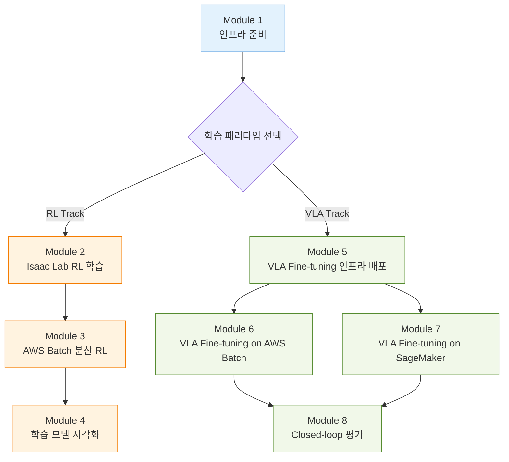

# Physical AI End-to-End on AWS

이 워크숍은 AWS 인프라 위에서 Physical AI의 두 가지 핵심 학습 패러다임을 모두 다룹니다. NVIDIA Isaac Lab으로 휴머노이드 로봇의 **강화학습(RL) 정책**을 학습시키고, NVIDIA GR00T로 자연어 명령을 따르는 **Vision-Language-Action(VLA) Foundation Model**을 fine-tuning한 뒤, 시뮬레이션 환경에서 closed-loop으로 검증합니다.

* [**AWS Batch**](https://docs.aws.amazon.com/ko_kr/batch/latest/userguide/what-is-batch.html): 워크로드 양과 규모에 따라 컴퓨팅 리소스를 자동으로 프로비저닝하고 워크로드 분산을 최적화하여, 비용을 절감하면서도 단일 GPU 인스턴스보다 훨씬 짧은 시간에 정교한 로봇 학습을 수행할 수 있습니다.
* [**Amazon SageMaker**](https://docs.aws.amazon.com/ko_kr/sagemaker/latest/dg/whatis.html): Training Job으로 GR00T VLA 모델을 학습하고, Model Registry로 버전을 관리하며, Real-time Endpoint로 즉시 REST API 추론 환경을 제공합니다.
* [**Amazon ECR**](https://docs.aws.amazon.com/ko_kr/AmazonECR/latest/userguide/what-is-ecr.html): Docker 컨테이너를 활용하면 설정 시간을 크게 줄이고, 대규모 분산 학습과 시뮬레이션 프로그램 전반에 걸쳐 재사용 가능한 자산과 일관된 표준을 제공할 수 있습니다.
* [**Amazon EFS**](https://docs.aws.amazon.com/ko_kr/efs/latest/ug/whatisefs.html): RL 체크포인트, GR00T fine-tuning 결과, 시뮬레이션 에셋을 여러 인스턴스가 공유하여 학습 → 추론 → 평가 단계를 끊김 없이 연결합니다.
* [**AWS CDK**](https://docs.aws.amazon.com/ko_kr/cdk/v2/guide/home.html): 프로그래밍 언어로 클라우드 인프라를 정의하고, 한 번의 명령으로 전체 환경을 자동 프로비저닝하여 팀 간 표준화된 환경을 빠르게 공유할 수 있습니다.

### Physical AI와 두 가지 학습 패러다임

Physical AI는 실제 물리 세계에서 동작하는 로봇을 위한 AI입니다. 로봇이 걷기, 물건 잡기 등의 동작을 학습하려면 수백만 번의 시행착오가 필요한데, 실제 로봇으로 이를 수행하면 시간과 비용이 막대하고 로봇이 파손될 위험이 있습니다.

이 워크숍에서는 Sim-to-Real 접근법으로 두 가지 핵심 패러다임을 학습합니다:

| 구분 | 강화학습 (RL Policy) | Vision-Language-Action (VLA Model) |
|------|---------------------|------------------------------------|
| **대표 모델** | Isaac Lab + PPO (skrl) | NVIDIA GR00T N1.6/N1.7 (3B params) |
| **입력** | 관절 상태, IMU, 접촉 센서 | 카메라 영상 + 자연어 명령 + 관절 상태 |
| **출력** | 단일 태스크 관절 토크/위치 | 16-step 미래 액션 (action horizon) |
| **학습 방식** | 시뮬레이션 시행착오로 from scratch | 대규모 사전학습 + 커스텀 데이터셋 fine-tuning |
| **태스크 범위** | 단일 태스크 (예: 휴머노이드 보행) | 범용 (자연어로 다양한 태스크 지시) |
| **이 워크숍 모듈** | Module 2-4 | Module 5-8 |

두 패러다임 모두 **동일한 AWS 인프라**([Module 1](1.-infra-setup.md))를 공유하며, 학습 결과는 EFS를 통해 즉시 시각화·평가할 수 있습니다.

### 아키텍처

전체 인프라는 [AWS CDK](https://github.com/hi-space/aws-physical-ai-recipes/tree/main/isaac-lab-workshop/infra-multiuser-groot)로 정의되어 있으며, 한 번의 배포로 RL과 VLA 모두에 필요한 환경이 자동 구성됩니다.

* **DCV 인스턴스 (EC2 GPU)**: Isaac Sim/Isaac Lab Docker 이미지를 빌드하고 시뮬레이션을 시각적으로 확인합니다. 검증된 컨테이너는 Amazon ECR에 업로드됩니다.
* **AWS Batch 멀티노드 병렬 작업 (MNP)**: [Multi-node parallel jobs](https://docs.aws.amazon.com/batch/latest/userguide/multi-node-parallel-jobs.html)로 RL 학습과 GR00T fine-tuning을 분산 실행합니다. NCCL AllReduce로 노드 간 gradient를 동기화합니다.
* **Amazon SageMaker** (선택): GR00T VLA 모델 학습 및 Real-time Endpoint 배포로 실시간 추론을 제공합니다.
* **Amazon EFS**: 멀티노드 학습 중 체크포인트와 로그를 영구 보관하며, DCV 인스턴스에서 동일 EFS를 마운트하여 별도 파일 복사 없이 평가에 활용할 수 있습니다.

***

### 실습 과정

#### Module 1. 공통 인프라

[**1. 클라우드 인프라 준비 및 환경 확인**](1.-infra-setup.md)

AWS CDK로 환경을 자동으로 프로비저닝합니다. VPC, EC2 GPU 인스턴스(DCV), AWS Batch, EFS, ECR 등 모든 리소스가 한 번의 명령으로 생성됩니다. EC2 단일 인스턴스에서 시뮬레이션과 학습이 정상 작동하는지 확인한 후, 검증된 컨테이너를 Amazon ECR에 업로드합니다.

#### RL Track — Isaac Lab으로 휴머노이드 로봇 강화학습

[**2. Isaac Lab 강화학습 실행**](2.-isaac-lab.md)

Isaac Lab을 사용하여 GPU 가속 물리 시뮬레이션 환경에서 Unitree H1 휴머노이드 로봇의 거친 지형 보행을 [skrl](https://skrl.readthedocs.io/) PPO로 학습합니다. 단일 GPU에서 2,048개의 가상 로봇을 동시에 시뮬레이션하며 제어 정책(Policy)을 최적화합니다.

[**3. AWS Batch를 활용한 대규모 RL 학습**](3.-aws-batch.md)

검증된 컨테이너로 AWS Batch 멀티노드 병렬 작업(MNP)을 시작합니다. 2노드 × 4 GPU = 총 8 GPU 환경에서 NCCL AllReduce로 gradient를 동기화하며, Compute Environment / Job Definition / Job Queue / Job 4단계 구성요소를 직접 만들어 봅니다. 학습 중 체크포인트와 TensorBoard 로그는 EFS에 저장되어 DCV에서 실시간으로 모니터링할 수 있습니다.

[**4. IsaacSim에서 학습된 모델 시각화**](4.-isaacsim.md)

EFS를 마운트한 Docker 컨테이너에서 학습된 RL 정책을 IsaacSim에 로드하여 추론(`play.py`) 모드로 실행합니다. 사전 학습된 72,000 iteration 모델과 직접 학습한 `best_agent.pt`를 비교하고, 검증된 체크포인트는 EFS에서 S3로 아카이빙하여 장기 보관합니다.

#### VLA Track — GR00T Foundation Model로 자연어 기반 로봇 제어

[**5. VLA Fine-tuning 인프라 배포**](5.-gr00t-n1.md)

NVIDIA GR00T N1 (3B params) Vision-Language-Action 모델의 fine-tuning에 사용할 `infra-groot-finetune` CDK 스택을 배포하여 CodeBuild·ECR·AWS Batch 환경을 구성하고, 빌드된 컨테이너 이미지로 ZMQ 기반 Policy Server를 띄워 base 모델 추론까지 검증합니다. 자연어 명령과 카메라 영상으로부터 16-step action horizon을 생성하는 receding horizon 제어 방식을 함께 확인합니다.

[**6. VLA Fine-tuning on AWS Batch**](6.-finetune-batch.md)

AWS Batch에서 커스텀 로봇 데이터셋(SO-101, leisaac-pick-orange)으로 GR00T VLA 모델을 fine-tuning합니다. 단일 노드 학습부터 Multi-Node Multi-GPU 분산 학습까지 다루며, CodeBuild가 자동 빌드한 학습 이미지를 사용합니다. 결과 체크포인트는 EFS에서 DCV로 바로 접근 가능합니다.

[**7. VLA Fine-tuning on SageMaker**](7.-finetune-sagemaker.md)

AWS SageMaker로 동일한 데이터셋을 학습합니다. Training Job → Model Registry → Real-time Endpoint 배포까지 전체 MLOps 파이프라인을 구성하여 REST API로 즉시 호출 가능한 추론 환경을 만듭니다. [Module 6](6.-finetune-batch.md)의 Batch 결과와 학습 곡선을 비교하여 두 인프라의 트레이드오프를 이해합니다.

[**8. Isaac Lab Closed-loop 평가**](8.-evaluation.md)

[LeIsaac](https://github.com/LightwheelAI/leisaac) 프레임워크로 fine-tuned GR00T 모델을 Isaac Lab 시뮬레이션에서 closed-loop으로 평가합니다. SO-101 로봇이 주방 씬에서 오렌지를 집어 접시에 올리는 태스크를 자연어 명령으로 수행하며, `eval_rounds` 기반 성공률을 측정합니다.

#### 부록

[**부록. 실무 팁 및 참고 사항**](99-tips.md)

S3, EFS, ECR 등 워크숍에서 활용하는 AWS 서비스의 사용법과 EC2 인스턴스 SSH 접속 방법을 정리합니다.

***

### References

* [**\[GitHub\]** AWS Physical AI Recipes — Isaac Lab Workshop CDK](https://github.com/hi-space/aws-physical-ai-recipes/tree/main/isaac-lab-workshop/infra-multiuser-groot)
* [**\[Workshop Studio\]** NVIDIA Isaac Lab on AWS](https://catalog.us-east-1.prod.workshops.aws/workshops/075ce3fe-6888-4ea9-986e-5bdd1b767ef7/en-US)
* [**\[AWS Blog\]** Scale Reinforcement Learning with AWS Batch Multi-Node Parallel Jobs](https://aws.amazon.com/blogs/hpc/scale-reinforcement-learning-with-aws-batch-multi-node-parallel-jobs/)
* [**\[NVIDIA\]** Isaac Lab Documentation](https://isaac-sim.github.io/IsaacLab/)
* [**\[NVIDIA\]** GR00T Foundation Model](https://developer.nvidia.com/gr00t)
