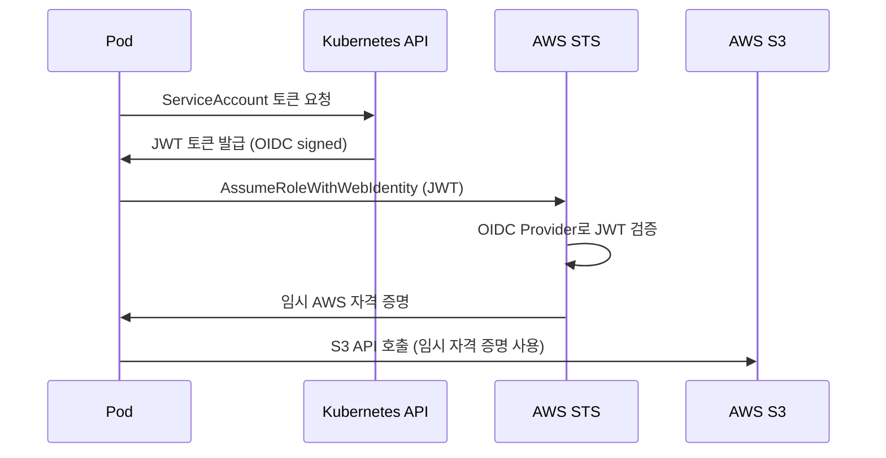

# 3. IRSA 및 보안 구성

EKS Pod에서 S3, Secrets Manager 등 AWS 서비스에 접근하려면 IRSA(IAM Roles for Service Accounts)를 설정해야 합니다. 이 단계에서는 OIDC Provider 등록, IAM Role 생성, Kubernetes ServiceAccount 연결을 진행합니다.

---

### 3.1 OIDC Provider 등록

OIDC(OpenID Connect) Provider는 EKS 클러스터가 발급한 토큰을 AWS IAM이 신뢰할 수 있도록 연결하는 "다리" 역할입니다. 이 등록이 없으면 Pod에서 발급받은 토큰으로는 AWS 서비스에 접근할 수 없습니다.

EKS 클러스터의 OIDC 발급자를 IAM에 등록합니다:

```bash
# OIDC URL 확인
OIDC_URL=$(aws eks describe-cluster --name osmo-eks \
  --query 'cluster.identity.oidc.issuer' --output text)
echo "OIDC URL: $OIDC_URL"

# OIDC Provider의 Thumbprint 가져오기
OIDC_HOST=$(echo $OIDC_URL | sed 's|https://||')
THUMBPRINT=$(echo | openssl s_client -servername $OIDC_HOST \
  -connect $OIDC_HOST:443 2>/dev/null | \
  openssl x509 -fingerprint -noout | sed 's/://g' | cut -d= -f2 | tr '[:upper:]' '[:lower:]')

# IAM에 OIDC Provider 등록
aws iam create-open-id-connect-provider \
  --url "$OIDC_URL" \
  --client-id-list sts.amazonaws.com \
  --thumbprint-list "$THUMBPRINT"
```

확인:

```bash
aws iam list-open-id-connect-providers | grep "us-east-1"
```


OIDC Provider ARN에는 클러스터 이름이 아닌 고유 ID(해시)가 포함됩니다. 따라서 리전명으로 필터링합니다.


---

### 3.2 환경 변수 설정

이후 명령어에서 반복 사용할 변수를 설정합니다:

```bash
export ACCOUNT_ID=$(aws sts get-caller-identity --query Account --output text)
export OIDC_PROVIDER=$(echo $OIDC_URL | sed 's|https://||')
export BUCKET=$(aws cloudformation describe-stacks --stack-name Osmo \
  --query 'Stacks[0].Outputs[?OutputKey==`S3BucketName`].OutputValue' --output text)

echo "Account: $ACCOUNT_ID"
echo "OIDC: $OIDC_PROVIDER"
echo "Bucket: $BUCKET"
```

---

### 3.3 Cluster Autoscaler IAM Role

Cluster Autoscaler가 ASG(Auto Scaling Group)를 제어할 수 있도록 IAM Role을 생성합니다.

**Trust Policy vs Inline Policy:**
- **Trust Policy**: "누가 이 역할을 사용할 수 있는가?" — 여기서는 `kube-system:cluster-autoscaler` ServiceAccount만 허용
- **Inline Policy**: "이 역할로 무엇을 할 수 있는가?" — ASG 조회, 용량 변경, 인스턴스 종료 등

```bash
# Trust Policy 생성
cat > /tmp/ca-trust-policy.json <<EOF
{
  "Version": "2012-10-17",
  "Statement": [{
    "Effect": "Allow",
    "Principal": {
      "Federated": "arn:aws:iam::${ACCOUNT_ID}:oidc-provider/${OIDC_PROVIDER}"
    },
    "Action": "sts:AssumeRoleWithWebIdentity",
    "Condition": {
      "StringEquals": {
        "${OIDC_PROVIDER}:sub": "system:serviceaccount:kube-system:cluster-autoscaler",
        "${OIDC_PROVIDER}:aud": "sts.amazonaws.com"
      }
    }
  }]
}
EOF

# IAM Role 생성
aws iam create-role \
  --role-name osmo-cluster-autoscaler-role \
  --assume-role-policy-document file:///tmp/ca-trust-policy.json

# 정책 연결
aws iam put-role-policy \
  --role-name osmo-cluster-autoscaler-role \
  --policy-name cluster-autoscaler-policy \
  --policy-document '{
    "Version": "2012-10-17",
    "Statement": [{
      "Effect": "Allow",
      "Action": [
        "autoscaling:DescribeAutoScalingGroups",
        "autoscaling:DescribeAutoScalingInstances",
        "autoscaling:DescribeLaunchConfigurations",
        "autoscaling:DescribeScalingActivities",
        "autoscaling:DescribeTags",
        "autoscaling:SetDesiredCapacity",
        "autoscaling:TerminateInstanceInAutoScalingGroup",
        "ec2:DescribeLaunchTemplateVersions",
        "ec2:DescribeInstanceTypes",
        "ec2:DescribeImages",
        "ec2:GetInstanceTypesFromInstanceRequirements",
        "eks:DescribeNodegroup"
      ],
      "Resource": "*"
    }]
  }'
```

---

### 3.4 Cluster Autoscaler에 IRSA 적용

생성한 IAM Role을 Cluster Autoscaler ServiceAccount에 연결합니다:

```bash
helm upgrade --install cluster-autoscaler autoscaler/cluster-autoscaler \
  --namespace kube-system \
  --set autoDiscovery.clusterName=osmo-eks \
  --set awsRegion=us-east-1 \
  --set image.tag=v1.30.2 \
  --set rbac.serviceAccount.create=true \
  --set rbac.serviceAccount.name=cluster-autoscaler \
  --set rbac.serviceAccount.annotations."eks\.amazonaws\.com/role-arn"=arn:aws:iam::${ACCOUNT_ID}:role/osmo-cluster-autoscaler-role
```

Pod를 재시작하여 새 IAM Role을 적용합니다:

```bash
kubectl delete pod -n kube-system -l app.kubernetes.io/name=aws-cluster-autoscaler
```

정상 동작 확인:

```bash
kubectl logs -n kube-system -l app.kubernetes.io/name=aws-cluster-autoscaler | grep "Refreshed ASG list"
```

**정상 출력:**

```
Refreshed ASG list, next refresh after 2026-...
```

---

### 3.5 OSMO Workload IAM Role

OSMO 워크플로 Pod에서 S3와 Secrets Manager에 접근할 수 있도록 IAM Role을 생성합니다:

```bash
# Trust Policy 생성
cat > /tmp/workload-trust-policy.json <<EOF
{
  "Version": "2012-10-17",
  "Statement": [{
    "Effect": "Allow",
    "Principal": {
      "Federated": "arn:aws:iam::${ACCOUNT_ID}:oidc-provider/${OIDC_PROVIDER}"
    },
    "Action": "sts:AssumeRoleWithWebIdentity",
    "Condition": {
      "StringLike": {
        "${OIDC_PROVIDER}:sub": "system:serviceaccount:osmo:*",
        "${OIDC_PROVIDER}:aud": "sts.amazonaws.com"
      }
    }
  }]
}
EOF

# IAM Role 생성
aws iam create-role \
  --role-name osmo-workload-role \
  --assume-role-policy-document file:///tmp/workload-trust-policy.json

# S3 + Secrets Manager 정책 연결
aws iam put-role-policy \
  --role-name osmo-workload-role \
  --policy-name osmo-s3-access \
  --policy-document "{
    \"Version\": \"2012-10-17\",
    \"Statement\": [
      {
        \"Effect\": \"Allow\",
        \"Action\": [\"s3:GetObject\",\"s3:PutObject\",\"s3:ListBucket\",\"s3:DeleteObject\"],
        \"Resource\": [
          \"arn:aws:s3:::${BUCKET}\",
          \"arn:aws:s3:::${BUCKET}/*\"
        ]
      },
      {
        \"Effect\": \"Allow\",
        \"Action\": [\"secretsmanager:GetSecretValue\"],
        \"Resource\": \"arn:aws:secretsmanager:us-east-1:${ACCOUNT_ID}:secret:osmo-db-secret-*\"
      }
    ]
  }"
```

---

### 3.6 Kubernetes ServiceAccount 생성

IAM Role을 Kubernetes ServiceAccount에 연결합니다:

```bash
kubectl apply -f - <<EOF
apiVersion: v1
kind: ServiceAccount
metadata:
  name: osmo-workload
  namespace: osmo
  annotations:
    eks.amazonaws.com/role-arn: arn:aws:iam::${ACCOUNT_ID}:role/osmo-workload-role
EOF
```

확인:

```bash
kubectl get sa -n osmo osmo-workload -o yaml | grep eks.amazonaws.com
```

**정상 출력:**

```
eks.amazonaws.com/role-arn: arn:aws:iam::123456789012:role/osmo-workload-role
```

---

### 3.7 SecretProviderClass 설정

Secrets Store CSI Driver를 통해 DB 비밀번호를 Pod에 마운트할 수 있도록 설정합니다:

```bash
kubectl apply -f - <<'EOF'
apiVersion: secrets-store.csi.x-k8s.io/v1
kind: SecretProviderClass
metadata:
  name: osmo-db-secret
  namespace: osmo
spec:
  provider: aws
  parameters:
    objects: |
      - objectName: "osmo-db-secret"
        objectType: "secretsmanager"
        jmesPath:
          - path: username
            objectAlias: db-username
          - path: password
            objectAlias: db-password
EOF
```

---

### 핵심 개념: IRSA란?



IRSA는 Pod 레벨에서 최소 권한 원칙을 적용합니다. EC2 Instance Profile과 달리, 같은 노드의 다른 Pod는 해당 권한을 사용할 수 없습니다.

---

### Troubleshooting

| 증상 | 원인 | 해결 |
|------|------|------|
| `Unable to locate credentials` | ServiceAccount annotation 누락 | `kubectl describe sa -n osmo osmo-workload`로 annotation 확인 |
| `AccessDenied` on S3 | IAM Policy의 Resource ARN 불일치 | 버킷명이 정확한지 확인 |
| CA `no EC2 IMDS role found` | CA에 IRSA 미적용 | 3.4 단계 재실행 후 Pod 재시작 |
| `WebIdentityErr` | OIDC Provider 미등록 | `aws iam list-open-id-connect-providers`로 확인 |
