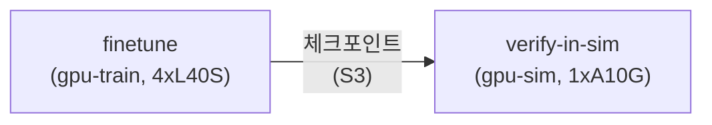
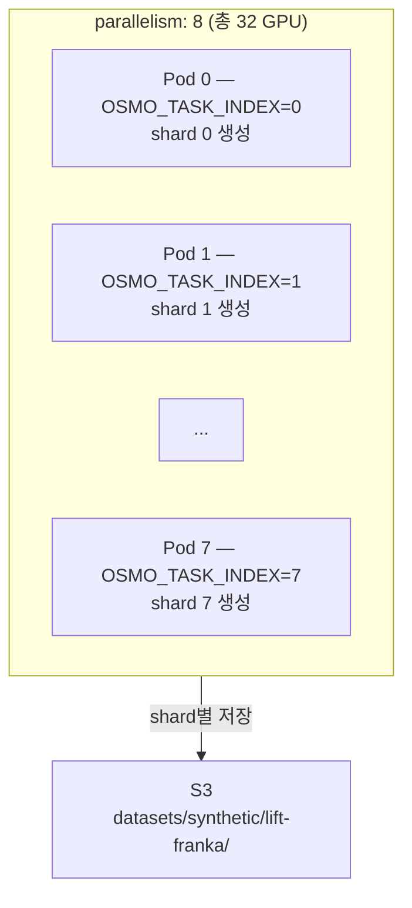

# 5. OSMO Workflow 실행

인프라 검증이 완료되었으므로, OSMO workflow를 사용하여 Physical AI 파이프라인을 실행합니다. GR00T VLA 모델 fine-tuning과 Isaac Sim 환경에서의 policy 검증을 자동화된 파이프라인으로 수행합니다.

---

### 5.1 핵심 개념: OSMO Workflow

OSMO workflow는 YAML 한 장으로 멀티 스테이지 파이프라인을 정의합니다:



| 필드 | 설명 |
|------|------|
| `name` | 작업 식별자 |
| `image` | 컨테이너 이미지 |
| `platform` | 스케줄링 대상 노드 풀 (gpu-train, gpu-sim) |
| `resources.gpu` | 요청 GPU 수 |
| `inputs` | 의존 작업 (완료 후 실행) |
| `parallelism` | 병렬 Pod 수 |
| `volumes` | S3 볼륨 마운트 |

---

### 5.2 사전 준비: HuggingFace 모델 접근 승인

GR00T-N1.7-3B 모델은 HuggingFace에서 게이트 모델로 관리됩니다. 학습 실행 전 아래 두 모델에 대한 접근 승인이 필요합니다:

1. [nvidia/GR00T-N1.7-3B](https://huggingface.co/nvidia/GR00T-N1.7-3B) — "Agree and access" 클릭
2. [nvidia/Cosmos-Reason2-2B](https://huggingface.co/nvidia/Cosmos-Reason2-2B) — "Agree and access" 클릭 (GR00T의 backbone 모델)

승인 후 HuggingFace 토큰을 생성합니다:
- [HuggingFace Settings → Access Tokens](https://huggingface.co/settings/tokens)에서 `Read` 권한 토큰 생성

```bash
export HF_TOKEN="hf_your_token_here"
```


GR00T-N1.7은 내부적으로 Cosmos-Reason2-2B를 backbone으로 사용합니다. 두 모델 모두 접근 승인이 필요하며, 승인 없이 실행하면 `403 Forbidden` 오류가 발생합니다.


---

### 5.3 데이터셋 준비

OSMO workflow의 컨테이너들은 S3 볼륨 마운트를 통해 데이터에 접근합니다. 따라서 학습 데이터를 미리 S3에 업로드해두어야 합니다.

학습에 사용할 데이터셋을 S3에 업로드합니다:

```bash
export BUCKET=$(aws cloudformation describe-stacks --stack-name Osmo \
  --query 'Stacks[0].Outputs[?OutputKey==`S3BucketName`].OutputValue' --output text)
echo "Bucket: $BUCKET"
```

**빠른 테스트 (demo 데이터 사용):**

GR00T 리포지토리에는 `demo_data/cube_to_bowl_5` 샘플 데이터셋이 포함되어 있어 별도 업로드 없이 바로 fine-tuning을 테스트할 수 있습니다.

**커스텀 데이터셋:**

```bash
# S3에 업로드
aws s3 sync ./my-dataset s3://$BUCKET/datasets/groot/my-dataset/

# 업로드 확인
aws s3 ls s3://$BUCKET/datasets/groot/my-dataset/ --summarize
```


GR00T fine-tuning은 [GR00T-flavored LeRobot v2 형식](https://github.com/NVIDIA/Isaac-GR00T/blob/n1.7-release/getting_started/data_preparation.md)의 데이터셋을 사용합니다. `meta/modality.json`, `data/chunk-*/episode_*.parquet`, `videos/chunk-*/` 구조가 필요합니다.


---

### 5.4 Workflow YAML 확인

#### GR00T Fine-tuning → Isaac Sim 검증

```bash
cat ~/aws-physical-ai-recipes/osmo/workflows/groot-train-sim.yaml
```

```yaml
workflow:
  tasks:
    - name: finetune
      image: nvidia/cuda:12.8.0-devel-ubuntu22.04
      platform: gpu-train
      resources:
        gpu: 4
      env:
        - name: HF_TOKEN
          value: "${HF_TOKEN}"
        - name: PYTHONPATH
          value: "/opt/gr00t"
      command: |
        set -ex
        apt-get update && apt-get install -y git git-lfs python3-pip ffmpeg libgl1
        ln -sf /usr/bin/python3 /usr/bin/python
        git lfs install

        pip install --no-cache-dir torch==2.7.1 torchvision==0.22.1 \
          --index-url https://download.pytorch.org/whl/cu128
        pip install --no-cache-dir \
          "https://github.com/Dao-AILab/flash-attention/releases/download/v2.7.4.post1/flash_attn-2.7.4.post1+cu12torch2.7cxx11abiFALSE-cp310-cp310-linux_x86_64.whl"

        git clone --depth 1 --branch n1.7-release \
          https://github.com/NVIDIA/Isaac-GR00T.git /opt/gr00t
        cd /opt/gr00t && git lfs pull

        pip install --no-cache-dir albumentations==1.4.18 av==16.1.0 \
          transformers==4.57.3 datasets==3.6.0 deepspeed==0.17.6 \
          accelerate peft==0.17.1 "huggingface-hub[cli]" awscli ...

        huggingface-cli login --token $HF_TOKEN

        NUM_GPUS=4 MAX_STEPS=10000 USE_WANDB=0 GLOBAL_BATCH_SIZE=32 \
          bash examples/finetune.sh \
            --base-model-path nvidia/GR00T-N1.7-3B \
            --dataset-path /data/datasets/groot/my-dataset \
            --embodiment-tag NEW_EMBODIMENT \
            --modality-config-path examples/SO100/so100_config.py \
            --output-dir /data/checkpoints/groot-n1.7
      volumes:
        - s3://${OSMO_DATA_BUCKET}/datasets:/data/datasets
        - s3://${OSMO_DATA_BUCKET}/checkpoints:/data/checkpoints

    - name: verify-in-sim
      image: nvcr.io/nvidia/isaac-sim:4.5.0
      platform: gpu-sim
      resources:
        gpu: 1
      inputs:
        - task: finetune
      command: |
        python /opt/scripts/verify_policy.py \
          --checkpoint /data/checkpoints/groot-n1.7/checkpoint-10000 \
          --env Isaac-Lift-Franka-v0 \
          --num-episodes 20 \
          --success-threshold 0.8
      volumes:
        - s3://${OSMO_DATA_BUCKET}/checkpoints:/data/checkpoints
```

**파이프라인 동작 흐름:**

1. `finetune` 스테이지: gpu-train 노드(4×L40S)에서 GR00T-N1.7 모델을 4-GPU DDP로 학습
2. 학습 완료 → 체크포인트를 S3에 저장 (~12GB)
3. `verify-in-sim` 스테이지: gpu-sim 노드(1×A10G)에서 Isaac Sim 환경을 띄우고 학습된 policy를 20 에피소드 검증
4. 성공률 80% 이상이면 PASS


**GPU 메모리 요구사항**: GR00T-N1.7-3B (3.14B 파라미터)는 Adam optimizer 상태를 포함하면 ~30GB VRAM이 필요합니다. A10G(24GB)에서는 OOM이 발생하므로, 반드시 L40S(48GB) 이상의 gpu-train 노드에서 실행해야 합니다.


---

### 5.5 Workflow 제출

```bash
osmo workflow submit ~/aws-physical-ai-recipes/osmo/workflows/groot-train-sim.yaml \
  --set OSMO_DATA_BUCKET=$BUCKET \
  --set HF_TOKEN=$HF_TOKEN
```

제출 후 workflow ID가 출력됩니다:

```
Workflow submitted: wf-abc123def456
```

---

### 5.6 Workflow 모니터링

```bash
# 전체 상태 확인
osmo workflow query <workflow-id>

# 실시간 로그 — finetune 스테이지
osmo workflow logs <workflow-id> --task finetune

# 실시간 로그 — verify 스테이지
osmo workflow logs <workflow-id> --task verify-in-sim

# 실행 중인 Pod 확인
kubectl get pods -n osmo -w
```

**kubectl로 직접 모니터링:**

```bash
# Pod 상태
kubectl get pods -n osmo

# GPU 노드 상태
kubectl get nodes -l node-role=gpu-train
kubectl get nodes -l node-role=gpu-sim

# 실시간 이벤트
kubectl get events -n osmo --sort-by='.metadata.creationTimestamp' | tail -20
```

**학습 진행 로그 확인:**

```bash
# 학습 로그에서 loss/step 확인
kubectl logs -n osmo -l app=groot-finetune | grep -E "loss|step|INFO"
```

정상 학습 시 출력 예시:

```
05/03/2026 14:08:55 - INFO - Total parameters: 3,144,016,000
05/03/2026 14:08:55 - INFO - Trainable parameters: 1,620,515,968 (51.54%)
05/03/2026 14:09:02 - INFO - 🚀 Starting training...
{'loss': 1.1493, 'grad_norm': 4.38, 'learning_rate': 3.0e-06}
05/03/2026 14:10:38 - INFO - Training completed!
```

---

### 5.7 대규모 Synthetic Data 생성

Isaac Sim으로 합성 데이터를 대규모 병렬 생성합니다:

```bash
cat ~/aws-physical-ai-recipes/osmo/workflows/sim-datagen.yaml
```

```yaml
workflow:
  tasks:
    - name: generate
      image: nvcr.io/nvidia/isaac-sim:4.5.0
      platform: gpu-sim
      resources:
        gpu: 4
      parallelism: 8
      command: |
        python /opt/scripts/generate_data.py \
          --env Isaac-Lift-Franka-v0 \
          --num-episodes 10000 \
          --output-dir /data/datasets/synthetic/lift-franka \
          --shard-id ${OSMO_TASK_INDEX} \
          --total-shards 8
      volumes:
        - s3://${OSMO_DATA_BUCKET}/datasets:/data/datasets
```



제출:

```bash
osmo workflow submit ~/aws-physical-ai-recipes/osmo/workflows/sim-datagen.yaml \
  --set OSMO_DATA_BUCKET=$BUCKET
```

---

### 5.8 결과 확인

```bash
# 학습된 체크포인트 확인
aws s3 ls s3://$BUCKET/checkpoints/groot-n1.7/

# 체크포인트 상세 확인
aws s3 ls s3://$BUCKET/checkpoints/groot-n1.7/ --summarize --human-readable

# Synthetic 데이터 확인
aws s3 ls s3://$BUCKET/datasets/synthetic/lift-franka/

# 로컬로 다운로드
aws s3 cp s3://$BUCKET/checkpoints/groot-n1.7/ ./groot-checkpoint/ --recursive
```

---

### 5.9 커스텀 Workflow 작성

자신만의 파이프라인을 작성하려면 `workflows/` 디렉토리에 YAML을 추가합니다:

```yaml
workflow:
  tasks:
    - name: my-training
      image: nvidia/cuda:12.8.0-devel-ubuntu22.04
      platform: gpu-train
      resources:
        gpu: 4
      command: |
        # ... 환경 설정 ...
        bash examples/finetune.sh \
          --base-model-path nvidia/GR00T-N1.7-3B \
          --dataset-path /data/datasets/my-robot-data \
          --embodiment-tag NEW_EMBODIMENT \
          --modality-config-path /data/configs/my_modality_config.py \
          --output-dir /data/checkpoints/my-model
      volumes:
        - s3://${OSMO_DATA_BUCKET}/configs:/data/configs
        - s3://${OSMO_DATA_BUCKET}/datasets:/data/datasets
        - s3://${OSMO_DATA_BUCKET}/checkpoints:/data/checkpoints
```

**사전 검증:**

```bash
osmo workflow validate workflows/my-workflow.yaml
```

---

### 비용 참고

| 리소스 | 사양 | 시간당 비용 (us-east-1) |
|--------|------|------------------------|
| GPU-Train 노드 | g6e.12xlarge (4×L40S, 48GB each) | ~$4.99/대 |
| GPU-Sim 노드 | g5.12xlarge (4×A10G, 24GB each) | ~$5.67/대 |
| 기본 유지 | EKS + System + RDS + Redis + NAT | ~$0.67 |


GPU 노드는 0대로 시작하므로, workflow를 실행하지 않으면 GPU 비용이 발생하지 않습니다. 완료 후 10분 idle 시 Cluster Autoscaler가 자동으로 scale-down합니다.


---

### Troubleshooting

| 증상 | 원인 | 해결 |
|------|------|------|
| Pod Pending 장시간 | GPU 인스턴스 capacity 부족 | `kubectl describe pod`로 이벤트 확인. CA가 scale-up 트리거했는지 로그 확인 |
| `403 Forbidden` on HuggingFace | 모델 접근 미승인 | nvidia/GR00T-N1.7-3B와 nvidia/Cosmos-Reason2-2B 모두 승인 필요 |
| OOMKilled / CUDA OOM | GPU 메모리 부족 | A10G(24GB)에서는 OOM 발생. L40S(48GB) gpu-train 노드 사용 필수 |
| `ModuleNotFoundError` | 의존성 누락 | pyproject.toml의 전체 의존성 목록 확인. flash-attn은 pre-built wheel 사용 |
| ArrowInvalid (parquet) | Git LFS 미실행 | `git lfs install && git lfs pull` 확인 |
| S3 mount 실패 | IRSA 미적용 | Pod의 serviceAccountName 확인 |
| finetune 실패 → verify 미실행 | 정상 동작 (inputs 의존성) | finetune 로그에서 에러 확인 |
