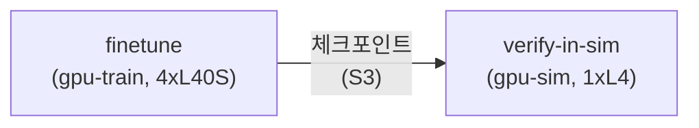
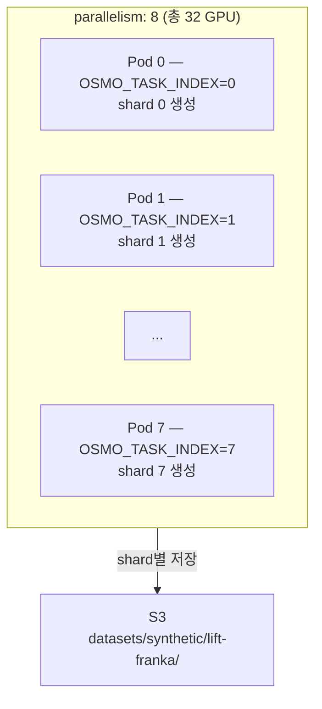

# 5. OSMO Workflow 실행

인프라 검증이 완료되었으므로, OSMO workflow를 사용하여 Physical AI 파이프라인을 실행합니다. GR00T VLA 모델 fine-tuning과 Isaac Sim 환경에서의 policy 검증을 자동화된 파이프라인으로 수행합니다.

---

### 5.1 핵심 개념: OSMO Workflow

OSMO workflow는 YAML 한 장으로 멀티 스테이지 파이프라인을 정의합니다:



| 필드 | 설명 |
|------|------|
| `name` | 작업 식별자 |
| `image` | NGC 컨테이너 이미지 |
| `platform` | 스케줄링 대상 노드 풀 (gpu-train, gpu-sim) |
| `resources.gpu` | 요청 GPU 수 |
| `inputs` | 의존 작업 (완료 후 실행) |
| `parallelism` | 병렬 Pod 수 |
| `volumes` | S3 볼륨 마운트 |

---

### 5.2 데이터셋 준비

OSMO workflow의 컨테이너들은 S3 볼륨 마운트를 통해 데이터에 접근합니다. 따라서 학습 데이터를 미리 S3에 업로드해두어야 합니다.

학습에 사용할 데이터셋을 S3에 업로드합니다:

```bash
export BUCKET=$(aws cloudformation describe-stacks --stack-name Osmo \
  --query 'Stacks[0].Outputs[?OutputKey==`S3BucketName`].OutputValue' --output text)
echo "Bucket: $BUCKET"
```

**ALOHA 데이터셋 예시:**

```bash
# 데이터셋 다운로드 (예시)
# git clone https://github.com/example/aloha-dataset.git /tmp/aloha-dataset

# S3에 업로드
aws s3 sync ./my-aloha-dataset s3://$BUCKET/datasets/groot/aloha/

# 업로드 확인
aws s3 ls s3://$BUCKET/datasets/groot/aloha/ --summarize
```


GR00T fine-tuning은 [LeRobot ALOHA 형식](https://github.com/huggingface/lerobot)의 데이터셋을 지원합니다. `observations`, `actions` 필드가 포함된 HDF5 또는 Parquet 파일을 준비하세요.


---

### 5.3 Workflow YAML 확인

#### GR00T Fine-tuning → Isaac Sim 검증

```bash
cat ~/aws-physical-ai-recipes/osmo/workflows/groot-train-sim.yaml
```

```yaml
workflow:
  tasks:
    - name: finetune
      image: nvcr.io/nvidia/gr00t:1.6.0
      platform: gpu-train
      resources:
        gpu: 4
      command: |
        torchrun --nproc_per_node=4 \
          /opt/gr00t/scripts/train.py \
          --dataset /data/datasets/groot/aloha \
          --output-dir /data/checkpoints/groot-aloha \
          --model gr00t-n1-2b \
          --epochs 50 \
          --batch-size 32
      volumes:
        - s3://${OSMO_DATA_BUCKET}/datasets:/data/datasets
        - s3://${OSMO_DATA_BUCKET}/checkpoints:/data/checkpoints

    - name: verify-in-sim
      image: nvcr.io/nvidia/isaac-sim:4.5.0
      platform: gpu-sim
      resources:
        gpu: 1
      inputs:
        - task: finetune
      command: |
        python /opt/scripts/verify_policy.py \
          --checkpoint /data/checkpoints/groot-aloha/model_final.pt \
          --env Isaac-Lift-Franka-v0 \
          --num-episodes 20 \
          --success-threshold 0.8
      volumes:
        - s3://${OSMO_DATA_BUCKET}/checkpoints:/data/checkpoints
```

**파이프라인 동작 흐름:**

1. `finetune` 스테이지: gpu-train 노드(4xL40S)에서 GR00T-N1 모델을 4-GPU DDP로 학습
2. 학습 완료 → 체크포인트를 S3에 저장
3. `verify-in-sim` 스테이지: gpu-sim 노드(1xL4)에서 Isaac Sim 환경을 띄우고 학습된 policy를 20 에피소드 검증
4. 성공률 80% 이상이면 PASS

---

### 5.4 Workflow 제출

```bash
osmo workflow submit ~/aws-physical-ai-recipes/osmo/workflows/groot-train-sim.yaml \
  --set OSMO_DATA_BUCKET=$BUCKET
```

제출 후 workflow ID가 출력됩니다:

```
Workflow submitted: wf-abc123def456
```

---

### 5.5 Workflow 모니터링

```bash
# 전체 상태 확인
osmo workflow query <workflow-id>

# 실시간 로그 — finetune 스테이지
osmo workflow logs <workflow-id> --task finetune

# 실시간 로그 — verify 스테이지
osmo workflow logs <workflow-id> --task verify-in-sim

# 실행 중인 Pod 확인
kubectl get pods -n osmo -w
```

**kubectl로 직접 모니터링:**

```bash
# Pod 상태
kubectl get pods -n osmo

# GPU 노드 상태
kubectl get nodes -l node-role=gpu-train
kubectl get nodes -l node-role=gpu-sim

# 실시간 이벤트
kubectl get events -n osmo --sort-by='.metadata.creationTimestamp' | tail -20
```

---

### 5.6 대규모 Synthetic Data 생성

Isaac Sim으로 합성 데이터를 대규모 병렬 생성합니다:

```bash
cat ~/aws-physical-ai-recipes/osmo/workflows/sim-datagen.yaml
```

```yaml
workflow:
  tasks:
    - name: generate
      image: nvcr.io/nvidia/isaac-sim:4.5.0
      platform: gpu-sim
      resources:
        gpu: 4
      parallelism: 8
      command: |
        python /opt/scripts/generate_data.py \
          --env Isaac-Lift-Franka-v0 \
          --num-episodes 10000 \
          --output-dir /data/datasets/synthetic/lift-franka \
          --shard-id ${OSMO_TASK_INDEX} \
          --total-shards 8
      volumes:
        - s3://${OSMO_DATA_BUCKET}/datasets:/data/datasets
```



제출:

```bash
osmo workflow submit ~/aws-physical-ai-recipes/osmo/workflows/sim-datagen.yaml \
  --set OSMO_DATA_BUCKET=$BUCKET
```

---

### 5.7 결과 확인

```bash
# 학습된 체크포인트 확인
aws s3 ls s3://$BUCKET/checkpoints/groot-aloha/

# Synthetic 데이터 확인
aws s3 ls s3://$BUCKET/datasets/synthetic/lift-franka/

# 로컬로 다운로드
aws s3 cp s3://$BUCKET/checkpoints/groot-aloha/model_final.pt ./
```

---

### 5.8 커스텀 Workflow 작성

자신만의 파이프라인을 작성하려면 `workflows/` 디렉토리에 YAML을 추가합니다:

```yaml
workflow:
  tasks:
    - name: my-training
      image: nvcr.io/nvidia/gr00t:1.6.0
      platform: gpu-train
      resources:
        gpu: 4
      command: |
        torchrun --nproc_per_node=4 my_train_script.py \
          --config /data/configs/my_config.yaml
      volumes:
        - s3://${OSMO_DATA_BUCKET}/configs:/data/configs
        - s3://${OSMO_DATA_BUCKET}/checkpoints:/data/checkpoints
```

**사전 검증:**

```bash
osmo workflow validate workflows/my-workflow.yaml
```

---

### 비용 참고

| 리소스 | 사양 | 시간당 비용 (us-west-2) |
|--------|------|------------------------|
| GPU-Sim 노드 | g5.12xlarge (4xL4) | ~$5.67/대 |
| GPU-Train 노드 | g6e.12xlarge (4xL40S) | ~$4.99/대 |
| 기본 유지 | EKS + System + RDS + Redis + NAT | ~$0.67 |


GPU 노드는 0대로 시작하므로, workflow를 실행하지 않으면 GPU 비용이 발생하지 않습니다. 완료 후 10분 idle 시 Cluster Autoscaler가 자동으로 scale-down합니다.


---

### Troubleshooting

| 증상 | 원인 | 해결 |
|------|------|------|
| Pod Pending 장시간 | GPU 인스턴스 capacity 부족 | `aws autoscaling describe-scaling-activities`로 확인. 리전/AZ 변경 고려 |
| OOMKilled | GPU 메모리 부족 | `--batch-size` 줄이기 또는 GPU 수 늘리기 |
| S3 mount 실패 | IRSA 미적용 | Pod의 serviceAccountName 확인 |
| finetune 실패 → verify 미실행 | 정상 동작 (inputs 의존성) | finetune 로그에서 에러 확인 |
