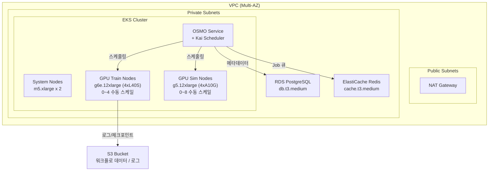
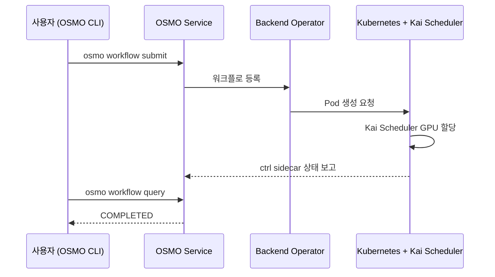

# NVIDIA OSMO on AWS EKS

이 실습에서는 AWS EKS 위에 NVIDIA OSMO를 배포하고, GR00T Fine-tuning 워크플로를 OSMO CLI로 실행합니다. CDK로 인프라를 원클릭 배포하고, OSMO workflow YAML 한 장으로 GPU 학습을 오케스트레이션합니다.

* [**Amazon EKS**](https://docs.aws.amazon.com/eks/latest/userguide/what-is-eks.html): 관리형 Kubernetes 서비스로 OSMO 서비스와 GPU 워크로드를 실행합니다.
* [**Amazon S3**](https://docs.aws.amazon.com/AmazonS3/latest/userguide/Welcome.html): 학습 데이터셋, 워크플로 로그, 모델 체크포인트를 저장합니다.
* [**Amazon RDS**](https://docs.aws.amazon.com/AmazonRDS/latest/UserGuide/CHAP_PostgreSQL.html): OSMO 메타데이터와 워크플로 상태를 저장하는 관리형 PostgreSQL입니다.
* [**Amazon ElastiCache**](https://docs.aws.amazon.com/AmazonElastiCache/latest/red-ug/WhatIs.html): OSMO Job 큐를 위한 관리형 Redis입니다.
* [**AWS CDK**](https://docs.aws.amazon.com/cdk/v2/guide/home.html): 전체 인프라를 TypeScript 코드로 정의하고, 한 번의 명령으로 자동 프로비저닝합니다.

### OSMO란?

[NVIDIA OSMO](https://github.com/NVIDIA/OSMO)는 Physical AI를 위한 오픈소스 워크플로 오케스트레이터입니다. 로봇 학습(GR00T Fine-tuning)이나 시뮬레이션 데이터 생성(Isaac Sim) 같은 GPU 집약적 작업을 Kubernetes 위에서 간단한 YAML 파일 하나로 실행할 수 있게 해줍니다.

| 특징 | 설명 |
|------|------|
| Kubernetes-native | EKS, AKS, GKE 등 표준 K8s 클러스터에서 실행 |
| NVIDIA 스택 통합 | Isaac Sim, Isaac Lab, GR00T 컨테이너를 직접 오케스트레이션 |
| Kai Scheduler | Queue CRD로 GPU 쿼터를 공정하게 관리 |
| 오픈소스 | Apache 2.0 라이선스 |

### 아키텍처

### 워크플로 실행 흐름

### 실습 과정

| Step | 내용 | 소요 시간 |
|------|------|-----------|
| 1 | [인프라 배포 (CDK)](1.-infra-deploy.md) | ~20분 |
| 2 | [Kubernetes 기본 설정](2.-eks-setup.md) | ~5분 |
| 3 | [OSMO 설치 (Helm)](3.-osmo-install.md) | ~10분 |
| 4 | [OSMO 구성 (Credential, Config, Queue)](4.-osmo-config.md) | ~10분 |
| 5 | [GPU 워크플로 검증](5.-gpu-verification.md) | ~5분 |
| 6 | [GR00T Fine-tuning 실행](6.-groot-finetune.md) | ~20분 |
| 7 | [정리 (Cleanup)](7.-cleanup.md) | ~10분 |

---

### References

* [**\[GitHub\]** AWS Physical AI Recipes — OSMO CDK](https://github.com/hi-space/aws-physical-ai-recipes/tree/main/osmo/cdk)
* [**\[NVIDIA\]** OSMO GitHub](https://github.com/NVIDIA/OSMO)
* [**\[NVIDIA\]** OSMO Cookbook (Workflow 예시)](https://github.com/NVIDIA/OSMO/tree/main/cookbook)
* [**\[NVIDIA\]** GR00T (Generalist Robot 00 Technology)](https://developer.nvidia.com/isaac/groot)
* [**\[AWS\]** Amazon EKS 공식 문서](https://docs.aws.amazon.com/eks/latest/userguide/what-is-eks.html)
