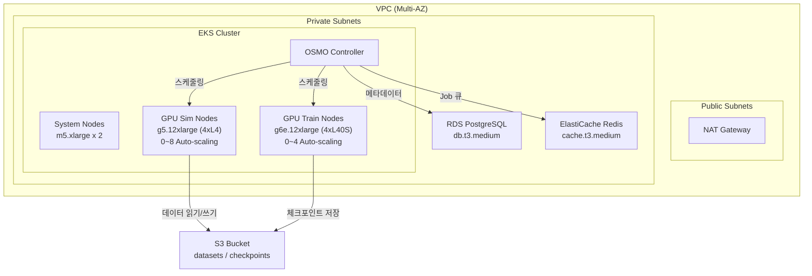

# NVIDIA OSMO on AWS EKS

이 실습에서는 AWS EKS 위에 NVIDIA OSMO를 배포하고, GR00T Fine-tuning과 Isaac Sim 검증을 Kubernetes 기반 파이프라인으로 실행합니다. CDK로 인프라를 원클릭 배포하고, OSMO workflow YAML 한 장으로 Training→Simulation→Verification을 오케스트레이션합니다.

* [**Amazon EKS**](https://docs.aws.amazon.com/eks/latest/userguide/what-is-eks.html): 관리형 Kubernetes 서비스로 OSMO 컨트롤러와 GPU 워크로드를 실행합니다. GPU 노드는 0대로 시작하여 워크플로 제출 시 자동 확장됩니다.
* [**Amazon S3**](https://docs.aws.amazon.com/AmazonS3/latest/userguide/Welcome.html): 학습 데이터셋, 체크포인트, synthetic 데이터를 저장합니다. IRSA로 Pod에서 직접 접근합니다.
* [**Amazon RDS**](https://docs.aws.amazon.com/AmazonRDS/latest/UserGuide/CHAP_PostgreSQL.html): OSMO 메타데이터와 워크플로 상태를 저장하는 관리형 PostgreSQL입니다.
* [**Amazon ElastiCache**](https://docs.aws.amazon.com/AmazonElastiCache/latest/red-ug/WhatIs.html): OSMO Job 큐와 캐싱을 위한 관리형 Redis입니다.
* [**AWS CDK**](https://docs.aws.amazon.com/cdk/v2/guide/home.html): 전체 인프라를 TypeScript 코드로 정의하고, 한 번의 명령으로 44개 리소스를 자동 프로비저닝합니다.

### OSMO란?

[NVIDIA OSMO](https://github.com/NVIDIA/OSMO)는 Physical AI 워크플로 오케스트레이터입니다. Training, Simulation, Edge 세 가지 컴퓨팅 환경에서 실행되는 작업을 단일 YAML 파이프라인으로 정의하고 Kubernetes 위에서 실행합니다.

| 특징 | 설명 |
|------|------|
| Kubernetes-native | EKS, AKS, GKE 등 표준 K8s 클러스터에서 실행 |
| NVIDIA 스택 통합 | Isaac Sim, Isaac Lab, GR00T 컨테이너를 직접 오케스트레이션 |
| 파이프라인 DAG | Stage 간 의존성으로 Train→Sim→Verify 자동화 |
| 분산 실행 | `parallelism` 설정으로 동일 작업을 N개 Pod에서 병렬 수행 |
| 오픈소스 | Apache 2.0 라이선스 |

### 아키텍처

### 실습 과정

[**1. 인프라 배포 (CDK)**](1.-infra-deploy.md)

AWS CDK로 EKS 클러스터, GPU 노드그룹, RDS, Redis, S3 등 전체 인프라를 배포합니다. CloudShell에서 한 번의 명령으로 44개 리소스가 자동 생성됩니다.

[**2. EKS 클러스터 설정**](2.-eks-setup.md)

kubectl 접근 설정, NVIDIA Device Plugin, Cluster Autoscaler, StorageClass 등 Kubernetes 클러스터 필수 구성요소를 설치합니다.

[**3. IRSA 및 보안 구성**](3.-irsa-setup.md)

OIDC Provider 등록, IAM Role 생성, Kubernetes ServiceAccount 연결로 Pod에서 AWS 서비스에 안전하게 접근하도록 설정합니다.

[**4. 인프라 검증**](4.-infra-verification.md)

S3 연결, GPU 오토스케일링, Cluster Autoscaler 동작을 실제 Job으로 검증합니다.

[**5. OSMO Workflow 실행**](5.-osmo-workflow.md)

GR00T Fine-tuning→Isaac Sim 검증 파이프라인과 대규모 Synthetic Data 생성 워크플로를 실행합니다.

[**6. 정리 (Cleanup)**](6.-cleanup.md)

생성된 모든 리소스를 안전하게 삭제합니다.

---

### References

* [**\[GitHub\]** AWS Physical AI Recipes — OSMO CDK](https://github.com/hi-space/aws-physical-ai-recipes/tree/main/osmo/cdk)
* [**\[NVIDIA\]** OSMO GitHub](https://github.com/NVIDIA/OSMO)
* [**\[NVIDIA\]** OSMO Cookbook (Workflow 예시)](https://github.com/NVIDIA/OSMO/tree/main/cookbook)
* [**\[NVIDIA\]** GR00T (Generalist Robot 00 Technology)](https://developer.nvidia.com/isaac/groot)
* [**\[AWS\]** Amazon EKS 공식 문서](https://docs.aws.amazon.com/eks/latest/userguide/what-is-eks.html)
* [**\[AWS\]** EKS Managed Node Groups](https://docs.aws.amazon.com/eks/latest/userguide/managed-node-groups.html)
